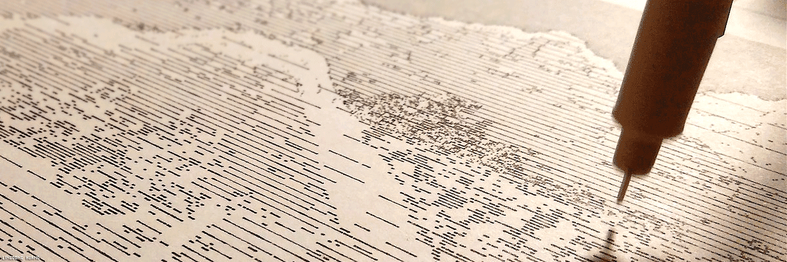
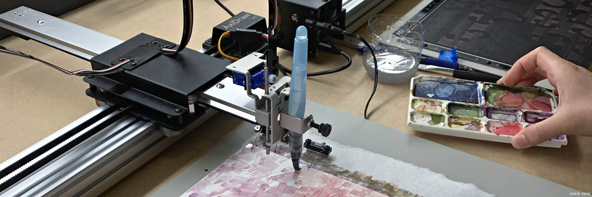

# Drawing with Machines

Resources for Golan Levin's *Drawing with Machines* Course Carnegie Mellon University School of Art & IDeATe

> <small>*This is an advanced studio course in experimental drawing and generative art. Working at the boundaries of creative code, automation, physical materials, and gestural mark-making, we will explore the use of algorithms and machine collaborators as nontraditional intermediaries between mind, hand, paper, and mark.*</small>

---

### Fall 2025 Admin

* [Syllabus](syllabus/60-468_syllabus_fall_2025.md) 
* Course Calendar
* Instagram
* Discord
* Github
* Box

---

### Key Resources

* [Lectures](lectures/README.md)
* [Assignments](assignments/README.md)
* [Readings](readings/README.md)
* [Machinery Instructions](machines/README.md)
* Software Instructions & Code Template Index
  * [Generating SVG Files](generating_svg/README.md)
  * [Preparing SVGs for Plotting with *vpype*](generating_svg/vpype_svg_prep/README.md)

---

### Course Archives

* [2021 Course at CMU: documentation](documentation/2021/README.md)
* [2024 Course at CMU: documentation](documentation/2024/README.md)
* [2022 Workshop at Anderson Ranch: documentation](documentation/2022/README.md)
