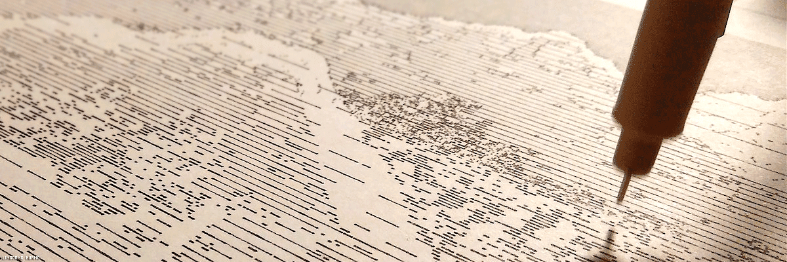
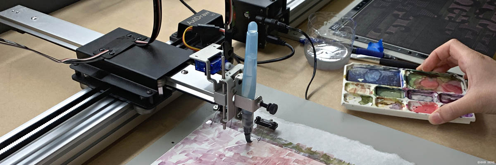

# Drawing with Machines

> "Using our brains to write code to control machines to do interesting things with art supplies"

Resources for Prof. Golan Levin's *Drawing with Machines* Course Carnegie Mellon University School of Art & IDeATe

> *This is an advanced studio course in experimental drawing and generative art. Working at the boundaries of creative code, automation, physical materials, and gestural mark-making, we will explore the use of algorithms and machine collaborators as nontraditional intermediaries between mind, hand, paper, and mark.*

---

### General Resources

* [**Topics, Themes, and Lectures**](lectures/topics/README.md)
* [**Machinery Instructions**](machines/README.md)
* **Code Templates & Software Instructions**:
  * [Generating SVG Files](generating_svg/README.md)
  * [Preparing SVGs for Plotting with *vpype*](generating_svg/vpype_svg_prep/README.md)
  * [Controlling various plotters in real-time](realtime/README.md)
* **Assignments**: [2021](assignments/2021/README.md), [2024](assignments/2024/README.md), [2025](assignments/2025/README.md)
* **Daily Notes**: [2021](https://courses.ideate.cmu.edu/60-428/f2021/index.html%3Fp=51.html), [2024](lectures/2024/README.md), [2025](lectures/2025/README.md)
* **Syllabi**: [2021](syllabus/60-428_syllabus_fall_2021.md), [2024](syllabus/60-225_syllabus_spring_2024.md), [2025](syllabus/60-428_syllabus_fall_2025.md)
* [**Readings**](readings/README.md)

---

### Course Archives

* [Instagram](https://www.instagram.com/drawingwithmachines/)
* [2021 Course at CMU: documentation](documentation/2021/README.md)
* [2024 Course at CMU: documentation](documentation/2024/README.md)
* [2022 Workshop at Anderson Ranch: documentation](documentation/2022/README.md)
* 2025 Course at CMU: *Documentation in Process*

---