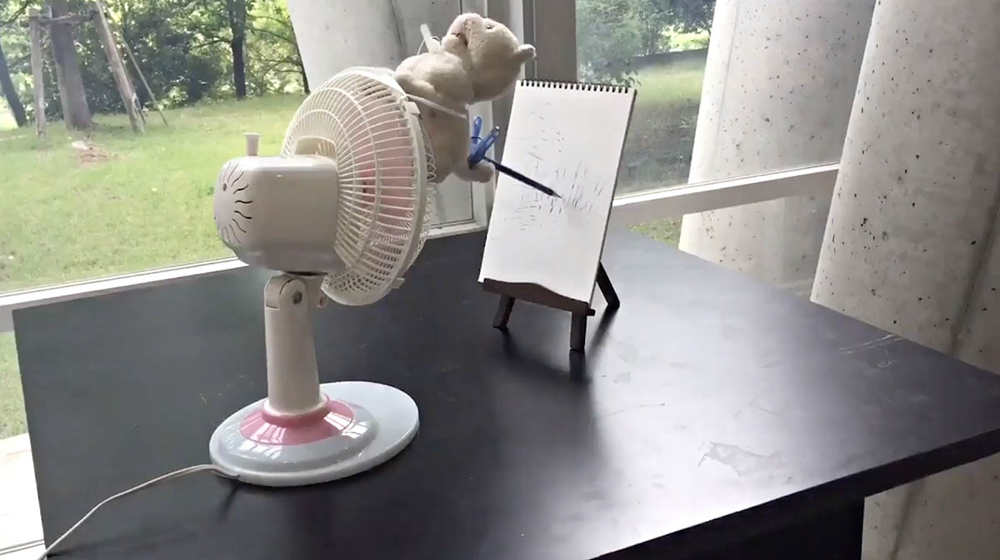

# Assignment 1: *DIY Drawing Machine*

---

(*2-3 hours*) **Using any materials you have at hand, create a shitty drawing machine.** Use it to make a shitty drawing. This is a speed project; don't overthink it. For some ideas, feel free to browse [these links](../../lectures/0115_hello/README.md), but don't look at too many, or you might feel stuck. This assignment is due at the beginning of class on **Thursday, January 18**.

Perhaps your machine is an instrument to release the image that is trapped inside some everyday object. Or perhaps your machine is a witchcraft you have constructed, and its scribbling is graphomancy, a divination.

Record a brief video or animated GIF of your system in action, and take a photograph of the drawing it created. A few seconds' duration is probably adequate, but feel free to do what's necessary to explain your project visually (e.g. a time lapse, etc). 

#### *Now*, your tasks are: 

1. (**50**) Create a drawing machine, and use it to make a drawing or two. 
3. (**5**) Create a post in the *#DIY-Drawing-Machine* Discord channel.
4. (**5**) Give your machine a title or name. In your post, tell us your machine's name. 
5. (**10**) Write a couple of sentences about it.
6. (**10**) Upload a photograph of your machine. 
7. (**10**) Upload a photograph of your machine's drawing. 
8. (**10**) Create and link to your brief video (an unlisted video on YouTube works well), **or** upload your animated GIF (note that Discord has an 8MB size limit; consider reducing your GIF's file size with [ezgif.com/optimize](https://ezgif.com/optimize).

---

* Shown: "[Drawing Machine](Drawing Machine)" by Kanako Ishikawa.
* [2021 Assignment Version](https://courses.ideate.cmu.edu/60-428/f2021/offerings/1-drawing-machine/)