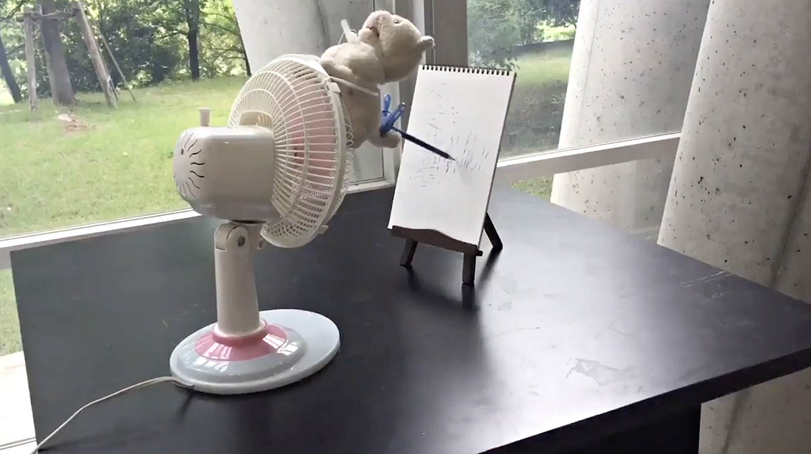

# Assignment 1: *DIY Drawing Machine*

---

**This Assignment has two parts.** Both are due at the beginning of class on **Thursday, January 18**.

1. (*0.5 hours*) **Drawing Machine Looking Outwards**, *#1a-looking-outwards* 
2. (*2.5 hours*) **Shitty Drawing Machine**, *#1b-diy-drawing-machine*

## 1. Drawing Machine *Looking Outwards*

* (*5 Points*) **Complete** the [**Course Agreements Form**](https://forms.gle/aJ3QvYeEK2PkCnYU6), if you have not already.
* (*20 Points*) *Looking Outwards* at Drawing Machines:
  * **Browse** the links [here](../../lectures/2024/0116_hello/README.md), and spend a few minutes browsing [DrawingMachines.org](https://drawingmachines.org/), an archive of optical/mechanical/automated drawing machines/devices/aids. **Identify** a drawing machine or tool that speaks to you. **Create** a post in the *#1a-looking-outwards* Discord channel. 
  * (15) **Write** a sentence or two describing the drawing machine or tool you selected, and why you found it interesting.
  * (5) **Include** an image of the machine or tool. 

## 2. Shitty Drawing Machine

**Using any materials you have at hand, create a shitty drawing machine.** Use it to make a shitty drawing. This is a speed project; don't overthink it. 

Perhaps your machine is an instrument to release the image that is trapped inside some everyday object. Or perhaps your machine is a witchcraft you have constructed, and its scribbling is graphomancy, a divination. Record a brief video or animated GIF of your system in action, and take a photograph of the drawing it created. A few seconds' duration is probably adequate, but feel free to do what's necessary to explain your project visually (e.g. a time lapse, etc). 

#### *Now*, your tasks are: 

* (*75 Points*) Make a Shitty Drawing Machine:
	* (40) **Create** a drawing machine, and **use** it to make a drawing or two. 
	* (5) **Create** a post in the *#1b-diy-drawing-machine* Discord channel.
	* (5) **Name** your machine. In your post, tell us your machine's name or title. 
	* (10) **Write** a couple of sentences about it.
	* (5) **Upload** a photograph of your machine. 
	* (5) **Upload** a photograph of your machine's drawing. 
	* (5) **Create** and **link** to a brief video (an "unlisted" video on YouTube is ideal), or **upload** an animated GIF to Discord. (**Note**: Discord has an 8MB size limit; consider reducing your GIF's file size with [ezgif.com/optimize](https://ezgif.com/optimize)).

---

* Shown: "[Drawing Machine](Drawing Machine)" by Kanako Ishikawa.
* [2021 Assignment Version](https://courses.ideate.cmu.edu/60-428/f2021/offerings/1-drawing-machine/)