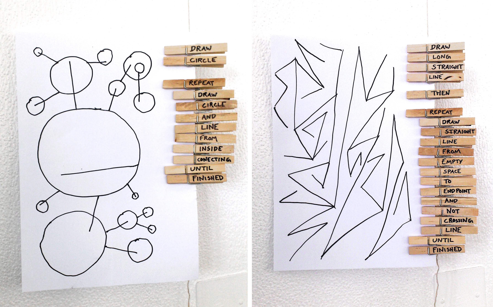

# Assignment 2: *Rule-Based Art*

 <small>*Peg Programming* by Ed Burton, 2002</small>

**This assignment has two parts, and is due at the beginning of class on Thursday, January 25.**

1. Reading-Response (20 Points)
2. Rule-Based Art (80 Points)

---

## Reading-Response

You are asked to read two one-page manifestos about rule-based art, written 50 years apart. 

1. **Read** François Morellet's [*The Case for Programmed Experimental Painting*](files/morellet-case-for-programmed-painting.jpg) (1962), which discusses "laying the foundations for a new science of art". (This is from "A Little-Known Story about a Movement, a Magazine, and the Computer's Arrival in Art: New Tendencies and Bit International, 1961–1973", [MIT Press](https://mitpress.mit.edu/9780262515818/a-little-known-story-about-a-movement-a-magazine-and-the-computers-arrival-in-art/), 2011.) You can see examples of Morellet's work in [this YouTube video](https://www.youtube.com/watch?v=QmXDF_IZcF8). 
2. **Read** the[*Conditional Design Manifesto*](https://conditionaldesign.org/manifesto/) (2012) by Studio Moniker (Luna Maurer et al.), which proposes using logic as a "method for accentuating the ungraspable." A [local PDF copy](files/conditional_design_manifesto.pdf) is here. These are the same folks who conceived the "Beach" and other exercises we did in class. You can see videos of this work on the [Conditional Design](http://conditionaldesign.org/) project site,  Don’t forget to click on their [Older Projects](https://conditionaldesign.org/index.html@articles=2.html) (the link is at the bottom of the page). 

(20 Points) In the Discord channel *#2a-reading-response*, write a couple of sentences that compares the authors' points of view. Alternatively, you may write a couple of sentences about something that struck you from these readings; explain what you think it meant, and why you liked or disliked it. 

---

## Designing an Interesting Ruleset

(80 Points) Create a set of instructions able to generate an infinite (but cohesive, and specific) set of different drawings. Print these out as written instructions on a sheet of paper. I recommend you keep your instructions under 300 words.

Without showing your own experiments or previous results, ask three different people to execute your written instructions. You are not allowed to communicate verbally or answer questions during their work. Scan or photograph the resulting drawings.

### Requirements:

* The surface must be a standard letter sheet (8.5 by 11 inches).
* The drawing tool should be a standardized pen, pencil, or marker that you provide to all of your participants. Please be consistent.
* Your rules should be as specific as possible but also able to generate different results every time. 
* Most importantly: the goal is to create a recipe for interesting drawings or rule-based compositions, not arbitrary doodles. *Can you embed style and composition in a set of rules?*

### Suggestions:

* You may wish to **include an element of iteration** (analogous to `while` or `for` loops) that establish (for example) rhythm, repetition, pattern, seriality, structures of self-similarity, etcetera. 
* You may have to **devise an ending condition**. For example, you could set up a 5-minute timer on your phone, or prescribe a certain number of iterations.
* You may wish to **include a source of randomness**, unpredictable input, or ambiguity, in order to ensure that your instructions generate different results every time. For example, you could use a coin flip, pair of dice, deck of cards, [random word generator](https://randomwordgenerator.com/), etc.
* You may wish to **iterate** your instructions — i.e. observe, evaluate, and revise :)
* You are welcome to devise a drawing "game"/activity for 2 or more participants.

### Deliverables

In the Discord channel *#2b-rule-based-art*, **create** a post that includes the following:

* (20) A copy of the written instructions you provided to your participants.
* (30) Images of the results produced by your participants.
* (30) A brief written evaluation of your “instructions”, in retrospect, after assessing the results produced by your participants. How did you iterate your design (if applicable)? What surprised you? What did you get right? What might you tinker with?

During class on Thursday 1/25, we will hang the drawings and discuss the results. Please bring them to class.
