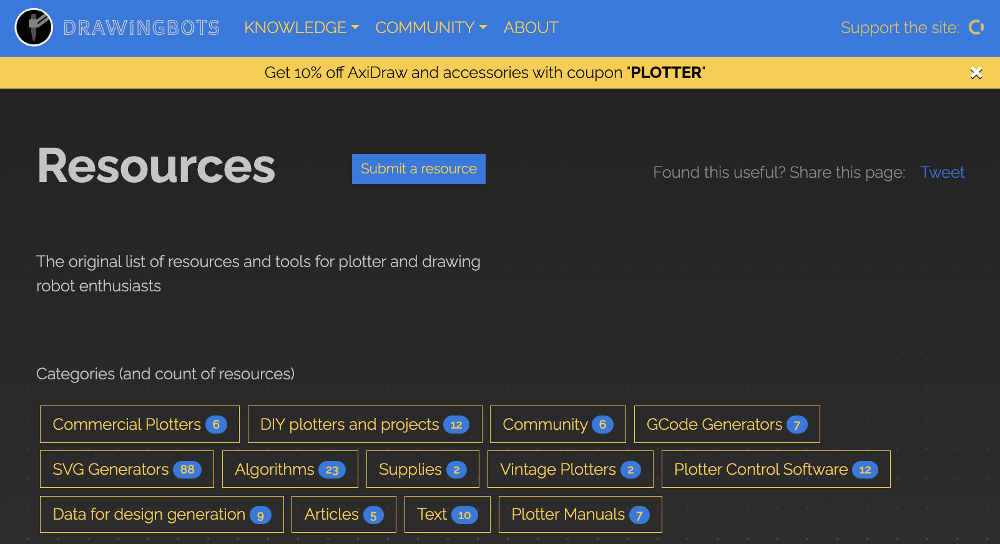
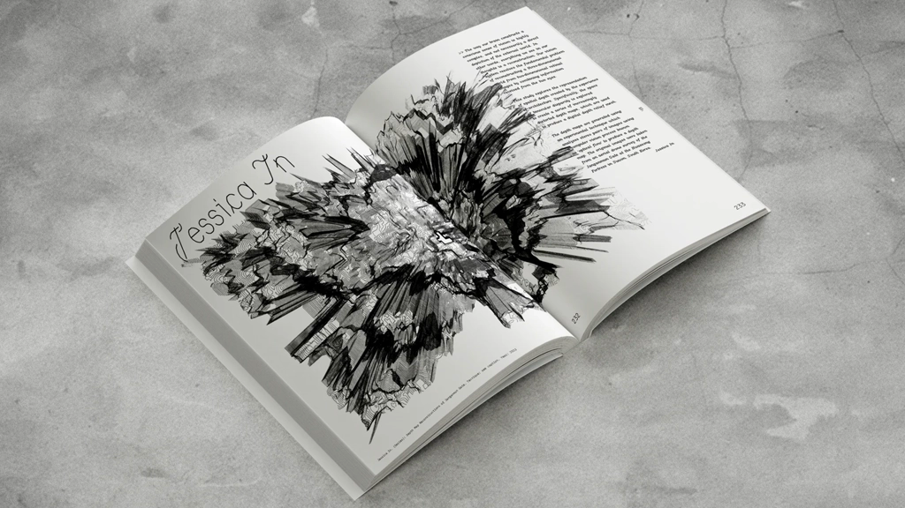
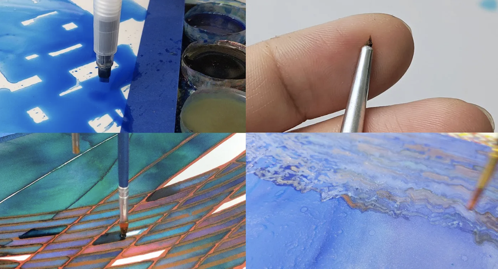
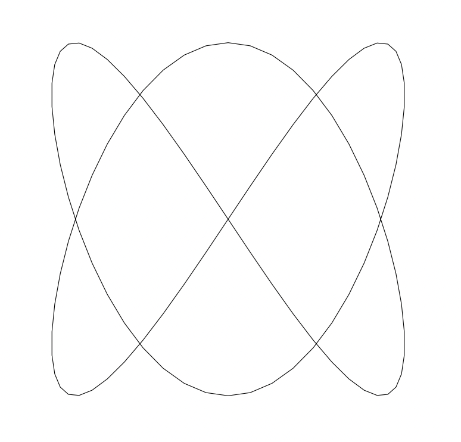

# Assignment 3: *Introductory Tooling*

*This set of exercises is due at the beginning of class on Tuesday, January 30th. No coding or other "creative" work is required, but you will need to find time on the weekend to make a plot (apologies).*

* [3a: Plotter tool resource immersion](#3a-plotter-tool-resource-immersion) (10 points; 20 minutes)
* [3b: Looking Outwards: Generative Plotter Art](#3b-looking-outwards-some-generative-plotter-art) (20 points; 30 minutes)
* [3c: Reading Response: Skimming Other's Practices](#3c-reading-response-skimming-others-practices) (20 points, 30 minutes)
* [3d: **Make a Simple Plot!**](#3d-make-a-simple-plot) (50 points, 60-120 minutes)

---

### 3a. Plotter tool resource immersion

*(10 points; 20 minutes)* The purpose of this exercise is to help introduce you to resources and communities for computer controlled pen-plotting machines. Note: The focus here is on *technical* resources.

* Spend 10 minutes browsing the materials on [**DrawingBots.net**](https://drawingbots.net/), particularly including the special [**Resources page**](https://drawingbots.net/resources). This is "the central place on the web to discover the world of drawing robots, get inspiration and talk to other drawing robot enthusiasts." Optionally, check out the affiliated [DrawingBots Discord (invite here)](https://discordapp.com/invite/XHP3dBg). There are lists of recommended pens, various types of SVG generators, links to code libraries, etc.
* Spend 5-10 minutes browsing the materials at the [**AwesomePlotters Repository**](https://github.com/beardicus/awesome-plotters), "a curated list of code and resources for computer-controlled drawing machines and other visual art robots."
* Spend 2-3 minutes familiarizing yourself with the [**AxiDraw documentation Wiki**](https://wiki.evilmadscientist.com/AxiDraw), "the central documentation site for AxiDraw plotters from Evil Mad Scientist."
* Now, in our Discord channel *#3a-tooling-resources*, **make** a very brief post about a specific technical resource that caught your attention. 
  * (*2 points*) **Link** to the resource, 
  * (*3 points*) **describe** what it is, and 
  * (*5 points*) **write** a sentence about why you found it interesting or potentially useful. 

---

### 3b. Looking Outwards: Some Generative Plotter Art

*(20 points, 30 minutes)* The purpose of this prompt is to develop your familiarity with global practices and international communities of people using code to create art with plotters. You can find this work on the following channels, among other places:

* In the book [*Tracing the Line*](https://vetroeditions.com/products/tracing-the-line), in our classroom (cabinet 1A)
* On [Twitter/X, using the hashtag #PlotterTwitter](https://twitter.com/hashtag/plottertwitter)
* On Instagram at [#PlotterTwitter](https://www.instagram.com/explore/tags/plottertwitter/) (yes) and [GenerativeHut](https://www.instagram.com/generative.hut/)
* On the [DrawingBots Discord](https://discordapp.com/invite/XHP3dBg), in the "Gallery" channels 

Additionally/alternatively, you may check out work by some recommended contemporary artists. (*Note, these are living, 3rd- and 4th generation software artists, generally under 40 years old, as opposed to 1st-generation computer artists who used plotters in the 1960s.*)

* [Licia He](https://www.eyesofpanda.com/gallery/)
* [Joanie Lemercier](https://twitter.com/JoanieLemercier/status/1391443586206535682)
* [Iskra Velitchkova](http://iskraovelitchkova.com/works.html)
* [Michael Zancan](https://www.instagram.com/zancan.code/?hl=en)
* [Jessica In](https://www.instagram.com/shedrawswithcode/?hl=en)
* [Julien Gachadoat](https://www.instagram.com/julienv3ga)
* [Frederik Vanhoutte](https://www.instagram.com/wblut/)
* [Sougwen Chung](https://sougwen.com/)
* [Jürg Lehni](https://juerglehni.com/)
* [Lars Wander](https://www.instagram.com/larswander/)
* [Rev Dan Catt](https://www.instagram.com/revdancatt)
* [LIA](https://www.liaworks.com/tag/plotter-drawing/)

Please spend at least 20 minutes browsing these materials to get a sense of how various people are combining computation and plotter devices. *Now*,

* **Create** a post in our Discord channel, *#3b-looking-outwards*.
* *(5 points)* **Write** a sentence or two summarizing the kinds of work you saw, overall. What was interesting to you? What was disappointing? What opportunities did you see?
* *(5 points)* **Identify** a specific artwork you liked from the #PlotterTwitter stream. In your post, **link** to the project's URL, and **embed** an image or screenshot of the project. 
* *(10 points)* **Write** another sentence or two, on what you appreciated about this particular project.

---

### 3c. Reading Response: Skimming Others' Practices

*(20 points, 30 minutes)* The purpose of this prompt is to learn about how various creators think about and describe their processes of working with code and plotters. These articles are essentially introductory technical walk-throughs, with “tips” and suggestions; you will notice considerable diversity in the artists’ approaches. (*Note: It is sufficient to skim these articles!*)

* Skim [*9 Tips to Execute Generative Art with a Plotter*](https://tylerxhobbs.com/essays/2018/executing-generative-art-with-a-plotter) by Tyler Hobbs
* Skim [*300 Days with Plotters*](https://liciahe.medium.com/300-days-with-plotters-14159ab64034) by Licia He
* Skim *Pen Plotter Art & Algorithms*, [Part 1](https://mattdesl.svbtle.com/pen-plotter-1) and [Part 2](https://mattdesl.svbtle.com/pen-plotter-2) by Matt Deslauriers
* Skim [*Pen Plotter Programming: the Basics*](https://medium.com/@fogleman/pen-plotter-programming-the-basics-ec0407ab5929) by Michael Fogleman

*Now*,

* **Create** a post in the Discord channel, *#3c-reading-response*.
* (*20 points*) Briefly **write** a sentence or two about something from one of the above articles that you found interesting and/or helpful.

---

### 3d. Make a Simple Plot!

(*50 points, 60-120 minutes*)

* Using one of the provided code templates, **Generate** an SVG of one of the provided "**Lissajous**" designs. You may choose from one of the following four workflows:
  * [Java with Processing](https://github.com/golanlevin/DrawingWithMachines/tree/main/generating_svg#generating-svgs-with-java-processing), 
  * [JavaScript with p5.js **v.1.6.0**](https://github.com/golanlevin/DrawingWithMachines/tree/main/generating_svg#generating-svgs-with-javascript-p5js), 
  * [Python in the Processing **v.3.5.4**](https://github.com/golanlevin/DrawingWithMachines/tree/main/generating_svg#generating-svgs-with-python-processingpy-v354) IDE, or 
  * [command-line Python with vsketch and vpype](https://github.com/golanlevin/DrawingWithMachines/tree/main/generating_svg#generating-svgs-with-python-vsketch). 
* Using an AxiDraw, **plot** the Lissajous SVG in black ink on 9x12 or 8.5x11 white paper. Feel free to sign your artwork flamboyantly.
* (*50 points*) In a Discord post in the channel *#3d-make-a-plot*, **post** a photo of your plot.
* **Bring** your plot to class on Tuesday 1/30. 

