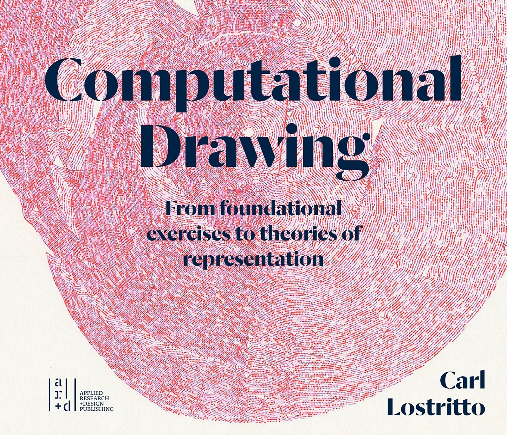
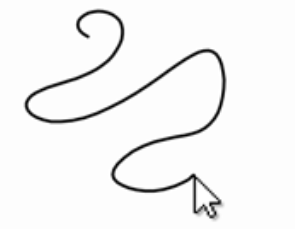
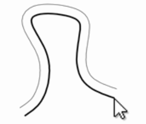
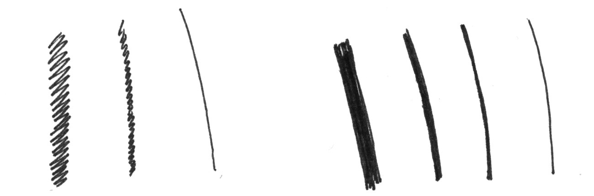
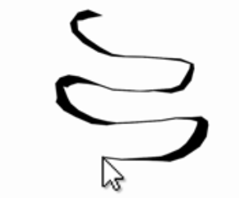
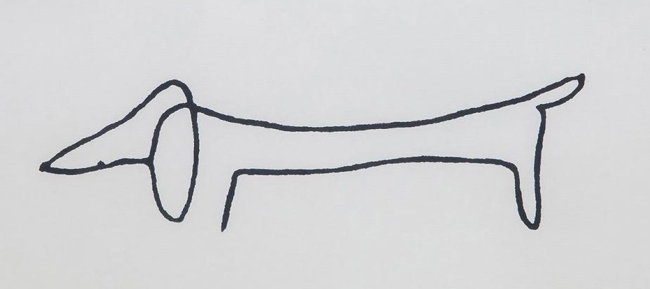
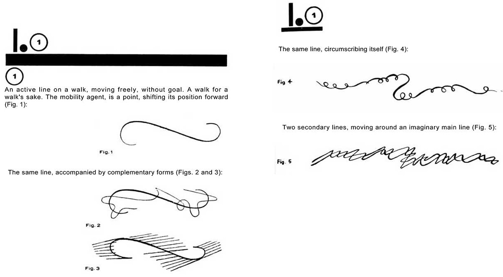
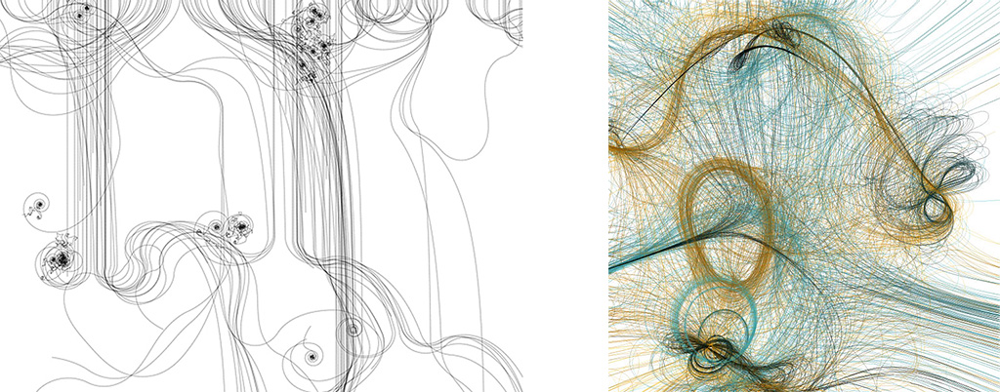

# Assignment 4: *Line*

This Assignment has three components, and is due at the beginning of class on Tuesday 2/6: 

* 4a. Reading on Computational Drawing (*30 minutes, 10 points*) 
* 4b. A Quartet of Line Exercises (*2 hours, 40 points*)
* 4c. Taking a Line for a Walk (*2-4 hours, 50 points*)

---

## 4a. Reading on *Computational Drawing*

(*30 minutes, 10 points*) The purpose of this exercise is (*in contrast to last week's extremely 'practical' readings*) to prompt philosophical consideration about what it means to make drawings with code. 

[Carl Lostritto](http://lostritto.com/drawing) is a professor of Architecture at RISD whose creative practice centers around the use of pen plotters. Read or skim “Chapter 1: Definitions” (9 pages) from his book, *Computational Drawing*, from the [PDF linked here](resources/lostritto_chapter1.pdf). This chapter has five brief provocations: 

* *What drawing is not and what computing cannot do*
* *A drawing cannot be edited*
* *A computer cannot draw*
* *A drawing is not final*
* *Misunderstandings about Computing*

*Now,*

* **Create** a post in the Discord channel, *#4a-reading*.
* **Select** one of the five provocations that you find more interesting than the others, and give it a closer reading.
* **Write** 2-3 sentences reflecting on this provocation.

---

## 4b. A Quartet of Line Exercises

(*2 hours, 40 points*) The purpose of this set of warmup exercises is to ensure that you have a foundation of basic skills in data management and computational geometry. In your preferred programming environment, please do the following four exercises. *Note that two of them (items 4b-3 and 4b-4) require you to make a plotter drawing.* 

The deliverables for Assignment 4b are summarized as follows: 

* **Create** a post in the Discord channel, *#4b-line-exercises*. In this post:
* 4b-1. (*10 points*) **Embed** a screenshot or GIF screen-recording.
* 4b-2. (*10 points*) **Embed** a screenshot or GIF screen-recording.
* 4b-3. (*10 points*) **Embed** a photograph of a plotter drawing.
* 4b-4. (*10 points*) **Embed** a photograph of a plotter drawing.

### 4b-1. Gesture Recording

Create an interaction that stores the past 100 mouse positions, and displays them as a polyline. (The oldest points should disappear as new ones are added.) For 10 points, **embed** a screenshot or GIF screen-recording of your project in your Discord post.

*Note: There are lots of ways you could store the mouse data. Feel free to represent this data using two 1D arrays (one for X, one for Y); in one 2D array; in one 1D array of Objects (such as PVectors); or as a collection of displacements, comprised of angular orientations and magnitudes...*

### 4b-2. Parallel Polyline (Offset Curve)

As with exercise **4b-1**, write a program that stores cursor points while a user draws. Connect these points with a polyline (shown in black, below). Use geometry to calculate a different polyline (shown in gray), which is offset everywhere from the user’s drawing by a fixed distance of 50 pixels. For 10 points, **embed** a screenshot or GIF screen-recording of your project in your Discord post.

*Note: How does your code manage the condition in which the user draws a sharp concave angle? (Python programmers, check out Shapely...)*

### 4b-3. Lines of Different Weights

First — Using your hand, paper, and a pen with a uniform (non-chiseled) tip, doodle some lines with different weights. Reflect on how you did this. 

*Now*, write a program to produce lines of different weights. (If you can, modify program **4b-1** to draw polylines with different weights.) Your program should generate SVGs of those lines, such that the lines will appear to have different weights, when plotted using a pen with a fixed width nib. 

(*Note: There’s no one right way to do this, but you will not be helped by trying to use the strokeWeight() command!*)  Here are a few (non-exhaustive) suggestions for how you might create lines of different weights:

* Draw a dense zig-zag
* Draw a closely-packed series of circles 
* Draw slightly-offset parallel lines that are closely spaced
* Draw a line very slowly or very quickly, with a pen that bleeds ink

**Generate** an SVG, and **plot** the SVG on letter-size paper. For 10 points, **embed** a photograph of this plot in your Discord post. **Bring** your plot to class. 

### 4b-4. Calligraphic Polyline

Create a sketch that stores the past 100 mouse positions. Connect these with a polyline of sorts—but give this line an expressive, calligraphic dimension by varying its thickness. **Generate** an SVG, and **plot** the SVG on letter-size paper. For 10 points, **embed** a photograph of this plot in your Discord post. **Bring** your plot to class. 

*Note: One possible way to achieve this is to make the thickness of this polyline inversely proportional to the distance between each pair of recorded cursor points — so that faster movements produce thinner regions of the polyline. Another possible way to do this is to connect points with their non-nearest neighbors...*

---

## 4c. Taking a Line for a Walk

Pablo Picasso, *Chien (Dog)*, 1957.

(*2-4 hours, 50 points*) The objective of this prompt is to exercise your conceptual, aesthetic, and computational skills in using code to govern a foundational graphical form: *a single line*. 

Recall Paul Klee’s *Pedagogical Sketchbook* (1925), in which he proposes that “a line is a dot that went for a walk”. (*A PDF copy of this book is available [here](resources/klee_pedagogical_sketchbook_1953.pdf) if you are interested in reading further.*) Klee’s statement has been very influential, and has become a common prompt for students, such as this [assignment for grade-schoolers](https://www.youtube.com/watch?v=2kPu7ndVZEo).

The artwork [*Sum05*](http://www.liaworks.com/theprojects/sum05/) by Austrian software artist (2005), Lia (at left) and the artwork [*Path_P*](http://reas.com/path_p/) by Casey Reas (2001, at right), can be understood as examples of this, though they achieve this in very different ways: In her design, Lia composes trigonometric functions of trigonometric functions, while Casey records the paths taken by Braitenberg vehicles.

In this assignment, you are asked to **write** code that takes a dot (or line) for a walk; **export** an SVG image of your line; **plot** the result; and **write** a brief statement about your project. In evaluating your work, we may discuss things like: the expressiveness of your line, the muscularity of your control, conceptual propositions you may have engaged, etc.

*Now:*

* **Write** code to take a line on an interesting walk. Your code may be written in any programming language you prefer (e.g. Java, JavaScript, Python, etc.), and should export an SVG that consists of exactly one line. 
* **Decide** whether you will plot on a 12x9" or 11x8.5" page. Either is fine. Please use nice paper.
* **Ensure** that your drawing does not ask the plotter to move beyond the bounds of your page! You may ensure this through some combination of scaling, translation, and/or cropping. To crop your drawing, use either *vpype* (preferred; instructions [here](https://github.com/golanlevin/DrawingWithMachines/tree/main/generating_svg/vpype_svg_prep)), *Inkscape* (instructions [here](https://inkscapetutorials.wordpress.com/2014/04/22/inkscape-faq-how-do-i-crop-in-inkscape/)), or [*svg-cropper-tool*](https://msurguy.github.io/svg-cropper-tool/).
* **Plot** your line drawing. Please use a black pen on white paper. Color is not permitted for this project.
* **Create** a post in the Discord channel, *#4c-line-walk*.
* (*30 points*) **Embed** a photograph of your plotted project in your Discord post.
* (*20 points*) **Write** a few sentences in your Discord post that describe your approach, what you struggled with, and what you learned.
* **Bring** your plot to class.

**It should be clear that there is no correct answer to this prompt**; there are an infinity of possible approaches to generate an interesting line, and there is absolutely no preferred or recommended method. Your line may be zig-zaggy, wavy, curly, wiggly, noisy, *etc.* Your line may be wholly synthesized using randomness and mathematics, or it may be a visualization of data captured from the real world. You may choose to start and end your line at the same point, or you may (for example) terminate your line at opposite corners of the page. Your line may cross itself, or you may write rules to prevent this from happening. Your line may have constant thickness, or you may give it an expressive and variable ductus. If you are so inclined, you may engage in [code golf](https://en.wikipedia.org/wiki/Code_golf), attempting to produce the most intriguing line you can with the least amount of code. The *Coding Train* offers some possible starting points, among many:

* [Random Walker in p5.js (Coding Challenge #52)](https://www.youtube.com/watch?v=l__fEY1xanY)
* [Coding Challenge #53: Random Walker with Vectors and Lévy Flight](https://www.youtube.com/watch?v=bqF9w9TTfeo)
* [Coding Challenge #162: Self-Avoiding Walk](https://www.youtube.com/watch?v=m6-cm6GZ1iw)
* [Coding Challenge #35.1: Traveling Salesperson](https://www.youtube.com/watch?v=BAejnwN4Ccw)
* [A* Pathfinding Algorithm (Coding Challenge #51)](https://www.youtube.com/watch?v=aKYlikFAV4k)
* [Coding Challenge #136.1: Polar Perlin Noise Loops](https://www.youtube.com/watch?v=ZI1dmHv3MeM)
* [Coding Challenge #172: Horizontal Directional Drilling](https://www.youtube.com/watch?v=FfCBNL6lWK0)

**Here are some helpful templates to get you started:**

* JavaScript (p5.js) [template for interactive SVG export](random_polyline_p5js.js) • [at the p5 Editor](https://editor.p5js.org/golan/sketches/hrxu2Bnly)
* Java (Processing) [template for interactive SVG export](random_polyline_processing.pde)
* Python (Processing.py, v.3.5.4) [template for interactive SVG export](random_polyline_py.pyde)

---

[*2021 Version*](https://courses.ideate.cmu.edu/60-428/f2021/offerings/3-foundation/)

---

