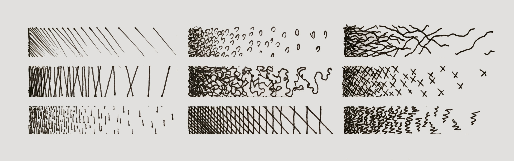
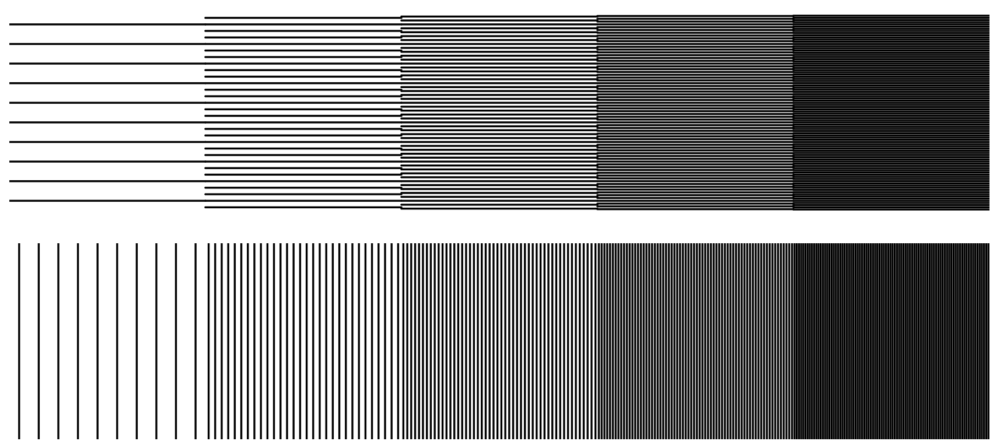
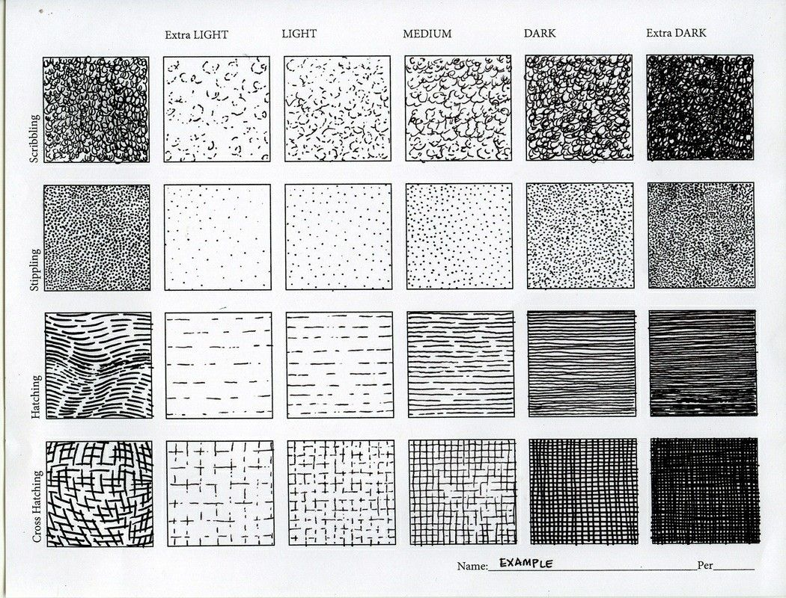
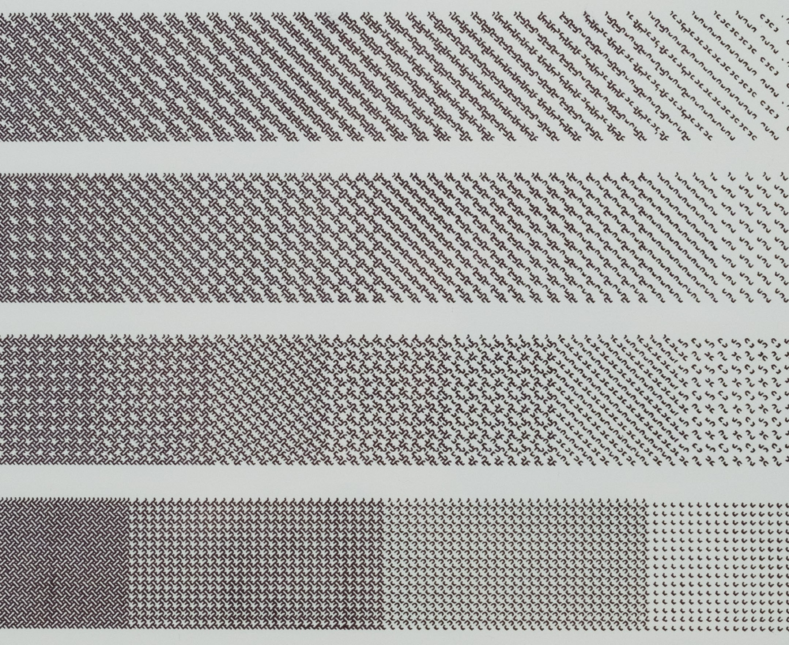
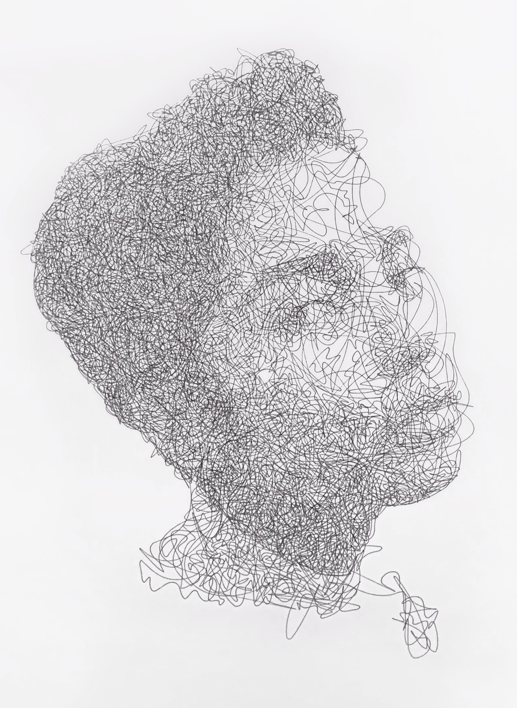

# Assignment 5: *Tone*

This assignment has two parts, and is due at the beginning of class on Tuesday, February 13: 

* [**5a. Hatching Studies**](#5a-hatching-studies) (50 points, 3 hours)
* [**5b. Hatched Portrait**](#5b-hatched-portrait) (50 points, 3 hours)

---

## 5a. Hatching Studies

*Please read this prompt all the way to the end, before you start any drawing or coding. The purpose of this prompt is for you to develop foundational skills in controlling value and tone.*

*First, a warmup exercise*: By hand, with a pen and paper, **draw** some hatching studies (i.e., ways of approximating gray tones using assemblies of lines, in order to fill areas of paper). Specifically: **Generate** 9 different hand-drawn hatching concepts or styles (say, in a 3×3 grid)—starting with the most obvious and simple hatching methods, and aiming for some more exotic hatching methods that you would have no idea how to implement in code. For each hatching style/concept, draw a "value scale" in which you explore how that method increases or decreases its density.

*Now*: 

* Write code to **implement** four different methods of hatching. You're not required to implement any method that you sketched earlier, but you're welcome to do so.
* For each hatching method, **create** a value scale (gradient sequence) of five adjacent one-inch squares, with evenly-spaced gray values of 10%, 30%, 50%, 70%, 90%. Some inspirations can be seen below.
* **Export** a single SVG with all four hatching sequences, and plot this using a thin black pen on a sheet of heavy white paper. *(Alternatively, you may use a white pen on black paper.)*
* **Create** a Discord post in the *#5a-hatching-studies* channel.
* (*5 points*) In your Discord post, **embed** a photo of your 3×3 grid of handmade sketches.
* (*40 points, i.e. 10 points for each of the four methods*) In your Discord post, **embed** a photograph of your plot with the four computer-generated value sequences.
* (*5 points*) In your Discord post, please **write** a sentence to describe each of your hatching methods, and what you learned making them. Did you have any surprises? Remember to give credit to any external code sources you may have used.

**In your designs,** 

* **Consider** methods like: hatching, cross-hatching, scribbling, scumbling, stippling, fill patterns, or other creative methods of your own design. If you're feeling ambitious and self-directed, this is a perfect opportunity to explore how you can create hatching techiques using things like Perlin noise flow fields, physics simulations (e.g. particle systems, Lloyd's relaxation), typography (e.g. Hershey fonts), etc. 
* **Consider** how you can productively control and contrast properties like: line direction, line density, line length, line curvature to produce different hatches with different characters. Consider how you can control the variation (e.g. randomness, or standard deviations) of these properties. *Do any of your hatching methods have more than one expressive variable (apart from value/density)*? 
* **Easement 1:** For one of your hatching methods, you are permitted to use a “readymade” hatching method (i.e., literally made by someone else — such as you might find in a high-level library like e.g. [PEmbroider](https://github.com/CreativeInquiry/PEmbroider), Cartopy, PyGeode, or [PySLM](https://github.com/drlukeparry/pyslm)). You may use such a library for no more than two of your four different hatch methods. An example project using PEmbroider is given [here](pembroider-example.md). Note that using an external library will not necessarily save you any time (*why*?).
* **Easement 2:** For one of your hatching methods, feel free to implement the following extremely simple method shown immediately below, using parallel lines.  I have posted the code for this method [here](https://editor.p5js.org/golan/sketches/4KhqqgP7l) in case you'd like to peek at an example solution.

Below is some more potential inspo. 

 *AxiDraw hatching by Lars Wander.*

---

## 5b. Hatched Portrait

(50 points). In this exercise, you will devise a hatching method in order to render a photograph using the plotter.

---

* [2021 Version](https://courses.ideate.cmu.edu/60-428/f2021/offerings/4-hatching/)

---
