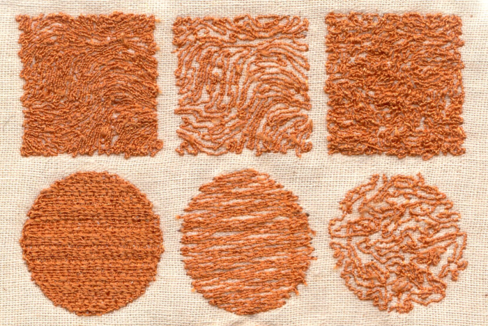
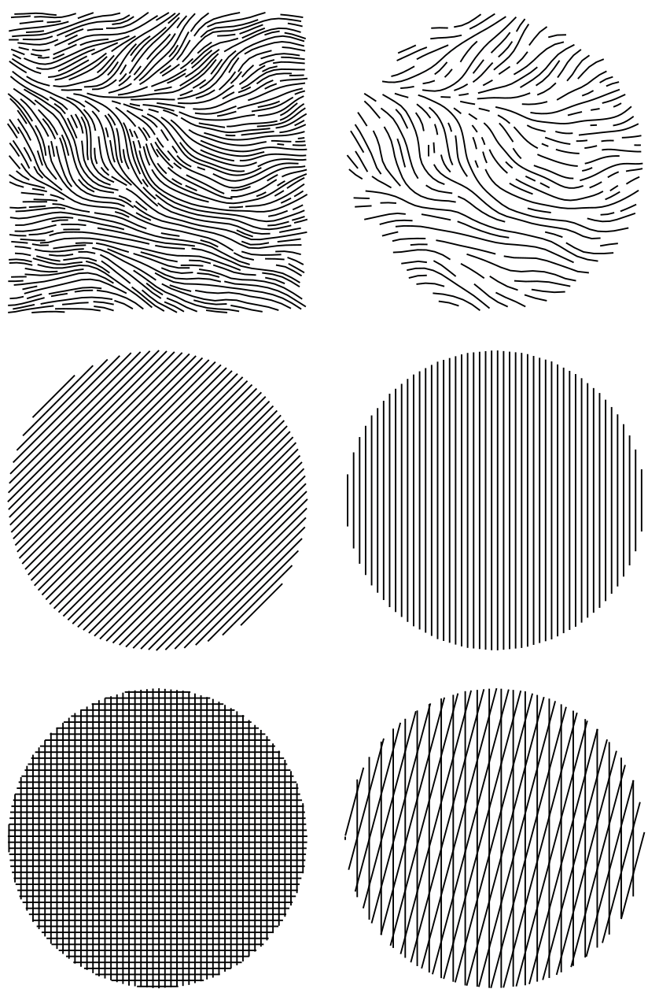

# PEmbroider Example

[PEmbroider](https://github.com/CreativeInquiry/PEmbroider) is a library for computational embroidery with Processing. It supports a wide range of different hatching techniques, and can export SVG files.




```
// Hatch some shapes and export an SVG
import processing.embroider.*;
PEmbroiderGraphics E;


void setup() {
  noLoop(); 
  size (475, 700);
  E = new PEmbroiderGraphics(this, width, height);

  String outputFilePath = sketchPath("PEmbroider_hatching.svg");
  E.setPath(outputFilePath); 
  E.beginDraw(); 
  E.clear();
  E.strokeWeight(1); 
  E.fill(0, 0, 0); 
  E.noStroke(); 
  
  // VERY important for SVG
  E.toggleConnectingLines(false); // for SVG!
  E.toggleResample(false); // for SVG!


  //-----------------------
  // Perlin noise field fill. 
  E.HATCH_MODE = PEmbroiderGraphics.PERLIN;
  E.HATCH_SPACING = 4;
  E.HATCH_SCALE = 1.0;
  E.rect( 25, 25, 200, 200);

  E.HATCH_MODE = PEmbroiderGraphics.PERLIN;
  E.HATCH_SPACING = 8;
  E.HATCH_SCALE = 1.0;
  E.circle(350, 125, 200);

  
  //-----------------------
  // Shapes filled with PARALLEL hatch mode.
  // I've changed up the way I'm setting the parameters.
  E.hatchMode(E.PARALLEL);
  E.hatchAngleDeg(45); // Degrees!
  E.hatchSpacing(4);
  E.circle(125, 350, 200);

  E.hatchMode(E.PARALLEL);
  E.hatchAngle(radians(90)); // Radians!
  E.hatchSpacing(4);
  E.circle(350, 350, 200);


  //-----------------------
  // The "cross" hatch mode is a convenience mode, 
  // placing parallel lines of stitching at two orientations
  // specified by HATCH_ANGLE and HATCH_ANGLE2:
  E.HATCH_MODE = PEmbroiderGraphics.CROSS;
  E.HATCH_ANGLE = radians(90);
  E.HATCH_ANGLE2 = radians(0); 
  E.HATCH_SPACING = 4;
  E.circle(125, 575, 200);

  E.HATCH_MODE = PEmbroiderGraphics.CROSS;
  E.HATCH_ANGLE = radians(90); 
  E.HATCH_ANGLE2 = radians(75); 
  E.HATCH_SPACING = 8;
  E.circle(350, 575, 200);
  

  //-----------------------
  E.optimize(); // slow, but good and important
  E.visualize(); 
  E.endDraw(); // write out the file
  save("screenshot.png"); 
}

//--------------------------------------------
void draw() {;}
```

