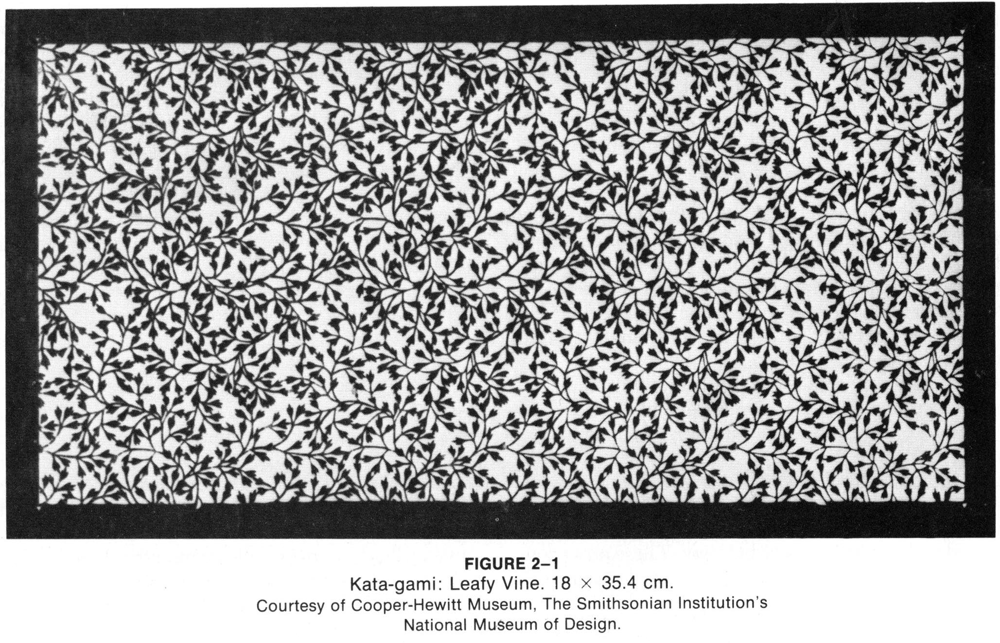
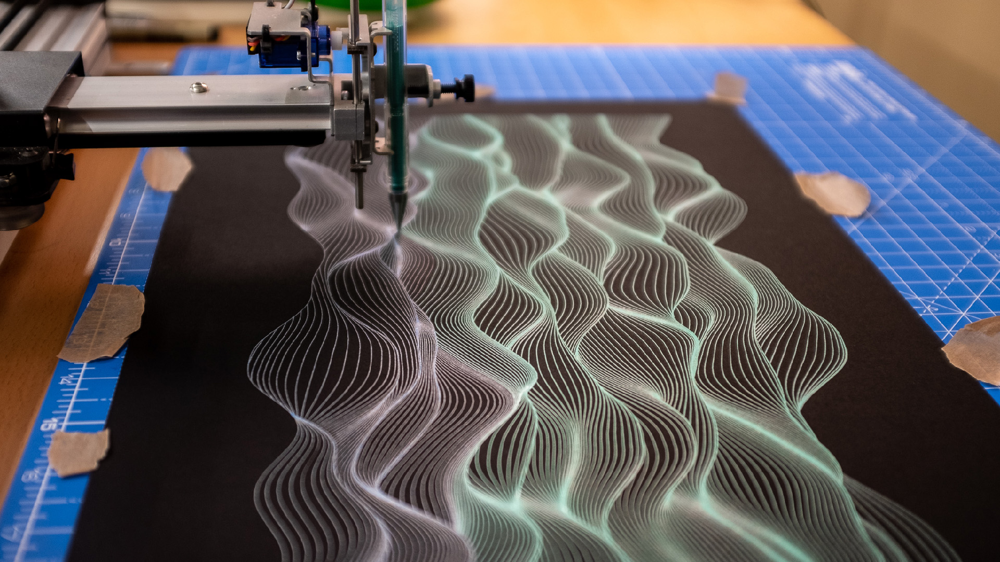

# Assignment 7: *Pattern*

> Distribution deals with the rhythmic reorganization of pattern structure. It involves movement of unequal elements which are equalized over the surface through the interplay of countermovements between them, rather than by an even repetition of identical design units.

---

This Assignment has 2 parts and is due at the beginning of class on **Thursday, 2/29**: 

1. (*15 points*) Readings on Fields/Distributions
2. (*85 points*) A Field/Distribution Composition, Plotted

---

## 1. Readings on Fields/Distributions

(*15 points total*) The purpose of this exercise is to familiarize you with some conceptual and technical approaches to filling 2D fields with aesthetic distributions, especially using visual models of morphogenesis. 

Please check out the following three resources:

1. **Read** [Chapter 2](distribution-graphic-games.pdf) (“Distribution”, pages 64-71) of *Graphic Games* by Victor Baumgartner. [[PDF](distribution-graphic-games.pdf)]
2. **Read** “[Flow Fields](https://tylerxhobbs.com/essays/2020/flow-fields)” by Tyler Hobbs.
3. **Skim** one or more of the following collections of algorithmic morphogenesis resources.
   * [*Morphogenesis Resources*](https://github.com/jasonwebb/morphogenesis-resources) by Jason Webb
   * [*That Creative Code Page*](https://thatcreativecode.page/) by Taru Muhonen & Raphaël de Courville
   * [*Processing repository*](https://github.com/v3ga/Processing) by Julien Gachadoat (v3ga)
   * [*Algorithmic Botany papers*](http://algorithmicbotany.org/papers/#webdocs) and/or [Visual Models of Morphogenesis](http://algorithmicbotany.org/vmm-deluxe/TableOfContents.html) by Przemyslaw Prusinkiewicz 

Now, in a Discord post in the channel *#7a-field-readings*: 

* (10 points) **Write** a brief response to something that you found interesting or helpful from these readings. 
* (5 points) **Include** a relevant image that illustrates the thing you found interesting. 

---

## 2. A Field/Distribution Composition, Plotted

 [*Perlin Noise landscapes by Revdancatt*](https://revdancatt.com/2020/01/30/penplotting-perlin-landscapes)

(*85 points*) The purpose of this prompt is to strengthen your skills in generative form-making with procedures that cover a 2D surface, such as growth algorithms and flow fields. You will likely be indirectly governing a process or simulation that implictly covers the page. You may use any algorithm you wish. The challenge will be making it bend to your will: making it your own.

**Prompt**: Develop a computationally-generated, machine-plotted artwork that presents a field or distribution across the surface.

To create your project:

* **Browse** the materials from the [previous lecture](../../lectures/2024/0220_field/README.md).
* **Sketch** ideas in your sketchbook. You may use any algorithm you wish, but if you are feeling uncertain or short on time, I encourage you to just get started with a Perlin noise flow field.
* **Write code** to generate several compositions. Export SVG files for plotting.
* **Plot** your artwork. You are encouraged to use more than one color in your design. Please do not use standard printer paper.

*Now*, to document your project:

* **Create** a post in the #7b-field-composition Discord channel. 
* (*Optional*) **Embed** some photographs of your sketches.
* (*15 points*) **Embed** some screenshots of at least two of your generated compositions.
* (*50 points*) **Embed** a good-quality photograph of your plotted composition. Consider having a second photograph showing a close detail.
* (*20 points*) **Write** a paragraph (of about 100-150 words) describing the logic of your composition, your sources of inspiration, your process, and an evaluation of your results. Be sure to acknowledge any code libraries that you used.

#### *Here are some potentially helpful Coding Train tutorials:*

* [Perlin Noise Flow Field](https://www.youtube.com/watch?v=BjoM9oKOAKY)
* [Circle Packing](https://www.youtube.com/watch?v=QHEQuoIKgNE)
* [Poisson-Disc Sampling](https://www.youtube.com/watch?v=flQgnCUxHlw)
* [Diffusion Limited Aggregation](https://www.youtube.com/watch?v=Cl_Gjj80gPE)
* [Space Colonization](https://www.youtube.com/watch?v=kKT0v3qhIQY)
* [Reaction-Diffusion](https://www.youtube.com/watch?v=BV9ny785UNc)

---

* [2021 Version](https://courses.ideate.cmu.edu/60-428/f2021/offerings/6-pattern/)

