# 6. Pattern

[**Original assignment here**](https://courses.ideate.cmu.edu/60-428/f2021/index.html%3Fp=1184.html). 

*Responses to this prompt will be discussed in class on Wednesday, October 6. This set of prompts has two parts:*

* Readings on Pattern
* A Tiling Pattern Composition

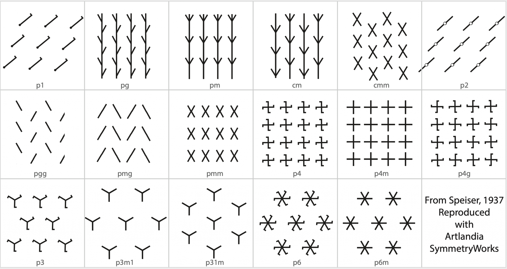

As a reminder, here are the [17 types of 2D crystallographic (wallpaper) symmetries](https://blog.artlandia.com/the-simplest-diagram-of-the-17-symmetry-types-ever/). *(There are no others!)*

---

## 6.1. Readings on Pattern

Please read the following two book excerpts:

* Excerpt (Chapter 30, p. 64-81) from *10 PRINT*, by Nick Montfort et al. — [6MB PDF](https://github.com/golanlevin/lectures/blob/master/lecture_pattern/img/10_print_excerpt_moln.pdf)
* Excerpt (Chapter 1, p. 17-37) from *Graphic Games*, by Victor Baumgartner, paying special attention to “Game C” — [22MB PDF](https://github.com/golanlevin/lectures/blob/master/lecture_pattern/img/graphic_games_ch1.pdf)

*Now:* in a blog **post**, write a very brief response to something that you found interesting or helpful. **Title** your blog post, *Nickname-PatternReading*, and Categorize your post, *06-PatternReading*.

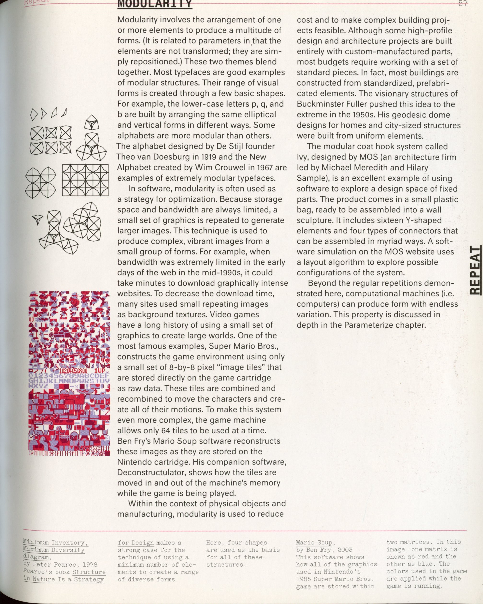

<table>
<tr>
<td>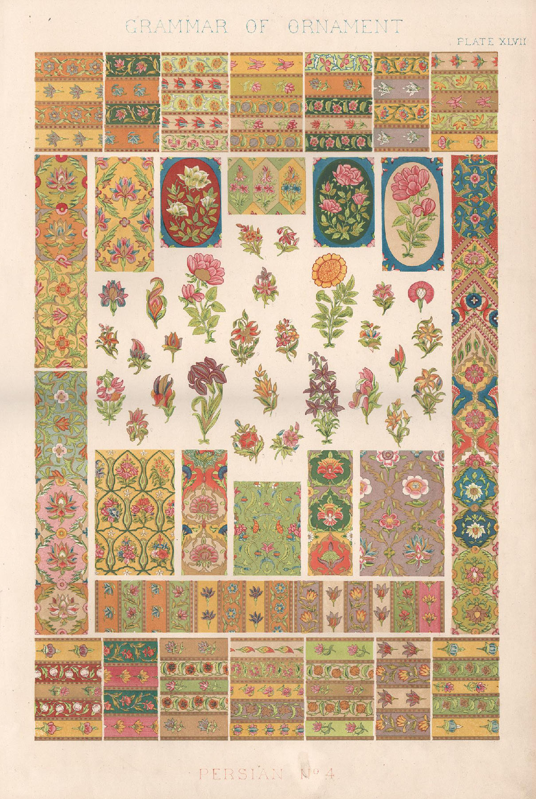</td>
<td>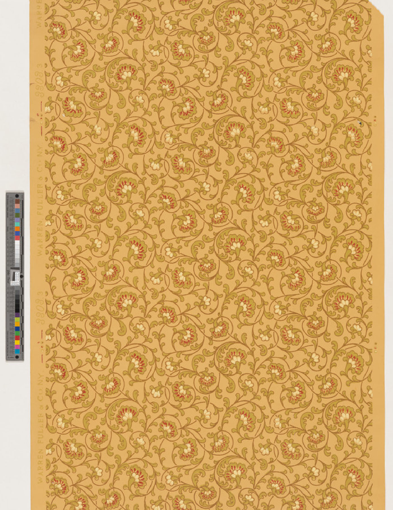</td>
</tr>
</table>


**Optional Inspirational Browsing:**

* Check out [*The Grammar of Ornament*](https://archive.org/details/grammarornament00Jone) (1856) by Owen Jones, one of the most gorgeous books ever published.
* Check out the fantastic [*Historic New England Wallpaper Archive*](https://www.historicnewengland.org/explore/collections-access/wallpaper/), which has more than 6000 high-resolution scans of antique wallpapers.
* Check out the [*Experimental Pattern Sourcebook : 300 Inspired Designs from Around the World*](https://cmu.primo.exlibrisgroup.com/discovery/fulldisplay?docid=alma991019809995604436&context=L&vid=01CMU_INST:01CMU&lang=en&search_scope=PITTSBURGH&adaptor=Local%20Search%20Engine&tab=CMU&query=any,contains,%20Experimental%20Pattern%20Sourcebook&mode=Basic), by Jackie Herald, available online in CMU’s library.
* Browse the amazing [*Tilings and Patterns*](https://archive.org/details/isbn_0716711931) book by Grünbaum and Shephard. This book includes many inspirational illustrations, such as these:

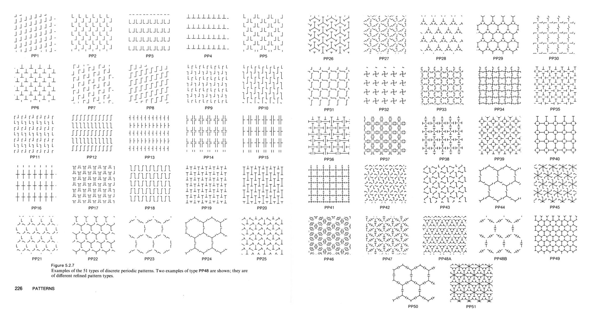

<table>
<tr>
<td>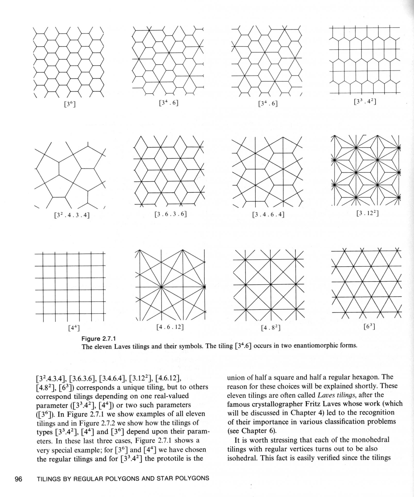</td>
<td>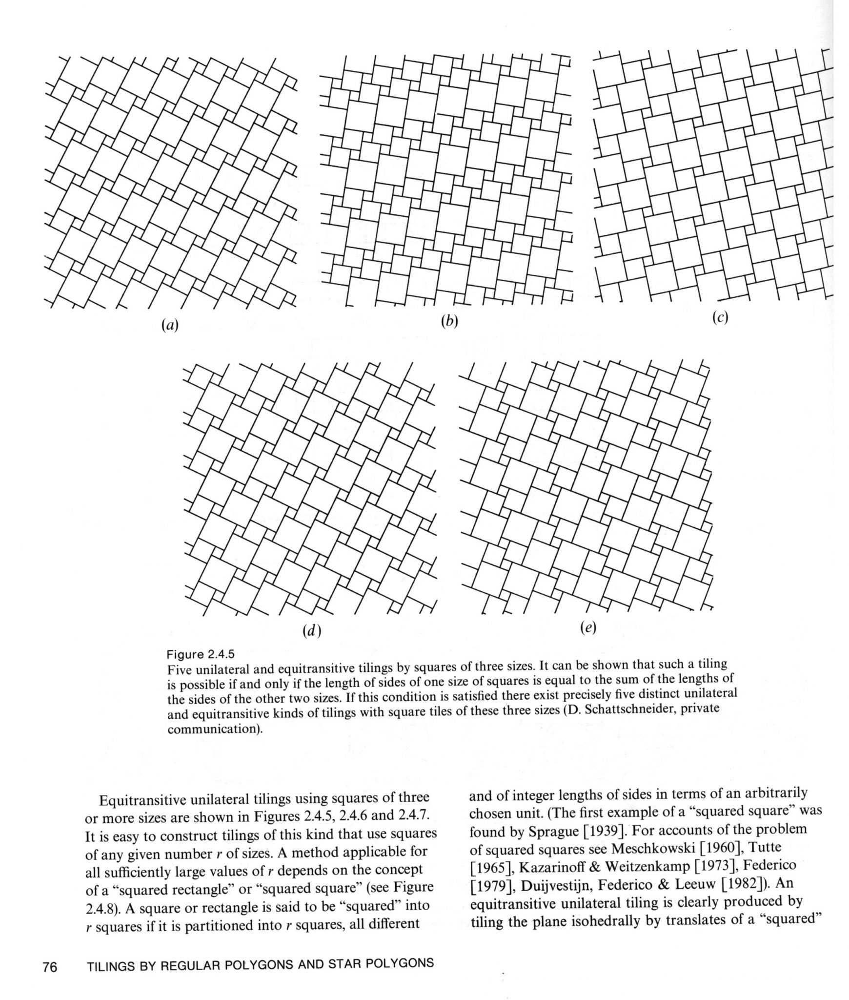</td>
</tr>
<tr>
<td>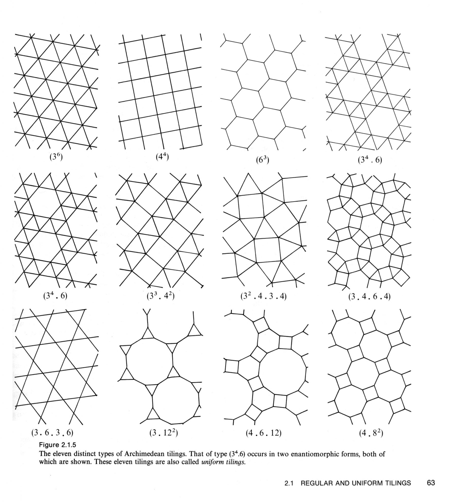</td>
<td>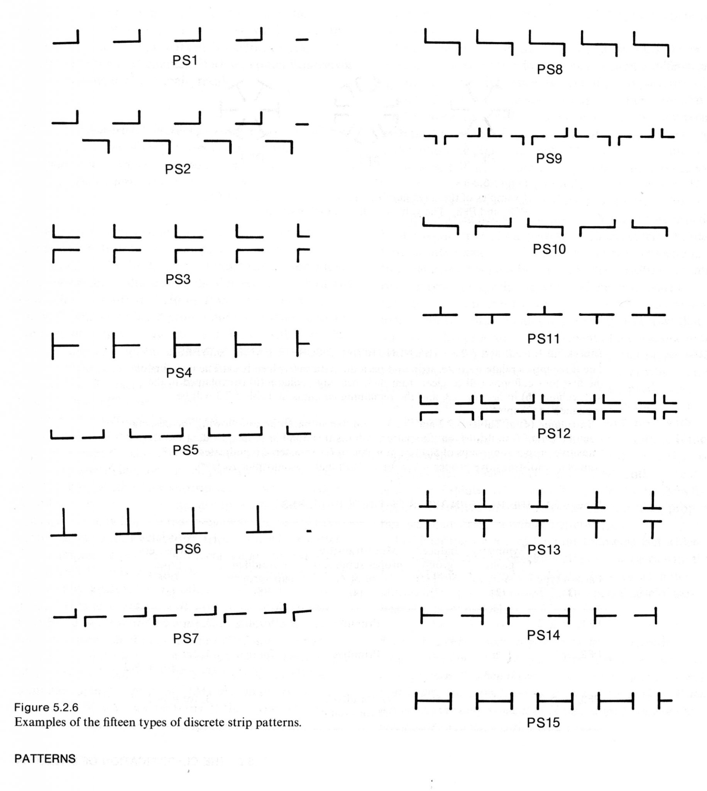</td>
</tr>
</table>
---

## 6.2. A Tiling Pattern Composition

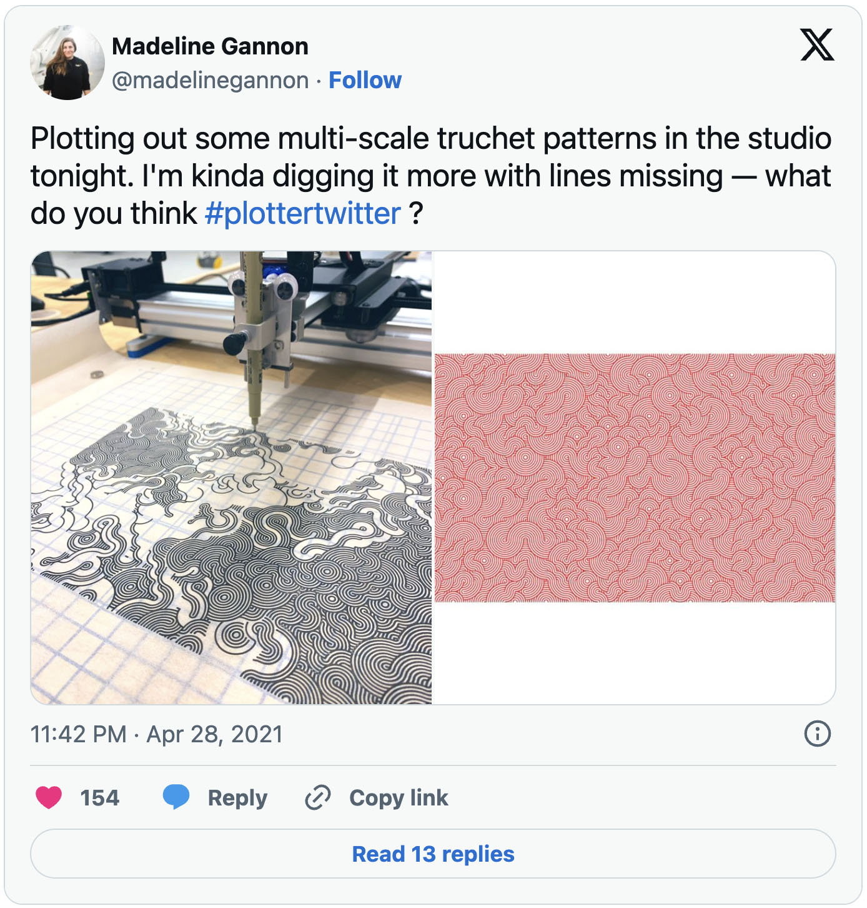

*The purpose of this prompt is to strengthen your skills in generative form-making with modular design elements.*

> Making procedural patterns is a mental exercise in finding minimal reusable elements. This practice is old; we as a species have been using grids and patterns to decorate textiles, floors and borders of objects for a long time: from meander patterns in ancient Greece, to Chinese lattice design, the pleasure of repetition and variation catches our imagination. Take some time to look at decorative patterns and see how artists and designers have a long history of navigating the fine edge between the predictability of order and the surprise of variation and chaos. From Arabic geometrical patterns, to gorgeous African fabric designs, there is an entire universe of patterns to learn from.

*— From [The Book of Shaders](https://thebookofshaders.com/09/) by Patricio Gonzalez-Vivo.*

**Prompt**: Develop a computationally-generated, machine-plotted artwork using tiling patterns—in which larger-scale structures appear to emerge from the arrangement of modular elements.

To **create** your project:

* **Browse** some of the examples from [last Wednesday’s lecture](https://courses.ideate.cmu.edu/60-428/f2021/index.html%3Fp=1160.html). Consider the use of randomness. **Consider** algorithms like Truchet tiles, Wang tiles, [Wave Function Collapse](https://github.com/LingDong-/ndwfc), etc. Some helpful tutorial videos can be found below. I have also provided some p5 template code for generating Wang tiles.
* **Sketch** some ideas in your sketchbook. You are strongly encouraged to use more than one color in your design.
* **Write** code to generate pattern compositions. **Export** SVG files for plotting.
* **Plot** your artwork. Please do not use standard printer paper.

To **document** your project:

* **Create** a blog post on this website. **Title** your blog post, *Nickname-TilingPattern*, and **Categorize** your blog post, *06-TilingPattern*.
* **Embed** some photographs of your sketches.
* **Embed** a good-quality photograph of your plotted composition. Consider having a second photograph showing a close detail.
* **Write** a paragraph (of about 100-150 words) describing the logic of your pattern, your sources of inspiration, your process, and an evaluation of your results. Be sure to **acknowledge** any code libraries that you used.

Here are some potentially helpful YouTube tutorials: 

* [Coding Challenge #76: 10PRINT in p5.js](https://youtu.be/bEyTZ5ZZxZs)
* [Shader Coding: Truchet Tiling Explained!](https://youtu.be/2R7h76GoIJM)


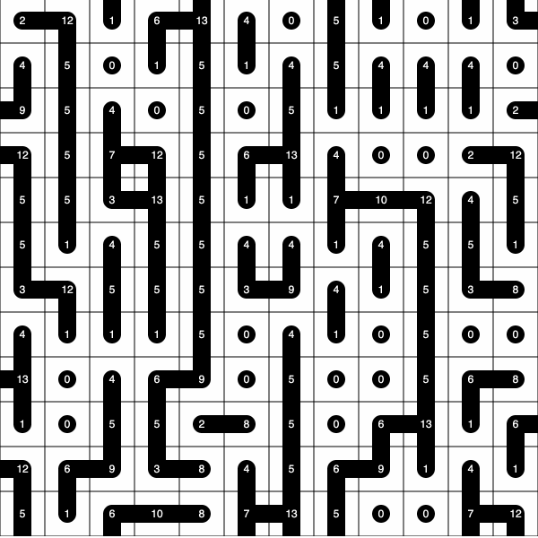

### Wang tiles in p5.js

```javascript
// Wang tiles in p5.js
var tiles;
var tileW, tileH;
var tileCols = 12;
var tileRows = 12;

function setup() {
  createCanvas(600, 600);
  tileW = width / tileCols;
  tileH = height / tileRows;
  tiles = create2DArray(tileRows, tileCols);
  arrangeWithConstraints();
}

function mousePressed() {
  arrangeWithConstraints();
}

function arrangeWithConstraints() {
  for (var row = 0; row < tileRows; row++) {
    for (var col = 0; col < tileCols; col++) {
      var tileThis = 0;

      if (row == 0 && col == 0) {
        // The top-left tile is totally random.
        tileThis = floor(random(16));
      } else {
        if (row > 0) {
          var tileAbov = tiles[row - 1][col];
          if ((tileAbov & 4) > 0) {
            // If the tile above us points downwards,
            // Draw upwards to connect with it.
            tileThis += 1;
          }
        } else {
          // For the first row,
          // Draw upwards with some probability
          if (random(1.0) < 0.333) {
            tileThis += 1;
          }
        }

        if (col > 0) {
          var tileLeft = tiles[row][col - 1];
          if ((tileLeft & 2) > 0) {
            // If the tile to the left points to its right,
            // Draw leftwards to connect with it.
            tileThis += 8;
          }
        } else {
          // For the first column,
          // Draw leftwards with some probability
          if (random(1.0) < 0.333) {
            tileThis += 8;
          }
        }

        if (random(1.0) < 0.6) {
          // Draw downwards with some probability.
          tileThis += 4;
        }
        if (random(1.0) < 0.2) {
          // Draw rightwards with some probability.
          tileThis += 2;
        }
      }
      tiles[row][col] = tileThis;
    }
  }
}

function arrangeWithNoConstraints() {
  // A purely random arrangement with no constraints.
  for (var row = 0; row < tileRows; row++) {
    for (var col = 0; col < tileCols; col++) {
      var random4BitInt = floor(random(16));
      tiles[row][col] = random4BitInt;
    }
  }
}

function draw() {
  background(230);
  for (var row = 0; row < tileRows; row++) {
    for (var col = 0; col < tileCols; col++) {
      var tileId = tiles[row][col];
      var x = col * tileW;
      var y = row * tileH;
      push();
      translate(x, y);
      rect(0, 0, tileW, tileH);
      drawTile(tileId);
      pop();
    }
  }
}

function drawTile(id) {
  var R = 20;
  fill(0);
  noStroke();
  push();
  translate(tileW / 2, tileH / 2);
  ellipse(0, 0, R, R);

  if ((id & 1) > 0) {
    // draw upwards
    rect(-R / 2, 0, R, -tileH / 2);
  }
  if ((id & 2) > 0) {
    // draw rightwards
    rect(0, -R / 2, tileW / 2, R);
  }
  if ((id & 4) > 0) {
    // draw downwards
    rect(-R / 2, 0, R, tileH / 2);
  }
  if ((id & 8) > 0) {
    // draw leftwards
    rect(0, -R / 2, -tileW / 2, R);
  }
  fill(255);
  textAlign(CENTER, CENTER);
  text(id, 0, 0);
  pop();
}

function create2DArray(nrows, ncols) {
  var arr = new Array(nrows);
  for (var r = 0; r < nrows; r++) {
    arr[r] = new Array(ncols);
  }
  return arr;
}
```