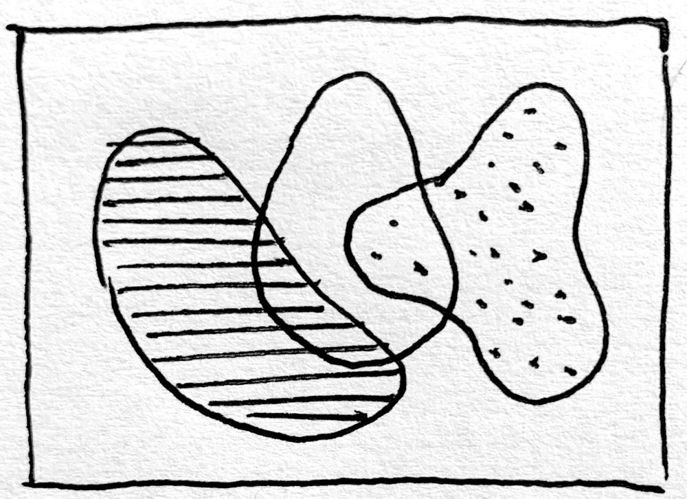

# Assignment 6: *Shape*

This Assignment has two parts: 

* **6a-shape-readings** (20 points)
* **6b-shape-family** (80 points)

---

## 6a. Shape Readings

```
A blob is a raw amorphous form
A blob is a potentiality
A blob is an indeterminate destination
A blob is a liminal manifestation of the inexplicable
A blob is neither this nor that but points as is
A blob is a transitional state of being
A blob is a subtle deconstruction of preconceptions
A blob is a real-time negotiation
A blob is a polite refusal of hierarchy
A blob is a poetic irregularity
A blob is a vague matter of existence
A blob is a sensitization to nonlinearity
— Laura Hyunjhee Kim
```

Please read two or more of the following readings:

1. [*Atlas of Blobs*](https://atlasofblobs.cc/), by Zachary Lieberman (and related [interview](https://www.mplus.org.hk/en/magazine/spirit-of-blobs--artist-zachary-lieberman-in-conversation/))
2. Excerpt from *Entering the Blobosphere*, by Laura Hyunjhee Kim [[PDF]](../../../readings/shape_readings/kim_blobosphere.pdf)
3. Excerpt from *Blobjects: Beyond the New Fluidity in Design*, by Steven Holt and Maria Skov [[PDF]](../../../readings/shape_readings/patton_blobjects.pdf)
4. Excerpt (“Good Shape”) from *The Nature of Order*, by Christopher Alexander [[PDF]](../../../readings/shape_readings/alexander_good-shape.pdf)

(*20 points*) In the Discord channel, *#6a-shape-readings*, write a sentence or two about something that struck you from these readings. 

---

## 6b. Shape Family



(80 points) *The objective of this prompt is to develop your skills in the control of expressive shape.* 

Too often, when using creative coding toolkits, we rely on "readymade" shapes like circles and rectangles. These forms are everywhere and everyone's. Presently, we turn our attention to making our ***own*** shapes. 

Write a computer program that generates various compositions of "blob families". Your blobs must be closed shapes, and at least one of them must be filled with some sort of hatching.

Blobs are a good goal, because everyone has their own unique blob. But please don't feel that you *must* focus on "blobs" *per se*. Despite the examples I've shown in class, the true goal here is for you to develop *your own vocabulary of expressive, computational 2D forms*. 

### Hints:

* *There’s no single correct technique to make a blob*. You are welcome to consider possible techniques including (but not limited to) things like: 
	* making polylines made from particle systems; 
	* making high-order Catmull-Rom or Bezier curves; 
	* tracing the contours (2D isolines) of metaballs; 
	* concatenating elliptical arcs; 
	* calculating a Cassini ellipse, [cranioid](https://mathworld.wolfram.com/Cranioid.html), or other parametric curve from Mathworld; 
	* simulating a smooth ropelike contour using Verlet integration, etc. 
	* Some possibly helpful Coding Train videos can be found below.
* *There’s no single correct technique to fill (hatch) an arbitrary shape*. You are welcome to use a [point-in-polygon test](https://rosettacode.org/wiki/Ray-casting_algorithm), a [flood-fill algorithm](https://rosettacode.org/wiki/Bitmap/Flood_fill), or an API/library of your choice, such as [PEmbroider](https://github.com/CreativeInquiry/PEmbroider/), [hatched](https://github.com/plottertools/hatched), [Shapely](https://shapely.readthedocs.io/en/latest/), etc.
* *There is no single correct technique to construct an ‘attractive’ form* or an attractive composition of forms. Devise your own principles.

### Now:

* **Run** your generator a few times to produce different compositions. Collect screenshots of some of your favorite compositions.
* Before you plot, **consider** your materials! You are welcome (but not required) to use colored inks. Use nice (heavy) paper. Note: *You are prohibited from using standard-ass white printer paper*. You are welcome (but not required) to use colored paper. You can [plot with the HP7475a](https://github.com/golanlevin/DrawingWithMachines/blob/main/machines/hp7475a/README.md) if you want to use multiple colors, and if you have time.
* **Select** a particular composition you like, export it as an SVG, and render it with a pen plotter. Do some quick tests with your materials before plotting. 
* **Photograph** your plotted composition with your phone or other camera. Be sure your composition is plotted before the beginning of class on Wednesday, September 29.
* **Create** a post in the Discord channel, *#6b-shape-family*.
* (*15 points*) In your post, **write** 100-200 words about your process. Be sure to give credit to any libraries or code that you used from elsewhere. If applicable, **include** a sentence or two about how any reading(s) and/or inspirational viewings may have influenced your thinking.
* (*15 points*) **Embed** three screenshots of different compositions produced by your software (including e.g. un-plotted ones).
* (*50 points*) **Embed** a photograph of your final plot. If you feel like it, feel free to also **embed** a photograph of a *detail view *of your plot (for example, a detailed view of the hatching).

#### Reference tutorials from Coding Train: 

* [Coding Challenge #36: Blobby](https://www.youtube.com/watch?v=rX5p-QRP6R4)
* [Coding Challenge #26: Metaballs](https://www.youtube.com/watch?v=ccYLb7cLB1I)
* [Coding Challenge: Marching Squares](https://www.youtube.com/watch?v=0ZONMNUKTfU)

--- 

* [2021 Version](https://courses.ideate.cmu.edu/60-428/f2021/offerings/5-shape/)
