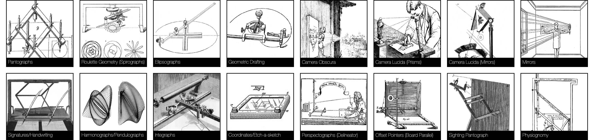

# 1. Drawing Machine

 <small><small>Tim Knowles attached pencils to a tree in his wind-activated [*Tree Drawings*](https://www.cabinetmagazine.org/issues/28/knowles.php), 2005; Rebecca Horn constructed this [*Pencil Mask*](https://www.youtube.com/watch?v=RPwpC82li2Q) to make wall drawings in 1973.</small></small>

*This project has four parts and is due Wednesday, August 27th at the beginning of class.* 

* 1.1. Course Administration *(15 minutes, 5%)*
* 1.2. Looking Outwards I: Previous Student Work *(15 minutes, 5%)*
* 1.3. Looking Outwards II: Drawing Machines *(30-45 minutes, 15%)*
* 1.4. Shitty Drawing Machine *(4 hours max, 75%)*

---

## 1.1. Course Administration

*(5%, due Wednesday 8/27; 15 minutes)*

* **Read** our [Syllabus](../../../syllabus/60-468_syllabus_fall_2025.md) carefully and thoroughly!
* **Join** our course Discord using the invite provided by email.
* **Complete** the [Welcome Questionnaire]().
* **Introduce** yourself! In the Discord channel `1-1-introductions`, **write** a couple of sentences about your background, interests, and special powers. Optionally, feel free to **embed** an image or **include** a link to some of your work.

---

## 1.2. Looking Outwards I: Previous Student Work

 <small><small>2021 DwM student [Lukas Hermann](https://lukashermann.com/#projects) recorded the walk cycles of fellow students, and used computer vision to [convert them to traces of motion](https://courses.ideate.cmu.edu/60-428/f2021/author/lsh/index.html).</small></small>

*(5%, due Wednesday 8/27; 15 minutes)*

* **Browse** the following pages, which present select projects made by students in previous instances of this course:
	* [**Drawing with Machines, Fall 2021**](https://github.com/golanlevin/DrawingWithMachines/blob/main/documentation/2021/README.md) 
	* [**Drawing with Machines, Spring 2024**](https://github.com/golanlevin/DrawingWithMachines/blob/main/documentation/2024/README.md)
	* [**Drawing with Machines Workshop, Summer 2022**](https://github.com/golanlevin/DrawingWithMachines/tree/main/documentation/2022)
* **Identify** a project that speaks to you, made by another student. 
* **Create** a post in the `#1-2-looking-at-dwm` Discord channel.
* **Write** a sentence or two about why you found the project appealing or interesting.
* **Include** an image of the project.

*(In some cases, additional information may be available about the project you selected. If you're interested, message the professor by Discord, or check out the provided links to Flickr archives, etc.)*

---

## 1.3. Looking Outwards II: Drawing Machines

*(15%, due Wednesday 8/27; 30-45 minutes)*

* **Browse** the following lists, which index a wide range of drawing tools, artworks, toys, and machine experiments:
	1. [**Links in this list**](../../2024/01_diy_drawing_machine/list.md) 
	2. [**DrawingMachines.org**](https://drawingmachines.org/), by Pablo Garcia
* **Identify** a drawing machine or tool that speaks to you. 
* **Create** a post in the `#1-3-looking-at-machines` Discord channel.
* **Write** a sentence or two describing the drawing machine or tool you selected, and why you found it interesting. (Be sure to **cite** the creator, if known.)
* **Include** an image of the machine or tool.

---

## 1.4. 💩🤖🖌️ Shitty Drawing Machine

 <small><small>Kanako Ishikawa used an oscillating fan and a barking puppy toy to create this [*Drawing Machine*](https://vimeo.com/305405463), 2018.</small></small>

*(75%, due Wednesday 8/27; 4 hours max)*

Using any materials you have at hand, **create** a shitty drawing machine. Use it to **make** a shitty drawing. This is a [speed project](https://fffff.at/speed-project/); don't overthink it.

Perhaps your machine is an instrument to release the drawing that is trapped inside some everyday object. Your project could be a prosthesis or performance partner, whose resulting drawings are duets between human and machine. Or perhaps your machine is a witchcraft, and its scribbling is graphomancy, a divination.

Take some photos of your machine and its drawings, and record a brief video or animated GIF of your system in action. A few seconds' duration is probably adequate, but feel free to do what's necessary to explain your project visually (e.g. a time lapse, etc).

*Now*, **provide documentation** of your project through two different channels: 

1. **Present** your documentation in a post in the **Discord channel**, `#1-4-drawing-machine`. The purpose of your Discord post is to make it easy for us to share, browse, and discuss each others' work. (Note: Discord imposes an 8 MB/file limit; for GIFs, consider reducing file size with [ezgif.com/optimize](https://ezgif.com/optimize).)
2. *Also*, **Submit** your documentation through this [**Google Form**](https://docs.google.com/forms/d/e/1FAIpQLScPxj3o4SNXomiYu4vGqDObooXI_7j4vK2sFzYPpyAIJK6-jQ/viewform?usp=header). The purpose of this form is to ensure that your documentation is collected in a well-organized archive. (Note: This form has a 10 MB/file limit, and requires that you be logged in through CMU.)

In both the Discord post and the Google form: 
 
* **Name** or **title** your machine. 
* **Write** a couple of sentences about your machine.
* **Upload** a photograph of your machine.
* **Upload** a photograph of your machine's drawing.
* **Create** and **upload** some time-based documentation of your machine in use. This could be an animated GIF or a brief video. (For Discord, link to an "unlisted" video on YouTube).

---

*EOF.*

<!--
*Past assignment versions: [2021](https://courses.ideate.cmu.edu/60-428/f2021/index.html%3Fp=41.html), [2024](https://github.com/golanlevin/DrawingWithMachines/blob/main/assignments/2024/01_diy_drawing_machine/README.md)*
-->

