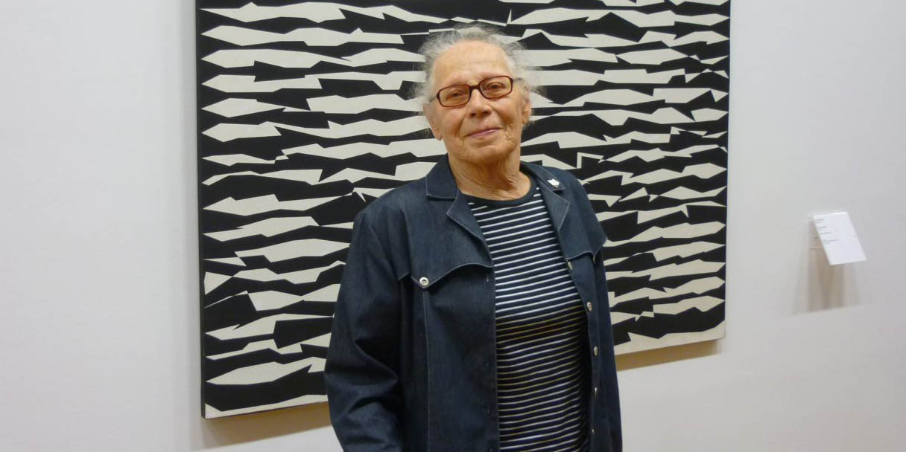

# 2: Getting Started, Plotting

### Drawing with Machines, Fall 2025 • Due 9/3

 James Merrill, [*Busy*](https://www.artblocks.io/exhibitions/busy-by-james-merrill), 2025

*This set of exercises has five parts and is due Wednesday, 9/3/2025 at the beginning of class.* 

* 2.1. Personal Speculation *(10%, 10 minutes)*
* 2.2. Looking Outwards: Tooling *(10%, 20 minutes)* 
* 2.3. Looking Outwards: Generative Plotter Art *(10%, 30 minutes)*
* 2.4. Reading Response: Skimming Others' Practices *(10%, 30 minutes)*
* 2.5. A Complete Workflow: Re-Coding and Plotting Molnar's "Lettres" *(60%, 3-4 hours)*

---

## 2.1. Personal Speculation

In the blink of an eye, it's 2026. Somehow, this class has completely changed how you work. 

* What was the breakthrough? 
* What was the challenge? 
* What was the casualty?

Create a post in the Discord channel `#2-1-speculation`. In your own voice, in a few sentences, please **speculate**. 

 
<em>What?</em>
 
We’re about to spend a semester making things with machines—and machines have a way of changing the people who use them. This prompt is a way to take your own baseline measurement. Imagine, before we start, how automation might actually <em>matter</em> to you — what you’d want from it, what might trip you up, and what you might have to give up. Months from now, you may look back and see how your thinking has shifted.

---

## 2.2. Looking Outwards: Tooling

*(20 minutes)* 

The purpose of this exercise is to help introduce you to some of the technical resources and communities for computer controlled pen-plotting machines.

* Spend ten minutes browsing the materials on the [**DrawingBots.net Resources**](https://drawingbots.net/resources) page. This is "the central place on the web to discover the world of drawing robots, get inspiration and talk to other drawing robot enthusiasts." Optionally, check out the affiliated [DrawingBots Discord (invite here)](https://discordapp.com/invite/XHP3dBg). There are lists of recommended pens, various types of SVG generators, many links to code libraries, etc.
* Spend 5-10 minutes browsing the materials at the [**AwesomePlotters Repository**](https://github.com/beardicus/awesome-plotters), "a curated list of code and resources for computer-controlled drawing machines and other visual art robots."
* *Now*, in our Discord channel `#2-1-looking-at-tooling`, **create** a very brief post about a specific technical resource that caught your attention. 
  * **Link** to the resource, 
  * **describe** what it is, and 
  * **write** a sentence about why you found it interesting or potentially useful. 

---

## 2.3. Looking Outwards: Generative Plotter Art

 Licia He, [*Fictional Lullaby*](https://www.eyesofpanda.com/project/fictional_lullaby/), 2023

*(30 minutes)* 

The purpose of this prompt is to develop your familiarity with global practices and international communities of people using code to create art with plotters. You can find this work on the following channels, among other places:

* In the book [*Tracing the Line*](https://vetroeditions.com/products/tracing-the-line), in our classroom
* On Twitter/X, using the hashtag [#PlotterTwitter](https://twitter.com/hashtag/plottertwitter)
* On Instagram at [#PlotterTwitter](https://www.instagram.com/explore/tags/plottertwitter/)
* On BlueSky, at [#penplotter](https://bsky.app/hashtag/penplotter) and [#plottertwitter](https://bsky.app/hashtag/plottertwitter)
* In the Feral File exhibition, [*+GRAPH*](https://feralfile.com/explore/exhibitions/graph-8vs)

You can also browse work by some individual contemporary artists who use code and plotters extensively in their practices: 

| Artists                 |                           |                         |
|:------------------------|:--------------------------|:------------------------|
| [Adam Fuhrer](https://adamfuhrer.bigcartel.com/) | [Catherine B](https://www.instagram.com/catherineb_._/) | [Frederik Vanhoutte](https://www.instagram.com/wblut/) |
| [Arjan van der Meij](https://dutchplottr.nl/en/) | [Cory Haber](https://x.com/search?q=Cory_Haber%20%23plotterTwitter&src=typed_query) | [Ingrid Burrington](https://wares.lifewinning.com/) |
| [Daniela Kroehnert](https://www.instagram.com/daniela_kroehnert/) | [Emre Meydan](https://x.com/thresfold) | [Iskra Velitchkova](https://www.instagram.com/ognyveli/) |
| [James Merrill](https://www.instagram.com/lostpixels) | [Jessica In](https://www.instagram.com/shedrawswithcode/?hl=en) | [Joanie Lemercier](https://www.instagram.com/joanielemercier/) |
| [Joel Cammarata](https://www.instagram.com/j.cammarata.art/) | [Julien Gachadoat](https://www.instagram.com/julienv3ga/) | [Jürg Lehni](https://juerglehni.com/) |
| [Lars Wander](https://www.instagram.com/larswander/) | [LIA](https://www.liaworks.com/tag/plotter-drawing/) | [Licia He](https://www.instagram.com/blahblahpaperblah/) |
| [Magda Brzezińska](https://www.instagram.com/magmidas_art/) | [Marius Watz](https://www.instagram.com/nosuchfuture/) | [Michael Fogleman](https://www.michaelfogleman.com/plotter/) |
| [Michaël Zancan](https://www.instagram.com/zancan.code/?hl=en) | [Michelle Chandra](https://www.dirtalleydesign.com/collections/flowers-and-leaves) | [Patrick Tresset](https://www.instagram.com/patricktresset/) |
| [Paul Prudence](https://www.instagram.com/mrprudence/) | [Paul Rickards](https://shop.paulrickards.com/galleries/) | [Rev Dan Catt](https://www.instagram.com/revdancatt) |
| [Ron Scalera](https://x.com/robscalera) | [Shojiro Nakaoka](https://viridian-adapter-f76.notion.site/PLOTTER-WORKS-1c972edc8aa680fc9cedef0cd5587c58) | [Sougwen Chung](https://sougwen.com/) |
| [Julien Terraz (Targz)](https://www.instagram.com/targz/) | [Travess Smalley](https://www.instagram.com/travess/?hl=en) |[Floris de Jonge](https://bsky.app/profile/florisdejonge.bsky.social) |

Please spend about 20 minutes browsing these materials to get a sense of how some artists are combining computation and plotter devices. *Now*,

* **Create** a post in the Discord channel, `#2-2-looking-at-art`.
* **Write** a sentence or two reflecting on the work you saw, overall. What was interesting to you? What was disappointing? What opportunities did you see? Why do you think people are combining generative art and plotting machines?
* **Identify** a specific artwork you liked, that involved plotters in some way. In your post, **link** to the project's URL, and **embed** an image or screenshot of the project. 
* **Write** another sentence or two, on what you appreciated about this particular project.

---

## 2.4. Reading Response: Skimming Others' Practices 

*(10%, 30 minutes)*

The purpose of this prompt is to learn about how various creators think about and describe their processes of working with code and plotters. These articles are essentially introductory technical walk-throughs, with “tips” and suggestions; you will notice considerable diversity in the artists’ approaches. *(Note: It is sufficient to skim these articles!)*

**Skim** the following:

* Shiqing (Licia) He. *300 Days with Plotters*, 2020. [PDF](https://github.com/golanlevin/DrawingWithMachines/blob/main/readings/licia_he_300_days_with_plotters.pdf) / [Online](https://liciahe.medium.com/300-days-with-plotters-14159ab64034)
* Matt Deslauriers, [*Pen Plotter Art & Algorithms, Part 1*](https://mattdesl.svbtle.com/pen-plotter-1), 2017. [PDF](https://github.com/golanlevin/DrawingWithMachines/blob/main/readings/deslauriers_plotter_art_i.pdf) / [Online](https://mattdesl.svbtle.com/pen-plotter-1)
* Matt Deslauriers, [*Pen Plotter Art & Algorithms, Part 2*](https://mattdesl.svbtle.com/pen-plotter-2), 2017. [PDF](https://github.com/golanlevin/DrawingWithMachines/blob/main/readings/deslauriers_plotter_art_ii.pdf) / [Online](https://mattdesl.svbtle.com/pen-plotter-2)
* Michael Fogleman, [*Pen Plotter Programming: The Basics*](https://medium.com/@fogleman/pen-plotter-programming-the-basics-ec0407ab5929), 2017. [PDF](https://github.com/golanlevin/DrawingWithMachines/blob/main/readings/fogleman_plotting_basics.pdf) / [Online](https://medium.com/@fogleman/pen-plotter-programming-the-basics-ec0407ab5929)

*Now:*

* **Create** a post in the Discord channel, `#2-4-reading-response`.
* **Write** a sentence or two about something from one of the above articles that you found interesting and/or helpful.

---

## 2.5. Re-Coding and Plotting Molnar's "Lettres"

*(60%, due Wednesday 9/3; 3-4 hours)*

Copying or interpreting a masterwork is a classic way artists learn. This assignment builds your skills in:

* Creative coding with a toolkit of your choice (p5.js, Processing, vsketch…)
* Exporting SVGs for plotting (essential for this course)
* Observation, analysis, and historical appreciation
* Expressing your own voice within asemic writing

Vera Molnar (1924–2023), known as the “Mother of Computer Art,” began making art with computers in 1968. In the mid-1980s, she began a series of plotted works, *Lettres de ma Mère*, which simulated her elderly mother’s handwriting as it became more chaotic with age and illness. Molnar described the work as tracing a transition — from precise to restless to unreadable:

> *“My mother had a wonderful hand-writing. There was something gothic in it (it was the style of writing of all well-educated ladies in the Habsburg monarchy in the early XXth century) but also something hysteric. The beginning of every line, on the left side, was always regular, severe, gothic and at the end of each line it became more nervous, restless, almost hysteric. As the years passed, the letters in their totality, became more and more chaotic, the gothic aspect disappeared step by step and only the disorder remained. Every week she wrote me a letter, it was a basic and important event in my visual environment. They were more and more difficult to decipher, but it was so nice to look at them… then, there were no more letters…So I went on to write letters of hers to myself, on the computer of course, simulating the transition between gothic and hysteric.”*

Two examples of *Lettres de ma Mère* by Vera Molnár, 1988, [Spalter Collection](https://spalterdigital.com/artists/vera-molnar/).

*Now:*

* **Examine** examples, [2](img/vera_lettres_2_1987.jpg), [3](img/vera_lettres_3_1988.jpg), [4](img/vera_lettres_4.jpg), [5](img/vera_lettres_5.jpg), [6](img/vera_lettres_6.jpg), and [7](img/vera_lettres_7.jpg).
* **Read or Skim**: Vera Molnar's own [1995 Leonardo article](../../../readings/molnar_letters/vera_molnar_my_mothers_letters_leonardo_1995.pdf), and [this 2024 Artforum article](../../../readings/molnar_letters/vera_molnar_artforum_2024.pdf).  
* **Code**: Re-create or re-interpret the work. Your program must be generative and export SVGs. (Practical [instructions on creating SVGs with p5.js, Python, or Java can be found here](https://github.com/golanlevin/DrawingWithMachines/blob/main/generating_svg/README.md).)
* **Plot**: Black or blue ink, 9×12" or 8.5×11" white paper. *First‑time DwM students should use AxiDraw*.
* **Post**: In Discord `#2-5-lettres`, **embed** a photo (2–3 variations if relevant) and **write** a few sentences about your approach.
* **Submit**: Documentation via Google Form (TBA) with clear filenames (e.g. `lastname_lettres.jpg`).
* **Bring**: Your physical plot to class on 9/3 for pinup.

For more information about *Lettres de ma Mère* and Molnar's work, see: 

* Vera Molnar, "[My Mother’s Letters: Simulation by Computer](../../../readings/molnar_letters/vera_molnar_my_mothers_letters_leonardo_1995.pdf)", *Leonardo*, June 1995
* Zsofi Valyi-Nagy, "[Between the Lines: The art of Vera Molnar](../../../readings/molnar_letters/vera_molnar_artforum_2024.pdf)", *Artforum*, May 2024
* Anne Spalter, "[Interview with Vera Molnár](https://brownpoliticalreview.org/bpr-interviews-vera-molnar/)", Brown Political Review, May 2020.
* Other [works by Molnár in the Spalter Collection](https://spalterdigital.com/artists/vera-molnar/)

<!--
* [Golan p5 solution](https://editor.p5js.org/golan/sketches/h-6WtzDGv)
-->

---

EOF

<!-- 
PAST VERSIONS: 
2021: https://courses.ideate.cmu.edu/60-428/f2021/index.html%3Fp=111.html
2024: https://github.com/golanlevin/DrawingWithMachines/tree/main/assignments/2024/03_introductory_tooling
2024: https://github.com/golanlevin/DrawingWithMachines/tree/main/assignments/2024/02_rule_based_art
-->

<!-- joanie thread: https://twitter.com/JoanieLemercier/status/1391443586206535682) 

* [Adam Fuhrer](https://adamfuhrer.bigcartel.com/)
* [Arjan van der Meij](https://dutchplottr.nl/en/)
* [Catherine B](https://www.instagram.com/catherineb_._/)
* [Cory Haber](https://x.com/search?q=Cory_Haber%20%23plotterTwitter&src=typed_query)
* [Daniela Kroehnert](https://www.instagram.com/daniela_kroehnert/)
* [Emre Meydan](https://x.com/thresfold)
* [Frederik Vanhoutte](https://www.instagram.com/wblut/)
* [Ingrid Burrington](https://wares.lifewinning.com/)
* [Iskra Velitchkova](https://www.instagram.com/ognyveli/)
* [James Merrill](https://www.instagram.com/lostpixels)
* [Jessica In](https://www.instagram.com/shedrawswithcode/?hl=en)
* [Joanie Lemercier](https://www.instagram.com/joanielemercier/)
* [Joel Cammarata](https://www.instagram.com/j.cammarata.art/)
* [Julien Gachadoat](https://www.instagram.com/julienv3ga/)
* [Jürg Lehni](https://juerglehni.com/)
* [Lars Wander](https://www.instagram.com/larswander/)
* [LIA](https://www.liaworks.com/tag/plotter-drawing/)
* [Licia He](https://www.instagram.com/blahblahpaperblah/)
* [Magda Brzezińska](https://www.instagram.com/magmidas_art/)
* [Marius Watz](https://www.instagram.com/nosuchfuture/)
* [Michael Fogleman](https://www.michaelfogleman.com/plotter/)
* [Michael Zancan](https://www.instagram.com/zancan.code/?hl=en)
* [Michelle Chandra](https://www.dirtalleydesign.com/collections/flowers-and-leaves)
* [Patrick Tresset](https://www.instagram.com/patricktresset/)
* [Paul Prudence](https://www.instagram.com/mrprudence/)
* [Paul Rickards](https://shop.paulrickards.com/galleries/)
* [Rev Dan Catt](https://www.instagram.com/revdancatt)
* [Ron Scalera](https://x.com/robscalera)
* [Shojiro Nakaoka](https://viridian-adapter-f76.notion.site/PLOTTER-WORKS-1c972edc8aa680fc9cedef0cd5587c58)
* [Sougwen Chung](https://sougwen.com/)
* [Targz](https://www.instagram.com/targz/)
* [Travess Smalley](https://www.instagram.com/travess/?hl=en)

-->
