# 3: Line

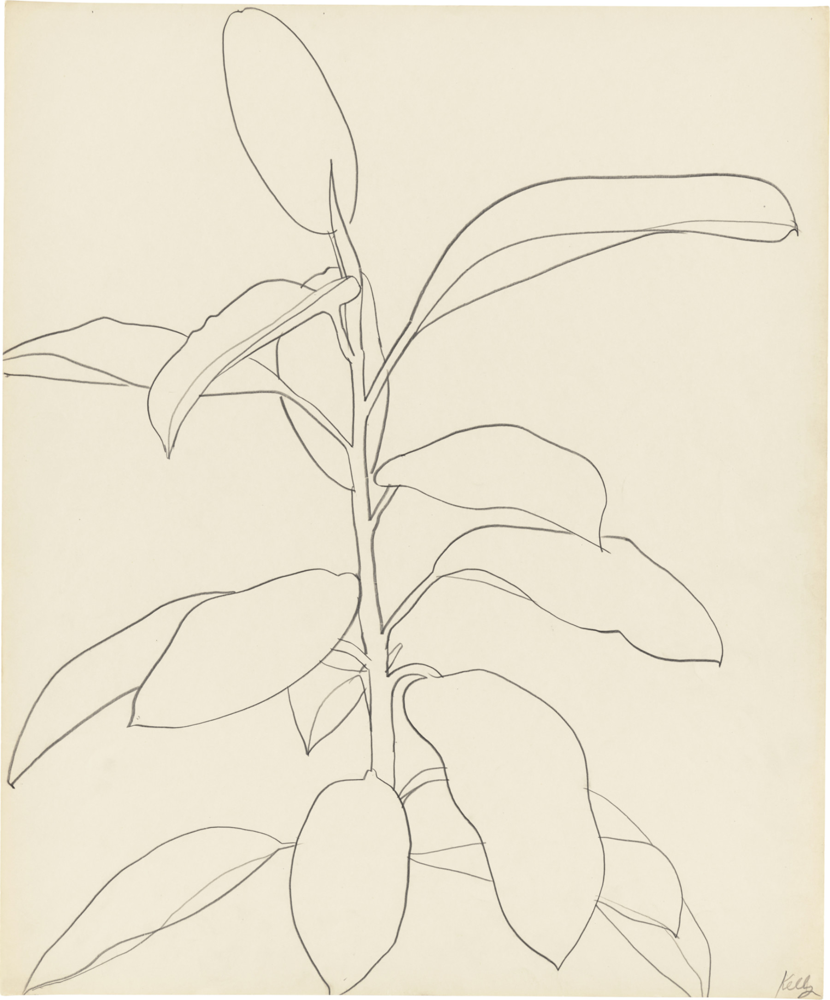<br />
<small>Ellsworth Kelly, [*Rubber Plant*](https://matthewmarks.com/exhibitions/ellsworth-kelly-plant-drawings-05-2017), 1957</small>

This set of assignments has three main parts: a series of warmup exercises, a minor project, and a main project. **You are asked to decide whether 3.2 (offset curves) or 3.3 (dot walk) is your minor project (worth 25%) or your main project (worth 50%), or vice-versa.**

* 3.1. [Warmup Exercises](#31-warmup-exercises) *(~2 hours)*
	* 3.1.0. [Install and Test vpype](#310-install-and-test-vpype) *(0-60 minutes)*
	* 3.1.1. [Naive Offset Curve](#311-naive-offset-curve) *(30 minutes, 5%)*
	* 3.1.2. [Making Lines with Different Weights](#312-making-lines-with-different-weights) *(30 minutes, 10%)*
	* 3.1.3. [Squiggy Hacking](#313-squiggy-hacking) *(30 minutes, 10%)*
* 3.2. [Offset Curve Composition](#32-offset-curve-composition) *(2-4 hours, 25% or 50%)*
* 3.3. [Taking A Dot for A Walk (in 3D)](#33-taking-a-dot-for-a-walk-in-3d) *(2-4 hours, 25% or 50%)*

---

# 3.1. Warmup Exercises

*These technical warmup exercises are intended to develop your understanding of computational control of line weight.*


## 3.1.0. Install and Test *vpype*

**(0-60 minutes, depending)** *In this assignment I ask you to make sure that vpype is installed and operational on your computer.*

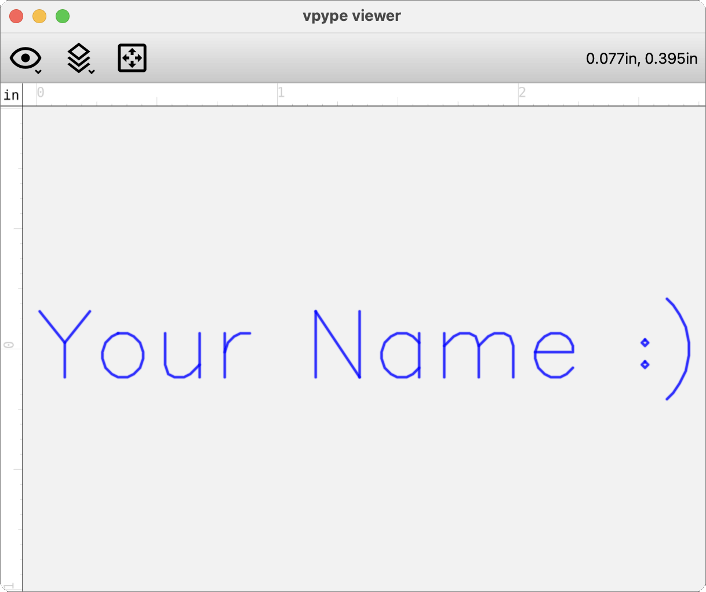

As we [discussed in class](https://github.com/golanlevin/DrawingWithMachines/blob/main/generating_svg/vpype_svg_prep/README.md), *vpype* is a powerful tool for preparing SVG files for plotting; from this point on, it will be extremely handy to have a Python3.10 venv (virtual environment) installed on your laptop that can run *vpype*. Instructions for installing *vpype* can be found here: [**Creating a Suitable Python3.10 Virtual Environment**](https://github.com/golanlevin/DrawingWithMachines/blob/main/generating_svg/python/README.md#1-creating-a-suitable-python310-virtual-environment). *So, please:*

* **Install** *vpype*, using these [instructions](https://github.com/golanlevin/DrawingWithMachines/blob/main/generating_svg/python/README.md#1-creating-a-suitable-python310-virtual-environment). **NOTE: I must emphasize the importance of installing vpype [in a virtual environment](https://docs.python.org/3/library/venv.html). Failing to do so could cause you a great deal of misery.**
* **Test** *vpype* with commands like `vpype --help` and `vpype random show`.
* **Run** the following *vpype* command, but **replace** "Your Name": `vpype text --font futural --size 40 "Your Name :)" show`. 
* **Screenshot** the *vpype* display with your name and **post** it in the Discord channel `#310-vpype-works`. (I want receipts, please.)
* In the unlikely event that you are unable to get *vpype* installed on your computer, **message** the professor in Discord to discuss other options for [optimizing](https://plotterfiles.com/tools/optimizer) and [cropping](https://msurguy.github.io/svg-cropper-tool/) your SVGs.

**Python programmers:** If you happen to prefer coding in Python, installing *vpype* and its interoperating sibling project [*vsketch*](https://github.com/abey79/vsketch) (for generative plotter art) is a terrific toolchain for this course. My instructions for [installing and using *vsketch* are here](https://github.com/golanlevin/DrawingWithMachines/blob/main/generating_svg/python/README.md#3-generating-an-svg-using-vsketch-and-vscode).

---

## 3.1.1. (Naive) Offset Curve

**(30 minutes, 5%)** *The purpose of this exercise is to give you a bottom-up appreciation of offset curves, which can be an essential ingredient in computing thickened lines. For this exercise, only a screenshot is required — no plot.*

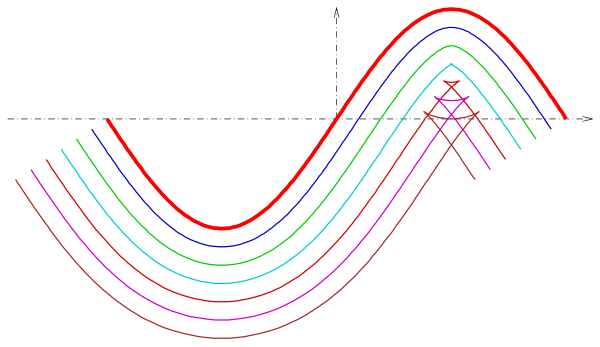

[**Offset curves**](https://en.wikipedia.org/wiki/Parallel_curve) are a generalization of the concept of "parallel lines" — they are shapes that run a fixed distance away from an original curve. They are essential in applications ranging from CNC machining to typography, and have many analogies in layered phenomena in the natural world. Despite their simple definition, offset curves are mathematically complex, and surprisingly challenging to calculate: as illustrated here, they can develop cusps, self-intersections, and abrupt changes even when the original curve is smooth. Understanding them can help artists and engineers work more precisely with form, structure, and process.

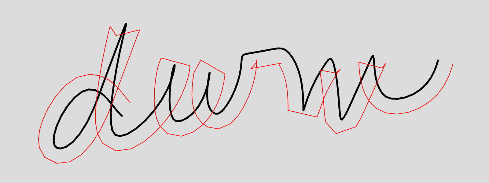

* **Write** a program that stores cursor points while a user draws.
* **Connect** these points with a polyline (shown in black, above). *(In the example shown here, I also performed some local averaging to improve the smoothness of my polyline, but you don't have to.)*
* **Compute** an additional polyline (shown above in red) derived from the user's drawing, which is *offset* everywhere from the user's drawing by a fixed distance of (say) 25 pixels. You can do this with just a few lines of trigonometry. *(Don't use any fancy libraries, and don't try to resolve any issues with unexpected cusps or self-intersections that arise.)*
* ***SIGH.*** ChatGPT is able to execute this assignment reasonably well. Personally, I genuinely think it's worth understanding how to do this exercise yourself — it hits a lot of pedagogic goals... or at least, it *used* to. But if you find yourself spending more than 15 minutes puzzling over the trigonometry, it may be best to ask your AI friend for help.
* **Create** a Discord post in the channel `#311-naive-offset`.
* **Draw** your cursive initials using your sketch, and **embed** a screenshot of your sketch in your Discord post. 
* Optionally, **write** a sentence in your Discord post discussing any observations.


---

## 3.1.2. Making Lines with Different Weights

**(30 minutes, 10$)** *In this exercise, you will construct a basic drawing primitive from first principles: lines thicker than the nib of one's pen.*

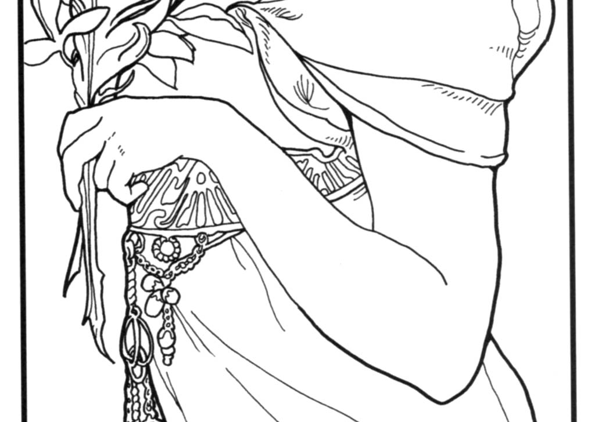<br />
<small>Alphonse Mucha's *La Plume* (1897) uses lines of different weights to establish visual hierarchy.</small> 

**Hand-sketch first!** Using your hand, paper, and a single pen, **think through** some workflows for constructing lines that appear to have different thicknesses. Use an ordinary pen that makes a line of reasonably constant thickness no matter how you hold or press it, such as a rollerball, gel, or ballpoint pen. (I recommend the Pilot G-2 or Pilot Precise V5 in your student kits.) 

Of course, there are *many* ways to do this; for example, you might:

* Draw a dense zig-zag
* Draw slightly-offset parallel lines that are closely spaced
* Draw a line very slowly or very quickly, using a pen/paper combo that bleeds ink
* Draw a line which turns out to be, upon close examination, a decorative border
* Draw a line comprised of a cloud of small dots

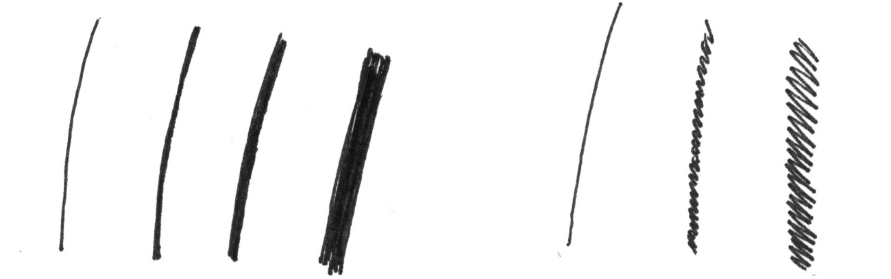

**Keep** your hand-made tests. *Now*, using one of your methods:

* **Write** code for a function that produces "lines" with different weights. *(I say "lines" in quotes because technically, each thick line is likely comprised of many constituent sub-lines.)* **Extend** your code so that it can produce a *polyline* ([polygonal chain](https://en.wikipedia.org/wiki/Polygonal_chain)) of a given thickness. Your program should **export** SVGs of your lines/polylines — such that they appear as intended when plotted using the pen you used earlier. As a reminder, some overviews and sample code for generating SVGs can be found [here](https://github.com/golanlevin/DrawingWithMachines/tree/main/generating_svg).
	* **Note 1**: For this particular exercise, you are not permitted to use Z-axis pressure.
	* **Note 2**: Sadly, the p5.js/Processing [`strokeWeight()`](https://p5js.org/reference/p5/strokeWeight/) command will not be helpful for generating plottable SVGs.
* 🌶️ For an optional challenge, **extend** your function so that it can produce a polyline with continuously-variable thickness. In other words, specify your thickened polyline using `(x,y, weight)` points that each specify their local thickness. 
* **Use** your function to create a *simple "test-sheet design"* that uses at least three line weights. You may use any color pen(s) and any color paper, but your design should allow for direct comparison between lines of different weights that were drawn with the same pen. *(Keep your test-sheet design simple, please, and save your time for the larger projects below.)*
* **Plot** your test-sheet design on 8.5x11" or 9x12" paper. For this project, I recommend using either [AxiDraw](https://github.com/golanlevin/DrawingWithMachines/blob/main/rpi_standalone/README.md), HP7475A, or [Line-Us](https://github.com/golanlevin/DrawingWithMachines/tree/main/machines/line-us) plotters. **Note**: If you use the HP7475A, you will need to convert SVG to HPGL using *vpype*; see [these instructions](https://github.com/golanlevin/DrawingWithMachines/blob/main/generating_svg/vpype_svg_prep/README.md), and this [one-sheet PDF for using the HP7475A](https://github.com/golanlevin/DrawingWithMachines/blob/main/machines/hp7475a/hp7475a-one-sheet/hp7475a-one-sheet.md).
* **Scan** or **photograph** your test-sheet design. 
* **Scan** or **photograph** your hand-made tests as well.
* **Create** a post in the Discord channel `#312-line-weight`.
* **Upload** the images of your hand-made tests and your test-sheet design plot. 
* **Write** a sentence or two that describes your method, and any considerations or discoveries you made.


---

## 3.1.3. Squiggy Hacking

**(30 minutes, 10%)** *In this exercise, you will develop experience designing strokes with procedural strokeweight functions.*

<a href="https://squiggy.netlify.app/">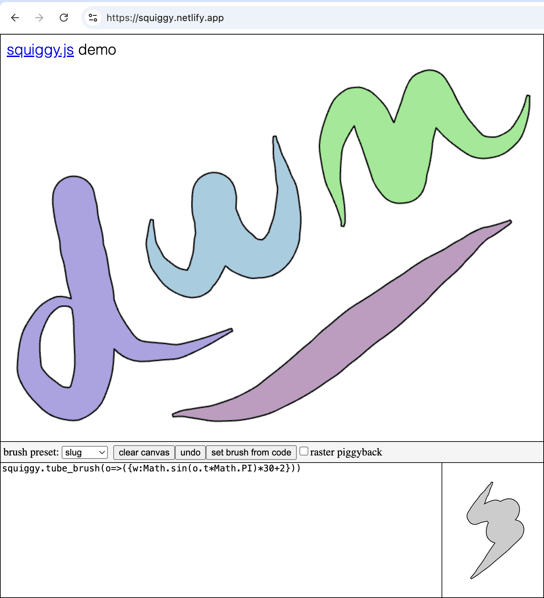</a>

[***Squiggy***](https://squiggy.netlify.app/) is a sketchpad for the design of lines with procedural strokeweights, and a [vector brushstroke library](https://github.com/LingDong-/squiggy). Squiggy was developed by former BCSA student [Lingdong Huang](https://lingdong.works/) in 2021.

Squiggy works by using a function to govern the thickness of the stroke. This function returns the local radius (half-width) `w` based on properties like the percentage of distance traveled  (`t`) and the user's velocity `z` (estimated from velocity) at a given point `o`, among others. For example, Squiggy's *slug* brush preset (pictured above) has the following equation, a half sine-wave:

`squiggy.tube_brush(o=>({w:Math.sin(o.t*Math.PI)*30+2}))`

In other words, the Squiggy brush function is an [arrow function callback](https://javascript.info/arrow-functions-basics) that Squiggy calls for each point along the line. *(Note that this function is pure JavaScript, not p5.js.)* Here are the available parameters for Squiggy brush functions:

```javascript
i,  // index of this point in polyline
d,  // distance travelled from start of path to this point
t,  // percentage of distance travelled (0.0-1.0)
dx, // delta X from previous point
dy, // delta Y from previous point
r,  // local rotation in radians
x,  // X (0th coordinate)
y,  // y (1st coordinate)
z,  // velocity, calculated as Math.hypot(dx,dy)
```

You can make your own brush function by typing code in the text region and clicking `set brush from code`. For example, in the illustration below, I have set the brush function `w` to `0.1 * o.x` — in other words: the thickness of the brush is directly (and strictly) proportional to the `x`-coordinate of the mark at that location `o`:

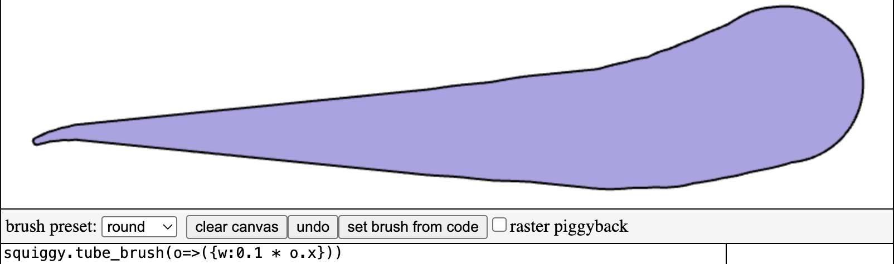

*Now:*

* **Tinker** with the [**Squiggy**](https://squiggy.netlify.app/) app for a few minutes. **Explore** the different brush presets, and **make** some superficial modifications to brush functions.
* **Devise** your own custom brush function. Feel free to consult Lingdong's [documentation](https://github.com/LingDong-/squiggy?tab=readme-ov-file#tube-brush). 
* **Create** a casual composition that shows off your brush function to good effect, and **screenshot** it.
* **Create** a post in the Discord channel `#313-squiggy`. **Paste** your function code in the post and **upload** your screenshot. **Write** a sentence that describes your function, and any thoughts you have about the exercise. *Note: Discord uses Markdown; you can format code in Discord by wrapping your code in backticks ( ` ) or triple-backticks for longer blocks.*

If you find this project interesting, I highly encourage you to read or skim the brief articles below.

* Lingdong Huang, [*Nuances of Hose Making*](https://quadst.rip/hose.html), 2021
* Matt Deslauriers, [*Drawing Lines is Hard*](https://mattdesl.svbtle.com/drawing-lines-is-hard), 2015


---

# 3.2. Offset Curve Composition 

**(2-4 hours, 25% or 50%)** *You are provided with libraries for computing "proper" offset curves—a type of machine-made line— and invited to use them to make a creative composition.* 

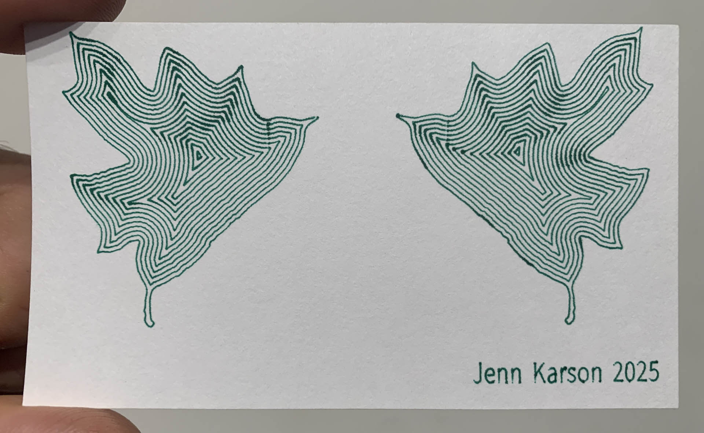

* **Choose** whether you would like this project or the *Dot-for-a-Walk* composition (3.3) to be your main focus for this week.
* **Review** [this presentation about offset curves](https://github.com/golanlevin/DrawingWithMachines/tree/main/lectures/topics/offset_curves). **Observe** that [code for computing offset curves](https://github.com/golanlevin/DrawingWithMachines/tree/main/lectures/topics/offset_curves#code) is provided for several toolkits. 
* **Develop** a composition using offset curves.
* **Plot** your offset curve composition — you are encouraged to use an AxiDraw or HP7475A plotter. This is a good opportunity to **experiment** with different pens and paper.
* **Create** a post in the Discord channel, `#33-line-walk`.
* **Embed** a scan or photograph of your plotted project in your Discord post.
* **Write** a few sentences in your Discord post that describe your approach, what you struggled with, and what you learned. **Indicate** whether this is your major or minor project for the unit. 
* **Submit** high-quality documentation of this project into [**this Google Form**]() (TBA). 
* **Bring** your plot to class for pinup on September 10.


---

# 3.3. Taking A Dot for A Walk (in 3D)

### *A.K.A. "Pressure" Project*

<br />
Pablo Picasso, *Chien* (Dog), 1957.

**(2-4 hours, 25% or 50%)** *The objective of this prompt is to exercise your conceptual, aesthetic, and computational skills to govern a foundational graphical form: a single, expressive line. The assignment is complexified by the* ***additional challenge*** *of controlling a pen's `z` pressure — and not just its `x,y` position.*

**Recall** Paul Klee’s [*Pedagogical Sketchbook*](https://github.com/golanlevin/DrawingWithMachines/blob/main/readings/klee_pedagogical_sketchbook.pdf) (1925), in which he describes:

> "an active line on a walk, moving freely, without goal. A walk for a walk's sake. The mobility agent, is a point, shifting its position forward." 

[](https://github.com/golanlevin/DrawingWithMachines/blob/main/readings/klee_pedagogical_sketchbook.pdf)

The artwork [Sum05](https://www.liaworks.com/theprojects/sum05/) by Austrian software artist (2005), Lia (at left); the artwork [Path_P](https://reas.com/path_p/) by Casey Reas (2001, at right, described in [this article](https://medium.com/@REAS/notes-on-phototaxis-db7aa7641ad8)), and [oioi0003](https://www.deconbatch.com/2019/05/think-it-over.html) (2019) by Deconbatch, [described here](https://www.deconbatch.com/2019/05/think-it-over.html), can be understood as examples of this, though they achieve this in very different ways: In her design, Lia composes trigonometric functions, while Casey records the paths taken by Braitenberg vehicles, and Deconbatch uses a fractal-like recurrence formula.


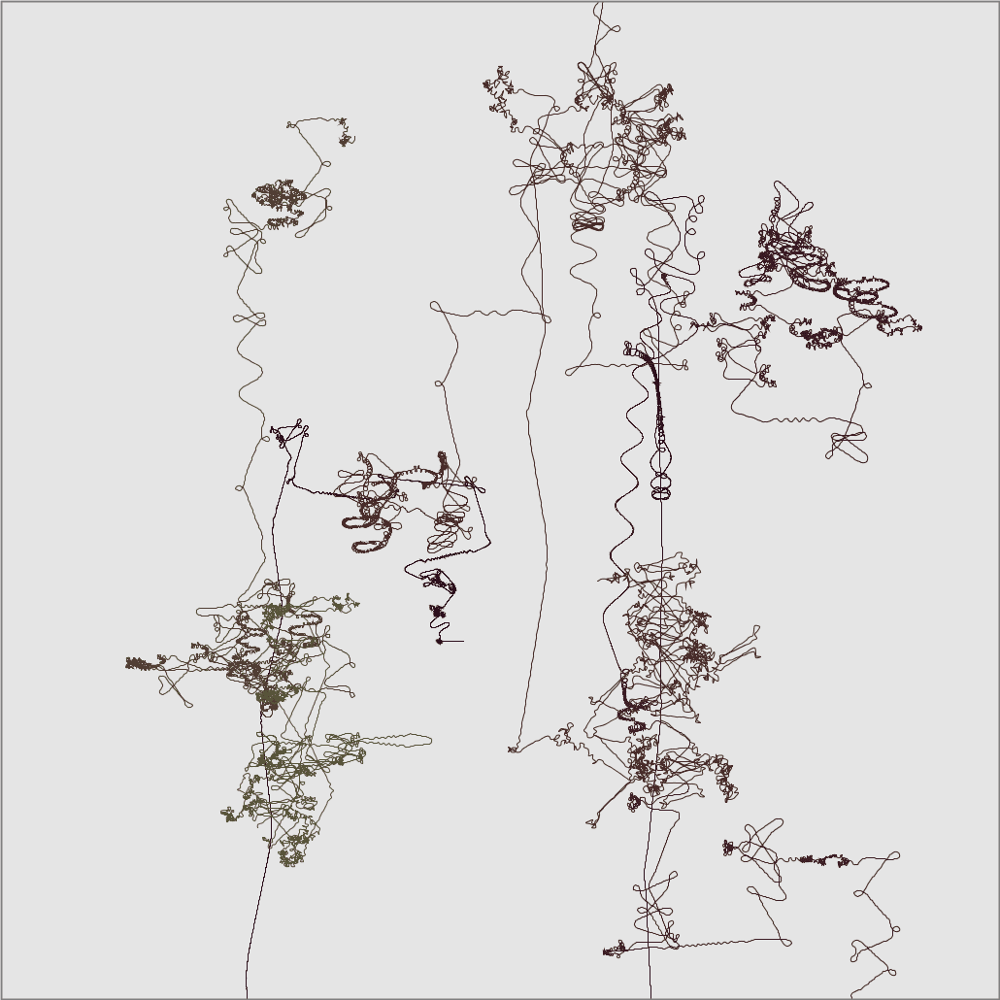

Now look again carefully at Klee's and Picasso's lines, above. There is ...*something else going on* besides merely traveling from place to place. There is also a sense of timing, of presence, of articulation and locality — conveyed by the changing *ductus* (weight and ink flow) of the line. For expressive and organic lines, pressure can make a big difference. 

In this open-ended assignment, you are asked to **write** code that takes a dot for a walk *in three dimensions*, in order to create an interesting line; **export** a plottable file representing your line; **plot** and **document** the result; and **write** a brief statement about your project. In evaluating your work, we may discuss things like: the expressiveness of your line, the muscularity of your control, conceptual propositions you may have engaged, etc.

*Now:*

* **Choose** whether you would like this project or the *Offset Curve Composition* (3.2) to be your main focus for this week.
* **Write** code to take a dot on an interesting walk. Your code may be written in any programming language you prefer, and should export a design that consists of exactly one line. Some possible springboards from the Coding Train are linked below, but you are by no means limited to these.
* ***HA HA BUT*** in addition to specifying your dot's path in `x` and `y`, you are *also* asked to specify its path in `z` — which will be used to govern *pen pressure* on the Bantam ArtFrame. In order to do this, your software will need to export G-Code directly — *not* SVG! Some code templates for doing this are below. 
* **Plot** your drawing. I have provided a *black PigmaBB brush pen* in your kit specifically for this exercise — it has excellent pressure response within a range of ~3-5mm of z-height. You may need to do some tests on scrap paper to reckon your pen's position and the z-travel specified by your code.
* For this assignment, I recommend you **limit** your paper size to no larger than 11x17 or 12x18; **limit** your total line length to no more than 100,000 millimeters; and **limit** your feed rate to 5000-10000 mm/minute. These parameters will afford the best chances for your design to look good, and for everyone to get a fair chance to use the Bantam plotter.
* *Optionally*, **record** a time-lapse video of the Bantam plotter in action. Speak with the professor or TA about how to do this. 
* Having everyone depend on a single plotter entails certain risks. If there is a failure situation of some sort, please just **fall back** to using an AxiDraw or HP7475A plotter. *(You'll have to jettison your pressure work.)*
* **Create** a post in the Discord channel, `#33-line-walk`.
* **Embed** a scan or photograph of your plotted project in your Discord post.
* **Write** a few sentences in your Discord post that describe your approach, what you struggled with, and what you learned. **Indicate** whether this is your major or minor project for the unit. 
* **Submit** high-quality documentation of this project into [**this Google Form**]() (TBA). 
* **Bring** your plot to class for pinup on September 10.


#### Generating G-Code: Code Templates

*Note that for this project, you will need to generate G-Code yourself in order to have continuous control of pressure (z-axis). Although there are tools for converting SVGs into G-Code, they treat the design as purely 2D.*

* Python: [G-Code Lissajous Exporter](https://github.com/golanlevin/DrawingWithMachines/tree/main/lectures/topics/gcode#generating-g-code-files-with-python)
* p5.js: [G-Code Lissajous Exporter](https://github.com/golanlevin/DrawingWithMachines/tree/main/lectures/topics/gcode#generating-g-code-with-p5js)
* p5.js: [G-Code Drawing Recorder](https://github.com/golanlevin/DrawingWithMachines/tree/main/lectures/topics/gcode#p5js-g-code-drawing-recorder)


#### Walking a Dot: Technical Springboards 

[**Some strategies for walking a dot are discussed in these lecture notes**](https://github.com/golanlevin/DrawingWithMachines/blob/main/lectures/topics/walking_a_dot/README.md) — but this list is only a starting point. There are an infinity of possible approaches to generate an interesting line, and there is no preferred method. 

Your line may be zig-zaggy, wavy, curly, wiggly, noisy, etc. Your line may be wholly synthesized using randomness and mathematics, or it may be a visualization of data captured from the real world. You may choose to start and end your line at the same point, or you may (for example) terminate your line at opposite corners of the page. Your line may cross itself, or you may write rules to prevent this from happening. Your line may have constant thickness, or you may give it an expressive and variable ductus. Dan Shiffman's *Coding Train* offers some additional starting points, among many:

* [Random Walker in p5.js](https://www.youtube.com/watch?v=l__fEY1xanY) (Coding Challenge #52)
* [Random Walker with Vectors and Lévy Flight](https://www.youtube.com/watch?v=bqF9w9TTfeo) (Coding Challenge #53)
* [Drawing with Fourier Transform and Epicycles](https://www.youtube.com/watch?v=MY4luNgGfms) (Coding Challenge #130.1)
* [Self-Avoiding Walk](https://www.youtube.com/watch?v=m6-cm6GZ1iw) (Coding Challenge #162)
* [Traveling Salesperson](https://www.youtube.com/watch?v=BAejnwN4Ccw) (Coding Challenge #35.1)
* [A* Pathfinding Algorithm](https://www.youtube.com/watch?v=aKYlikFAV4k) (Coding Challenge #51)
* [Polar Perlin Noise Loops](https://www.youtube.com/watch?v=ZI1dmHv3MeM) (Coding Challenge #136.1)
* [Horizontal Directional Drilling](https://www.youtube.com/watch?v=FfCBNL6lWK0) (Coding Challenge #172)


#### 3D Plotting Case Study: Lia's Hacked AxiDraw (2018) 

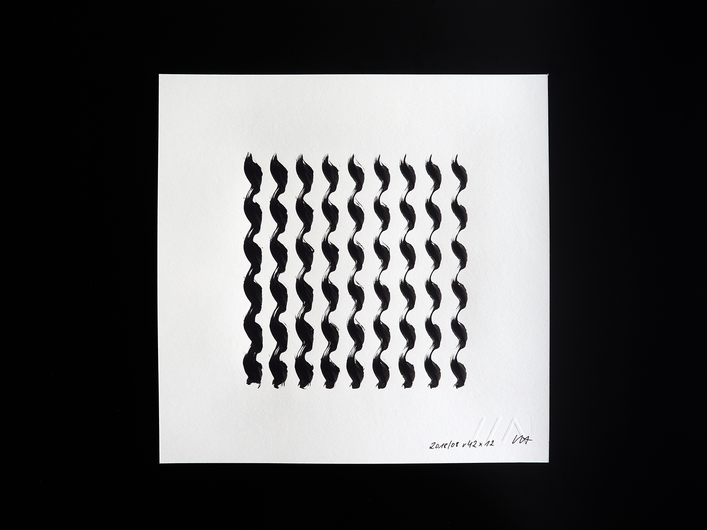

The mononymic Austrian computer artist, [Lia](https://www.liaworks.com/), mentioned earlier, has been active in software art since 1995. In 2018 she developed a custom workflow to control a hacked AxiDraw plotter **in 3D**, in order to produce a [series of ink studies](https://www.liaworks.com/theprojects/mechanical-plotter-drawings-waves/) exploring pen pressure. The example shown above consists of a series of sinewave-like paths, executed by an ink brush. *(To the extent that this artwork is interesting, what makes it so?)*

---

EOF


<!-- 
PAST VERSIONS: 
2021: https://courses.ideate.cmu.edu/60-428/f2021/index.html%3Fp=456.html
2024: https://github.com/golanlevin/DrawingWithMachines/blob/main/assignments/2024/04_line/
README.md
-->


