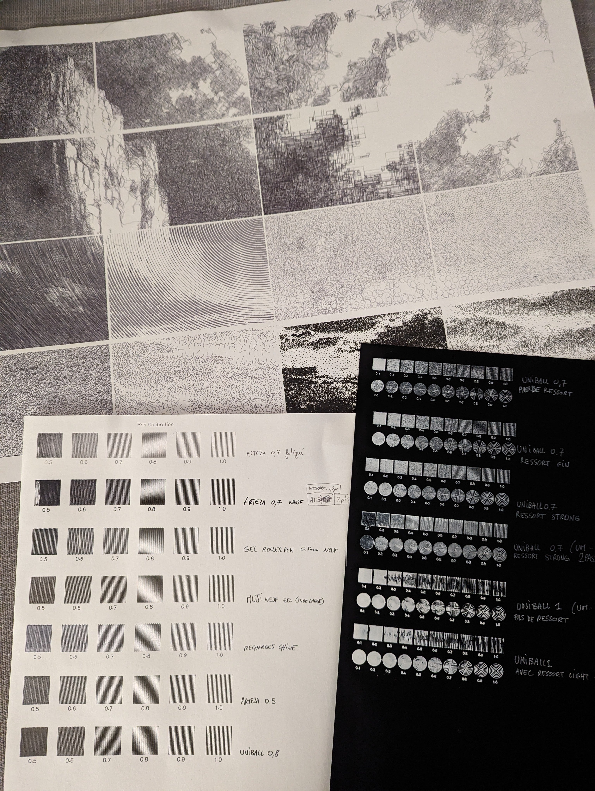
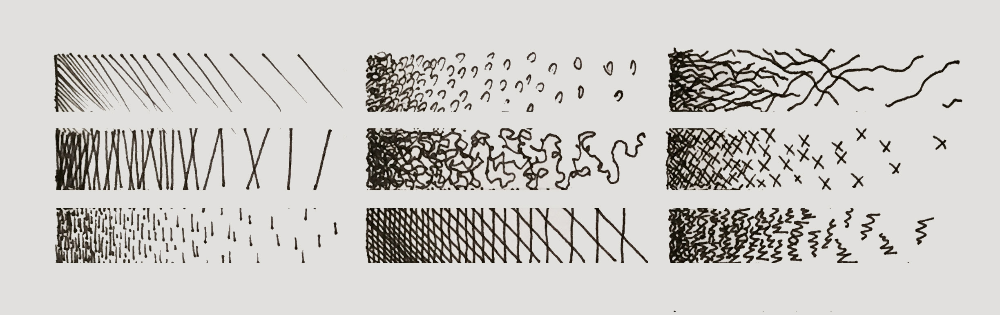
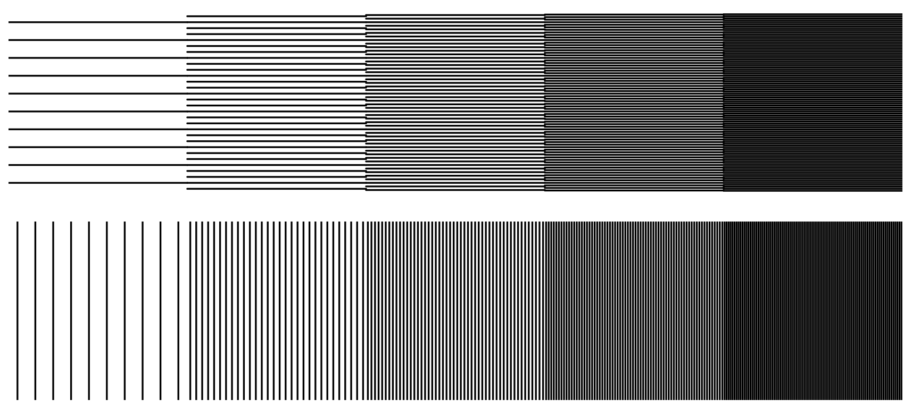
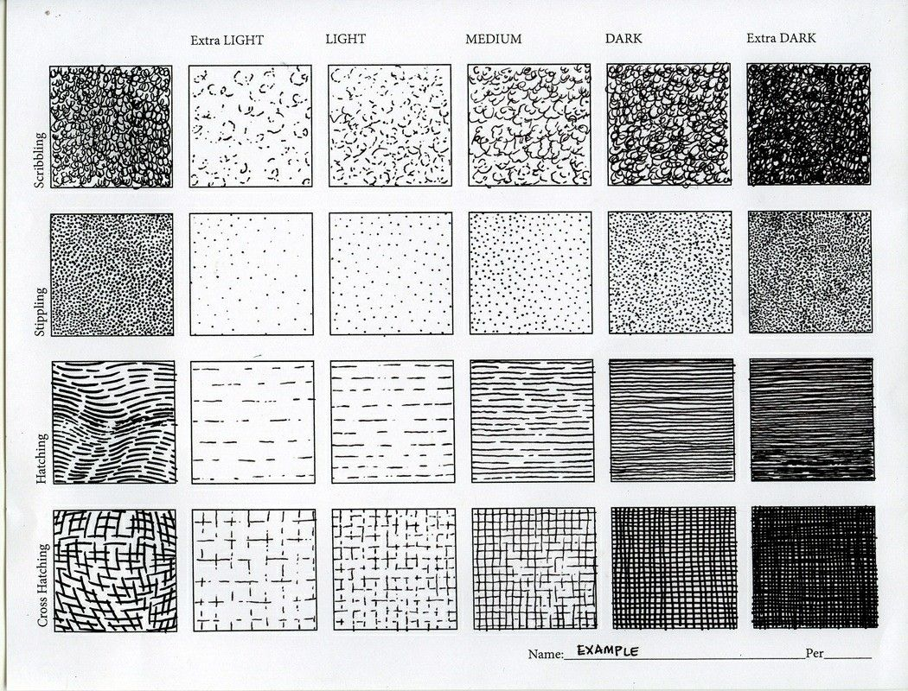
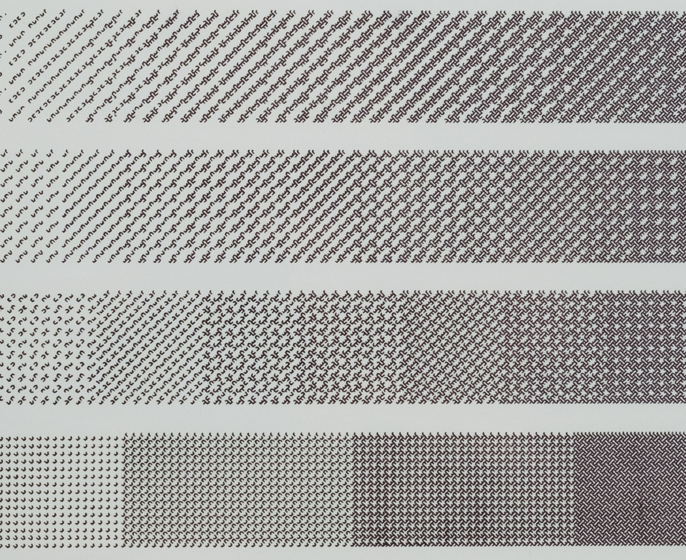
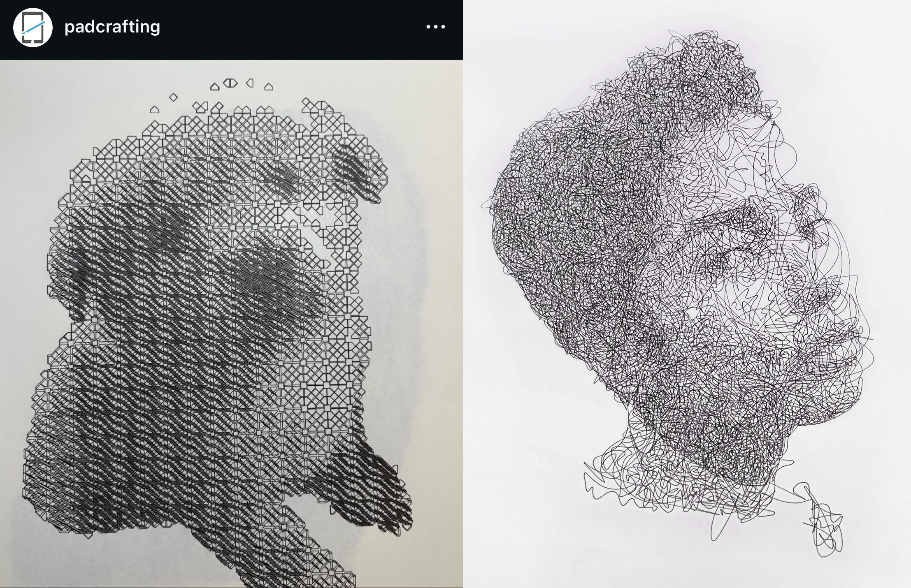
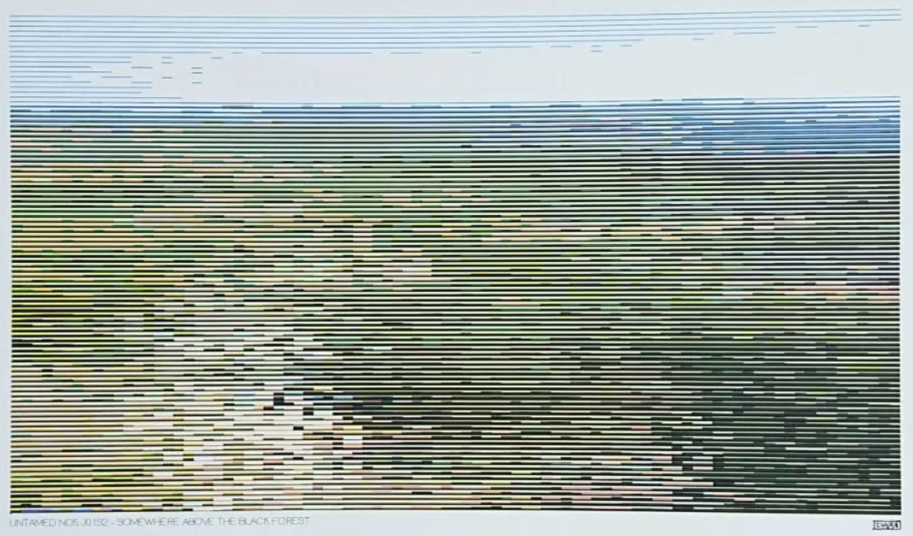
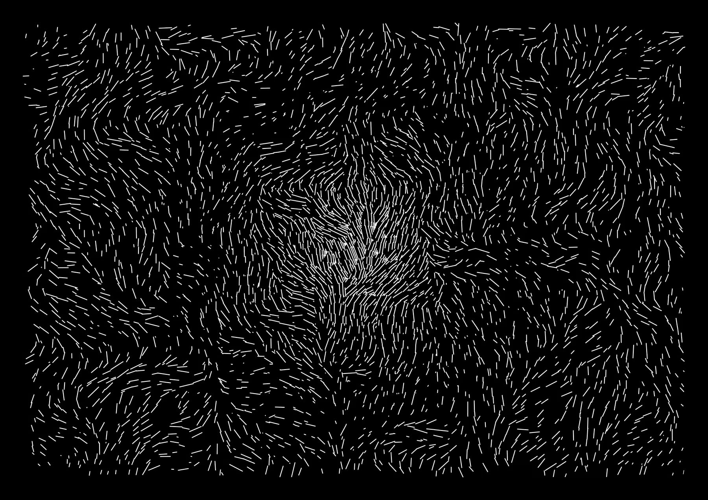

# 4: Tone, Hatching, Field

This assignment has three parts, and is due at the beginning of class on Wednesday, September 17: 

* [**4.1. Hatching Studies**](#41-hatching-studies) *(1 hour, 20%)*
* [**4.2. Hatched Selfie**](#42-hatched-selfie) *(2 hours, 20%)*
* [**4.3. Tonal Composition**](#43-tonal-composition) *(4 hours, 60%)*

For reference: 

* Golan's [**Tone lecture is here**](https://github.com/golanlevin/DrawingWithMachines/blob/main/lectures/topics/tone/README.md).
* Golan's [**Field lecture is here**](https://github.com/golanlevin/DrawingWithMachines/tree/main/lectures/topics/field).

---

## 4.1. Hatching Studies

*(1 hour, 20%) Please* ***read*** *this prompt all the way to the end, before you start any drawing or coding. The purpose of this prompt is for you to develop foundational skills in controlling value and tone.*

*First, a warmup exercise*: 

* Take a moment to **look** at how Joanie Lemercier does plotter test studies for achieving different tones, above.
* *Now*: by hand, with a pen and paper, **draw** some hatching studies (i.e., ways of approximating gray tones using assemblies of lines, in order to fill areas of paper). 
* Specifically: **Generate** 9 different hand-drawn hatching concepts or styles (say, in a 3×3 grid)—starting with the most obvious and simple hatching methods, and aiming for some more exotic hatching methods that you might not have any idea whatsoever about how to implement in code. For each hatching style/concept, draw a "value scale" in which you explore how that method achieves variations in density.

*Now*: 

* **Write code** to implement **two** different methods of hatching. You're not specifically required to implement any of the hatching methods that you sketched earlier, but of course you're welcome to do so.
* For each hatching method, **create** a value scale (gradient sequence) of five adjacent one-inch squares, with evenly-spaced gray values of 10%, 30%, 50%, 70%, 90%. Some inspirations can be seen [below](#hatch-inspo).
* **Export** a single SVG with both of your hatching sequences, and **plot** this using a thin black pen on a sheet of white paper. *(Alternatively, you may use a white pen on black paper.)* If you use 11x8.5" paper, you will have the option to use the (fast) [HP7475a plotter (instructions here)](https://github.com/golanlevin/DrawingWithMachines/blob/main/machines/hp7475a/README.md).
* **Create** a Discord post in the *#41-hatching-studies* channel.
* In your Discord post, **embed** a photo of your 3×3 grid of handmade sketches.
* In your Discord post, **embed** a photograph of your plot with the two computer-generated value sequences.
* In your Discord post, please **write** a sentence to describe each of your hatching methods, and what you learned making them.

**In your designs,** 

* **Consider** methods like: hatching, cross-hatching, scribbling, scumbling, stippling, fill patterns, or other creative methods of your own design. If you're feeling ambitious and self-directed, this is a perfect opportunity to explore how you can create hatching techiques using things like Perlin noise flow fields, physics simulations (e.g. particle systems, Lloyd's relaxation), typography (e.g. Hershey fonts), etc. 
* **Consider** how you can productively control and contrast properties like: line direction, line density, line length, line curvature, line thickness, and line duty cycle (dashes) to produce different hatches with different characters. Consider how you can control the variation (e.g. randomness, or standard deviations) of these properties. *Do any of your hatching methods have more than one expressive variable (apart from value/density)*? 
* To help you get started, feel free to **study** the code of the following extremely simple method shown immediately below, using parallel lines. I have posted the code for this method [here](https://editor.p5js.org/golan/sketches/4KhqqgP7l) for you to examine. 

Click here for additional <em>hatchspo</em>.

 *AxiDraw hatching by Lars Wander.*

---

## 4.2. Hatched Selfie

#### *Quickie Exercise — No Overthinking — No Judgement — Keep it Simple!*

*(2 hours, 20%)* The purpose of this quick exercise is to develop an introductory understanding of the computational techniques required to transduce raster images into vector representations. Put simply: I think it's important for you to be able to fetch the pixel values of an image and use them as the basis for your making own custom picture elements.

This is intended as a *no-fuss, low-concept exercise*, whose results will be published on our class Instagram. Keep it fun and simple, and **please don't overthink this**. In this exercise, you will devise a method to render a selfie photograph using the plotter. The objectives of this project are: 

1. To learn how to convert *raster* images into *vector* representations, *and/or*
2. To increase your skill in using code to represent gradations of continuous tone through *hatching*, dithering, halftones, or related techniques.

*Now*: 

* **Write code** to implement a hatching method capable of transducing a continuous-tone photograph into a vector file for plotting. 
* **SAMPLE CODE.** Here is some sample code to get you started: 
	* [weighted rejection sampling of an image](https://editor.p5js.org/golan/sketches/qmdA2b2_Y) in p5.js 
	* [line hatching in grid-based image subdivision](https://editor.p5js.org/golan/sketches/CQmqp4JTQ) in p5.js
	* [line hatching in grid-based image subdivision](../../2024/05_tone/photo_grid_hatching_java/photo_grid_hatching_java.pde) in Processing (Java)
	* [hatched shapes](https://editor.p5js.org/golan/sketches/b75oVci5f) in p5.js
	* [point-in-polygon hatching](https://editor.p5js.org/golan/sketches/wf8xsGn_-), p5.js
	* [very simple cross-hatching](https://editor.p5js.org/golan/sketches/kZjmGKR0X), p5.js
* **Choose** a selfie to transduce with the plotter. Keep it light; this will appear on the class Instagram. If you would prefer not to present your face in this way, that's fine; feel free to use an image of your hand, your pet, your lunch, etc.
* **Apply** your hatching technique to the photograph, and **plot** the result. You may plot using any colors of pen and paper you like, but it is recommended (for purely practical reasons) that you limit yourself to one color of pen.
* **Create** a Discord post in the *#42-hatched-selfie* channel.
* In your Discord post, **embed** a photograph of your plotter drawing.
* In your Discord post, please **write** a couple sentences about your design or your process.

---

## 4.3. Tonal Composition

 Daniela Kroehnert, *Untamed #5: Somewhere Above the Black Forest*, plotter art, 2024. 

 Julien Gachadoat, plotter art, 2021.

(*4 hours, 60%*). In this assignment, you will devise a method to render a tonal composition using the plotter. The objective of this project is to develop dexterity in representing gradations of continuous tone through hatching, dithering, halftones, or other algorithmic techniques that cover the image surface in marks of varying density.

### Ground Rules

To be very clear: for this project, you may *choose* between directly **generating** a composition (using algorithmic techniques), or "**converting**" a pixel-based image into a hatched vector design.

Some **special rules apply** if you choose to convert or transduce a pixel-based image into a plottable design:

* If you choose to convert a pixel-based image, you should **feel welcome** to use any *type* of pixel-based source image, such as a video, photograph, drawing, AI-synthesized image, or shader.
* If you choose to convert a pixel-based image, it **must be** *an image that you created or captured yourself* (such as with a camera, scanner, paint program, Midjourney, etc.). You are not permitted to just download some photo off the internet.
* If you choose to convert a pixel-based image, you must **give consideration** to the relationship between your subject (*who/what*) and your hatching method (*how*). Ideally, these will be tightly coupled: you will choose a photo for a specific rendering treatment, and/or develop a rendering treatment for a specific photo. I recommend depicting a subject in which you have some meaningful personal investment, such as a portrait of someone you know personally (friend, family, self).
* If you choose to convert a pixel-based image, ***you are permitted** to use readymade photo-to-SVG tools such as [DrawingBotV3](https://docs.drawingbotv3.com/en/latest/pfms.html), [SquiggleCam](https://msurguy.github.io/SquiggleCam/), or [StippleGen](https://www.evilmadscientist.com/2012/stipplegen-weighted-voronoi-stippling-and-tsp-paths-in-processing/), if you wish — but be prepared to explain your choices.
* You **may not** create a portrait of a celebrity, nor of the professor, please.

### Requirements

* **Devise a workflow** to create a "hatched surface" or "tonal composition". Either of the following approaches is acceptable — you may: 
	* **synthesize** a tonal composition entirely from scratch using generative techniques that cover a 2D surface, such as [growth algorithms](), flow [fields](https://github.com/golanlevin/DrawingWithMachines/tree/main/lectures/topics/field), etc.; *or*, you may
	* **implement** a hatching method to transduce a continuous-tone image into a vector file. 
* **Plot** the result. You may plot using any colors of pen and paper you like. **Remember** that your plot could take several hours to execute. 
* **Create** a Discord post in the *#43-tonal-composition* channel.
* **Embed** a scan or photograph of your plotter drawing in your Discord post. *If* you derived your hatched design from a source photograph, **embed** a copy of your original source photo as well.
* **Write** a couple sentences about your process in your Discord post. Evaluate your work.
* **Submit** high-quality documentation of your project to [**this Google Form**]() (TBA).
* **Bring** your work to class on Wednesday 9/17 for pinup.

### Some Potentially Helpful Coding Train Tutorials

*Here are some generative algorithms for populating a 2D field in interesting ways. You're not under any obligation to use these, but they may be helpful.* 

 
[Perlin Noise Flow Field](https://www.youtube.com/watch?v=BjoM9oKOAKY)

 
[Circle Packing](https://www.youtube.com/watch?v=QHEQuoIKgNE)

 [Weighted Voronoi Stippling](https://www.youtube.com/watch?v=Bxdt6T_1qgc)

 
[Poisson-Disc Sampling](https://www.youtube.com/watch?v=flQgnCUxHlw)

 
[Diffusion Limited Aggregation](https://www.youtube.com/watch?v=Cl_Gjj80gPE)

 
[Space Colonization](https://www.youtube.com/watch?v=kKT0v3qhIQY)

<!-- 

Code: 

**SAMPLE CODE.** Here is some sample code to get you started: 

* [weighted rejection sampling of an image](https://editor.p5js.org/golan/sketches/qmdA2b2_Y) in p5.js 
* [line hatching in grid-based image subdivision](https://editor.p5js.org/golan/sketches/CQmqp4JTQ) in p5.js
* [line hatching in grid-based image subdivision](photo_grid_hatching_java/photo_grid_hatching_java.pde) in Processing (Java)
* [line hatching in grid-based image subdivision](photo_grid_hatching_py/photo_grid_hatching_py.pyde) in Processing (Python)
* [Axis-Aligned Polygon Hatching in Processing (Java)](axis_aligned_hatching_java/axis_aligned_hatching_java.pde)

-->

---

<!-- 
PAST VERSIONS: 
2021: https://courses.ideate.cmu.edu/60-428/f2021/offerings/4-hatching/
2021: https://courses.ideate.cmu.edu/60-428/f2021/index.html%3Fp=823.html
2024: https://github.com/golanlevin/DrawingWithMachines/blob/main/assignments/2024/05_tone/README.md
-->