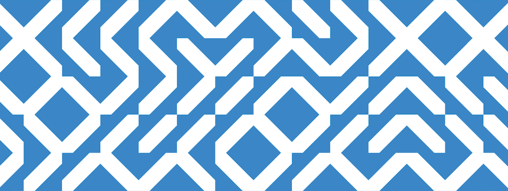

# 5: Pattern/Modularity

This project has four components, which are due at the beginning of class on Wednesday, September 24:

* 5.1. [**Readings**](#51-readings) *(45-90 minutes; 10%)*
* 5.2. [**Viewings**](#52-viewings) *(30 minutes; 10%)*
* 5.3. [**Dead-Simple Truchet Tiling**](#53-dead-simple-truchet-tiling) *(5 to 30 minutes; 10%)*
* 5.4. [**Pattern Composition**](#54-pattern-composition) *(6 hours; 70%)* 

---

## 5.1. Readings

*(45-90 minutes; 10%)* Please **read** the following excerpts:

* Summary of Christopher Alexander's romantic *Fifteen Geometric Properties of Wholeness*, a chapter in *The Nature of Order, Book One* (2002), in which he proposes 15 visual properties common to all the structures that we perceive as "organic". [[**3MB PDF**](https://github.com/golanlevin/DrawingWithMachines/blob/main/readings/alexander-15-properties-summary.pdf)]
* Excerpt (Chapter 30, p. 64-81) from *10 PRINT*, by Nick Montfort et al. **[[6MB PDF](https://github.com/golanlevin/lectures/blob/master/lecture_pattern/img/10_print_excerpt_moln.pdf)]**
* Excerpt (Chapter 1, p. 17-37) from *Graphic Games*, by Victor Baumgartner, paying special attention to “Game C” **[[22MB PDF](https://github.com/golanlevin/lectures/blob/master/lecture_pattern/img/graphic_games_ch1.pdf)]** (Download the whole document to see Game C).

*Now:*

* In the Discord channel `#51-readings`, **write** a brief response to something that you found interesting, helpful, or sticky.

---

## 5.2. Viewings

 *As a reminder, here are the [17 types of 2D crystallographic (wallpaper) symmetries](https://blog.artlandia.com/the-simplest-diagram-of-the-17-symmetry-types-ever/). There are no others!*

*(30 minutes; 10%)* **Spend some time** with any or all of the following resources: 

* [*The Grammar of Ornament*](https://archive.org/details/grammarornament00Jone) (1856) by Owen Jones, one of the most gorgeous books ever published.
* Check out the fantastic [*Historic New England Wallpaper Archive*](https://www.historicnewengland.org/explore/collections-access/wallpaper/), which has more than 6000 high-resolution scans of antique wallpapers.
* Browse the amazing [*Tilings and Patterns*](https://archive.org/details/isbn_0716711931) book by Grünbaum and Shephard. You can find a [PDF copy online here](https://archive.org/details/isbn_0716711931), and a copy in the 303 lab. 
* The stupendous *L' Ornement Polychrome* (1869) by Albert Racinet: [Volume 1](https://archive.org/details/l-ornement-polychrome-cent-planches-en-...-racinet-albert-bpt-6k-1512059w/mode/2up), [Volume 2](https://archive.org/details/l-ornement-polychrome-cent-planches-en-...-racinet-albert-bpt-6k-1512061z/mode/2up)
* Check out the [*Experimental Pattern Sourcebook: 300 Inspired Designs from Around the World*](https://ebookcentral.proquest.com/lib/cm/detail.action?pq-origsite=primo&docID=3399705), by Jackie Herald, available online in CMU’s library.
* Peruse the [*Vogue knitting stitchionary: the ultimate stitch dictionary*](https://archive.org/details/vogueknittingsti0000unse/mode/2up) (2005) (Internet Archive account required.)
* OR, browse another substantive resource of your choice that focuses on human-made patterns. *(Note that for this exercise, we are not focusing on "patterns in nature".)*

*Now,*

* In the Discord channel `#52-viewings`, **post** a screenshot, photo, or scan of a pattern you appreciated. **Include** information about the source. That's it.  

---

## 5.3. *Dead-Simple* Truchet Tiling

*(5-30 minutes; 10%)* Modular patterns like Truchet tilings are a common idiom in computational arts, especially with plotters. The purpose of this **quick technical exercise** is to ensure that all students have a baseline foundational practical understanding of how Truchet tiles are constructed, and an appreciation of how they can respond to optimization with vpype. **Plotting is *optional* and *not requested*.**

* **Write** a program to create a dead-simple, zero-frills SVG Truchet tiling, such as the one shown above. **Aim** to complete this in 5-10 minutes — but use ChatGPT if it takes you more than 15 minutes, and limit yourself to absolutely no more than 30 minutes for this exercise, period. 
* **Optimize** your Truchet SVG using the following vpype command: `vpype read mySimpleTruchet.svg linesort linemerge reloop write myOptimizedTruchet.svg show`
* **Screenshot** your optimized Truchet SVG in the vpype viewer, as shown below on the right-hand side. Be sure to enable "Outline Mode" and "Pen-Up Trajectories" as shown in the inset (at top left). 
* In the Discord channel `#53-truchet`, briefly **explain** the specific effects of `linesort`, `linemerge`, and `reloop` on your Truchet SVG design. 

---

## 5.4. Pattern Composition

*(6 hours; 70%)* Develop a computationally-generated, machine-plotted artwork using rhythmic patterns—in which larger-scale structures appear to emerge from the arrangement of modular elements.

To create your project:

* **Consider** algorithms like Truchet tiles, Wang tiles, Wave Function Collapse, Penrose Tiles, Meanders, Aperiodic Monotiles, etc.
* **Sketch** some ideas in your sketchbook. You are strongly encouraged to use more than one color in your design. 
* In your design, **consider** problems like:
	* *Regularity vs Surprise.* The production of rhythm against punctuation by unexpected elements.
	* *Design at multiple scales.* Moments of interest up close and also far away. 
* **Write** code to generate pattern compositions, and **export** SVG files for plotting.
* **Plot** your artwork. Please do not use standard printer paper.
* **Document** your project: 
	* **Upload** high-quality imagery of your project to this [Google form]() (TBA). 
* In a Discord post in the channel `#54-pattern-composition`:
	* **Embed** some images of your hand-sketches or other process tests.
	* **Embed** a good-quality photograph or scan of your final plotted composition. If appropriate, **include** a second photograph showing a close detail (e.g. see below). 
	* **Write** a paragraph (of about 100-150 words) describing the logic of your pattern, your sources of inspiration, your process, and an evaluation of your results. Be sure to acknowledge any code libraries that you used.

 *Wang tile composition by DwM 2021 student, Hima Gururaj, showing detail image.*

---

<!-- 

* https://blog.garritys.org/2012/01/path-tile-games.html
* https://n-e-r-v-o-u-s.com/blog/?p=9333
* https://www.wired.com/2011/09/tsuro-the-game-of-the-path-is-the-game-for-you/
* https://www.johansivertsen.com/post/monotile/
* https://www.google.com/search?q=einstein+truchet+tiles&sca_esv=4c66011f2d283160&udm=2&biw=1392&bih=887&ei=qBeNaNnfEYmr5NoPhKXssAc&ved=0ahUKEwjZ0-6xruqOAxWJFVkFHYQSG3YQ4dUDCBE&uact=5&oq=einstein+truchet+tiles&gs_lp=EgNpbWciFmVpbnN0ZWluIHRydWNoZXQgdGlsZXNIpxRQoQdYnxFwAngAkAEAmAFHoAGOBKoBATi4AQPIAQD4AQGYAgCgAgCYAwCIBgGSBwCgB-gCsgcAuAcAwgcAyAcA&sclient=img#vhid=GK7Or134-DNyyM&vssid=mosaic

-->

<!-- 
PAST VERSIONS: 
https://courses.ideate.cmu.edu/60-428/f2021/index.html%3Fp=1184.html
-->