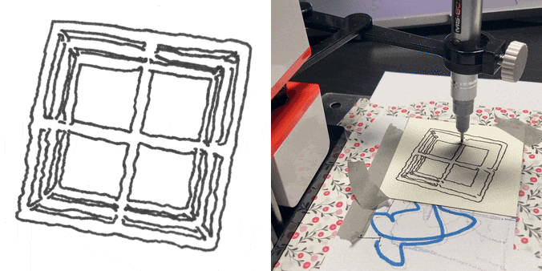
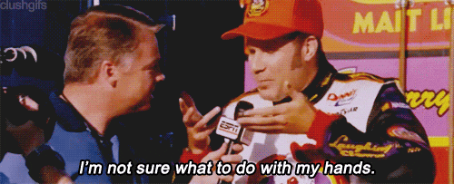
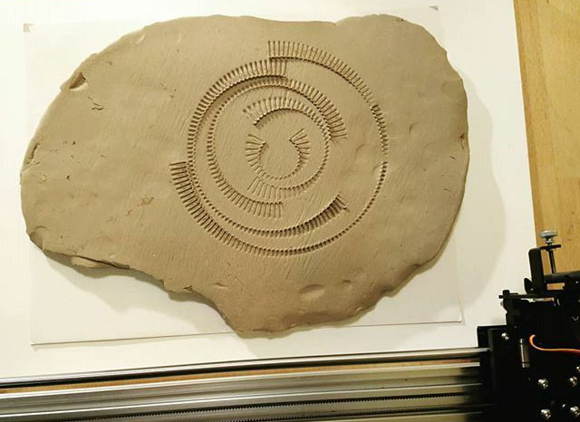

# 7: Material Conditions

This project is due Wednesday, October 8th and asks you to make a *small experiment or study* into any (one or more) of the four topics listed below. *Note that this project is intended to be comparatively open-ended (given the choices listed below) and comparatively small (given the one-week turnaround).* 

1. [**Materiality**](https://github.com/golanlevin/DrawingWithMachines/blob/main/lectures/topics/material_conditions/README.md): Experiment with an unfamiliar marking tool, a new type of ink/paint, a new surface to mark on, etc.
2. [**Plottimation**](https://github.com/golanlevin/DrawingWithMachines/tree/main/lectures/topics/plot_animation). Write code to generate frames of an animation. Plot them in a grid (with registration marks!) and we'll turn them into a GIF that has both materiality and temporality. 
3. [**Text/typography**](https://github.com/golanlevin/DrawingWithMachines/tree/main/lectures/topics/type): Create a composition using letterforms — possibly using these [single-line font resources](https://github.com/golanlevin/p5-single-line-font-resources), or these approaches to [extracting points from glyphs](https://github.com/golanlevin/DrawingWithMachines/tree/main/lectures/topics/type#getting-points-from-glyphs) — and perhaps informed by approaches from [concrete poetry](https://www.theguardian.com/artanddesign/gallery/2017/apr/07/masterpieces-concrete-poetry-pictures-getty-center-ian-hamilton-finlay-augusto-campos).
4. **Hand**: Think about some of the following starting points: 
	* Collage using a database of others' hand drawings (e.g. Google Quick!Draw; see [list below](#some-databases-of-hand-drawings--sketches))
	* Collage of one's own gestural recording SVGs — see this p5.js [drawing recorder](https://editor.p5js.org/golan/sketches/bQDM5IQdv)
	* Conversion of hand drawings to SVG (with [RapidResizer](https://online.rapidresizer.com/tracer.php)) and further re-composition — see this p5.js [SVG Loader](https://editor.p5js.org/golan/sketches/qn6EpSXiQ)
	* Hand overdrawing of plotted work (see [Jean Cho's 2021 DwM project](https://github.com/golanlevin/DrawingWithMachines/tree/main/documentation/2021#final-projects))
	* Drawing resynthesis using neural techniques (e.g. CharRNN/ML5)
	* Plotted overdrawing of hand work

*Now:*

* Using technologies of your choice, **make** a drawing that addresses one or more of the topics above.
* **Bring** your drawing to class on Wednesday 10/8 for pinup.
* **Scan or photograph** your drawing. 
* **Create** a post in the Discord channel `#7-project`. **Embed** an image of your project.
* In the following [Google form](https://forms.gle/YGegiEt13UtDzEheA), **upload** high-quality documentation of your drawing. 

---

### Some Databases of Hand Drawings & Sketches:

* [Google Quick!Draw](https://quickdraw.withgoogle.com/data) 
* [Quickdraw-Appendix](https://github.com/studiomoniker/Quickdraw-appendix)
* [Creative Birds & Creative Creatures](https://songweige.github.io/projects/creative_sketech_generation/home.html)
* [How Do Humans Sketch Objects? Mathias Eitz, SIGGRAPH 2012](https://dl.acm.org/doi/10.1145/2185520.2185540#supplementary-materials)
* [Simple Vector Drawing Datasets](https://github.com/hardmaru/sketch-rnn-datasets)
* [Chinese handwriting dataset](https://nlpr.ia.ac.cn/databases/handwriting/home.html)

---

 Clay+plotting experiment by Zach Kron

---

<!-- 
PAST VERSIONS: 
https://courses.ideate.cmu.edu/60-428/f2021/index.html%3Fp=1716.html
-->