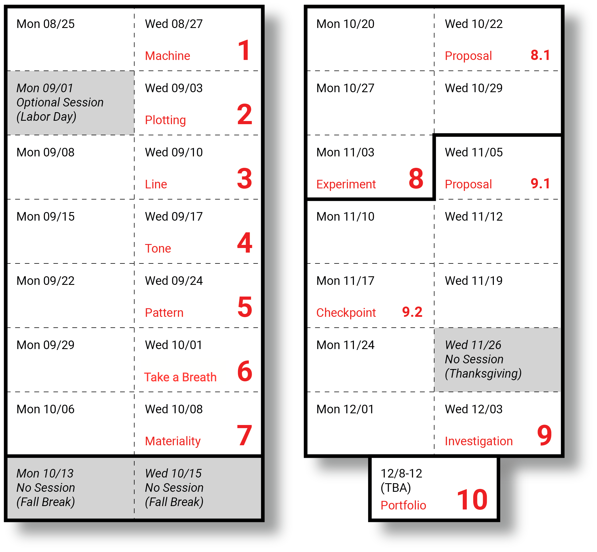

# DwM Assignments (Fall 2025)

---

## 1. [Drawing Machine](01_drawing_machine/README.md) `8/27`

* 1.1. [Course Administration](01_drawing_machine/README.md#11-course-administration) (15m)
* 1.2. [Looking Outwards I: Previous Student Work](01_drawing_machine/README.md#12-looking-outwards-i-previous-student-work) (15m)
* 1.3. [Looking Outwards II: Drawing Machines](01_drawing_machine/README.md#13-looking-outwards-ii-drawing-machines) (30m)
* 1.4. [Shitty Drawing Machine](01_drawing_machine/README.md#14-%EF%B8%8F-shitty-drawing-machine) (3h)

---

## 2. Getting Started `9/3`

<!-- 
PAST VERSIONS: 
2021: https://courses.ideate.cmu.edu/60-428/f2021/index.html%3Fp=111.html
2024: https://github.com/golanlevin/DrawingWithMachines/tree/main/assignments/2024/03_introductory_tooling
2024: https://github.com/golanlevin/DrawingWithMachines/tree/main/assignments/2024/02_rule_based_art
-->

* 2.1. Looking Outwards III: Tooling
* 2.2. Looking Outwards IV: Generative Plotter Art
* 2.3. (Re)Coding and Plotting Molnár's *Letters*

---

## 3. Line `9/10`

<!-- 
PAST VERSIONS: 
2021: https://courses.ideate.cmu.edu/60-428/f2021/index.html%3Fp=456.html
2024: https://github.com/golanlevin/DrawingWithMachines/blob/main/assignments/2024/04_line/
README.md
-->

* 3.1. Line Exercises
* 3.2. Offset Curve Composition
* 3.3. Taking A Line for A Walk (3D)

---

## 4. Tone `9/17`

<!-- 
PAST VERSIONS: 
2021: https://courses.ideate.cmu.edu/60-428/f2021/index.html%3Fp=823.html
2024: https://github.com/golanlevin/DrawingWithMachines/blob/main/assignments/2024/05_tone/README.md
-->

* 4.1. Hatching Studies (50 points, 3 hours)
* 4.2. Hatched Image/Surface (50 points, 3 hours)

---

## 5. Pattern/Modularity `9/24`

<!-- 
PAST VERSIONS: 
https://courses.ideate.cmu.edu/60-428/f2021/index.html%3Fp=1184.html
-->

* 5.1. Readings
* 5.2. Truchet Tiling
* 5.3. A Tiling Pattern Composition

---

## 6. Field/Distribution `10/1` 

<!-- 
PAST VERSIONS: 
https://courses.ideate.cmu.edu/60-428/f2021/index.html%3Fp=1430.html
-->

* 6.1. Readings
* 6.2. Packing
* 6.3. Flow Field
* 6.3. A Field/Distribution Composition

---

## 7. Materiality `10/8`

<!-- 
PAST VERSIONS: 
https://github.com/golanlevin/DrawingWithMachines/blob/main/assignments/2024/07_field/README.md
-->

* 7.1. Plottimation `10/8`
* 7.2. Material Exploration `10/8`

---

## 8. Self-Directed Experiment `11/3`

* 8.1. Experiment Proposal `10/22`
* 8.2. Experiment Presentation `11/3`

---

## 9. Self-Directed Investigation `12/3`

* 9.1. Investigation Proposal `11/5`
* 9.2. Investigation Checkpoint `11/17`
* 9.3. Investigation Presentation `12/3`

---

## 10. Portfolio Review `12/TBA`

* 10.1. Portfolio Review `12/8-12, TBA`
* 10.2. Card Exchange and NY Exhibition Prep

