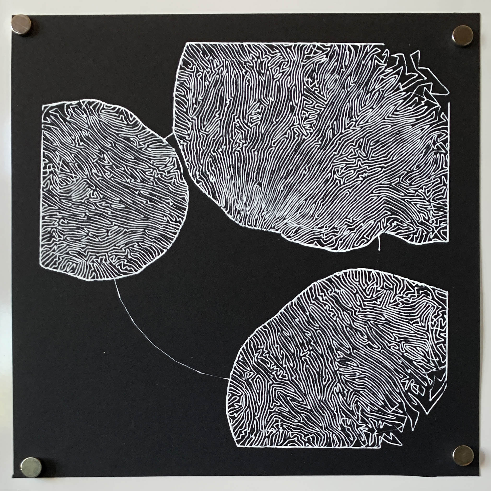
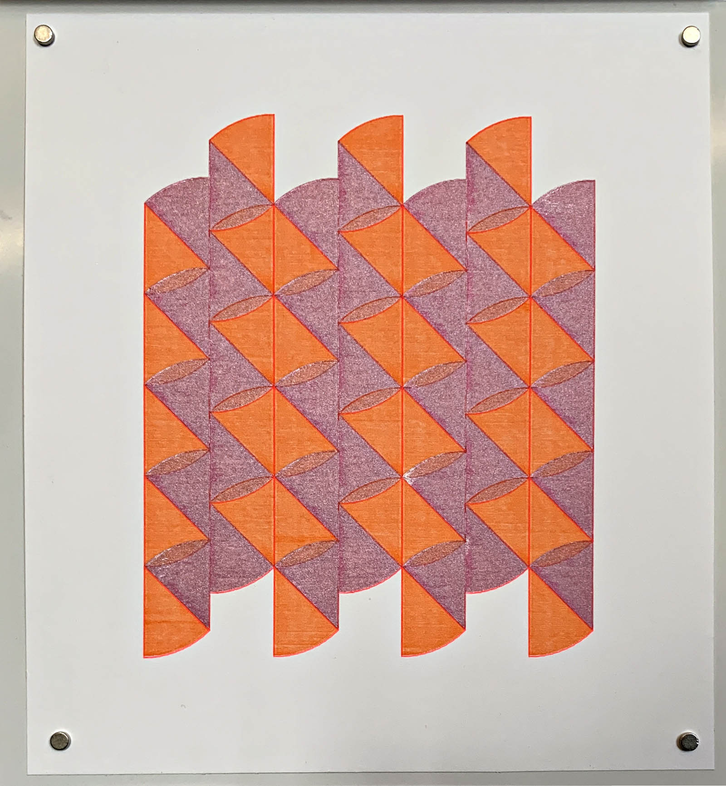

# Drawing with Machines: Fall 2021

* https://courses.ideate.cmu.edu/60-428/f2021/daily-notes/09-08-lines/
* https://x.com/golan/status/1447980505236914179
* https://flickr.com/photos/creativeinquiry/albums/72157719893055282/

---

 

Generative plots by CMU School of Art and IDeATe undergraduates in my *Drawing with Machines* course at CMU. The prompt here was to write code to create a family of (hatched) blobs. Works shown by Sarah Di, Leah Minsky, Jean Cho, and Aren Davey.

Additional responses by Angie Bonilla (who created a generative comic strip), and Himalini Gururaj: 

..And BCSA student Nik Diamant made this "blob family" animation using the @EMSL #AxiDraw and a @FlipBooKit

... while BFA sophomore Rick Zhang developed this generative "blob family" inspired by the pocket watches of Salvador Dalí's "Persistence of Memory".

Last week, my #PlotterTwitter students had a #Truchet tiling project. Here are #AxiDraw plots by Shiva Peri, Hima Gururaj, Jean Cho, and Evan Tipping:

Art+Engineering @CMU_BXA student @PerryNaseck discovered that our HP7475A supports an HPGL command to make filled wedges (...presumably, for pie charts). His pattern is exclusively made of them, and uses fluorescent & metallic inks.



BCSA senior @_aahdee_ blew everyone away with these stunners, plotted on her own machine.

Possibly the most surprising #PlotterTwitter project last week was this wholesome orgy by BCSA senior Nik Diamant. The #TruchetTile modules are generatively-arranged heads that kiss their neighbors. Nik hand-colored "islands" of connected friends.

Bonus round—more #PlotterTwitter projects from "Drawing with Machines"! 
Benford Krummenacher used non-alphanumeric Hershey font glyphs to construct tiling patterns for the cardigans of generatively-designed people...who were rendered life-size on our 30" MH871-MK2 drum plotter.

An example plot by Benford.

In our #PlotterTwitter course, BSA 3rd-year Angie Bonilla made a #TruchetTile stopframe animation governed by a cellular automaton. Here are some of her frames, plotted on the #AxiDraw....

...and one of Angie's plotted animations.

3am @creativeinquiry last night, Nik Diamant is busting robodoodles with EasyWhip, uh #plotterTwitter

Tomorrow is a big crit in my #plottertwitter class. @_aahdee_ is making a blisteringly good revision of her Truchet piece, and @lukashermann_ is visualizing his text message history…

A #plotterTwitter update on yesterday’s offerings from my “Drawing with Machines” creative coding course:

Shiva Peri (ab)used GIS software to generate offset curves from a squiggly hair…

Second-year @CMUSchoolofArt BFA student @MinskyLeah used a differential growth algorithm in @ProcessingOrg to govern the path of an @EMSL #AxiDraw. Then she created uncannily similar diptychs of seemingly improvised brushwork.

Nik Diamant, a @CMU_BXA senior studying Art+CS, updated his wholesome Wang Tile orgy: a computationally-generated arrangement of kissing heads. The eyes and cheeks are hand-colored.

Engineering student Evan Tipping explored psychedelic circle packings in blobby forms.

Second-year Art student Jean Cho used noise fields to create structured Truchet patterns, and then purposefully interrupted the plotter when it felt done.

Art+Engineering 3rd-year @PerryNaseck has become unusually good friends with @creativeinquiry’s HP7475a, even learning to repair it. Here, he used it to plot frames of a fluid simulation, with fluorescent inks, and also explored densely overlapping colors.

Engineering sophomore Shenai Chan generated interactive (physical) Truchet tiles, which she engraved with a laser cutter and hand-colored.

Benford Krummenacher, a 3rd-year Science+Art student, continued their work in computationally generating life-size people, which, they explained, were for the purpose of making a party seem more crowded.

3rd-year Art+CS @CMU_BXA student, @miniverse11, continued refining her algorithmic body-part tiling system. After conversion to HPGL, she executed it on 
@creativeinquiry’s 30” cutter.

Jamaal (Mali) Tribune, a graduate student in the @CMUSoA Computational Design program, executed rule-based drawings using the knitting machinery in CMU’s Algorithmic Textiles lab.

In this eight-foot drawing, Architecture+HCI senior @lukashermann_ visualized the 30,000 text messages he exchanged with @crabbage_.

3rd-year science+art student, @ABFominaya, is developing graphic novels in an unusual hybrid process. She generates reaction-diffusion and other algorithmic patterns, and plots them with #axidraw; she then uses these marks to structure and inspire her own hand-drawings over top.

Art+CS 4th-year student @_aahdee_ made numerous test swatches to tune the proportions in her revised Truchet tile plot. Algo fans may also recognize just a hint of (x^y)%9 rhythms in the mix.

The #plotterTwitter fun continues in my "Drawing with Machines" course: @xoxosweetcorn is creating computationally-generated party-planning floor mats to algorithmically orchestrate social interactions. Plotted with @creativeinquiry's MH871.

Compelling #PlotterTwitter work by 2nd-year @CMUSchoolofArt student @jeanch325 in my “Drawing with Machines” course at @creativeinquiry — doesn’t quite look like anything I’ve seen before.

@jeanch325 continues her blistering #plottertwitter final project investigation…

Final project documentation is pouring in from my Fall 2021 "Drawing with Machines" (#PlotterTwitter) course, held at the STUDIO for @CreativeInquiry and populated by students from @CMUSchoolofArt @CMU_BXA & @CMUIDeATe. Watch this thread...

One 3rd-year Art+CS undergraduate, @ABFominaya, secured a grant for an @EMSL #Axidraw plotter, and has been conducting a particularly deep investigation into bespoke algorithmic image treatments and end-to-end generative comic strips.

A remarkable artist, @ABFominaya also gave herself permission to get her actual hand in the work, experimenting with the use of plotted algorithmic textures as a starting point for improvisatory manual over-drawing.

(If you'd like to support @ABFominaya's work, she has some lovely and inexpensive #NFTart collectibles at https://hicetnunc.art/abfominaya.)

In this unusual #PlotterTwitter study, 3rd-year Art+Bio undergraduate @xoxosweetcorn used Farneback optical flow to analyze motion patterns in archival films of race cars. They used these vectors to guide the paths of thousands of colored pen marks, rendered by a vintage HP7475A.

Third-year Art+CS undergrad @shiva_peri's large-format #PlotterTwitter project depicts a catastrophic collision of thousands of empty office chairs—proxies, perhaps, of lives lost during COVID. Shiva scraped the chair models from online, and arranged them with simulated physics.

4th-year Art+CS undergrad Nik Diamant wrestled with the dragon of creating his own 2D shape intersection library. (It's not as simple as it might sound.) In the course of so doing, he produced generative #DebugView plots like this one.

Here's a detail view. Nik was hitting a lot of NaN's. Racing to produce work for the final exhibition, he decided to display all results, including faulty ones, by whatever means necessary.

Inspired by Étienne-Jules Marey, fifth-year Architecture+HCI undergraduate @lukashermann_ video-recorded each of his classmates walking down the hallway. Using the Detectron2 library, he then produced this series of chronophotographic #PlotterTwitter motion-portraits.

Re-posting 2nd-year BFA @jeanch325's remarkable figurations, thrice-drawn in a bespoke #PlotterTwitter workflow that blurs the boundaries of human and machine: 3D forms are hand-drawn by Jean in VR; projected to 2D and plotted by AxiDraw; then hand-overdrawn with the same pen.

For some of our #PlotterTwitter experiments, you had to be there. 3rd-year Art+CS undergraduate @difriendlygrape combined @cycling74 Max/MSP and @ProcessingOrg to create an interactive recording system for asemic voice memos.

Using Google QuickDraw and Markov-driven remixes of her own chat history, second-year Engineering+Art student Shenai Chan generated imaginary interior scenes and abstract love letters for a series of two-sided #PlotterTwitter postcards.

Mali Tribune (@native0systems), a 1st-year @CMUSoA computational design graduate student, used virtual headforms as an environmental pressure on particle simulations to generate #PlotterTwitter drawings inspired by Murjoni Merriweather and the fiber architectures of African hair.
