# Drawing with Machines: July 2022

This page presents highlights of projects produced in Golan Levin's one-week [*Drawing with Machines*](https://www.andersonranch.org/workshops/workshop/drawing-with-machines-p0814-22/) workshop at [Anderson Ranch Arts Center](https://www.andersonranch.org/) in Snowmass, Colorado, in July 2022. The participating attendees were [Chris Coleman](https://digitalcoleman.com/), [Lea Eaton](https://www.linkedin.com/in/lea-eaton-a61327b8/), [Deanna Gelosi](https://www.deannagelosi.com/), [Moishe Lettvin](https://www.moishelettvin.com/), [Caleb Ogg](https://www.instagram.com/iso.hedron/), [Elliott Spelman](https://www.ebspelman.com/), [Satre Stuelke](https://www.satrestuelke.com/about), [Harley Turan](https://hturan.com/), and [Travis Uhrig](https://x.com/travisformayor). Key links include: 

* Here is the [syllabus for the one-week workshop](syllabus.md).
* Additional and higher-resolution images can also be found in [this Flickr Album](https://flickr.com/photos/golanlevin/albums/72177720301016071/).
* The notes below were originally published in [this Twitter thread](https://x.com/golan/status/1552039797023055874).

---

It's day 2 of our "Drawing with Machines" plotter workshop at Anderson Ranch near Aspen, and there's already lovely generative artworks in progress by Chris Coleman, Caleb Ogg, Harley Turan, and many others.

<table>
  <tr>
    <td></td>
    <td></td>
    <td></td>
  </tr>
</table>

On Day 3 of our "Drawing with Machines" workshop at Anderson Ranch, Elliott Spelman generated novel faces with Quick!Draw data — and then made a real-time portrait machine using ZKM Karlsruhe's ofxTensorFlow2, Nick Hardeman's ofxHPGL, and a vintage HP7475A pen plotter.

<table>
  <tr>
    <td></td>
    <td></td>
  </tr>
</table>

More of today's experiments from our #generativeArt workshop at Anderson Ranch: hand-colored spring by Lea Eaton; differential growth cyanotype by Harley Turan; multicolor plot by Caleb Ogg; plot-in-progress of a vectorized physarum simulation by Moishe Lettvin:

<table>
  <tr>
    <td>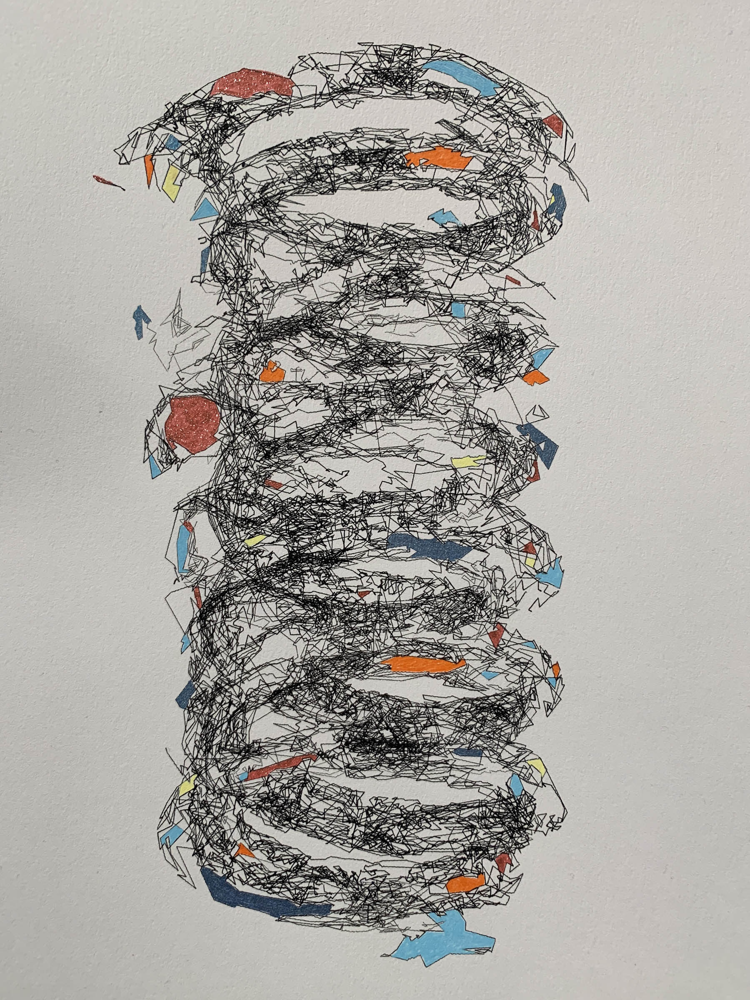</td>
    <td>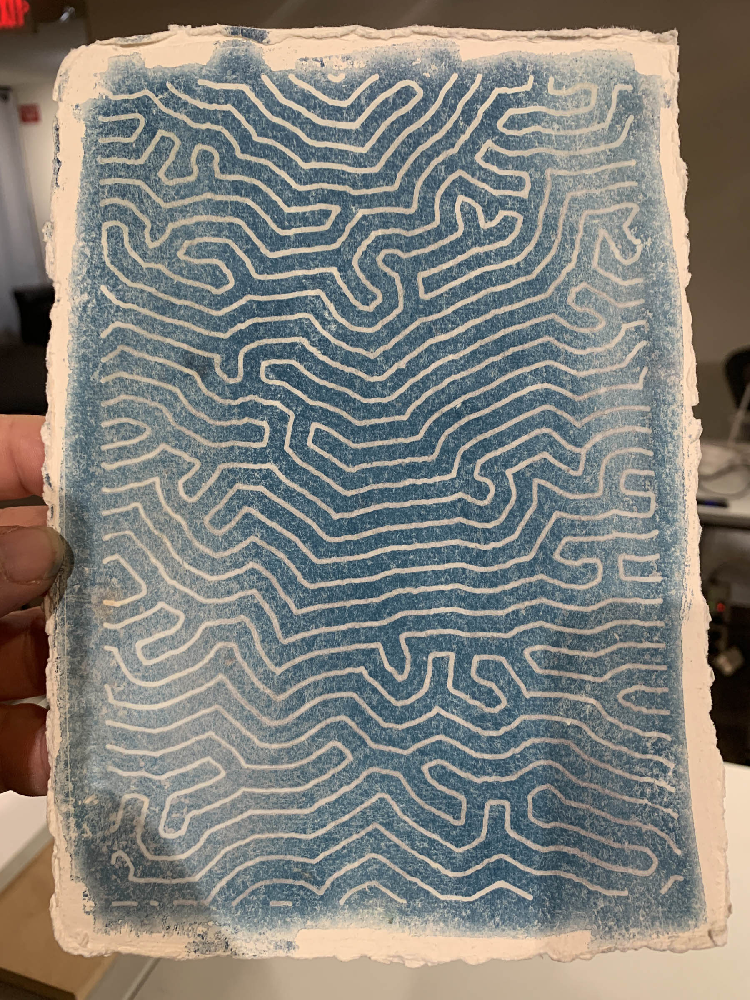</td>
  </tr>
  <tr>
    <td></td>
    <td>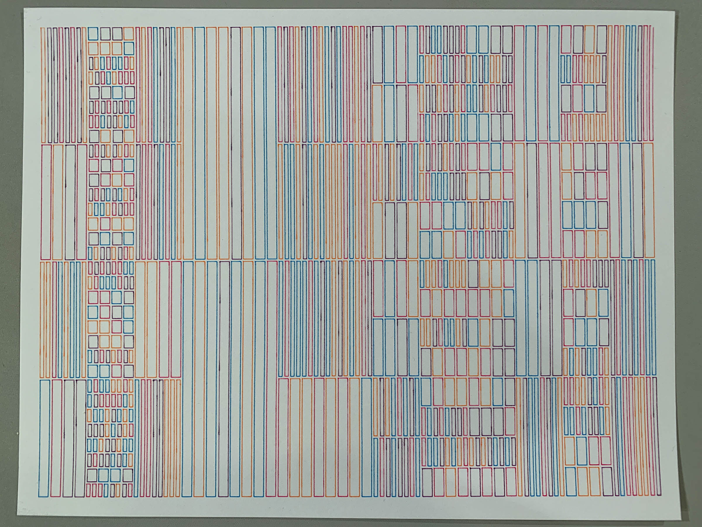</td>
  </tr>
</table>

The seven AxiDraws in our workshop sound like a roomful of chirping crickets. Kudos to EMSL for an amazing line of artist tools, and their incredibly responsive customer service when we had a (rare) issue.

<table>
  <tr>
    <td>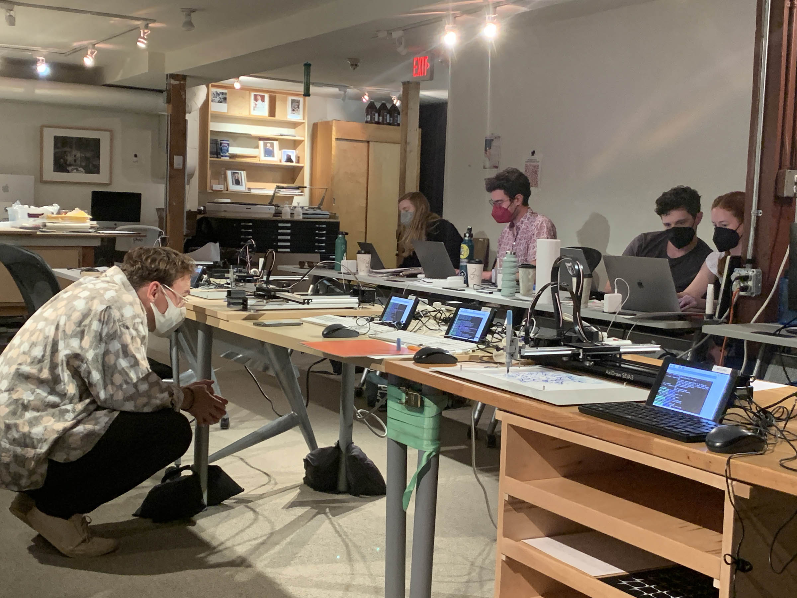</td>
    <td>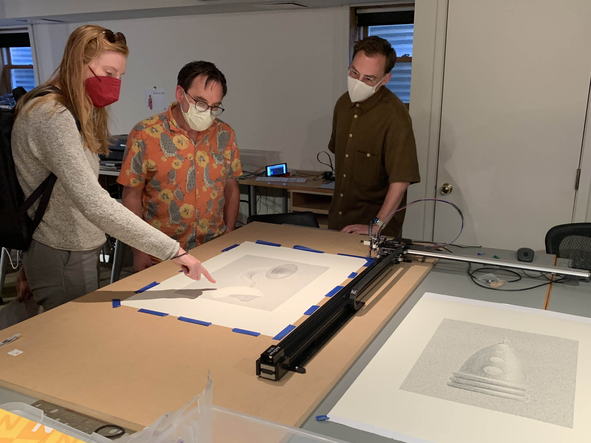</td>
  </tr>
</table>

Plein-air drawing, but by whom? In our generative plotter art workshop at Anderson Ranch today, Deanna Gelosi — Tinkering Studio alum, CUAtlas PhD student, and AxiDraw cyborg — expressed a posthuman squiggle through her computer-controlled finger-painting apparatus.

More images of Deanna Gelosi's plein-air mechatronic fingerpainting studies from our "Drawing with Machines" workshop at Anderson Ranch — including 4-up paintings exploring the nuances of automation and repetition.

<table>
  <tr>
    <td></td>
    <td></td>
  </tr>
</table>

Deanna Gelosi wrote more about her project in [this Medium post](https://medium.com/@deannagelosi/computer-controlled-finger-painting-352767a39358).

Some projects from Day 4 of our "Drawing with Machines" plotter workshop at Anderson Ranch: vectorized physarum simulation by Moishe Lettvin; 3D-to-2D projection study by Satre Stuelke; Multilayer interpolations by Lea Eaton; moiré discs by Caleb Ogg.

<table>
  <tr>
    <td>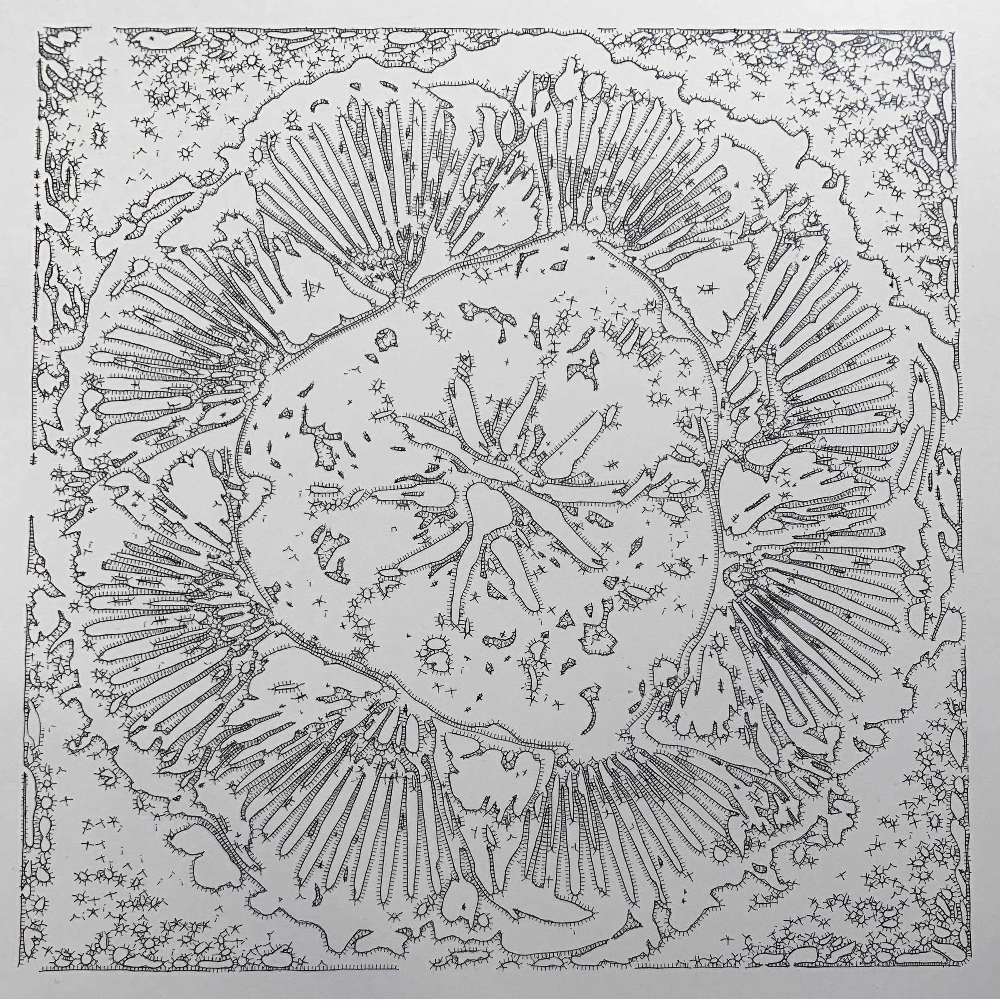</td>
    <td></td>
  </tr>
</table>

<table>
  <tr>
    <td></td>
    <td>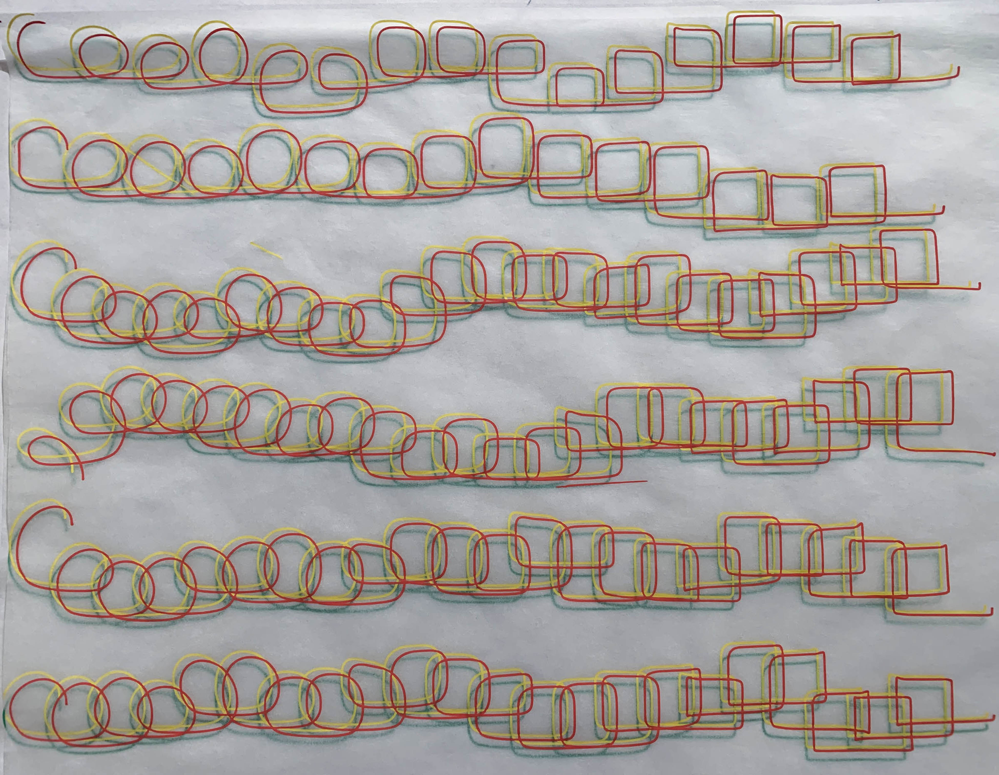</td>
  </tr>
</table>

The final day of the workshop at lovely Anderson Ranch was a whirlwind. Here are some more highlights. (Stylized photogrammetry landscape by Chris Coleman; skeletonized reaction-diffusion and differential growth T-shirt design by Harley Turan):

<table>
  <tr>
    <td></td>
    <td></td>
  </tr>
</table>

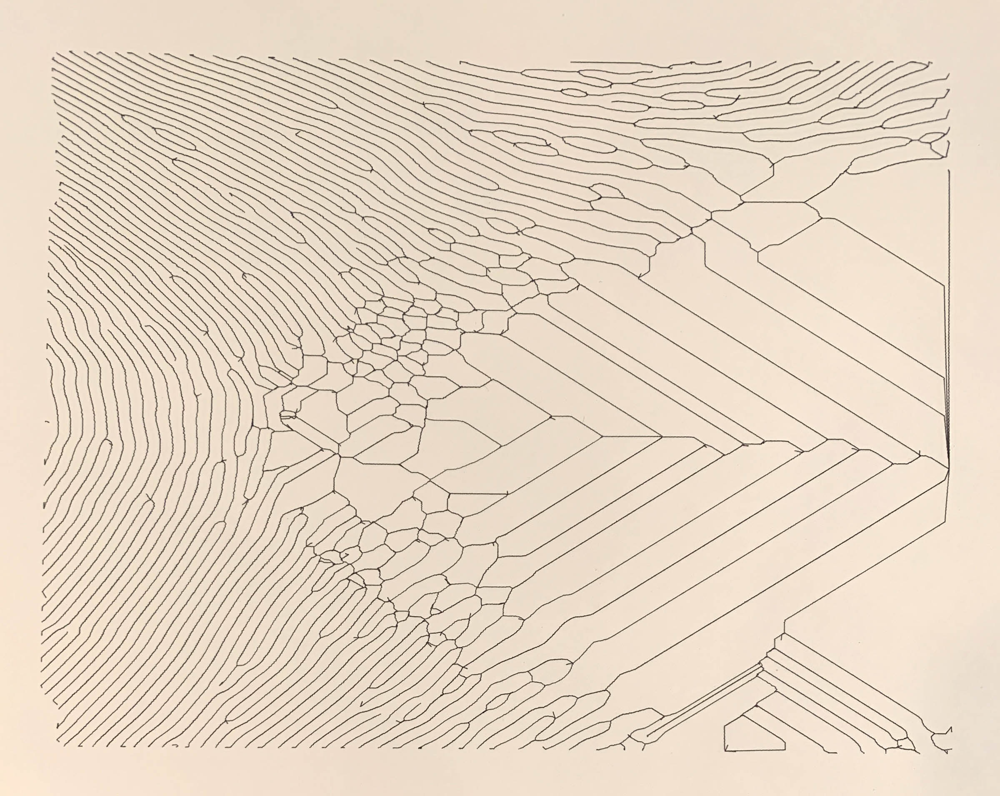

Elliott Spelman completed his impromptu contour-capture kiosk. Every 20 seconds, the system extracted and plotted the outline of whomever was gawking at it.

<table>
  <tr>
    <td>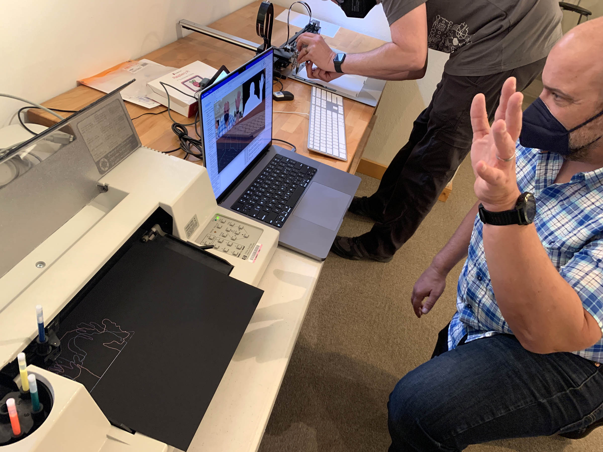</td>
    <td>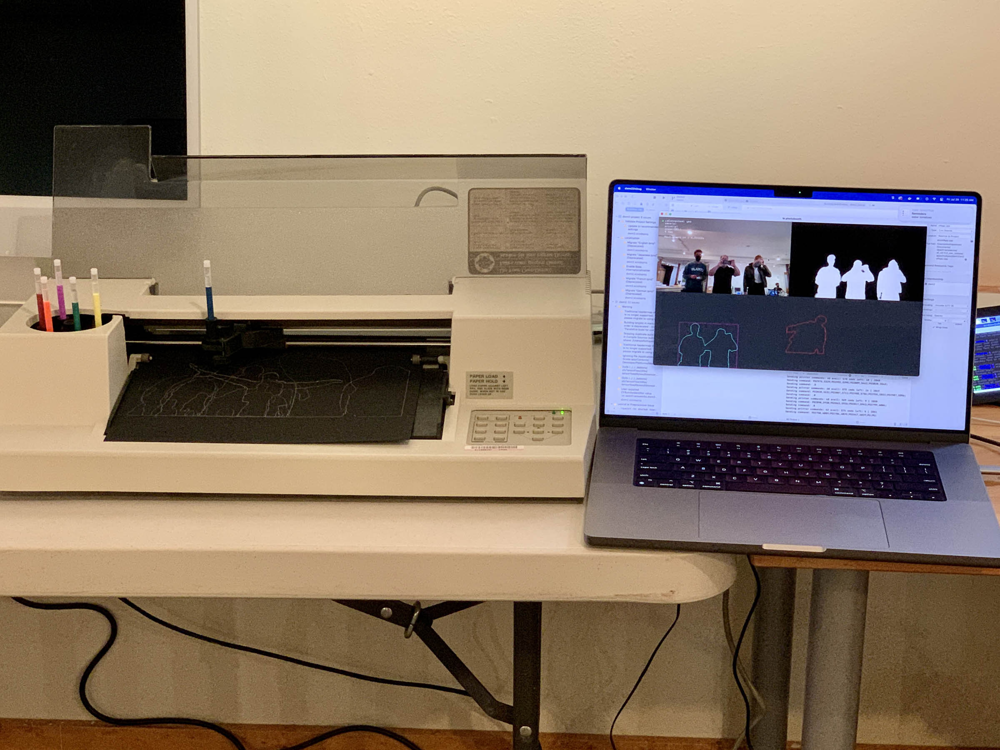</td>
  </tr>
</table>


At our plein-air AxiDraw station, Deanna Gelosi and her partner Travis Uhrig continued their cyborg finger-painting experiments. Here, Deanna is obligingly helping the machine execute a generative squiggle; it dips her finger in paint to reload between strokes. ([Here](img/travis_uhrig_plotterfinger.mp4) is a related video.)

On the final day, all of the participants in our plotter workshop made generative cards for a print exchange. (Some cards were individually personalized by/for the recipients, such as Elliott Spelman's body contours and Harley Turan's overplotted photos.)

More generative art cards from the print exchange of our plotter workshop at Anderson Ranch: curlicues by Chris Coleman; arc play by Caleb Ogg; interpolated profiles by Golan Levin; vectorized Physarum simulations by Moishe Lettvin...

...and both positive and negative (resist) generative plotter-fingerpaintings by Deanna Gelosi + Travis Uhrig!

<table>
  <tr>
    <td></td>
    <td>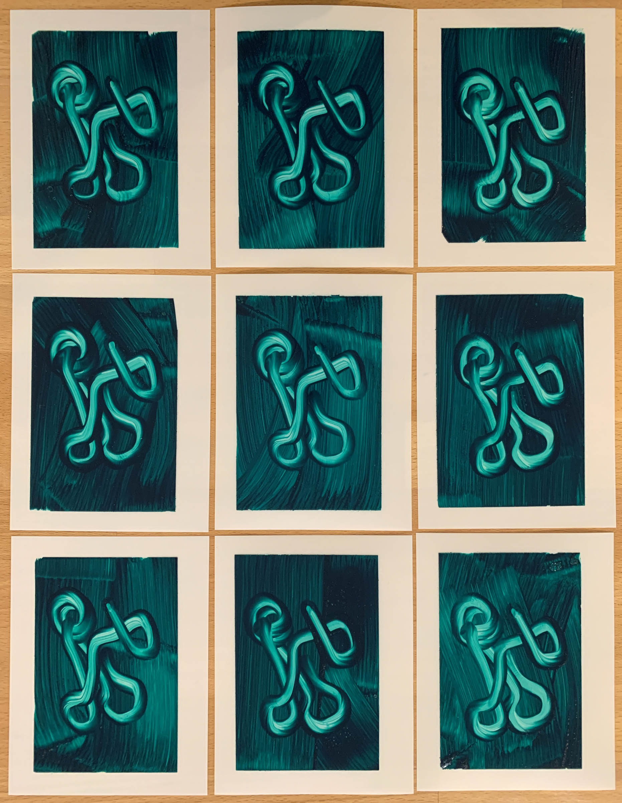</td>
  </tr>
</table>

For me, the highlight of our workshop at Anderson Ranch was an unplanned colab: student Lea Eaton, and ceramics student Joey Glickman, joined forces to create a set of sgraffito Truchet/Wang tiles (generated with differential growth & hobby curves)!

<table>
  <tr>
    <td></td>
    <td></td>
  </tr>
</table>

Bonus pic: Lea & Joey generously shared their developing understanding of CNC sgraffito techniques with other students in our plotter workshop at Anderson Ranch. Here, Lea uses the AxiDraw to execute a generative curlicue design, by Chris Coleman, into a clay slab.

