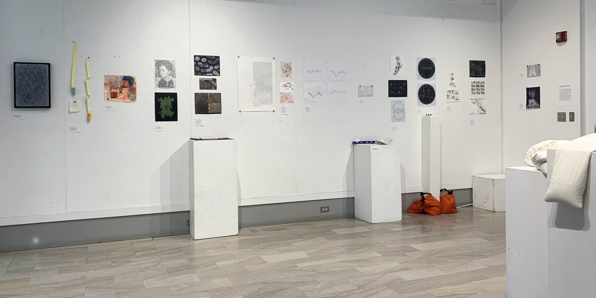
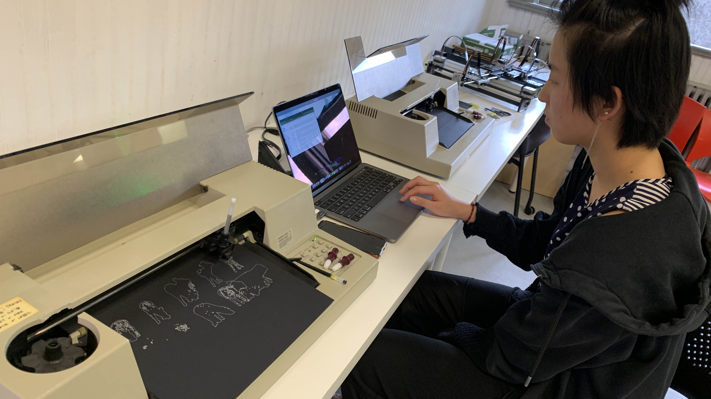
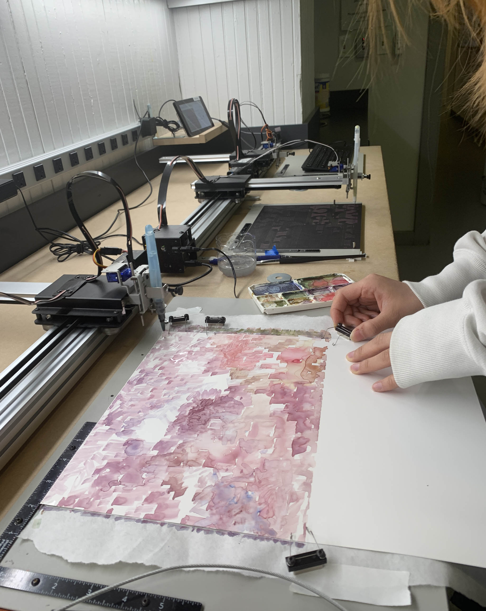
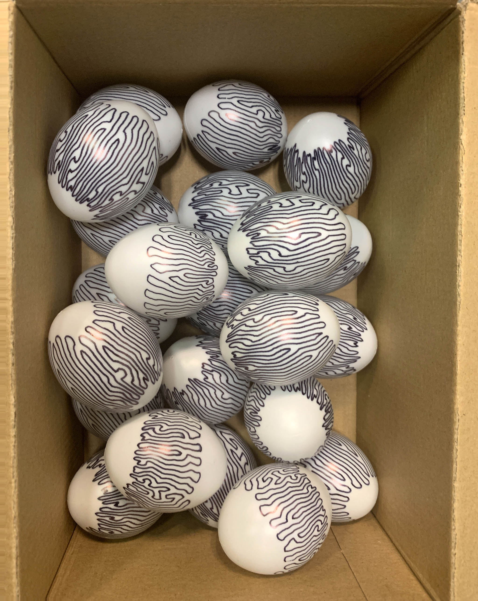
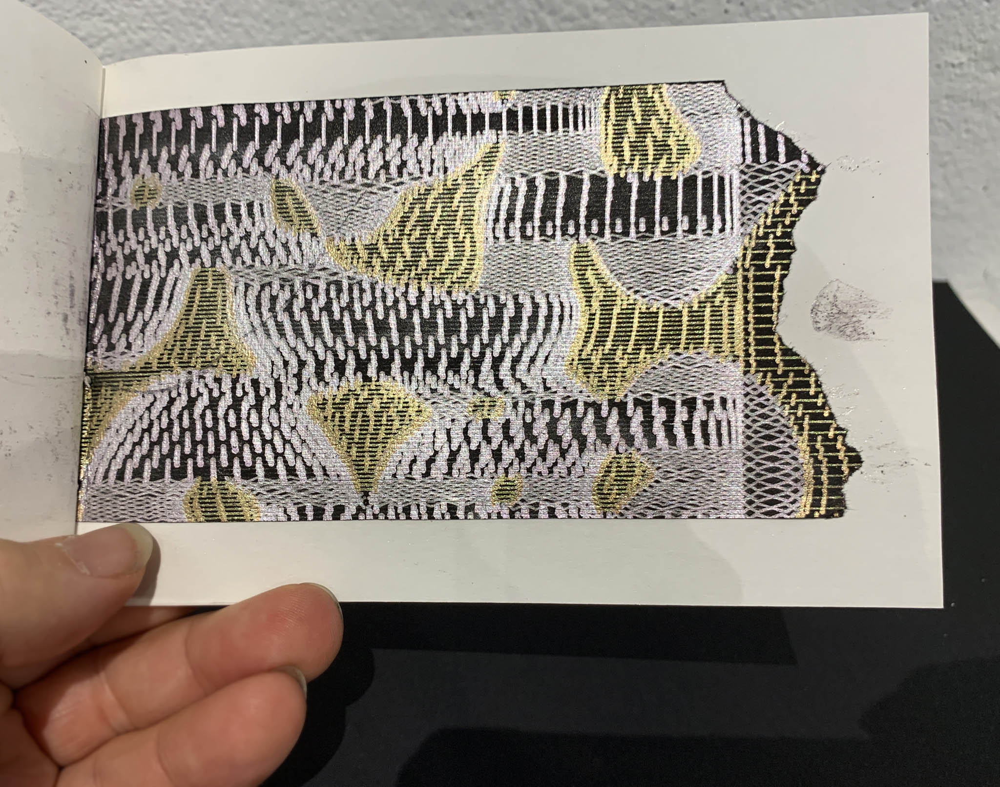
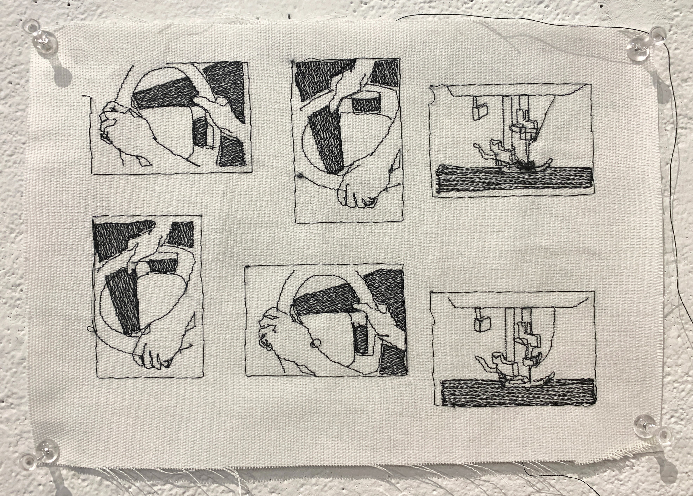
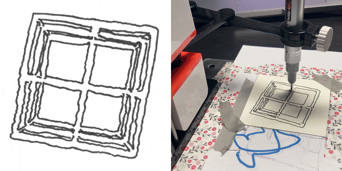

# Drawing with Machines: Spring 2024

This page presents highlights of projects produced in Golan Levin's Spring 2024 *Drawing with Machines* course at Carnegie Mellon University, as documented in [this Twitter thread](https://x.com/golan/status/1789165483658244231). Additional and higher-resolution images can also be found in [this Flickr album](https://flickr.com/photos/golanlevin/albums/72177720316690822/).

---

Friends, a thread: projects from my Spring 2024 #generativeArt #plotterTwitter course at CMU, [*Drawing with Machines*](https://github.com/golanlevin/DrawingWithMachines)! I'm privileged to work with brilliant students from the [CMU School of Art](https://art.cmu.edu/), [CMU's BXA](https://www.cmu.edu/interdisciplinary/programs/) Intercollege Degree Programs, the [CMU IDeATe](https://ideate.cmu.edu/) program — and generous support from [Bantam Tools](https://bantamtools.com/), makers of the world's best plotters.

*Drawing with Machines* is a studio art course in creative coding, CNC drawing, and mechatronic mishegoss. Students explored ultra-niche workflows, generative art algorithms, and the use of machine collaborators as nontraditional intermediaries between mind, hand, and paper.

<table>
  <tr>
    <td></td>
    <td></td>
  </tr>
</table>

2nd-year BHA student [Emma Deng](https://www.emmadeng.com/about) explored combinations of virtual and real-world fluid physics, using the [Bantam Tools ArtFrame 1824](https://bantamtools.com/products/bantam-tools-artframe-1824) and [AxiDraw](https://axidraw.com/) to plot designs with ink, watercolor, and Matter.js. Her large Chinese plot is the [*Buddhist Heart Sutra*](https://en.wikipedia.org/wiki/Heart_Sutra), a text intended to be copied as a meditative practice. Emma is studying Cognitive Neuroscience and Fine Art. 

<table>
  <tr>
    <td></td>
    <td></td>
  </tr>
</table>

[Lorie Chen](https://www.loriechen.com/) used [openFrameworks](https://openframeworks.cc/), HP 7475A plotters, and the Bantam Tools ArtFrame 1824 to produce custom-hatched treatments of [reaction diffusion](https://github.com/jasonwebb/morphogenesis-resources?tab=readme-ov-file#reaction-diffusion) (an algorithm that produces fishlike spots)—focusing on ink layering, material failures, and the unpredictable irregularity of gel-pen media.

<table>
  <tr>
    <td></td>
    <td></td>
  </tr>
  <tr>
    <td></td>
    <td></td>
  </tr>
</table>

Here's more of Lorie Chen's work. Lorie created several small books from cut-up fragments of her reaction-diffusion plots. Lorie is a sophomore in CMU's hybrid BCSA (Computer Science + Art) degree program.

<table>
  <tr>
    <td></td>
    <td></td>
  </tr>
  <tr>
    <td colspan="2"></td>
  </tr>
</table>

BFA sophomore [Vincent Wolfe](https://www.instagram.com/fangknife/) conducted multiple investigations with [PEmbroider](https://github.com/CreativeInquiry/PEmbroider) (our [Processing](https://processing.org/) library for computational embroidery), such as [this rotoscopic vector-art animation](https://www.youtube.com/watch?v=2r4ikNz2sI4) inspired by the work of BFA alum [Huw Messie](https://www.instagram.com/huwmessie/?hl=en).

Some more stills from Vincent's embroidered animation.

Vincent Wolfe also used PEmbroider and Processing to create these herbarium-style plant samples — implementing an [L-system](https://en.wikipedia.org/wiki/L-system) algorithm from papers by [Przemyslaw Prusinkiewicz](https://algorithmicbotany.org/) and running the embroidery machine without fabric (i.e. only stabilizer).

<table>
  <tr>
    <td></td>
    <td></td>
  </tr>
</table>

BFA senior [Em Lugo](https://github.com/elugo1/) developed a TouchDesigner-based workflow for generating SVG images, which he then plotted by rubbing carbon transfer paper (!) with an [EMSL](https://www.evilmadscientist.com/) AxiDraw. Em also explored TouchDesigner pipelines for plotting designs derived from computer vision.

<table>
  <tr>
    <td rowspan="2"></td>
    <td></td>
  </tr>
  <tr>
    <td></td>
  </tr>
</table>

[Emily Liu](https://medium.com/studio6117/drawing-with-machines-7af3c376267c), a senior in the [CMU School of Design](https://design.cmu.edu/), used Processing [skeletonization code](https://github.com/LingDong-/skeleton-tracing) by BCSA alum [Lingdong Huang](https://lingdong.works/) to transform ultra-high-resolution scans of her fingerprints into greatly magnified, vectorized, plotted self-portraits.

<table>
  <tr>
    <td rowspan="2"></td>
    <td></td>
  </tr>
  <tr>
    <td></td>
  </tr>
</table>

Santiago Salazar, a BHA junior studying Art and Cognitive Neuroscience, used EMSL AxiDraws and vintage HP7475A's to develop a distinctive, glitched approach to computational image hatching. 

<table>
  <tr>
    <td></td>
    <td></td>
  </tr>
  <tr>
    <td></td>
    <td></td>
  </tr>
</table>

One of Santi's most impressive projects was [*cuerpo y alas*](https://www.youtube.com/watch?v=poSatspv0o0), a collection of plotted stop-frame animations informed by visual noise and radio static. The individual image frames are each about 5x3cm. 

<table>
  <tr>
    <td></td>
    <td></td>
  </tr>
</table>

2nd-year BFA student Anastasia Jungle has a keen interest in rule-based poetry and a material obsession with sandbags. They used PEmbroider and 
Daniel Howe's [RiTa.js](https://rednoise.org/rita/) to create a series of satirical barricades, with text generated from OSHA manuals and employment contracts.

<table>
  <tr>
    <td rowspan="2"></td>
    <td></td>
  </tr>
  <tr>
    <td></td>
  </tr>
</table>

The playful and wobbly [Line-Us plotter](https://www.line-us.com/) was a hit with many students this spring. 3rd-year BXA student [Mimi Chuang](https://mimichuang.com/) used it to develop an interactive storybook—merging Mad Libs and Mr. Potatohead—in which players can freely combine modular stickers of body parts with generated text.

<table>
  <tr>
    <td></td>
    <td></td>
  </tr>
  <tr>
    <td></td>
    <td></td>
  </tr>
</table>

Inspired by the organic and crunky unpredictability of the Line-Us plotter, BFA senior [Shelly Zhang](https://www.zshelly.com/) used it to create drawings, drypoint etchings, and paper sculptures of squashed gnats and mosquitoes. 

<table>
  <tr>
    <td></td>
    <td></td>
  </tr>
  <tr>
    <td></td>
    <td></td>
  </tr>
</table>

Shelly Zhang also used the tiny Line-Us to introduce material irregularity into machine-drawn stop-frame animations. Working in Maya, she developed a workflow for exporting frames of 3D geometries as plottable SVGs.

BFA sophomore G Meloche developed custom workflows for generative geometry in Blender, building on SVG-export tools by [Maks Surguy](https://makssurguy.com/). They then used these to produce mixed-media pieces, combining Axidraw plots with hand-painted casein and acrylic.

<table>
  <tr>
    <td></td>
    <td></td>
  </tr>
</table>

BFA 2nd-year Emma Im created a “3D-print photobooth” in a project combining computer vision and real-time additive prototyping. [Her p5.js program](https://github.com/siye0ngim/SIMS) transforms webcam snaps directly into G-code for a low-cost 3D printer, as shown in this self-portrait.

BFA sophomore [Finnian Brooke](https://www.instagram.com/finnian_brooke/) explored "automatic" drawing in expressive and psychedelic works that combined hand and machine mark-making. In this example, a computer-generated noise field of AxiDraw marks (blue) is overdrawn by Finn's own improvised sketches (black).

[Elise Chapman](https://eliseraichapman.com/), a senior in the CMU School of Design, developed a Processing program to generate flourishes and asemic writing informed by traditional calligraphy techniques. Elise made heavy use of specialized AxiDraw attachments for angled fountain pens.


 

This light painting was produced by CMU School of Architecture 5th-year student [Mira Teng](https://www.linkedin.com/in/mira-teng-050233212/), who directed a modified, autonomous Zumo robot to roam their house. Through long-exposure photography, Mira's drawing machine gave voice to the spaces between the walls.

These computer-engraved pennies were created by [Yon Maor](https://www.linkedin.com/in/yonmaor/), an Art+MechE junior, with an AxiDraw. The coins, coated in asphaltum and graffitied with brief provocations about labor, were documented under a microscope and then recirculated as currency.

<table>
  <tr>
    <td></td>
    <td></td>
  </tr>
  <tr>
    <td></td>
    <td></td>
  </tr>
</table>

Art+MechE senior [Jude Bissonette](https://www.linkedin.com/in/jude-bissonette/) spent the first part of the semester experimenting with algorithms for image hatching, such as rejection sampling with Perlin noise fields, and a novel technique using the XOR operator.

<table>
  <tr>
    <td></td>
    <td></td>
  </tr>
</table>

Jude's final project was [*Asspire*](https://studioforcreativeinquiry.org/project/asspire), a real-time gestural controller for drawing with one's butt! It uses a 6DOF IMU and a pressure sensor to govern the shape of a plotted line and other generative art. Jude used [the device](https://github.com/jbissonette02/Asspire) in a live performance.

<table>
  <tr>
    <td rowspan="2"></td>
    <td></td>
  </tr>
  <tr>
    <td></td>
  </tr>
</table>

[Leo Lin](https://leolin.art/about) executed a series of crisp conceptual wall installations with an AxiDraw SE/A3 pen plotter, including this [24-hour plotter clock](https://www.youtube.com/watch?v=N6idEq3z7Rw). Leo's real-time system writes the current time—once per minute—all day long.

More images of Leo Lin's *AxiDraw Clock*. Leo is a junior in our hybrid BCSA (Computer Science + Art) degree program.

<table>
  <tr>
    <td colspan="2"></td>
  </tr>
  <tr>
    <td></td>
    <td></td>
  </tr>
</table>

Another of Leo Lin's durational installation projects was his *Bounding Box*, in which [a drawing machine ray-traces the path of a simulated photon](https://youtube.com/watch?v=uxH9vzOfRnc) as it bounces around its enclosure. 

In [Marc Dunand](https://marcdunand.com/)'s [interactive project](https://www.youtube.com/watch?v=MfCeOq2Uj1s), participants draw a curve across a piece of paper. Using his custom vision software, a plotter then embellishes this hand-drawn curve with features like trees, lakes, and houses—turning it into a charming landscape. 

Some more photos of Marc's collaborative drawing machine, and its results. Marc developed the software using OpenCV and the A]xiDraw Python API.

Students finished the semester with a postcard exchange, annotated in [this PDF](dwm_2024_postcards.pdf).

Thanks for your interest! If you're interested in browsing the "Drawing with Machines" course syllabus and resources, you can find these [here](https://github.com/golanlevin/DrawingWithMachines).

---