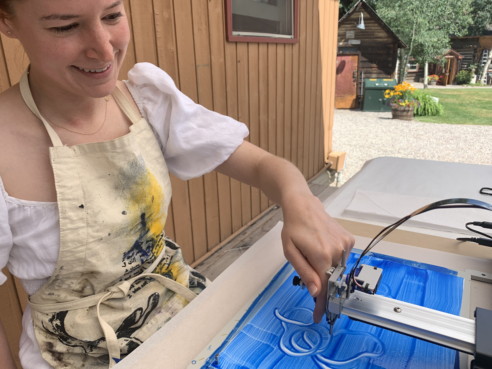
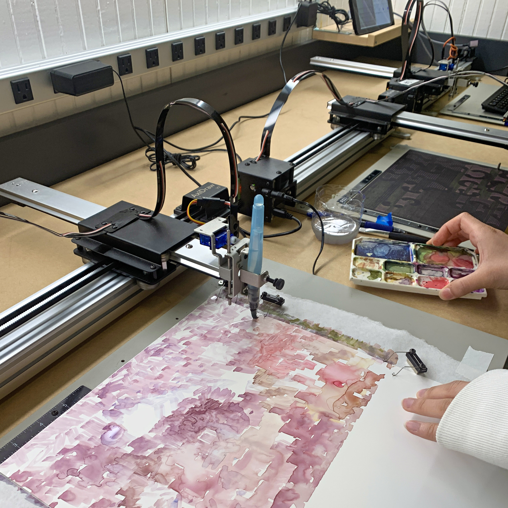
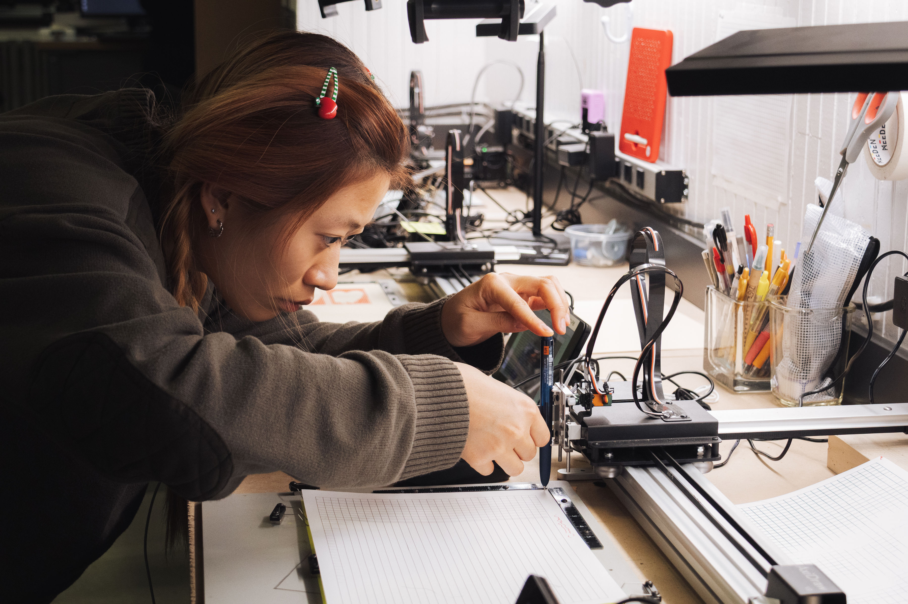
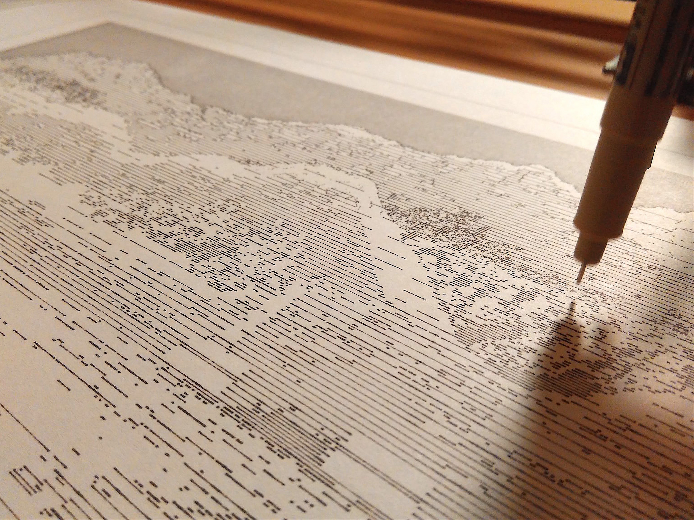
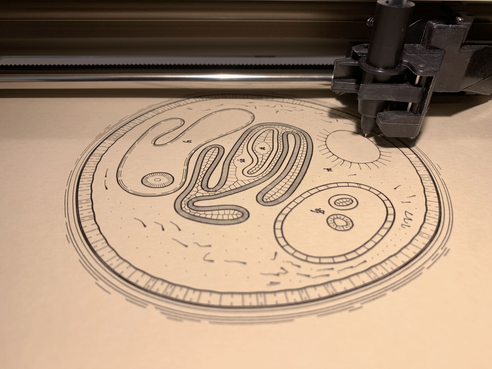

# Drawing with Machines: July 2027

This page is a stub for an upcoming *Drawing with Machines* workshop that will be offered from July 26-30, 2027 at Anderson Ranch, Snowmass, CO. 

> In this workshop, students challenge themselves with experimental drawing, generative art, computational design, and mechatronic tinkering. Working at the boundaries of creative coding, physical materials and digital fabrication, participants will explore personal and peculiar new approaches to mark-making; the development of ultra-niche workflows as a mode of creative practice; and the use of algorithms and machine collaborators as nontraditional intermediaries between mind, hand and paper. Participants develop skills in generative art and animation while learning how to control popular robotic pen plotters like the Bantam ArtFrame, NextDraw/AxiDraw, WatercolorBot, EggBot, and vintage machines like the HP7475a. Interested participants should have some prior experience programming and/or vibe-coding in p5.js, Processing, or Python.

---

## About the Instructor

Golan Levin is Professor of computational and interactive new media art at Carnegie Mellon University, where he teaches courses in generative art, machine drawing, experimental capture, and audiovisual systems. Golan is a two-time TED speaker and recipient of undergraduate and graduate degrees from the MIT Media Laboratory. With Tega Brain, he is co-author of Code as Creative Medium (2021, MIT Press), an educator’s guide to creative coding.

--- 

## Images

