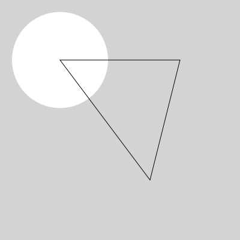

# Generating SVG Files for Plotters (2024)

**Contents:** 

* Introduction: What are SVG Files?
* Recommended Toolchains
	* Finalizing Your SVGs with *vpype*
	* Generating SVGs with Java (Processing)
	* Generating SVGs with JavaScript (p5.js)
	* Generating SVGs with Python (Processing.py v.3.5.4)
	* Generating SVGs with Python (*vsketch*)
	* Other SVG Tools and Generators

---

# Introduction: What are SVG Files?

SVG ("Scalable Vector Graphic") files are text files that contain descriptions of geometry. Paths in SVG files are defined as sequences of points (though elliptical arcs and Bezier curves are also possible), which makes them very suitable for controlling pen plotters. Here is an SVG file, and its code: 



```
<svg version="1.1"
	width="400" height="400"
	xmlns="http://www.w3.org/2000/svg">

	<rect width="100%" height="100%" fill="lightgray" />
	<circle cx="100" cy="100" r="80" fill="white" />
	<path fill="none" stroke="black" stroke-width="1.0px" d="
		M100 100 
		L300 100 
		L250 300 
		Z" />
</svg>
```

In this course, you will generally: 

1. Generate SVG files using Processing, Python, or p5.js.
2. Use *vpype* to prepare and optimize your SVG files for plotting. 

---

# Recommended Toolchains

**Note**: *After generating an SVG with one of the toolkits below, use vpype to prepare your SVG for plotting.* 

## Finalizing Your SVGs with *vpype*

**Heads up!** No matter which programming toolkit you use to create your SVG files, you will need to prepare and optimize them for plotting using [*vpype*](https://github.com/abey79/vpype), a powerful command-line tool. Doing so will help avoid damage to our machines, and will make your plots execute much faster, too. 

1. Follow these instructions [*(Prepping SVGs for Plotting with vpype)*](vpype_svg_prep/README.md) for installing *vpype*.
2. *vpype* allows commands to be "stacked" into a filtering pipeline. The following *vpype* command loads your inputfile.svg; ensures that any line segments with coincident endpoints are merged into polylines; optimally sorts the results; and crops the image for an 11x8.5 page with a half-inch margin: `vpype read inputfile.svg linemerge --tolerance 0.1mm linesort crop 0.5in 0.5in 10.0in 7.5in write outputfile.svg`
3. Some other common ready-to-use formulas for *vpype* can be found [here](https://github.com/abey79/vpype?tab=readme-ov-file#examples). The main *vpype* documentation is [here](https://vpype.readthedocs.io/en/latest/index.html). 

## Generating SVGs with Java (Processing)

[**Processing**](https://processing.org/) is a mature toolkit for creative coding, with an extensive set of 3rd-party libraries. With its built-in [**SVG Export Library**](https://processing.org/reference/libraries/svg/index.html), Processing provides several different ways of using Java to generate SVG files (with [code samples provided here](https://processing.org/reference/libraries/svg/index.html)), including: 

* SVG Export (No Screen Display)
* SVG Export (With Screen Display)
* Single Frame from an Interaction/Animation (With Screen Display)
* SVG Files from 3D Geometry (With Screen Display)

The Processing toolkit is documented [here](https://processing.org/reference) and [here](https://processing.org/environment). The following example sketches should help you get started. These work with both Processing 4.x and Processing 3.5.4:

* [*Test Grid demo*](processing_java/svg_testgrid/svg_testgrid.pde)
* [*Lissajous demo*](processing_java/svg_lissajous/svg_lissajous.pde)
* [*Simple Flow Field*](processing_java/svg_simpleFlowField/svg_simpleFlowField.pde)
* [*100 Random Lines*](processing_java/svg_random_lines/svg_random_lines.pde)


## Generating SVGs with JavaScript (p5.js)

[**p5.js**](https://p5js.org/) is Processing's JavaScript sibling. Version 1.6.0 of p5.js, along with @zenozeng's [p5.js-svg library](https://github.com/zenozeng/p5.js-svg) v.1.5.1, can be used to generate SVGs. **Note**: *As of January 2024, the current version of p5.js (v.1.9.0) is not compatible with the p5.js-svg renderer (v.1.5.1). Instead, be sure to use p5.js v.1.6.0, which is set in the index.html file of your sketch.* The documentation for p5.js is [here](https://p5js.org/reference/).

* *Lissajous demo* - [at Editor.p5js.org](https://editor.p5js.org/golan/sketches/JBWOKOQYH) - [on GitHub](p5js/svg_lissajous/sketch.js)
* *100 Random Lines* - [at Editor.p5js.org](https://editor.p5js.org/golan/sketches/afWmQU4yg) - [on GitHub](p5js/svg_lissajous/sketch.js)

For alternative JavaScript-based toolkits and approaches, consider: 

* [*SVG From Scratch*](https://editor.p5js.org/golan/sketches/cR3C_JI1-) - [on GitHub](p5js/svg_from_scratch/sketch.js), assembling SVG code directly in p5.js
* [*svg5.js*](https://www.npmjs.com/package/svg5) by @MAKIO135:  (demo at [Editor.p5js.org](https://editor.p5js.org/golan/sketches/QbOhi4I1v))
* [*Rune.js*](http://runemadsen.github.io/rune.js/) by @runemadsen, with [rune.save.js](https://www.npmjs.com/package/rune.save.js) by @alterebro
* [*canvas-sketch*](https://github.com/mattdesl/canvas-sketch/) by @mattdesl, with [```pathsToSVG()```](https://github.com/mattdesl/canvas-sketch-util/blob/master/docs/penplot.md#pathsToSVG) from [canvas-sketch-util](https://github.com/mattdesl/canvas-sketch-util/blob/master/docs/penplot.md)
* [*Paper.js*](http://paperjs.org/) by @lehni, using [```exportSVG()```](http://paperjs.org/reference/project/#exportsvg) as shown [here](http://paperjs.org/features/#svg-import-and-export) 

## Generating SVGs with Python (Processing.py v.3.5.4)

Processing has a "Python Mode" that allows you to use the same [SVG Export Library](https://processing.org/reference/libraries/svg/index.html) as the Java version. It is documented [here](https://py.processing.org/tutorials/gettingstarted/). There are two small snags: 

* In Python Mode, the SVG Export Library is **only compatible with Processing v.3.5.4**, from 2020, [which you can download here](https://processing.org/releases). As of January 2024, the SVG Export Library is not working in the Python Mode of Processing 4.x. 
* Processing's Python Mode is not compatible with other Python libraries, such as NumPy or SciPy. 

Assuming you're working in Processing 3.5.4, you can install the Python Mode using the instructions [here](https://py.processing.org/tutorials/gettingstarted/). Here are example projects:

* [*Test Grid demo*](processing_py_3.5.4/svg_testgrid/svg_testgrid.pyde)
* [*Lissajous demo*](processing_py_3.5.4/svg_lissajous/svg_lissajous.pyde)
* [*100 Random Lines*](processing_py_3.5.4/svg_random_lines/svg_random_lines.pyde)


## Generating SVGs with Python (*vsketch*)

* [**Here's a Python v.3 workflow**](python/README.md) for generating SVG files. The recommended toolchain includes [**vsketch**](https://github.com/abey79/vsketch) (a Processing-like Python toolkit for generating SVGs), and [**vpype**](https://vpype.readthedocs.io/en/latest/index.html) (a Python framework for generating SVGs, as well as prepping them for plotting), which interoperates with vsketch.
  * [*Lissajous demo*](python/svg_lissajous/sketch_svg_lissajous.py)
* [**vsketch**](https://github.com/abey79/vsketch) by @abey79, with e.g. [Shapely](https://shapely.readthedocs.io/en/latest/), which can be used [in Google Colab notebooks](https://vsketch.readthedocs.io/en/latest/install.html#using-notebooks)


---

## Other SVG Tools and Generators

* [**Huge list of SVG tools**](https://drawingbots.net/resources#5) at Drawingbots.net
* [vpype](https://github.com/abey79/vpype), which can 
  * layout vector files with precise control of position & scale
  * optimize existing SVG files for faster and cleaner plots;
  * create HPGL output for vintage plotters;
  * create generative artwork from scratch;
  * create, modify and process multi-layer vector files for multi-colour plots; etc.
* [Occult](https://github.com/LoicGoulefert/occult), vpype plug-in to remove lines occulted by polygons from SVG files.
* [Deduplicate](https://github.com/LoicGoulefert/deduplicate), vpype plug-in to remove overlapping lines in SVG files.
* [Shapely](https://shapely.readthedocs.io/en/latest/project.html), a Python package for manipulation and analysis of planar geometric objects.


### "Readymade" SVG Generators

*We will generally not be using other peoples' "readymade" SVG generators, but it's good to be aware of the kinds of free tools that people make.*

* [rad-lines](https://msurguy.github.io/rad-lines/) by @msurguy, a readymade tool for generating SVGs of rotating patterns
* [flow-lines](https://msurguy.github.io/flow-lines/) by @msurguy, a readymade tool for generating SVGs of flow fields
* [Potrace](https://www.npmjs.com/package/potrace), a NodeJS-compatible JavaScript tool for tracing bitmaps.
* [Flowchart.fun](https://flowchart.fun/), a tool that generates SVGs of flowcharts from structured text
* [City Map Generator](https://maps.probabletrain.com/#/), a readymade tool by @probabletrain for creating procedural city maps in the browser
* [Great96](https://isohedral.ca/great-96/), a tool for generating Islamic tiling geometric patterns
* [AudioPlotter](https://audioplotter.ars.is/), a tool for generating SVGs of audio waveforms from sound files
* [DrawingBotV3](https://github.com/SonarSonic/DrawingBotV3) a tool to create stylised line drawings from images

---

*Note: the [2021 version of this document](2021/README_2021.md) includes additional resources which may or may not be obsolete.*