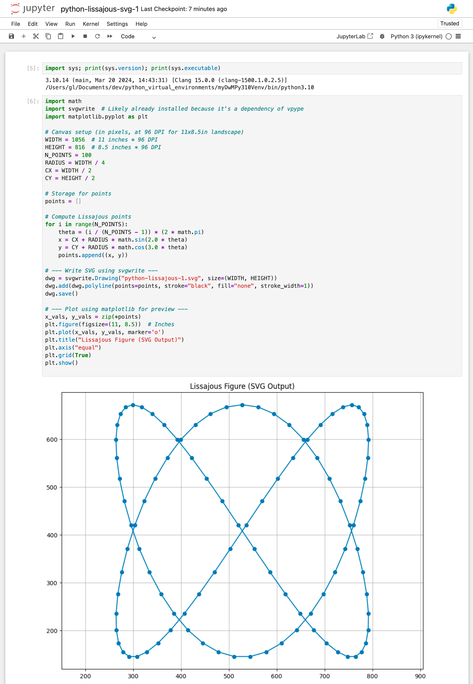
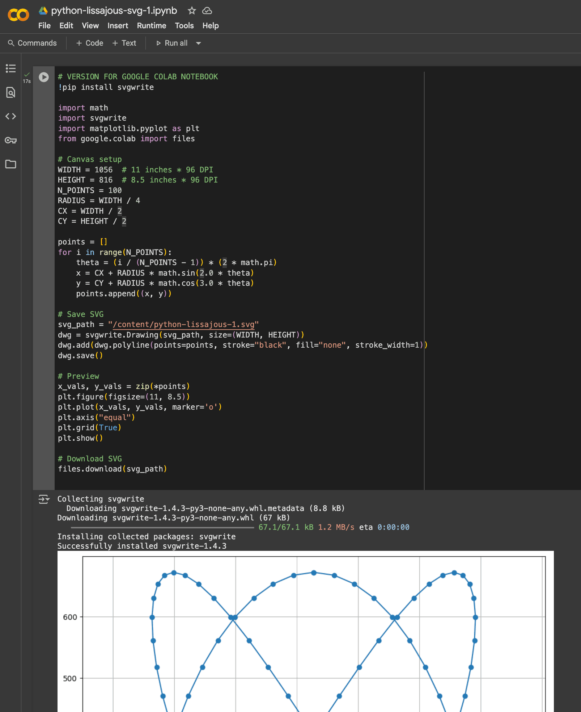
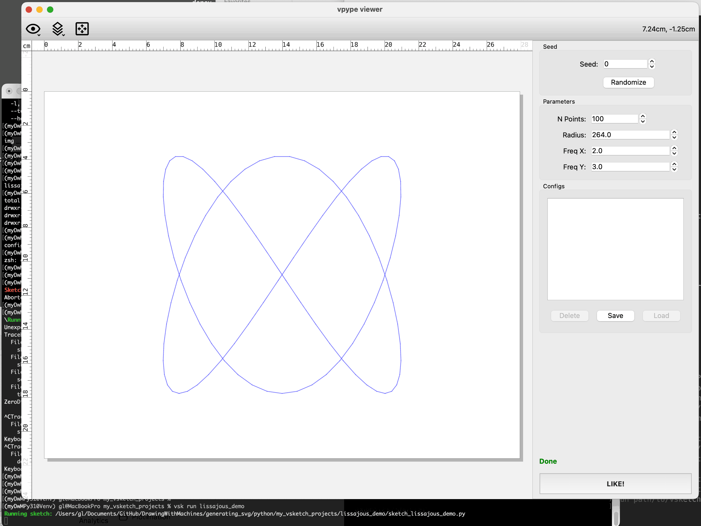

# Generating SVGs in Python (2025)

**Contents:**

1. [Creating a Suitable Python3.10 Virtual Environment](#1-creating-a-suitable-python310-virtual-environment)
2. [Generating an SVG within a Jupyter Python Notebook](#2-generating-an-svg-within-a-jupyter-python-notebook)
	* [2a. Generating an SVG within a Google Colab Notebook](#2a-generating-an-svg-within-a-google-colab-notebook)
3. [Generating an SVG using vsketch and VSCode](#3-generating-an-SVG-using-vsketch-and-vscode)

---

## 1. Creating a Suitable Python3.10 Virtual Environment

1. As of August 2025, the **recommended Python version** for our course is **3.10**. To get started, at the MacOS Terminal, **find out** whether you have Python v.3.10 installed by typing: `which python3.10`
2. You should see a response like `/opt/local/bin/python3.10`. If you don't already have Python 3.10 installed, you'll need to do that. To **install** Python3.10, if necessary:
	* Use [Homebrew](https://brew.sh/) if you already have it installed, because it’s common and widely documented: `brew install python@3.10`
	* Otherwise, use the [official Python.org installer](https://www.python.org/downloads/release/python-3100/), which is easy and requires no package manager.
	* You could also use the [MacPorts](https://www.macports.org/) package manager if that's your thing. 
3. You can now **test** that Python 3.10 is installed correctly by typing `python3.10` at the Terminal. You should see something like `Python 3.10.14 (main, Mar 20 2024, 14:43:31)`. (To quit, type `quit()`.)
4. **Change directory** to the folder in which you'd like to create your virtual environment(s). In my case, that looks like: `cd /Users/golan/Documents/dev/python_virtual_environments`.
5. **Create** a new *virtual environment* in that directory by typing: `python3.10 -m venv myDwMPy310Venv` . This will create a subdirectory (*myDwMPy310Venv*) containing various files. A virtual environment is like a bubble that protects your Python installation by keeping its packages and dependencies isolated from the rest of your system.
6. **Activate** the newly created virtual environment: `source myDwMPy310Venv/bin/activate`. (You can exit the virtual environment later by typing `deactivate`.) Your Terminal prompt should change to indicate that you are now operating within this virtual environment.
7. We will now **add some libraries** to grow our virtual environment. First we will install/update `pip`, which is a package manager for Python that lets you install and manage external libraries and tools: `pip install --upgrade pip`.
8. Now we **add** more libraries: support for [Jupyter](https://jupyter.org/) notebooks and [matplotlib](https://matplotlib.org/), a graphing/visualization library. Type: `pip install notebook matplotlib`
9. We now install *vpype* and its collection of sidecar plugins: `pip install "vpype[all]"`. Note that the `[all]` installs the helpful *vpype* viewer.
10. We will also install vpype's sibling project, *vsketch*: `pip install vsketch`, which will come in handy soon.  
11. *vpype* should now be installed and ready to use. You may check that it is fully functional by checking its version: `vpype --version` (I get the result: `vpype 1.13.0`.) You can also check *vpype* by displaying some random lines: `vpype random show`.
12. *Eventually*, you may wish to also `pip install` some additional useful libraries into this virtual environment, such as: 
	* `svgpathtools` — for parsing and manipulating SVG paths and Bézier curves
	* `numpy` — foundational array math for geometry, transforms, and image data
	* `scipy` — numerical and scientific computing, including interpolation and optimization
	* `shapely` — 2D geometry manipulation (union, intersection, buffering, etc.)
	* `opencv-python` — image processing and computer vision (e.g., contour tracing, edge detection)
	* `scikit-image` — image analysis and filters (e.g., thinning, labeling, segmentation)

---

## 2. Generating an SVG within a Jupyter Python Notebook

A Python notebook is an interactive, document-like workspace that lets you write and run code in small, testable chunks alongside text, images, and visual output — making it ideal for exploring ideas, documenting your process, and sharing work in a clear, reproducible way. Popular notebook formats include Jupyter and Google Colab. 

1. From within your virtual environment (i.e., with it "activated"), you should now be able to **launch** the Jupyter notebook environment. Type: `jupyter notebook`. This will open a browser window at `http://localhost:8888`. 
2. From there, you can **create** a new notebook. In the upper right corner, click **New → Python3 (ipykernel)**.
3. You will find yourself in a blank new Jupyter notebook called "Untitled" (in the upper left). **Change** the title to `python-lissajous-svg-1.ipynb`. Be conscientious about where you save this file. 
4. To **test** whether you are running in the correct Python environment, **type** the following in the first cell of your notebook, and then click *Run*: `import sys; print(sys.version)`. You should see something like `3.10.14 (main, Mar 20 2024, 14:43:31)`. (You could also add `print(sys.executable)`, and it should report the filepath of your virtual environment.)
5. Now, **paste** the following Python code into an empty cell, and click *Run*. You should see a Lissajous figure rendered in the notebook by matplotlib, and a file named `python-lissajous-1.svg` should appear in the same folder as your notebook. 

```python
import math
import svgwrite  # Already installed because vpype depends on it
import matplotlib.pyplot as plt

# Canvas setup (in pixels, at 96 DPI for 11x8.5in landscape)
WIDTH = 1056  # 11 inches * 96 DPI
HEIGHT = 816  # 8.5 inches * 96 DPI
N_POINTS = 100
RADIUS = WIDTH / 4
CX = WIDTH / 2
CY = HEIGHT / 2

# Storage for points
points = []

# Compute Lissajous points
for i in range(N_POINTS):
    theta = (i / (N_POINTS - 1)) * (2 * math.pi)
    x = CX + RADIUS * math.sin(2.0 * theta)
    y = CY + RADIUS * math.cos(3.0 * theta)
    points.append((x, y))

# --- Write SVG using svgwrite ---
dwg = svgwrite.Drawing("python-lissajous-1.svg", size=(WIDTH, HEIGHT))
dwg.add(dwg.polyline(points=points, stroke="black", fill="none", stroke_width=1))
dwg.save()

# --- Plot using matplotlib for preview ---
x_vals, y_vals = zip(*points)
plt.figure(figsize=(11, 8.5))  # Inches
plt.plot(x_vals, y_vals, marker='o')
plt.title("Lissajous Figure (SVG Output)")
plt.axis("equal")
plt.grid(True)
plt.show()
```

Here's how it should look in your browser:



---

### 2a. Generating an SVG within a Google Colab Notebook

In general, we **won’t** be using Google Colab notebooks this semester because our workflow depends on reading and writing local files for plotting, which Colab’s cloud-based environment makes cumbersome. In addition, the visualization tools in *vpype* and *vsketch* require a local graphics context and do not run inside a browser-based environment like Colab, making them impractical for our needs.

That said, the above program is *so simple* — it uses just three libraries, `math`, `matplotlib`, and `svgwrite` — that only small changes are needed to create the following **Google Colab version** of the same program, which you can set up in your Google Drive. This may be a workable fallback if you're unable to set up a local Python environment, but keep in mind that it won't support our full toolchain.

<details>
  <summary><strong>Click here</strong> for information about generating SVGs within a Google Colab Notebook.</summary>

* To create a Colab notebook from Google Drive, go to **+New → More → Google Colaboratory**.
* If you don’t see “Google Colaboratory” in the list, click **+New → More → Connect more apps**, search for *Colaboratory*, and install it.

Once you have a blank Colab notebook, **paste** the following code into a cell and run it: 


```python
# VERSION FOR GOOGLE COLAB NOTEBOOK
!pip install svgwrite

import math
import svgwrite
import matplotlib.pyplot as plt
from google.colab import files

# Canvas setup
WIDTH = 1056  # 11 inches * 96 DPI
HEIGHT = 816  # 8.5 inches * 96 DPI
N_POINTS = 100
RADIUS = WIDTH / 4
CX = WIDTH / 2
CY = HEIGHT / 2

points = []
for i in range(N_POINTS):
    theta = (i / (N_POINTS - 1)) * (2 * math.pi)
    x = CX + RADIUS * math.sin(2.0 * theta)
    y = CY + RADIUS * math.cos(3.0 * theta)
    points.append((x, y))

# Save SVG
svg_path = "/content/python-lissajous-1.svg"
dwg = svgwrite.Drawing(svg_path, size=(WIDTH, HEIGHT))
dwg.add(dwg.polyline(points=points, stroke="black", fill="none", stroke_width=1))
dwg.save()

# Preview
x_vals, y_vals = zip(*points)
plt.figure(figsize=(11, 8.5))
plt.plot(x_vals, y_vals, marker='o')
plt.axis("equal")
plt.grid(True)
plt.show()

# Download SVG
files.download(svg_path)
```

Here's how the Google Colab version should look in your browser:



</details>


---

## 3. Generating an SVG using vsketch and VSCode

The [vsketch API](https://vsketch.readthedocs.io/en/latest/autoapi/vsketch/index.html) gives you an *extensive* library of p5-like drawing commands, such as `vsk.line()`. These commands are documented [here](https://vsketch.readthedocs.io/en/latest/autoapi/vsketch/index.html).  Unlike p5, vsketch runs entirely in Python and is built for generating precise, plotter‑ready SVGs. Because it’s pure Python, it connects seamlessly to the full Python ecosystem — from geometry libraries to data science, machine learning, and AI — letting you integrate powerful computational tools directly into your creative, code‑driven art workflow.

1. Activate your virtual environment, `myDwMPy310Venv` (or whatever you called it): `source /path/to/myDwMPy310Venv/bin/activate`
2. Install `vsketch` if you haven’t already: `pip install vsketch`
3. Change directory to your directory of projects, e.g. `cd /path/to/my_vsketch_projects/`
4. From inside there, **type**: `vsk init lissajous_demo --page-size letter --landscape`. This will create a vsketch project folder called `lissajous_demo/`, and inside it, ` config/`, `output/`, and `sketch_lissajous_demo.py`.
5. **Open** the project in VS Code. Do this by creating a New Window in VS Code, and dragging the `lissajous_demo` directory into it (or you can use `code lissajous_demo` if you have the VS Code CLI helper installed).
6. **Replace** the default sketch code. In VS Code, open `sketch_lissajous_demo.py` and replace its contents with:

```
import math
import vsketch

# It's necessary to extend the vsketch base class, to use its functionality.
# This provides .draw()/.finalize() hooks, live parameters, 
# and integration with the vsk CLI/viewer.
class LissajousSketch(vsketch.SketchClass):

    # These are parameter definitions. 
    # vsketch.Param makes them adjustable in the live viewer.
    n_points = vsketch.Param(100)
    radius = vsketch.Param(264.0)  # ~ WIDTH/4 at 96 DPI
    freq_x = vsketch.Param(2.0)
    freq_y = vsketch.Param(3.0)

    # The draw() method is called by vsketch to render the sketch's geometry.
    def draw(self, vsk: vsketch.Vsketch) -> None:
        # Set page size to US Letter in landscape orientation, in pixels at 96 DPI
        vsk.size("letter", landscape=True)
        vsk.scale("px")  # Work in pixel units

        cx = vsk.width / 2
        cy = vsk.height / 2

        # Starting point for the line sequence
        qx = cx + self.radius * math.sin(0)
        qy = cy + self.radius * math.cos(0)

        # Generate a Lissajous curve as connected line segments
        for i in range(self.n_points):
            theta = (i / (self.n_points - 1)) * (2 * math.pi)
            px = cx + self.radius * math.sin(self.freq_x * theta)
            py = cy + self.radius * math.cos(self.freq_y * theta)
            vsk.line(qx, qy, px, py)
            qx, qy = px, py  # Update last point

    # finalize() is called after drawing to optionally post-process the geometry.
    def finalize(self, vsk: vsketch.Vsketch) -> None:
        # This runs vpype commands to merge/simplify/reorder paths for efficient plotting.
        # It's worth reading up about the cool optimizations vpype can do. 
        vsk.vpype("linemerge linesimplify reloop linesort")


# This block is optional for our workflow because we normally run sketches with `vsk run`.
# It’s only here to allow standalone preview if you run the file directly with Python, e.g.
#     python sketch_lissajous_demo.py
if __name__ == "__main__":
    LissajousSketch.display()
```

**Observe** that this version of the project also gives you *live‑adjustable* parameters for:

* `n_points`
* `radius`
* `freq_x` (Lissajous X frequency)
* `freq_y` (Lissajous Y frequency)

Now you can **run** it! In Terminal, from within the `my_vsketch_projects` folder containing your project, **type**: `vsk run lissajous_demo`. This will launch the vsketch viewer. You can **adjust** the stubbed-out parameters, and when you like the results, **clicking** the "LIKE!" button will save an SVG to `lissajous_demo/output/lissajous_demo_liked_1.svg`. 

**Note**: it is expected that you will **run the project through the vsketch viewer**; *running the project as a normal Python program will introduce undesirable additional elements in the SVG.* 



### Connecting VS Code to our Venv

There's just a *little* more work we need to do. Currently VS Code is not aware of our virtual environment, `myDwMPy310Venv`. As a result, its type hints, IntelliSense, and Copilot aren't currently working while we're editing our *vsketch* code. To **fix** this: 

1. **Create** a `.vscode/settings.json` file inside your project folder. First, from inside `lissajous_demo/`, make a directory: `mkdir .vscode`. (Note that this directory will be hidden in your Finder, but should be visible from inside VS Code.) Then, **create** a new file, `settings.json` inside of `.vscode`. (You can create this file from within VS Code if you like.)
2. Inside of `settings.json`, **paste** this: `{ "python.defaultInterpreterPath": "/Users/golan/Documents/dev/python_virtual_environments/myDwMPy310Venv/bin/python" }`
3. ...But **replace** that path with your *actual* venv Python path. To find it, type `which python` (with your venv activated).
4. **Quit and restart** VS Code. It should now be aware of the *vsketch* library, and any other libraries you installed. 

*For those interested:* If you also create a VS Code `tasks.json` file, you would be able to run their whole “generate and preview” workflow from inside VS Code with a single menu command, without switching to the terminal.

### More About *vsketch*

* See the official [*vsketch* examples](https://vsketch.readthedocs.io/en/latest/install.html#running-the-examples)
* Here are some [examples by former DwM student Shiva Peri](shapely_demos/README.md), showing the integration of *vsketch* and *vpype* with *numpy*, *sklearn*, and especially [***shapely***](https://pypi.org/project/Shapely/) (which can be used for advanced geometry operations like offset curves and clipping):
	1. [*hatching*](https://github.com/shivaPeri/shapely-demos/blob/main/hatching/README.md), demo of using clip_by_rect
	2. [*blob*](https://github.com/shivaPeri/shapely-demos/blob/main/blob/README.md), demo of data manipulation with sklearn
	3. [*tiling*](https://github.com/shivaPeri/shapely-demos/blob/main/tiling/README.md), demo of triangular coordinates with numpy
	4. [*moire*](https://github.com/shivaPeri/shapely-demos/blob/main/moire/README.md), demo of using offset curves


---

EOF