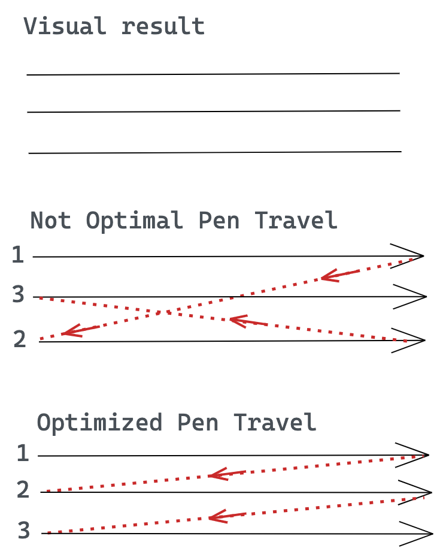
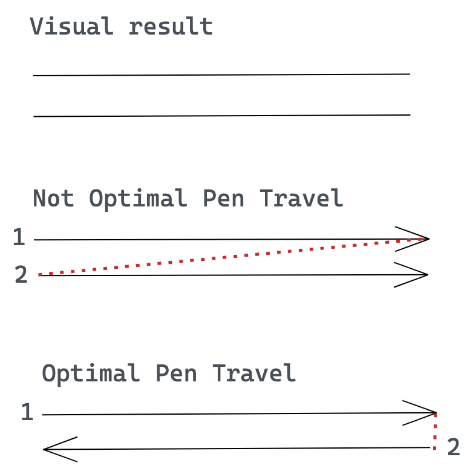
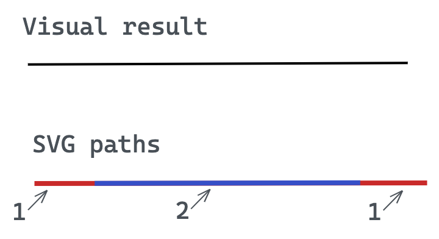
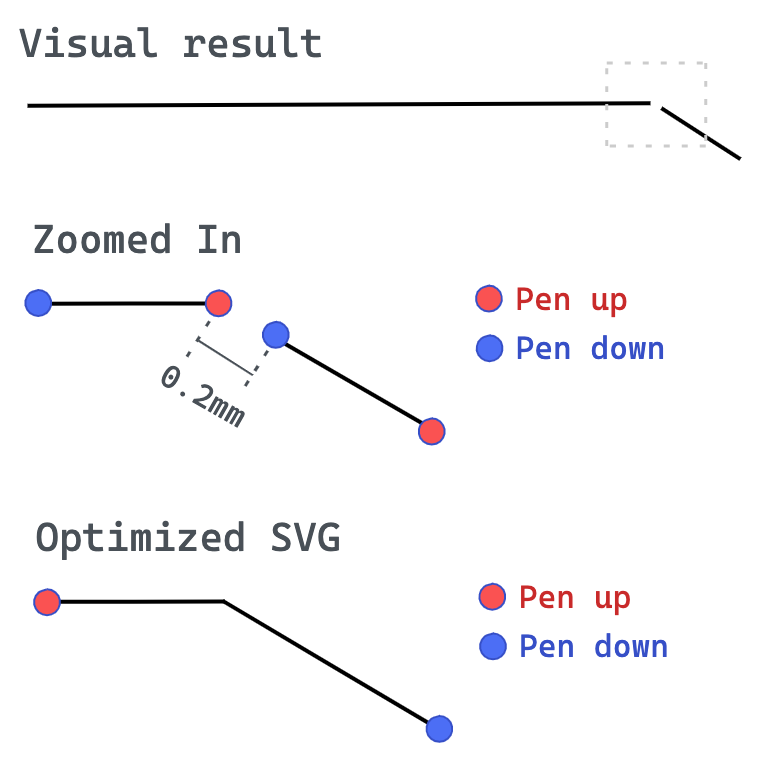
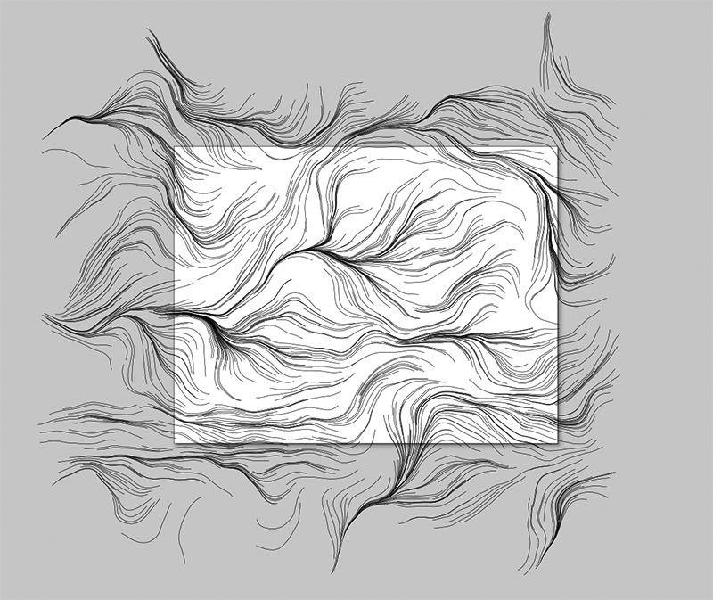
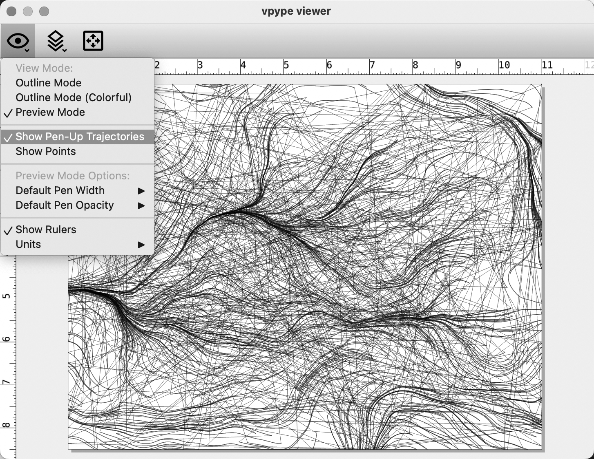
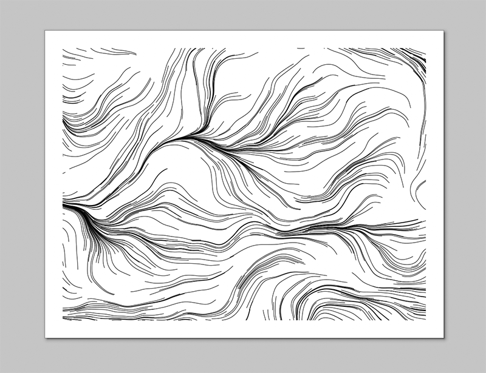
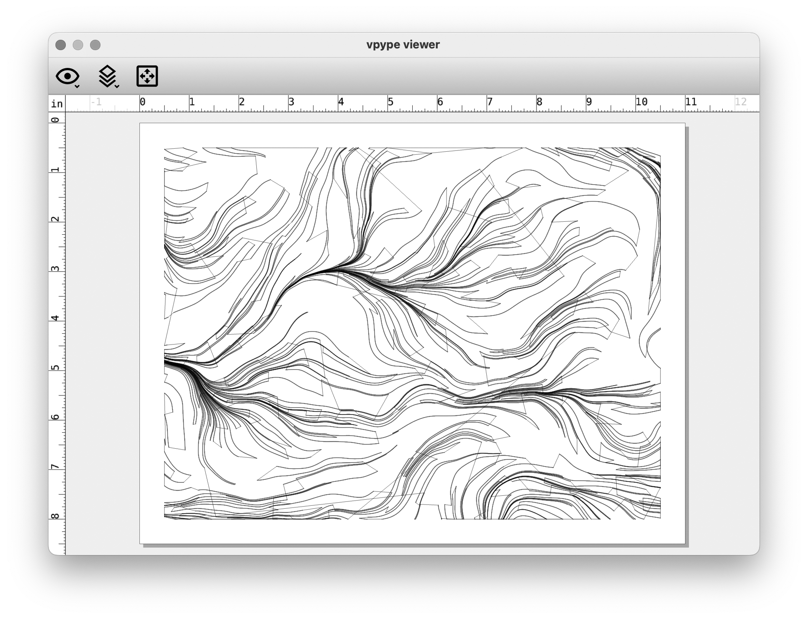

# Prepping SVGs for Plotting with *vpype*

***TL,DR*** *— here are some vpype commands I find handy:*

> *`vpype read inputfile.svg linesimplify linemerge linesort write outputfile.svg show`* 
> *`vpype read inputfile.svg linemerge --tolerance 0.1mm linesort crop 0.5in 0.5in 10.0in 7.5in write outputfile.svg`* 
> *`vpype read inputfile.svg reloop linesort --no-flip write --device hp7475a --page-size letter outputfile.hpgl`*

**Contents:** 

* [Why Optimize? Introducing *vpype*](#why-optimize-introducing-vpype)
* [1 - Install Python; create a virtual environment; install *vpype*](#1-install-python-create-a-virtual-environment-install-vpype)
* [2 - Use *vpype* to crop and optimize](#2-use-vpype-to-crop-and-optimize)
* [3 - *vpype* cheatsheet](#3-vpype-cheatsheet)

---

## Why Optimize? Introducing *vpype*

**SVG files often benefit from optimization prior to plotting.** [This article](https://plotterfiles.com/news/optimizing-files-for-plotting) by Maks Surguy offers a good explanation for why we need such optimization. As we can see in Surguy's illustrations below, optimization software (such as [vpype](https://vpype.readthedocs.io), [saxi](https://github.com/nornagon/saxi), and the 
[PlotterFiles SVG Optimizer](https://plotterfiles.com/tools/optimizer)) can significantly reduce plotting time by changing the *order* in which strokes are plotted; optionally changing the *direction* in which strokes are drawn; *merging* pen-up/pen-down actions when points are sufficiently close; and *eliminating* duplicate paths when they overlap:

<table>
<tr>
<td></td>
<td></td>
<td></td>
<td></td>
</tr>
</table>

[***vpype***](https://vpype.readthedocs.io/en/latest/) is a powerful tool for preparing and optimizing SVG files for plotters. It can do many different things, but we will use it most often for the following operations: 

* **Optimizing plots**. *vpype* uses a traveling-salesman algorithm to reorder the strokes in your design so that the machine doesn't have to move around as much. This saves wear-and-tear on the machine, and can also reduce your plot times from hours to minutes. Optimizing can also mean things like de-duplicating strokes, simplifying complex strokes, etc.
* **Cropping plots**. It's possible for SVG designs to have strokes that "go off the page" (for example, into negative coordinates). You can't ordinarily see these lines, but they're in the file. Plotters are dumb machines and can break when they try to move to these inaccessible locations. *vpype* can ensure that this data is eliminated.

Just so you know, *vpype* can do much more, including: 

* layout vector files with precise control of position & scale
* optimize existing SVG files for faster and cleaner plots;
* create HPGL output for vintage plotters;
* create generative artwork from scratch;
* create, modify and process multi-layer SVGs for multi-colour plots; etc.

---

## 1. Install Python; create a virtual environment; install *vpype*

In order to install *vpype*, it is first necessary to make sure your computer has an installation of the correct version of Python (*v3.10 for fall 2025*), and to create a virtual environment in which to execute the *vpype* commands. Doing Python coding in a virtual environment is **VERY STRONGLY RECOMMENDED.**  

Instructions for installing Python, creating a correctly-configured virtual environment, and installing *vpype* can be found [**here**](../python/README.md#1-creating-a-suitable-python310-virtual-environment):

* [**Creating a Suitable Python3.10 Virtual Environment**](../python/README.md#1-creating-a-suitable-python310-virtual-environment)

---

## 2. Use *vpype* to crop and optimize

Suppose you have generated an SVG. It is possible that your lines may go outside the bounds of the document's plottable region. It is also likely that your plot is not "optimized", so that strokes are badly ordered, or connecting line segments are not understood to be continuous. *vpype* can help. 

The workflow below assumes that the virtual environment has already been activated at the command line, i.e. `source myVypeEnvironment/bin/activate`. 

Here is an 11x8.5" SVG of a flow field, called [`inputfile.svg`](img/inputfile.svg), generated in Processing, and viewed in InkScape. As you can see, the strokes go outside of the document bounds. Our plotters cannot handle such points, and will grind their motors trying to reach them.

Using this Terminal command, we can verify and view the file with the *vpype* file viewer: `vpype read inputfile.svg show`. A command in its menu allows us to see the "pen-up trajectories", which clearly shows that the file is not optimized. 

We can use the following *vpype* command to crop the strokes to a specified rectangle: `vpype read inputfile.svg crop 0.5in 0.5in 10.0in 7.5in write outputfile.svg show`. Viewing the [`outputfile.svg`](img/outputfile.svg), we can see that the strokes have been cropped, with a half-inch margin all around: 

*vpype* allows commands to be "stacked" into a filtering pipeline. This command loads the original file; ensures that line segments with coincident endpoints are treated as polylines; optimally sorts the results; and crops the image as before: `vpype read inputfile.svg linemerge --tolerance 0.1mm linesort crop 0.5in 0.5in 10.0in 7.5in write outputfile.svg`

Examining the result in the *vpype* viewer, and displaying the pen trajectories, we can now see that the strokes are now well-ordered: 

---

## 3. *vpype* cheatsheet

Some common, ready-to-use formulas for *vpype* can be found [here](https://github.com/abey79/vpype?tab=readme-ov-file#examples). The main *vpype* documentation is [here](https://vpype.readthedocs.io/en/latest/index.html). 

* Unit constants `px`, `in`, `mm`, `cm`, `pt`, etc. Reminder: SVG pixel units are 1/96th of an inch.
* [crop](https://vpype.readthedocs.io/en/latest/reference.html#crop) Crop the geometries.
* [linemerge](https://vpype.readthedocs.io/en/latest/reference.html#cmd-linemerge): Merge lines whose endings and starts overlap or are very close.
* [linesimplify](https://vpype.readthedocs.io/en/latest/reference.html#linesimplify): Reduce the number of segments in the geometries.
* [linesort](https://vpype.readthedocs.io/en/latest/reference.html#linesort): Sort lines to minimize the pen-up travel distance.
* [multipass](https://vpype.readthedocs.io/en/latest/reference.html#multipass) Add multiple passes to each line.
* [pagerotate](https://vpype.readthedocs.io/en/latest/reference.html#pagerotate) Rotate the page by 90 degrees.
* [pagesize](https://vpype.readthedocs.io/en/latest/reference.html#pagesize) Change the current page size (does not affect the geometry). 
* [reloop](https://vpype.readthedocs.io/en/latest/reference.html#reloop) Randomize the seam location of closed paths.
* [reverse](https://vpype.readthedocs.io/en/latest/reference.html#reverse). Reverse the *order* of lines.
* [scale](https://vpype.readthedocs.io/en/latest/reference.html#scale) Scale the geometries by a factor.
* [show](https://vpype.readthedocs.io/en/latest/reference.html#show) Display the geometry in the *vpype* viewer.
* [text](https://vpype.readthedocs.io/en/latest/reference.html#text) Generate text using Hershey fonts.

