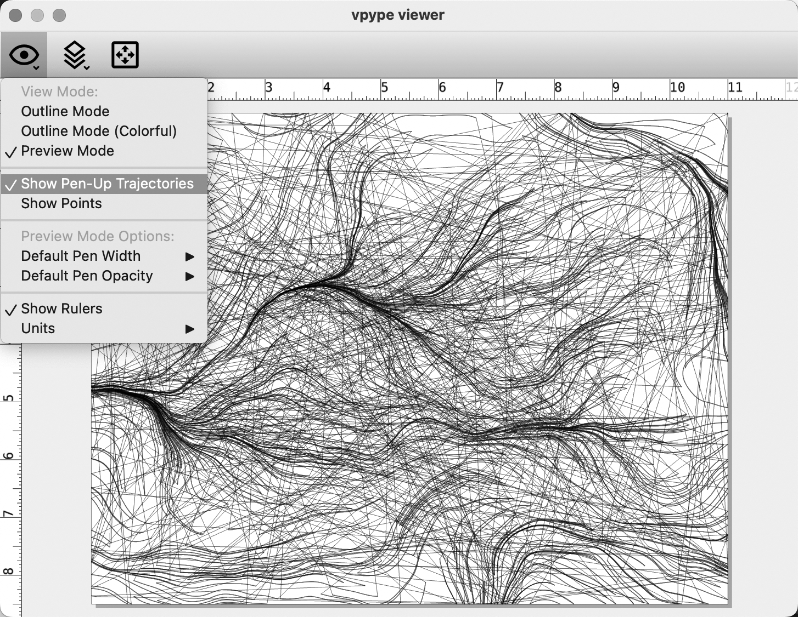

# Prepping SVGs for Plotting with *vpype*

*vpype* is a powerful tool for preparing and optimizing SVG files for plotters. It can do many different things, but we will use it most often for the following operations: 

* **Optimizing plots**. *vpype* uses a traveling-salesman algorithm to reorder the strokes in your design so that the machine doesn't have to move around as much. This saves wear-and-tear on the machine, and can also reduce your plot times from hours to minutes. Optimizing can also mean things like de-duplicating strokes, simplifying complex strokes, etc.
* **Cropping plots**. It's possible for SVG designs to have strokes that "go off the page" (for example, into negative coordinates). You can't ordinarily see these lines, but they're in the file. Plotters are dumb machines and can break when they try to move to these inaccessible locations. *vpype* can ensure that this data is eliminated.

Just so you know, *vpype* can do much more, including: 

* layout vector files with precise control of position & scale
* optimize existing SVG files for faster and cleaner plots;
* create HPGL output for vintage plotters;
* create generative artwork from scratch;
* create, modify and process multi-layer SVGs for multi-colour plots; etc.

**Summary of Instructions Below:** 

1. Install Python; create a virtual environment
2. Install MacPorts and *vpype*.
3. Use *vpype* to crop and optimize
4. *vpype* cheatsheet

---

## 1. Install Python; create a virtual environment.

*These instructions are for MacOS.*

1. Find out which version of Python you have installed. At the Terminal, type: `python3`. You may see a response like `Python 3.8.9 (default, May 17 2022, 12:55:41)`. As of January 2024, the recommended Python version is 3.10.2 or later, but *vpype* is also compatible with Python 3.8 and 3.9.
2. The preferred way to work with *vpype* is in a dedicated virtual environment running Python 3.10+. We will follow the vpype installation instructions for end-users, [here](https://vpype.readthedocs.io/en/latest/install.html), which are duplicated below. Make sure your computer has at least 1GB of available hard drive space for this virtual environment. 
3. In MacOS, you'll need to have the Homebrew package manager installed, if you don't already. You can achieve this with: `/bin/bash -c "$(curl -fsSL https://raw.githubusercontent.com/Homebrew/install/HEAD/install.sh)"`
4. Using your Mac's Terminal app, install Python 3.10 if it is not already installed: `brew install python@3.10`. 
5. You can now test that Python is installed correctly by typing `python3.10` at the Terminal. To quit, type `quit()`.
6. Change directory to the folder in which you'd like to create your virtual environment(s). In my case, that looks like: `cd /Users/golan/Documents/dev/python_virtual_environments`
7. Create a new virtual environment in that directory: `python3.10 -m venv myVypeEnvironment` . This will create a subdirectory (*myVypeEnvironment*) containing various files.

---

## 2. Install *vpype* via MacPorts and pipx

These instructions are adapted from [here](https://vpype.readthedocs.io/en/latest/install.html).

1. [MacPorts](https://www.macports.org/) is the recommended way to install the Python interpreter on macOS. Following the instructions from [here](https://guide.macports.org/chunked/installing.macports.html), download the latest package installer for MacPorts. For example, I have installed *MacPorts-2.8.1-14-Sonoma.pkg*.
2. To confirm the MacPorts installation is working as expected, now try using port in a ***new*** terminal window: `port version`.
3. Activate the newly created virtual environment: `source myVypeEnvironment/bin/activate`. (You can exit the virtual environment later by typing `deactivate`.)
4. We will now install *pipx*, a tool that allows you to install Python applications in isolated environments. It is the recommended way to install *vpype* on macOS. It can be installed with the following commands:`python3 -m pip install pipx` followed by `python3 -m pipx ensurepath`. You can then ensure that *pipx* is properly installed by running this command: `pipx --version`.
5. Once *pipx* is properly installed, you can install *vpype* with the following command: `pipx install "vpype[all]"`.
7. *vpype* should now be installed and ready to use. You may check that it is fully functional by checking its version: `vpype --version` (I get the result: `vpype 1.13.0`.) You can also check *vpype* by displaying some random lines: `vpype random show`.

---

## 3. Use *vpype* to crop and optimize

Suppose you have generated an SVG. It is possible that your lines may go outside the bounds of the document's plottable region. It is also likely that your plot is not "optimized", so that strokes are badly ordered, or connecting line segments are not understood to be continuous. *vpype* can help. 

The workflow below assumes that the virtual environment has already been activated at the command line, i.e. `source myVypeEnvironment/bin/activate`. 

Here is an 11x8.5" SVG of a flow field, called [`inputfile.svg`](inputfile.svg), generated in Processing, and viewed in InkScape. As you can see, the strokes go outside of the document bounds. Our plotters cannot handle such points, and will grind their motors trying to reach them.

Using this Terminal command, we can verify and view the file with the *vpype* file viewer: `vpype read inputfile.svg show`. A command in its menu allows us to see the "pen-up trajectories", which clearly shows that the file is not optimized. 

We can use the following *vpype* command to crop the strokes to a specified rectangle: `vpype read inputfile.svg crop 0.5in 0.5in 10.0in 7.5in write outputfile.svg show`. Viewing the `outputfile.svg`, we can see that the strokes have been cropped, with a half-inch margin all around: 

*vpype* allows commands to be "stacked" into a filtering pipeline. This command loads the original file; ensures that line segments with coincident endpoints are treated as polylines; optimally sorts the results; and crops the image as before: `vpype read inputfile.svg linemerge --tolerance 0.1mm linesort crop 0.5in 0.5in 10.0in 7.5in write outputfile.svg`

Examining the result in the *vpype* viewer, and displaying the pen trajectories, we can now see that the strokes are now well-ordered: 

---

## 4. *vpype* cheatsheet

Some common, ready-to-use formulas for *vpype* can be found [here](https://github.com/abey79/vpype?tab=readme-ov-file#examples). The main *vpype* documentation is [here](https://vpype.readthedocs.io/en/latest/index.html). 

* Unit constants `px`, `in`, `mm`, `cm`, `pt`, etc. Reminder: SVG pixel units are 1/96th of an inch.
* [crop](https://vpype.readthedocs.io/en/latest/reference.html#crop) Crop the geometries.
* [linemerge](https://vpype.readthedocs.io/en/latest/reference.html#cmd-linemerge): Merge lines whose endings and starts overlap or are very close.
* [linesimplify](https://vpype.readthedocs.io/en/latest/reference.html#linesimplify): Reduce the number of segments in the geometries.
* [linesort](https://vpype.readthedocs.io/en/latest/reference.html#linesort): Sort lines to minimize the pen-up travel distance.
* [multipass](https://vpype.readthedocs.io/en/latest/reference.html#multipass) Add multiple passes to each line.
* [pagerotate](https://vpype.readthedocs.io/en/latest/reference.html#pagerotate) Rotate the page by 90 degrees.
* [pagesize](https://vpype.readthedocs.io/en/latest/reference.html#pagesize) Change the current page size (does not affect the geometry). 
* [reloop](https://vpype.readthedocs.io/en/latest/reference.html#reloop) Randomize the seam location of closed paths.
* [reverse](https://vpype.readthedocs.io/en/latest/reference.html#reverse). Reverse the *order* of lines.
* [scale](https://vpype.readthedocs.io/en/latest/reference.html#scale) Scale the geometries by a factor.
* [show](https://vpype.readthedocs.io/en/latest/reference.html#show) Display the geometry in the *vpype* viewer.
* [text](https://vpype.readthedocs.io/en/latest/reference.html#text) Generate text using Hershey fonts.

