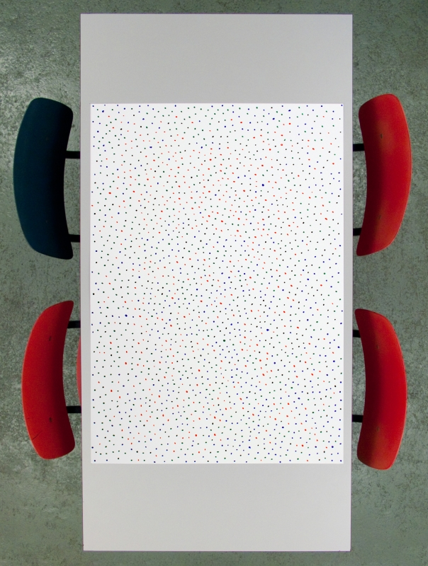

# Jan 18: Rule Based Art

---

## Agenda

* Proper Introductions; Roll Call
* Announcements: 
	* Change of final schedule
	* Distribution of keys
	* box trays
	* [Madeline Gannon talk](https://studioforcreativeinquiry.org/events/breathing-life-into-machines), 5pm Friday Feb 2 in the STUDIO (CFA-111)
* Exercises (below)
* Lectures (below)
	* Rule-Based Art, 1950s-1960s
	* Minimum Inventory, Maximum Diversity
* Announcement of Assignment 2: [*Rule-Based Art*](../../assignments/02_rule_based_art/README.md) (due Thursday January 25)

---

## Exercises: Rule-Based Art and Drawing Games

### Exercise 1: Sprouts

This is [Sprouts](https://en.wikipedia.org/wiki/Sprouts_(game)), a planar graph drawing game. It is demonstrated in [this video](https://www.youtube.com/watch?v=ZQY4v5GItes) and [this video](https://www.youtube.com/watch?v=bvDkMD6r7pY). It was invented by John Conway and Michael S. Paterson in the early 1960s.

The game is played by two players, starting with a few spots drawn on a sheet of paper. Players take turns, where each turn consists of drawing a line between two spots (or from a spot to itself) and adding a new spot somewhere along the line. The players are constrained by the following rules:

* The line may be straight or curved, but must not touch or cross itself or any other line.
* The new spot cannot be placed on top of one of the endpoints of the new line. Thus the new spot splits the line into two shorter lines.
* No spot may have more than three lines attached to it. For the purposes of this rule, a line from the spot to itself counts as two attached lines and new spots are counted as having two lines already attached to them.

In so-called *normal* play, the player who makes the last move wins. In *misère* play, the player who makes the last move loses. Misère Sprouts is perhaps the only misère combinatorial game that is played competitively in an organized forum.[3]

### Exercise 2: Blind Drawing

There are two drawings made by the Professor, [Drawing-X](img/drawing1.pdf) and [Drawing-Y](img/drawing2.pdf).

* Divide students into pairs. Call one person of each pair X, the other Y.
* X students get Drawing-X. Y students get Drawing-Y.
* Distribute blank paper and pens.
* Pairs sit back to back without looking at the other’s drawing
* X student describes their drawing to Y; Y tries to draw it from X's instructions. Switch at a reasonable time. Then Y student describes their drawing to X; X tries to draw it from Y's instructions.
* Pin up the drawings at the end. Group by X/Y. Discuss.

### Exercises 3a,3b,3c: Conditional Design

These exercises are by the [Conditional Design](http://conditionaldesign.org/) group.

#### The Beach

**Instructions:** 

* Arrange participants in groups of 3-5 persons per table. Distribute colored pens and a large sheet of paper to each group. 
* Each turn, find the most empty space on the paper and place a dot in the middle of it.

--

#### Knots

**First Step:** The first player draws a line. The other players draw a line that goes over and under the last drawn line.

**In Turns:** The player elongates his/her line on both ends. The elongations have to go over and under a line of another player and may not go over the line of the same color twice in a row. When a line can no longer be elongated, it is considered dead for the rest of the game. When both ends of a line have died, the player may place a new line.

--

#### Kaleidoscope

**Setup:** Each player has one color pen. The paper is divided into 4 imaginary segments, in which a player operates. Each turn a player is either leader or follower. The players decide which person may be the leader first.

**Play:** Clockwise in turns a player is the leader, for approx. 30 sec. The other 3 people are the followers. The leader draws freely in his segment using only straight lines. The followers must mirror the drawing of the leader, synchronously while he/she is drawing.

**End:** The ending of the game is decided by the player who proposed to play it.

### Exercise 4: Instructional Drawing in Reverse

*Exercise courtesy of Paolo Pedercini.*

Below are some screenshots of a well-known generative artwork from 2003. Analyze it and try to “reverse engineer” the algorithm that produces similar images (only the lines; colors are not important for this exercise). In your sketchbook or on your computer, describe the process using the minimum amount of clear, non ambiguous instructions. Discuss.

The work is "[Substrate](http://www.complexification.net/gallery/machines/substrate/)" by Jared Tarbell (2003). A working re-implementation by Tom White is [here](https://dribnet.github.io/substrate/).

---

## Lectures

* Lecture: [Rule-Based Art, 1950s-1960s](https://ems.andrew.cmu.edu/2013_60210a/lectures/lecture-01/index.html)
* Lecture: [Minimum Inventory, Maximum Diversity](https://ems.andrew.cmu.edu/2021s/60210a/deliverables/deliverables-01/absolute-drawings/index.html)

#### Side note: Lewitt's Instructional Work

* [*Melanie Nailed It*](https://ems.andrew.cmu.edu/2013_60210a/golan/09/02/melanie-nailed-it/index.html) (Lewitt's *Wall Drawing #231*)
* More examples:
	* [Lewitt Boston Museum wall drawing](img/lewitt-boston-wall-drawing.jpg)
	* [*The Location of a Circle*](img/lewitt_circle_cri_000000205810.jpg)
	* [*The Location of a Parallelogram*](img/lewitt_parallelogram_cri_000000205814.jpg)
	* [*The Location of a Rectangle*](img/lewitt_rectangle_cri_000000205208.jpg)
	* [*The Location of a Square*](img/lewitt_square_000000205812.jpg)
	* [*The Location of a Trapezoid*](img/lewitt_trapezoid_cri_000000205209.jpg)
	* [*The Location of a Triangle*](img/lewitt_triangle_cri_000000205813.jpg)

---

*For another time:*

* Lecture: [Drawing, Expanded by the Computer](https://github.com/golanlevin/lectures/tree/master/lecture_drawing)
