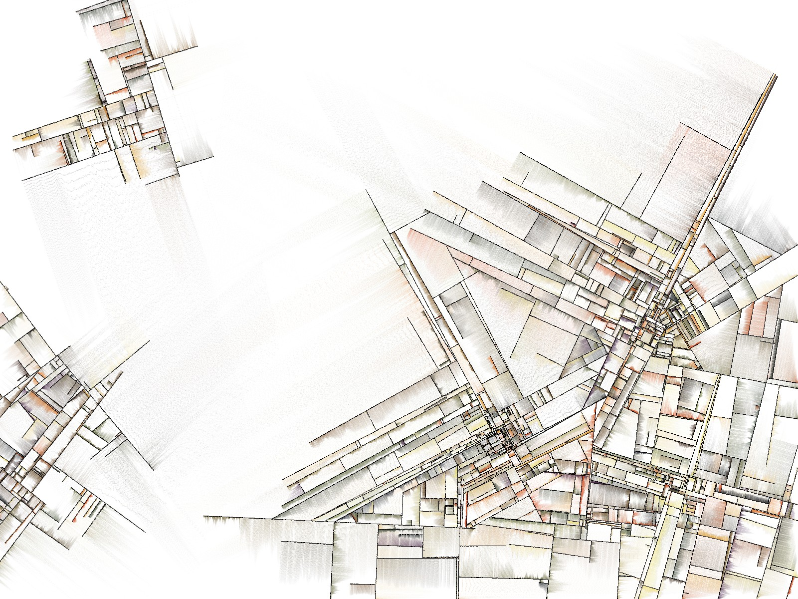
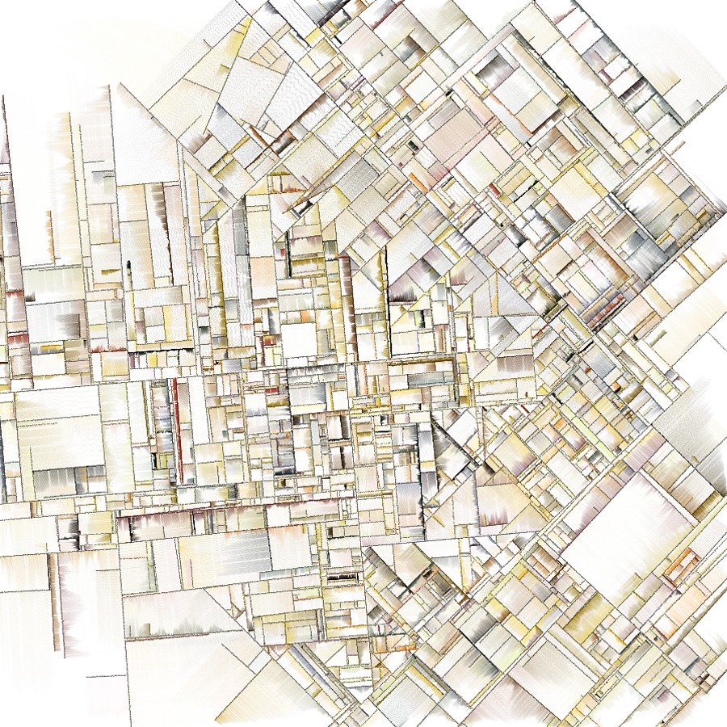

# Jan 23: Rule Based Art (II)

---

## Agenda

* Announcements: 
	* Reminder: [Madeline Gannon talk](https://studioforcreativeinquiry.org/events/breathing-life-into-machines), 5pm Friday Feb 2 in the STUDIO (CFA-111)
* Exercise: Reverse Instructional Drawing
* Lectures (below)
	* Historic Computer Art
	* A Line is a Dot that Went for a Walk
	* Drawing, Expanded by the Computer
* Work Session ([Assignment 2](../../../assignments/02_rule_based_art/README.md))
* Zoom visit from [Joshua Schachter](https://www.inverse.com/input/culture/tiktok-robotsdraw-joshua-schachter-art)

---

### Exercise: Instructional Drawing in Reverse

*Exercise courtesy of Paolo Pedercini.*

Below are some screenshots of a well-known generative artwork from 2003. Analyze it and try to “reverse engineer” the algorithm that produces similar images (only the lines; colors are not important for this exercise). In your sketchbook or on your computer, describe the process using the minimum amount of clear, non ambiguous instructions. Discuss.

The work is [*Substrate*](http://www.complexification.net/gallery/machines/substrate/) by Jared Tarbell (2003). A working re-implementation by Tom White is [here](https://dribnet.github.io/substrate/).

---

## Lectures

* Lecture(s): [Historic Computer Art; A Line is a Dot that Went for a Walk](https://courses.ideate.cmu.edu/60-428/f2021/daily-notes/09-01-lines-and-svgs/)
* Lecture: [Drawing, Expanded by the Computer](https://github.com/golanlevin/lectures/tree/master/lecture_drawing) 

