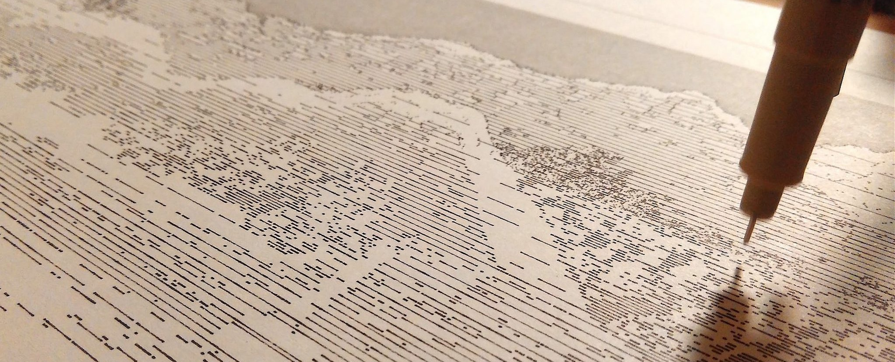
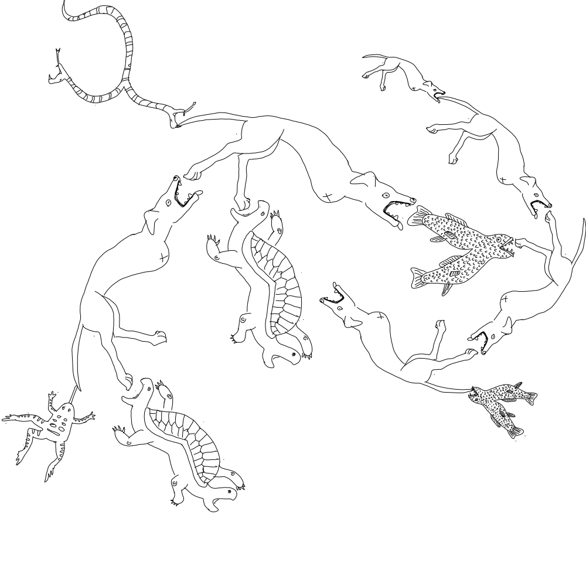

# Jan 25: Guests; Crit #2; Tooling

 *Generative landscape plot by Lingdong Huang (BCSA '20)*

## Agenda

#### Reminders

* [Madeline Gannon talk](https://studioforcreativeinquiry.org/events/breathing-life-into-machines), 5pm Friday Feb 2 in the STUDIO (CFA-111)
* Plotting times: [Draft when2meet poll, here](https://www.when2meet.com/?23333057-znyQ3). *(Actual times TBA!)*

#### Today's Material

* Guests from Spring 2021's *Drawing with Machines* class: [Benford Krummenacher](https://courses.ideate.cmu.edu/60-428/f2021/author/sweetcorn/), [Aren Davey](https://courses.ideate.cmu.edu/60-428/f2021/author/aahdee/), [Jean Cho](https://courses.ideate.cmu.edu/60-428/f2021/author/spingbing/), [Angie Bonilla](https://courses.ideate.cmu.edu/60-428/f2021/author/marimonda/)
* Discussion/Critique of [Assignment #2](../../../assignments/02_rule_based_art/README.md), "analog" rule-based art
* Presentation ("Tooling: Generating and Plotting SVGs"), below
* Pointer to [Assignment #3, *Introductory Tooling*](../../../assignments/03_introductory_tooling/README.md), due **Tuesday January 30**.

---

## Tooling: Generating and Plotting SVGs

* [What is an SVG?](https://github.com/golanlevin/DrawingWithMachines/blob/main/generating_svg/README.md#introduction-what-are-svg-files)
* Examination of an SVG made with Adobe Illustrator
* [Some Readymade SVG generators](https://github.com/golanlevin/DrawingWithMachines/blob/main/generating_svg/README.md#readymade-svg-generators), & don't forget [the list at DrawingBots.net](https://drawingbots.net/resources#5)
* Computationally generating an SVG with different creative coding toolkits
  * Generating an SVG with [Java, using Processing](https://github.com/golanlevin/DrawingWithMachines/blob/main/generating_svg/README.md#generating-svgs-with-java-processing)
  * Generating an SVG with [JavaScript, using p5.js](https://github.com/golanlevin/DrawingWithMachines/blob/main/generating_svg/README.md#generating-svgs-with-javascript-p5js) + the p5.js-svg library
  * Generating an SVG with [Python, using Processing **v.3.5.4**](https://github.com/golanlevin/DrawingWithMachines/blob/main/generating_svg/README.md#generating-svgs-with-python-processingpy-v354) (note version!)
  * *Forward pointer to [other Python tools](https://github.com/golanlevin/DrawingWithMachines/blob/main/generating_svg/README.md#generating-svgs-with-python-vsketch)*
* [Optimizing and preparing your SVG for plotting with vpype](https://github.com/golanlevin/DrawingWithMachines/blob/main/generating_svg/vpype_svg_prep/README.md)
* [Executing a plot on the AxiDraw](https://github.com/golanlevin/DrawingWithMachines/blob/main/rpi_standalone/README.md)
* Re-code of Vera Molnár's *Des(Ordres)* artwork (1970); [cheat sheet](https://courses.ideate.cmu.edu/60-428/f2021/daily-notes/09-01-lines-and-svgs/)

---

*Generative exquisite corpse by [Himalini Gururaj (BCSA '23)](https://courses.ideate.cmu.edu/60-428/f2021/miniverse/12/07/miniverse-finalprojectdocumentation/) and her [automated tiling tool](https://www.youtube.com/watch?v=-dChQ_zm3hE)*

