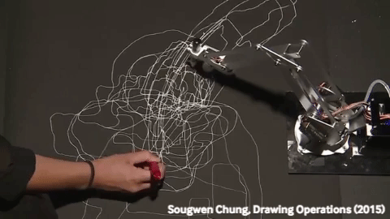
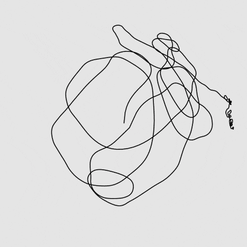

# Jan 30: A Breezy Review of Creative Coding

## Agenda

#### Reminders & Announcements

* Please complete this survey of general plotting times: [Draft when2meet poll, here](https://www.when2meet.com/?23333057-znyQ3).
* Our instructions for [Executing a plot on the AxiDraw](https://github.com/golanlevin/DrawingWithMachines/blob/main/rpi_standalone/README.md) have been updated :)
* Pointer to [Assignment #4, *Line*](../../../assignments/04_line/README.md), due **Tuesday February 6**.

#### Time Permitting

* [Joanie LeMercier's desert workflow](https://twitter.com/JoanieLemercier/status/996180699357958144) (& [more](https://twitter.com/JoanieLemercier/status/1391443586206535682))
* William Forsythe's *Improvisation Technologies* (1995): [*Point-Point-Line*](https://www.youtube.com/watch?v=6X29OjcBHG8), [*Line Extrusion*](https://www.youtube.com/watch?v=e_7ixi32lCo), [*Line Avoidance*](https://www.youtube.com/watch?v=cqGyFiEXXIQ), [*Dropping Curves*](https://www.youtube.com/watch?v=_zt95yXWLX4)
* [*The Dot and the Line*](https://vimeo.com/4929038) (1965, 10m)
* Re-code of Vera Molnár's *Des(Ordres)* artwork (1970); [cheat sheet](https://courses.ideate.cmu.edu/60-428/f2021/daily-notes/09-01-lines-and-svgs/)

---

## Lines of Risk vs. Lines of Certainty

In *Lines: a Brief History*,  Chapter 6, Tim Ingold writes:

> *In his book "The Nature and Art of Workmanship", theorist of design David Pye arrives at a […] distinction between what he calls the ‘workmanship of risk’ and the ‘workmanship of certainty’. In the workmanship of risk, the result is not pre-determined but ‘depends on the judgement, dexterity and care which the maker exercises as he works’ (Pye 1968: 4). Thus the quality of the outcome is never assured until the work is actually finished. In the workmanship of certainty, by contrast, the result is exactly pre-determined before the task is even begun. This determination is given in the settings and specifications of the apparatus of production, which in turn controls the movements of the working point. The workmanship of risk, Pye suggests, is exemplified by writing with a pen, and the workmanship of certainty by modern printing. In the workmanship of risk, however, practitioners are continually devising ways to limit risk through the use of jigs and templates, which introduce a degree of certainty into the proceedings. Thus ‘if you want to draw a straight line with your pen’, Pye advises, ‘you do not go at it freehand, but use a ruler, that is to say, a jig’.*

---

## Technical Lecture: Creative Coding Basics

Introducing Processing & p5.js:

* Development environments:
	* Processing sketchbook
	* Editor.p5js.org
	* VSCode with [p5.vscode](https://marketplace.visualstudio.com/items?itemName=samplavigne.p5-vscode)
* Getting help: 
	* [Processing reference](https://processing.org/reference)
	* [p5.js reference](https://p5js.org/reference/)
	* [Processing.py reference](https://py.processing.org/reference/)
	* [Coding Train](https://www.youtube.com/@TheCodingTrain/playlists)
* `setup()` and `draw()`
* The coordinate system (origin, ppi)
* Graphics primitives I: Lines, circles, rects, arcs, curves, quad, etc.
* Graphics primitives II: Polylines
* Iteration
* `random()` and `noise()`;
* `loop()` and `noLoop()`; export latch

## Taking a Line for A Walk

**Here are some helpful templates to get you started:**

* JavaScript (p5.js) [template for interactive SVG export](random_polyline_p5js.js) • [at the p5 Editor](https://editor.p5js.org/golan/sketches/hrxu2Bnly)
* Java (Processing) [template for interactive SVG export](random_polyline_processing.pde)
* Python (Processing.py, v.3.5.4) [template for interactive SVG export](random_polyline_py.pyde)
* [**Our main reference page for Generating SVGs**](https://github.com/golanlevin/DrawingWithMachines/blob/main/generating_svg/README.md)
* [Optimizing and preparing your SVG for plotting with vpype](https://github.com/golanlevin/DrawingWithMachines/blob/main/generating_svg/vpype_svg_prep/README.md)

 
[*The Professor's Attempt*](https://editor.p5js.org/golan/sketches/im4aJHJO_) (p5)

---
