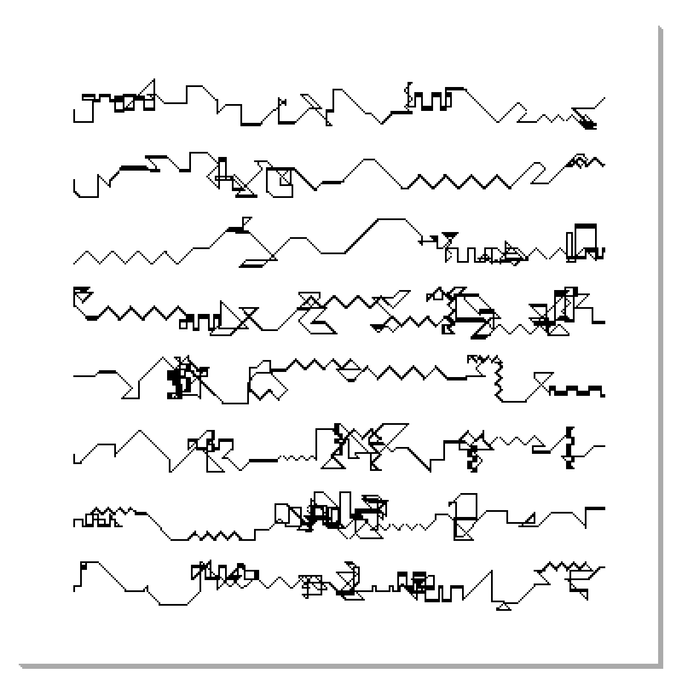
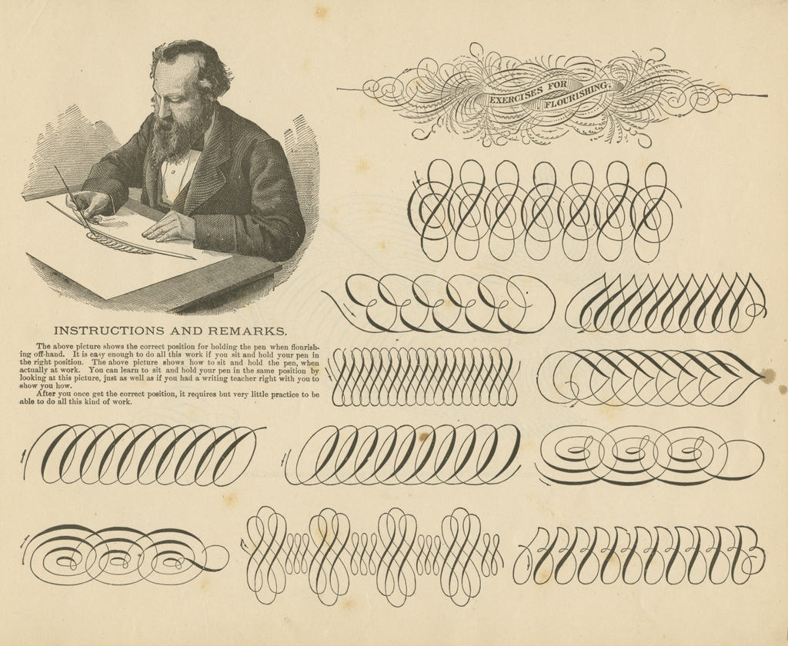
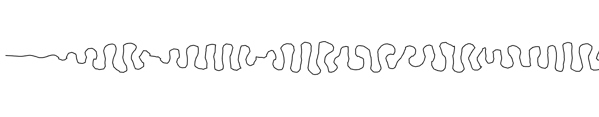
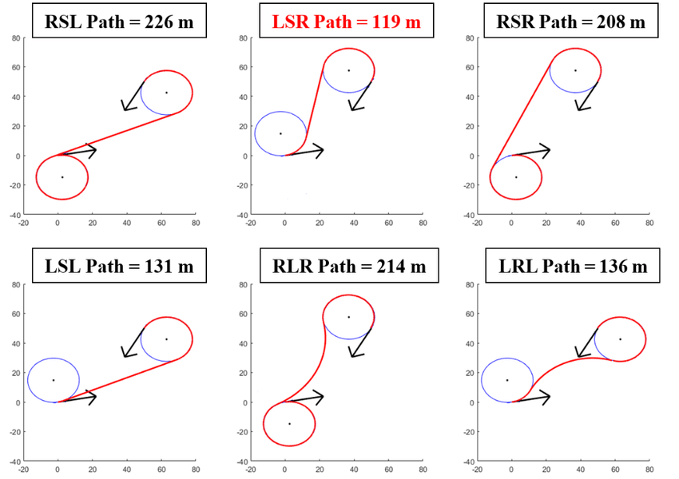
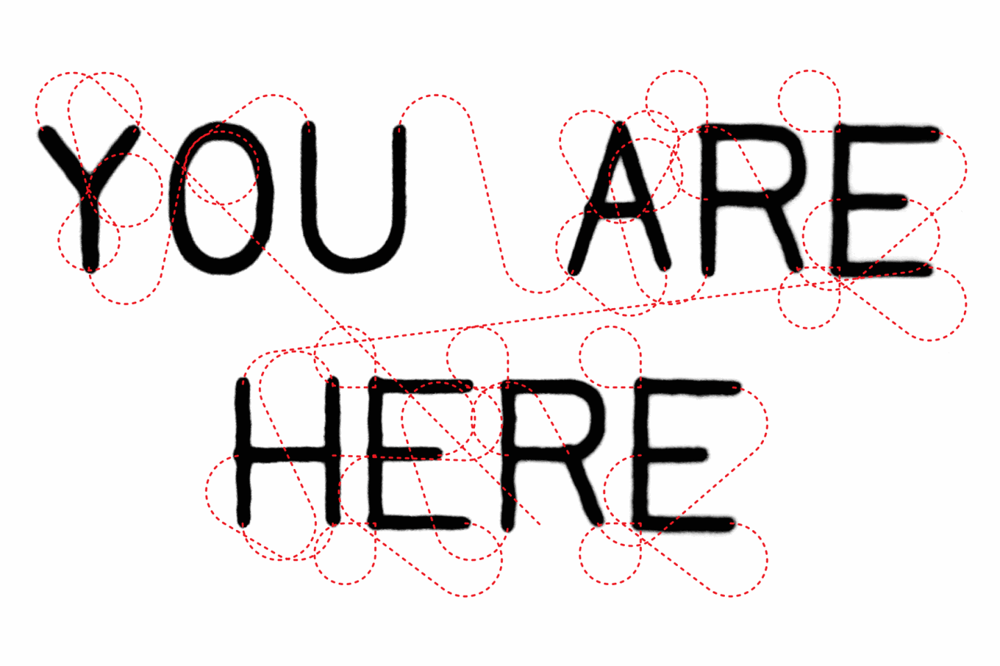

# Feb 01: Linewalking

## Agenda

#### Reminders & Announcements

* Please complete this survey of general plotting times: [Draft when2meet poll, here](https://www.when2meet.com/?23333057-znyQ3).
* Em Lugo has an **announcement about B★A**, "*a student-led and presented artist lecture series where undergraduate students in the College of Fine Arts can share their artistic work, interdisciplinary research, and experimental areas of interest with their peers.*"
* Lorie Chen has an **announcement about Lemon**, "*a student-run publication that aims to showcase student work ranging from fine arts, performance, music, design, architecture and literature.*"

#### Presentations

(

* Robot whisperer **Madeline Gannon** will chat about drawing with machines! (Madeline will also be giving a full presentation on [Friday evening (2/2, tomorrow) at 5pm at the STUDIO for Creative Inquiry](https://studioforcreativeinquiry.org/events/breathing-life-into-machines) (CFA-111)!
* Some Techniques for Walking a Dot (or Line), *below*.

#### Time Permitting

* William Forsythe's *Improvisation Technologies* (1995): [*Point-Point-Line*](https://www.youtube.com/watch?v=6X29OjcBHG8), [*Line Extrusion*](https://www.youtube.com/watch?v=e_7ixi32lCo), [*Line Avoidance*](https://www.youtube.com/watch?v=cqGyFiEXXIQ), [*Dropping Curves*](https://www.youtube.com/watch?v=_zt95yXWLX4)

---

## Strategies for Walking a Dot (or Line)

1. **Direct calculation**. Use an equation to determine the position of a point leaving a trace. For example: 
  * explicit curves: `y=f(x)`
  * polar curves: `r=f(θ)` [...and then convert: `x=r*cos(θ), y=r*sin(θ)`]
  * parametric curves: `y=f(t), x=g(t)`, etc.
  * Evolutes and involutes
2. **Differential curve plotting**. Trace the movement of a point as its position accumulates small stepwise differences. Those small differences could be computed in lots of (similar) ways: 
  * using "turtle graphics", in which an agent's bearing (speed and orientation) change over time: `x+=speed*cos(orientation), y+=speed*sin(orientation)`
  * from randomness (e.g. drunk walk): `x+=random(), y+=random()`.
  * using differential equations: `dy=f(t), dx=g(t); y+=dy, x+=dx`. 
  * using particle physics and/or flocking algorithms: in which a particle's position or bearing changes as a result of environmental "forces" (gravity, wind, flow fields, attraction to other agents or food sources, avoiding predators, etc.). See Braitenberg Vehicles, Craig Reynolds' Steering Behaviors, Boids-type Flocking, etc. 
3. **Whole-line transformations and/or physics**. Given a polyline, 
  * Signal processing and filtering (convolution): Smoothing & sharpening
  * Segmentwise substitution rules (space filling curves)
  * Filament simulations: Represent the line as a sequence of particles; affect all of the particles with forces. 
  * Differential growth: Filament simulation in which new particles can be "born" between older ones.
4. **Other**
  * Path planning
  * Fourier synthesis
  * ...

---

### Some Specific Techniques

#### Turtle Graphics.


#### Turtle Graphics: Greek Meander Designs

A meander or meandros, also called a Greek fret or Greek key, is a decorative border constructed from a continuous line, shaped into a repeated motif. Meanders are [common decorative elements in Greek and Roman art](https://blogmymaze.wordpress.com/2012/06/07/different-types-of-meanders-in-greek-art/), used as running ornaments. On one hand, the name “meander” recalls the twisting and turning path of the Maeander River in Asia Minor, and on the other hand, as Karl Kerenyi has pointed out, “the meander is the figure of a labyrinth in linear form”.


#### Writing-Like

#### Manfred Mohr, *P-021/B*, 1969



*P-021/A + B*, "band-structure", computer generated algorithmic plotter drawings, ink/paper, 1969, 50cm x 50cm

> *"The elements are horizontal, vertical, 45 degree lines, square waves, zig-zags, and have probabilities for line widths and lengths. The algorithm places elements in a horizontal direction and has a high probability to move from left to right and a limited probability to backtrack.
The original idea of this algorithm was to create a visual musical score which defies the progression in time by occasionally turning back on itself. Thus at the same time an abstract text is created."*

#### Vera Molnár, *Lettres de ma Mère* (1988)


Spencerian Flourishes (copperplate calligraphy) 

* [image](img/flourish-exercises-2.jpg)
* [image](img/flourish-exercises-3.jpg)
* [code example](https://editor.p5js.org/golan/sketches/_bBzlrd26)




#### Drunk Walk

```
// Dumb Perlin Drunk Walk
let px = 200; 
let py = 200;
function setup() {
  createCanvas(400, 400);
  background(220);
  fill(0);
}

function draw() {
  let qx = px + map(noise(12345+millis()/1000),0,1,-1,1);
  let qy = py + map(noise(34567+millis()/1000),0,1,-1,1);
  line(px,py,qx,qy); 
  px = qx; 
  py = qy;
}
```

#### Turtle Graphics with Recursion (Fractals)

The Koch Snowflake, Hilbert Curve, Minkowski Island, and other "[space-filling curves](https://teachout1.net/village/fill.html)", use *segment substitution rules*: each line segment is replaced by a more articulated polyline — whose line segments are then replaced, etc.


#### Signal Filtering

* Smoothing & sharpening ("convolution kernel filtering"). [Example](https://editor.p5js.org/golan/sketches/G-uT6taZ_)

#### Braitenberg Vehicles


#### Differential Growth



#### Double Pendulum

Double Pendulum (https://editor.p5js.org/codingtrain/sketches/jaH7XdzMK), tripolar (https://www.snibbe.com/art/tripolar)

;

#### Fourier Synthesis


* https://github.com/jasonwebb/morphogenesis-resources?tab=readme-ov-file#fourier-series
* https://www.youtube.com/watch?v=MY4luNgGfms

#### Dubins Path

Optimal path for robots/turtles with a fixed turning radius. 

* [Dubins Paths](https://en.wikipedia.org/wiki/Dubins_path)
* [Example app](https://editor.p5js.org/Codefish/sketches/mtTdme9-H)





---

#### Other

* Parametric equations (mathworld)
* Leaf venation, space colonization
* Crack formation 
* Path planning


---

<br />
[*The Professor's Attempt*](https://editor.p5js.org/golan/sketches/im4aJHJO_) (p5)


---
