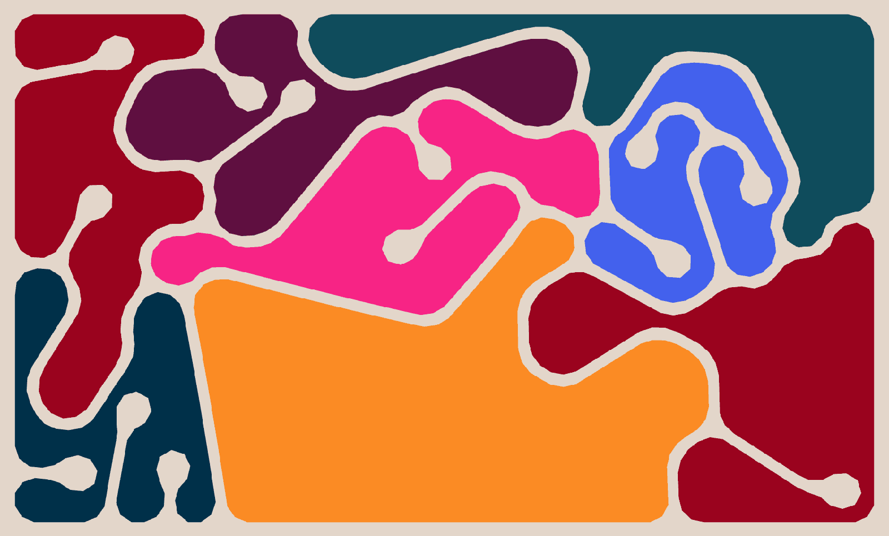
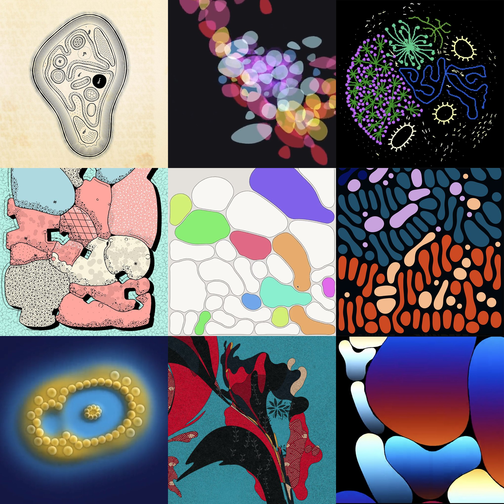

# February 12: Shape

---

## Agenda

* Raven Kwok 'hatching' project (2/10/2024)
	* [Dynamic version](https://twitter.com/RavenKwok/status/1756692564596650113) (one-line + hatching)
	* [Static version](https://twitter.com/RavenKwok/status/1756385615661478341)

---

## Shape

In Kimi Hanauer's *Blobwork: Vision of Contemporary Art Practice & Engagement*, the author "tentatively defines" a blob as "a form that is in constant change and interaction with its specific site, a structure that transforms and moves between disciplines and spaces, all the while interacting and reacting with its audience." She writes: 

> The blob is a system of ordering that, rather than containing its various components, flows through and between them as they expand and contract. It is order that occurs through interaction; an infestation that parasitically feeds from, and thus connects, the various parts within its system. Greg Lynn talks about the blob as an index of continuity and differentiation. The blob’s existence is based in its constant deconstruction of structure and the integration of change. The blob is infinite because its context and connections always have the potential for expansion. The blob is singular because it can be located within any one of its various constituent parts. The blob is a living organism that it is born, lives and eventually dies.

* THE BLOB IS RADICALLY OPEN
* THE BLOB IS DEMOCRATIC
* THE BLOB IS ALIVE

