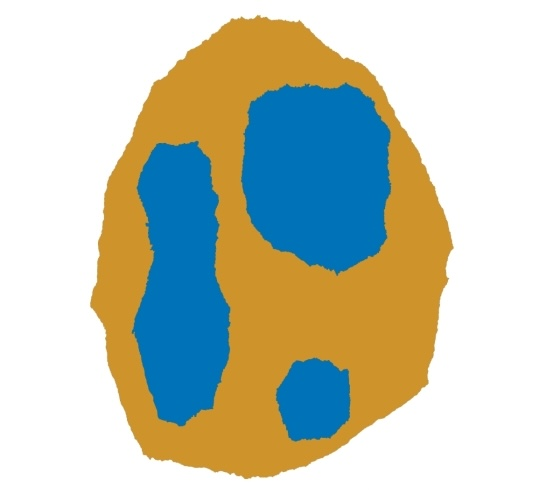
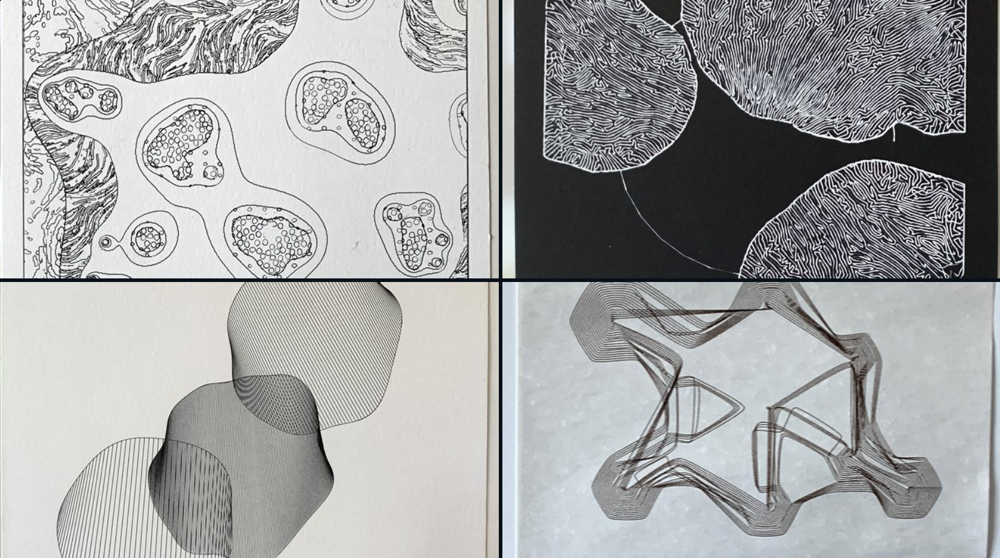
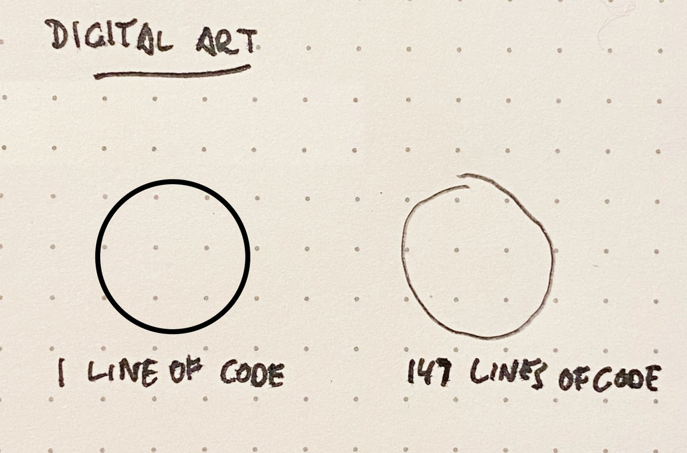

# February 15: Shape

---

## Agenda

* Leo Leonni, [*Little Blue and Little Yellow*](https://www.youtube.com/watch?v=91ZmDCXlxAA) (1959)

#### Material Conditions

* [Dragging a stylus through charcoal powder](https://www.instagram.com/reel/C1vGPXmPTNF/)
* [Rafael Lozano-Hemmer, *A Crack in the Hourglass*](https://www.youtube.com/watch?v=BsVsULhoSbM)
* [Dragging a paintbrush through piles of paint](https://www.instagram.com/reel/C3Go-jOPtdg/)
* [Black and white ink on gray paper](https://www.instagram.com/p/C1prz_6yWDD/)
* [DIY CMYK](https://www.instagram.com/p/C3QxL1iSyLo/)

#### *Blob Family* Projects by Previous Students

* [https://twitter.com/golan/status/1447980505236914179](https://twitter.com/golan/status/1447980505236914179)

#### Featured Artist: Julien Espagnon

* [Julien Espagnon @fxhash](https://www.fxhash.xyz/u/Julien%20Espagnon)
* [Julien Espagnon plotter works](https://www.julienespagnon.fr/art/plotter-artworks/)
* [current project](https://twitter.com/Julien_Espagnon/status/1758182192495132758)
* [process](https://twitter.com/Julien_Espagnon/status/1697564859775266821)
* [video](https://twitter.com/Julien_Espagnon/status/1729523421673890053), [video](https://twitter.com/Julien_Espagnon/status/1730543605226278965)

---

## Making Shapes

 *Cartoon by Dominikus Baur*

#### Generating Interesting Shapes

* [Demo: Truchet Blobs](https://editor.p5js.org/golan/sketches/OU4vaCEAA) (p5)
  * [Resource: Truchet Tiles](https://courses.ideate.cmu.edu/60-428/f2021/daily-notes/09-29-truchet/)
* [Demo: Closed Catmull-Rom Curve](https://editor.p5js.org/golan/sketches/IlEFXzOkF) (p5)
* [Demo: Radial Displacement by Looping Noise](https://editor.p5js.org/golan/sketches/Fv_U5kR6g) (p5)
  * [Video: Coding Challenge #36: *Blobby* (Radial Displacement by Looping Noise)](https://www.youtube.com/watch?v=rX5p-QRP6R4)
* [Demo: Spring Blob Mesh](https://editor.p5js.org/golan/sketches/tN09_szTo) (p5), full lecture notes [here](https://courses.ideate.cmu.edu/60-212/f2020/daily-notes/september/09-14-movement/springs/)
  * [Video: Spring Blob Mesh (Nokia Friends)](https://www.youtube.com/watch?v=g20QOQP6kSU)
* [Demo: Metaball Isoline Contour](https://editor.p5js.org/golan/sketches/1bmDXMSHX) (p5)
  * [Video: Coding Challenge: *Marching Squares*](https://www.youtube.com/watch?v=0ZONMNUKTfU&t=1444s)
  * [Video: Coding Challenge #26: *Metaballs*](https://www.youtube.com/watch?v=ccYLb7cLB1I)
* [Resource: Differential Growth](https://github.com/jasonwebb/morphogenesis-resources?tab=readme-ov-file#differential-growth)
* [Video: Viscous Fingering](https://vimeo.com/22212386) (Hele-Shaw Cells, Saffman-Taylor instability)

#### Hatching an Arbitrary Shape

* [Demo: Point-in-Polygon Rejection Sampling](https://editor.p5js.org/golan/sketches/wf8xsGn_-) (p5)
* [Demo: Axis-Aligned Shape Hatching](https://editor.p5js.org/golan/sketches/jiHPNbJOl) (p5)
* [Demo: Oriented Shape Hatching](https://editor.p5js.org/golan/sketches/kPj9pY-8l) (p5 & Processing)
* [Demo: Flood Fill](https://editor.p5js.org/StevesMakerspace/sketches/U7CPwxnVS) (p5)

#### Hatching via Poisson Disk Sampling

* [Video: Mike Bostock on Poisson Disc Sampling](https://vimeo.com/112319901)
* [Video: Coding Train's Poisson Disc Sampling](https://www.youtube.com/watch?v=flQgnCUxHlw)
* [Demo: Coding Train's Poisson Disc Sampling](https://editor.p5js.org/codingtrain/sketches/4N78DFCXN) (p5)
* [Demo: Point-in-Polygon Poisson Disc Sampling](https://editor.p5js.org/golan/sketches/R-oeb4gsj) (p5)

#### Some Other Hatching Possibilities

* [Resource: Diffusion-Limited Aggregation](https://github.com/jasonwebb/morphogenesis-resources?tab=readme-ov-file#diffusion-limited-aggregation-dla)
* [Resource: Space Colonization](https://github.com/jasonwebb/morphogenesis-resources?tab=readme-ov-file#space-colonization)
* [Video: Leaf Venation](https://vimeo.com/25604611)

---
