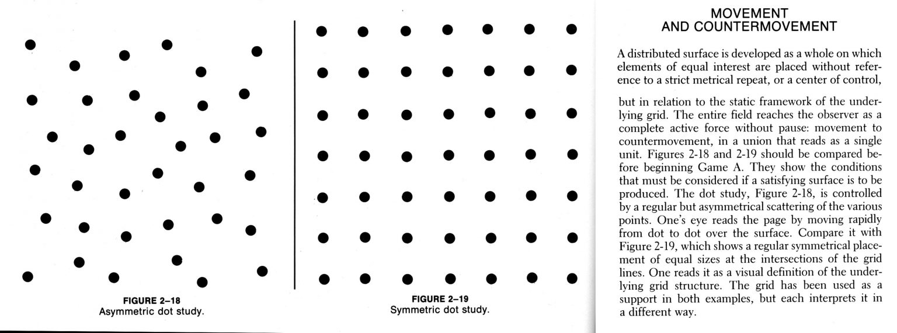
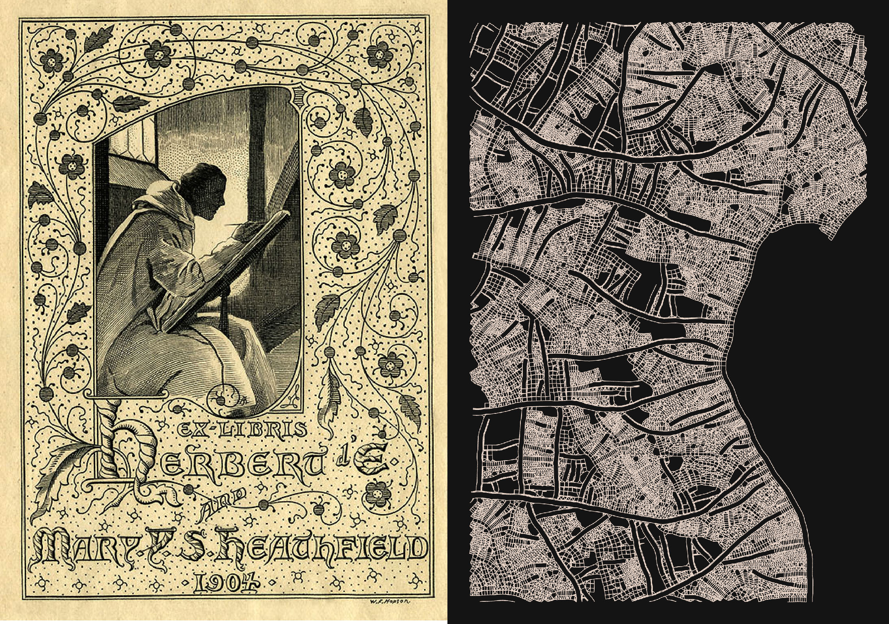
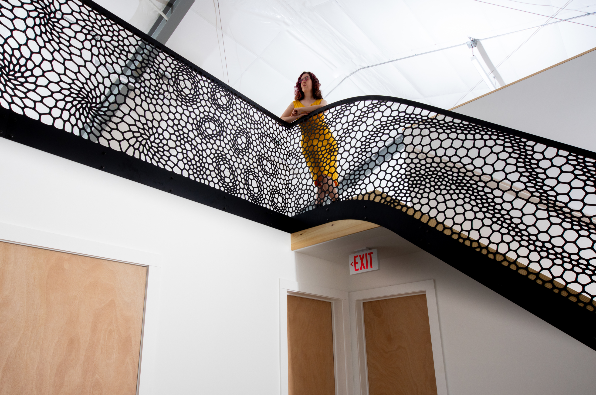
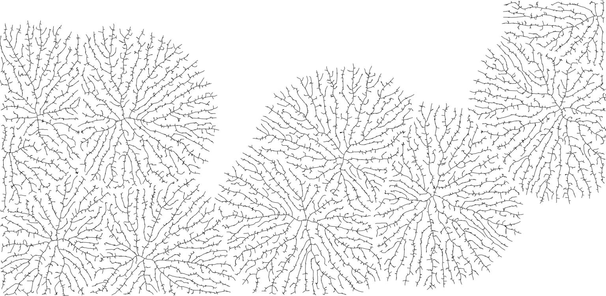
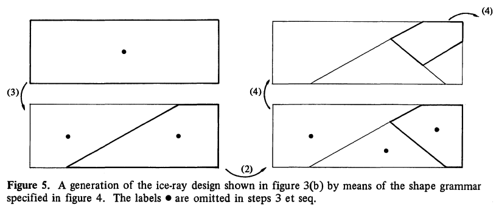
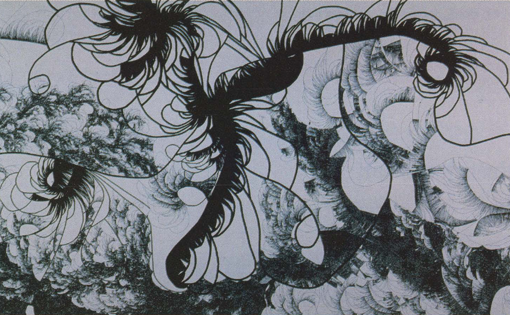
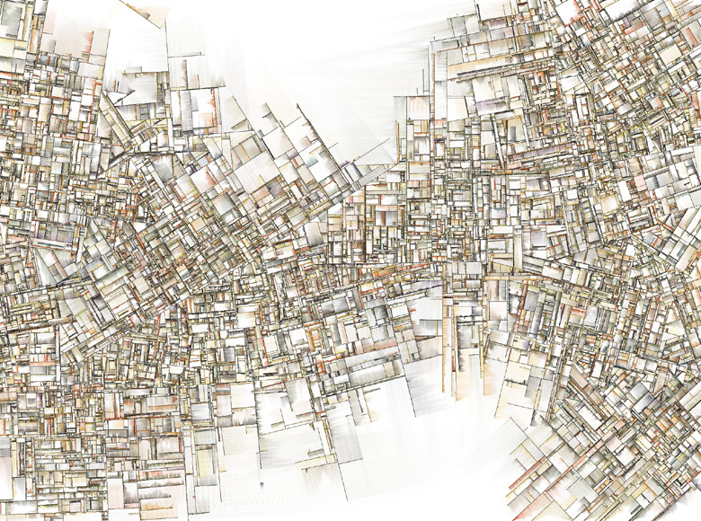
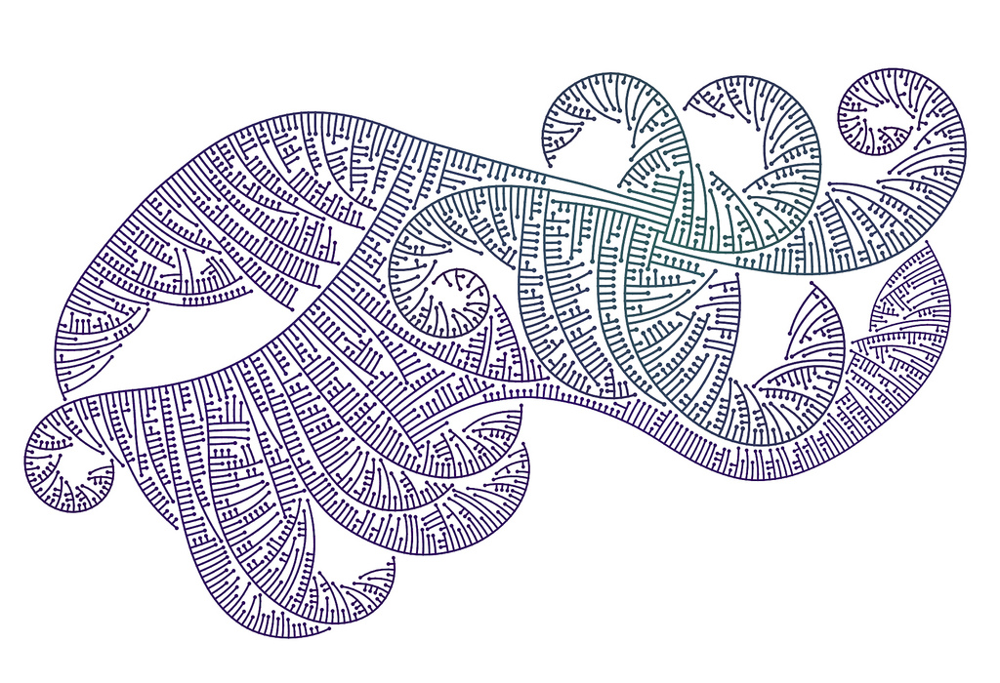
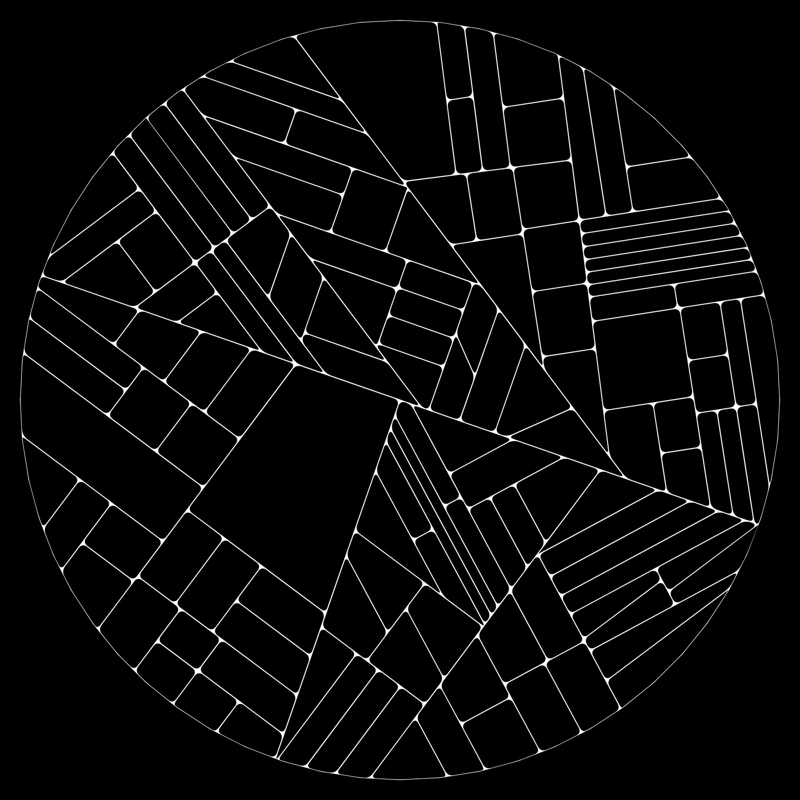

# February 20: Field

*How can we write software to fill a surface with an aesthetic, organic field?*

---

## Case Study: [Corollaria Railing](https://n-e-r-v-o-u-s.com/blog/?p=8753)

--- 

## Morphogenesis Resources

* [*Morphogenesis Resources*](https://github.com/jasonwebb/morphogenesis-resources) by Jason Webb
* [*That Creative Code Page*](https://thatcreativecode.page/) by Taru Muhonen & Raphaël de Courville
* [*Processing repository*](https://github.com/v3ga/Processing) by Julien Gachadoat (v3ga)
* [*Algorithmic Botany papers*](http://algorithmicbotany.org/papers/#webdocs) and [Visual Models of Morphogenesis](http://algorithmicbotany.org/vmm-deluxe/TableOfContents.html) by Przemyslaw Prusinkiewicz 

--- 
## Contents 

* [**Flow Fields**](../../topics/flow_fields/README.md)
* Shape Packing
* Diffusion Limited Aggregation
* Ice-Ray Grammars

---

## Ice-Ray Grammars

*A line propagates until it hits a line, while sometimes branching off new lines.*

 George Stiny, [*Ice Ray Grammars*](https://www.contrib.andrew.cmu.edu/~ramesh/teaching/course/48-747/subFrames/readings/Stiny-1977-EPB3_89-98.Ice-ray..pdf), 1977

 Mauro Annunziato, [*Chaos Revenge*](https://digitalartarchive.siggraph.org/artwork/mauro-annunziato-chaos-revenge/), 1999

 Jared Tarbell, [*Substrate*](), 2003; [2023 recode by Tom White](https://dribnet.github.io/substrate/).

 Mitchell Whitelaw, [*Limits to Growth*](https://mtchl.net/limits-to-growth/), 2008

 Mario Klingemann, [*Subdivision*](https://www.flickr.com/photos/quasimondo/albums/72157606163595189/), 2008

---

## Diffusion-Limited Aggregation

* https://twitter.com/0xelric_eth/status/1684045756863504384
* https://n-e-r-v-o-u-s.com/shop/generativeProduct.php?code=9
* [*A Two-Dimensional Growth Process*](img/eden_2d_growth_process_1961.pdf), Murray Eden, 1961 (PDF)
* http://algorithmicbotany.org/vmm-deluxe/Section-05.html
* [Coding Train](https://www.youtube.com/watch?v=Cl_Gjj80gPE)
* https://editor.p5js.org/codingtrain/sketches/XpS9wGkbB
* https://twitter.com/nacho_cossio/status/1372279259578953728
* https://twitter.com/DonKarlssonSan/status/649693928950775808
* https://twitter.com/colinreid_me/status/1680274061253853184
* https://twitter.com/Rainmaker1973/status/1551139590890733570
* https://paulbourke.net/fractals/dla/
* https://twitter.com/mikebrondbjerg/status/1359748990041010177
* https://www.youtube.com/watch?v=s3VsK8BtIw0

## Shape Packing

* [Coding Train: Animated Circle Packing](https://www.youtube.com/watch?v=QHEQuoIKgNE)
* [Codepen: Animated Circle Packing](https://codepen.io/DonKarlssonSan/pen/VwLxXYg)
* [Lars Wander Article: Polygon Packing](https://larswander.com/art/polygon-packing/)
* Amy Goodchild: [Maplands artwork](https://www.amygoodchild.com/art/maplands)
* Amy Goodchild: [Maplands article](https://www.amygoodchild.com/blog/maplands)
* Amy Goodchild: [*Cake Shaped* at fxhash](https://www.fxhash.xyz/generative/13069)
* Box2D/matter

---

[2021 Lecture](https://courses.ideate.cmu.edu/60-428/f2021/daily-notes/10-06-field-distribution/)

