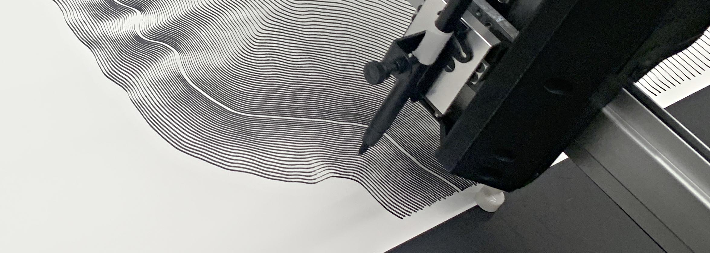
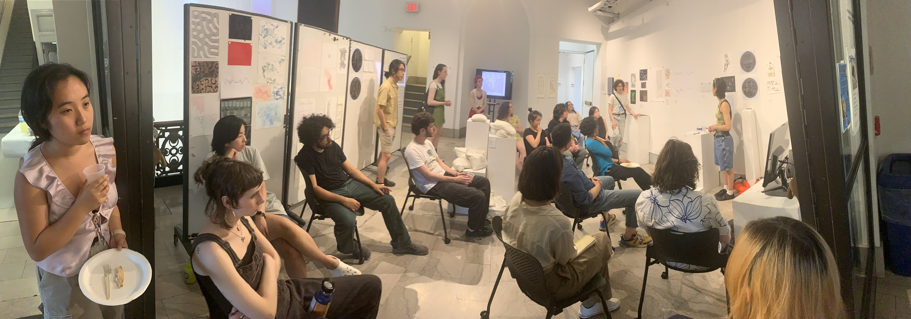
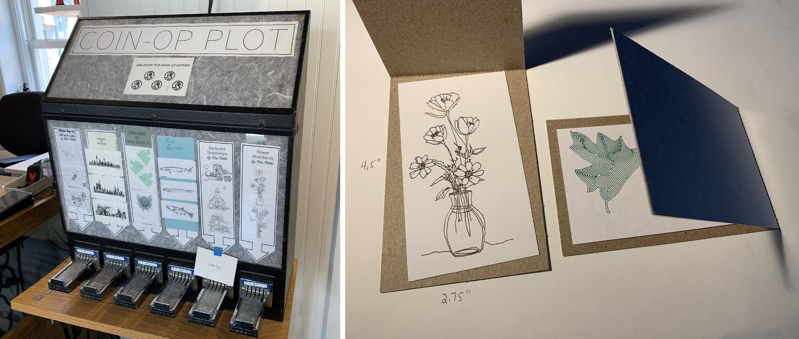
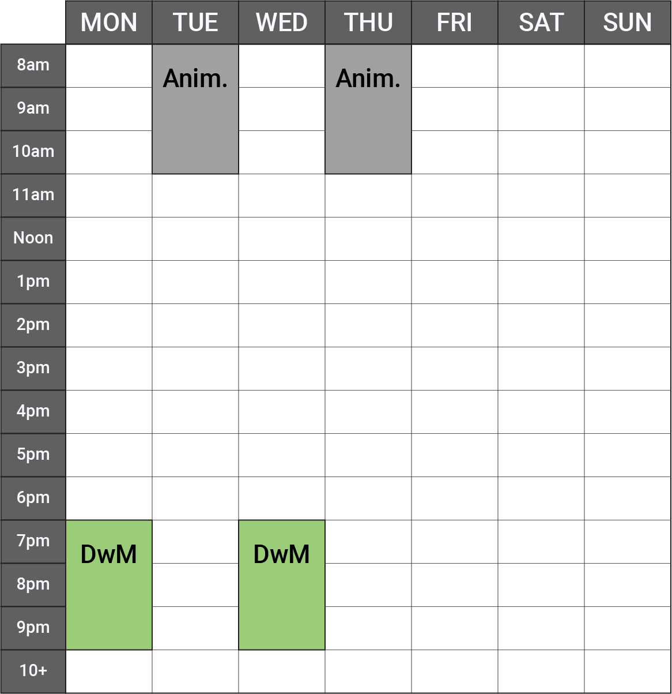
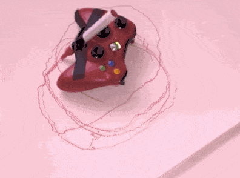

# August 25: Hello

---

## Agenda

**Welcome** to the Fall 2025 edition of **Drawing with Machines** (60-428/728)!

* Introductions
* Studio Knowledge, Machine Literacy, and Peer Support
* Overview of Information Resources & Workflows
* Overview of Semester Units & Assignments
* End-of-Semester Activities
* Welcome to our Machine Drawing Lab

**Kickoff: Loosening Up with DIY Drawing Machines**

* A Discussion about Machines and Drawings
* In-Class Viewings: Low-Tech Drawing Machines
* Assignment 1: Shitty Drawing Machine

---

## Welcome

### Studio Knowledge, Machine Literacy, and Peer Support

This semester, we’re lucky to have a few students who have taken this course before. They know the machines. They’ve debugged weird problems. They’ve survived SVGs.

**If you are a returning student:** *thank you* for being here again. (I've got some new machines and assignments to keep things fresh for you.) You’re part of what will make this studio robust, responsive, and delightful. Your expertise helps lift everyone up. I want to acknowledge that experience — and also gently deputize you. I’m not asking you to be full-on TAs, but I am asking you to share what you know and help others get unstuck. 

This is a rhizomatic studio: learning flows sideways. I am not the center of knowledge. You’ll all be asking each other for help, and hopefully giving help too. And when someone helps you: Give them credit in your project report. We build community that way.

### Overview of Information Resources & Workflows

This semester, my primary vehicle for delivering information **to you** will be this [**Drawing with Machines GitHub**](https://github.com/golanlevin/DrawingWithMachines/tree/main). Here you will be able to find my [Lectures](../), [Assignments](../../../assignments/2025/README.md), [Machinery Instructions](../../../machines/README.md), and much more.

This semester, you will have three main channels for **sharing and documenting** your work:

  1. Our private **Discord** server, where you will post writeups about your work. You can also use this Discord to ask for help, coordinate with each other, and offer comments, encouragement, and feedback to your peers. *Check your email for the invite link*. 
  2. My own **Google Forms**, such as [this one](https://docs.google.com/forms/d/e/1FAIpQLScPxj3o4SNXomiYu4vGqDObooXI_7j4vK2sFzYPpyAIJK6-jQ/viewform?usp=header), which I will use to collect, archive, and automatically organize high-quality documentation of your work.
  3. Our public-facing [**course Instagram**](https://www.instagram.com/drawingwithmachines/), a collectively-managed space for our class to document and share our work, process, and experiments. In order for us to share this account, I have developed some [**Policies**](https://github.com/golanlevin/DrawingWithMachines/blob/main/syllabus/instagram_policies.md). Your participation in this Instagram is encouraged but optional.

---

### Overview of Semester Units & Assignments

This semester, there will be [**10 sets of Assignments**](../../../assignments/2025/README.md). These include: 

* 7 *weekly assignments* prior to the mid-semester break;
* a 2-week *Experiment*, with a proposal stage; 
* a 4-week *Investigation*, with proposal and check-in stages; 
* and a culminatory *Portfolio Review* during Finals Week. 

The themes of the units/assignments will be:

1. Drawing Machine `8/27`
2. Getting Started `9/3`
3. Line `9/10`
4. Tone `9/17`
5. Pattern/Modularity `9/24`
6. Field/Distribution `10/1` 
7. Materiality `10/8`
8. Self-Directed Experiment `11/3`
9. Self-Directed Investigation `12/3`
10. Portfolio Review `12/TBA`

---

### End-of-Semester Activities

* Portfolio Review during Final Exam week
* CFA Hallway Exhibition (December 8-12, 3rd Floor South Foyer)
* Class exhibition at the Bantam [Machine Art Gallery](https://bantamtools.com/pages/gallery), January 2026, Peekskill NY
* Card Exchange & Coin-Op Vending Machines

---

### Welcome to our Machine Drawing Lab

This semester we will share our space with Prof. Johannes DeYoung's *Stop Frame Animation* course, which meets on Tuesday/Thursday mornings from 8-11am. Other than these morning sessions, and unless otherwise notified, this room is entirely available for you to work in. 

Here is a set of [**Policies and Guidelines for Our Studio Classroom**](../../../syllabus/room_policies.md).

On Wednesday we'll discuss the machines in the room in great detail. But for the record, this semester we will use or have access to: 

* *(multiple)* [AxiDraw](https://github.com/golanlevin/DrawingWithMachines/tree/main/machines#axidraw), [HP7475A](https://github.com/golanlevin/DrawingWithMachines/blob/main/machines/hp7475a/README.md), and [Line-Us](https://github.com/golanlevin/DrawingWithMachines/blob/main/machines/line-us/README.md) plotters, as well as
* *(singular)* [Bantam Tools Artframe 1824](https://bantamtools.com/products/bantam-tools-artframe-1824), [HP DraftMaster II](https://github.com/golanlevin/DrawingWithMachines/blob/main/machines/hp_draftmaster/README.md), [USCutter MH871-MK2](https://github.com/golanlevin/DrawingWithMachines/blob/main/machines/uscutter-mh871-mk2/README.md), [Rotrics DexArm](https://github.com/CreativeInquiry/Rotrics_control), [Silhouette Portrait 4](https://github.com/fablabnbg/inkscape-silhouette)
* *(elsewhere at CMU)* laser cutters, computer-controlled embroidery machines, UR5 robot arm, etc.

---

## Unit 1: Loosening Up with DIY Drawing Machines

*In which we allow ourselves to make shitty machines and even shittier drawings.* 

### A Discussion about Machines and Drawings

What is a *drawing*? List some common assumptions.

* A drawing is made *on paper*...
* A drawing is a picture *of* something.

What is a *machine*? List some common assumptions.

* A machine is *electric*.
* A machine is *not a living thing*...

What is a *drawing tool*? List some common assumptions. 

* A drawing tool is held in your *hand*.
* A drawing tool is only used by *one person at a time*...
* How much does it affect your thinking if we say drawing *tool*, *toy*, *machine*, *apparatus*...?

**Show**: Ruler, stencil, spirograph, pantograph, doodletop...

---

### In-Class Viewings: No-Tech Drawing Machines

We will spend plenty of time thinking about drawing machines that use computers, but let's begin with an appreciation of the poetics of those that don't. From this [list of links](../../../assignments/2024/01_diy_drawing_machine/list.md), we will view in class (time permitting):

* Jean Tinguely [*Metamatics*](https://www.youtube.com/watch?v=VxoqVvQeil0), 1959
* Rebecca Horn, [*Pencil Mask*](https://www.youtube.com/watch?v=Eh9JH7daSbg), 1972
* Karina Smigla-Bobinski, [*ADA*](https://www.youtube.com/watch?v=RPwpC82li2Q), 2017
* Iepe Rubingh, [*Painting Reality*](https://www.youtube.com/watch?v=N1AHBZybjW4), 2010
* Sam van Doorn, [*STYN* (Machine that Records Pinball)](https://www.thisiscolossal.com/2012/11/a-drawing-machine-that-records-the-chaos-of-pinball/)
* Laura Millard, [*Crossing*](https://lauramillard.com/2019/01/01/crossing/), 2019
* Tim Knowles, [*Tree Drawings*](https://www.cabinetmagazine.org/issues/28/knowles.php), 2005
* Meaghan Kombol, [*Subway Lines*](../../../assignments/2024/01_diy_drawing_machine/img/meaghan_kombol_subway_lines.jpg), 2007
* Kiki van Caspel, [*Drawing Machine for Two*](https://vimeo.com/18362446), 2011

---

### Introducing Assignment 1: Shitty Drawing Machine

 *Alban Voss, [Xbox Rumble Drawing Machine](https://vimeo.com/16728393), 2010*

* Overview of [**Assignment 1: Drawing Machine**](../../../assignments/2025/01_drawing_machine/README.md) (due Wednesday 8/27)
* Distribution of **student kits**

---
EOF

