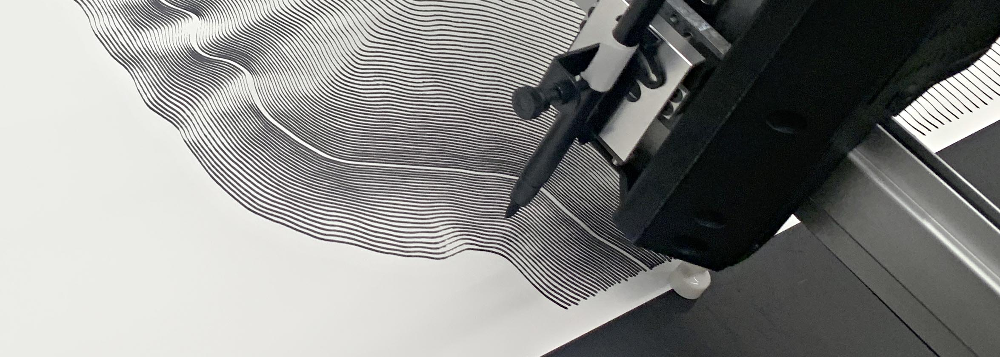
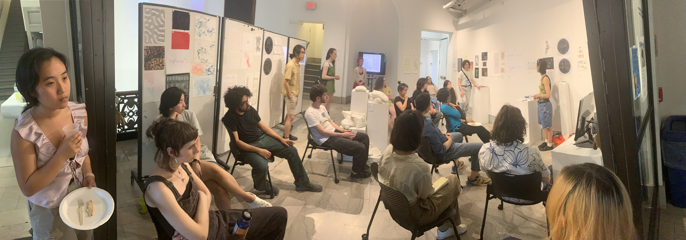
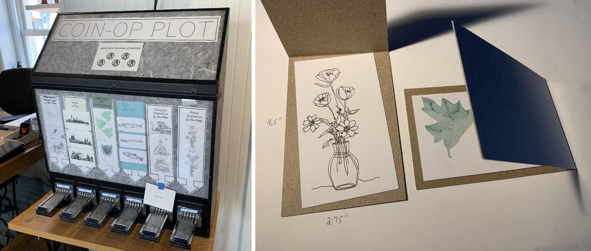
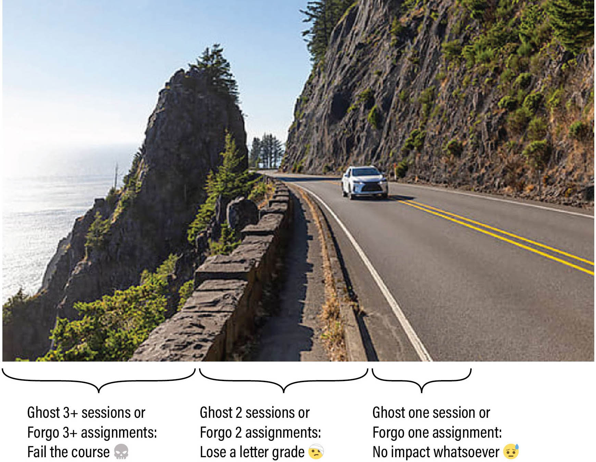
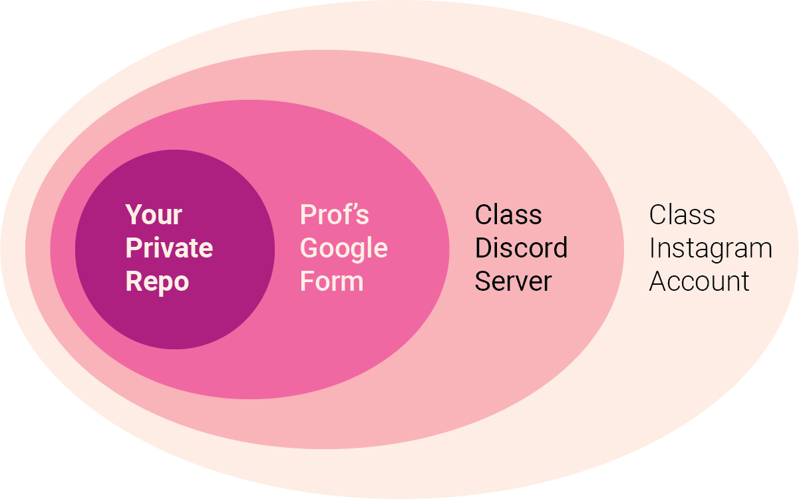
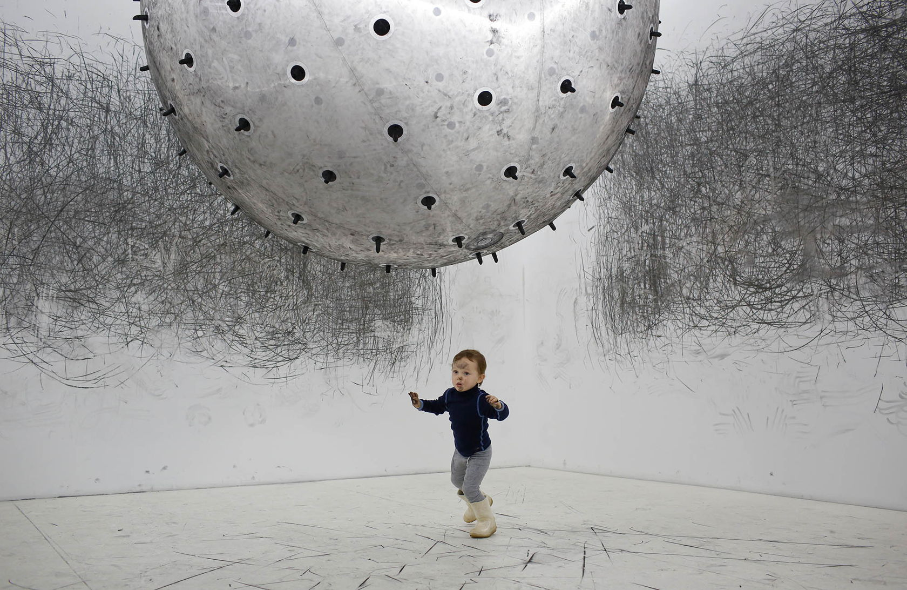
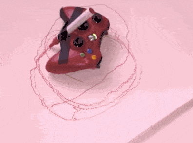

# August 25: Hello

---

## Agenda

**Welcome** to the Fall 2025 edition of **Drawing with Machines** (60-428/728)!

* [Introductions](#introductions)
* [What is this class?](#what-is-this-class)
* [Studio Knowledge, Machine Literacy, and Peer Support](#studio-knowledge-machine-literacy-and-peer-support)
* [Overview of Semester Units & Assignments](#overview-of-semester-units--assignments)
* [End-of-Semester Activities](#end-of-semester-activities)
* [Overview of Information Resources & Workflows](#overview-of-semester-units--assignments)
* [Welcome to our Machine Drawing Lab](#welcome-to-our-machine-drawing-lab)

**[Kickoff: Loosening Up with Low-Tech Drawing Machines](#unit-1-loosening-up-with-low-tech-drawing-machines)**

* [A Discussion about Machines and Drawing](#a-discussion-about-machines-and-drawing)
* [In-Class Viewings: Low-Tech Drawing Machines](#in-class-viewings-low-tech-drawing-machines)
* [Introducing Assignment 1: Shitty Drawing Machine](#introducing-assignment-1-%EF%B8%8F-shitty-drawing-machine)

---

## Welcome

### Introductions

Hello! Who's here?

### What is this class?

*(What do* ***you*** *think this course is about?)*

> This is an advanced studio course in experimental drawing and generative art. Working at the boundaries of creative code, automation, physical materials, and gestural mark-making, we will explore the use of algorithms and machine collaborators as nontraditional intermediaries between mind, hand, paper, and mark.

*In this course, we will use our brains to control machines to do new things with art supplies.*

### Studio Knowledge, Machine Literacy, and Peer Support

This semester, we’re lucky to have a few students who have taken this course before. They know the machines, they’ve survived SVGs.

**If you are a returning student:** *thank you* for being here again. (We've got some new machines and assignments to keep things fresh for you.) You’re part of what will make this studio robust, responsive, and delightful. Your expertise helps lift everyone up. I want to acknowledge that experience — and also gently deputize you. I’m not asking you to be full-on TAs, but I am asking you to share what you know and help others get unstuck. 

This is a rhizomatic studio: learning flows sideways. I am not the center of knowledge. You’ll all be asking each other for help, and hopefully giving help too. And when someone helps you: Give them credit in your project report. We build community that way.

---

### Overview of Semester Units & Assignments

This semester, there will be [**10 sets of Assignments**](../../../assignments/2025/README.md). These include: 

* 7 *weekly assignments* prior to the mid-semester break;
* a 2-week *Experiment*, with a proposal stage; 
* a 4-week *Investigation*, with proposal and check-in stages; 
* and a culminatory *Portfolio Review* during Finals Week. 

The themes of the units/assignments will be:

1. Drawing Machine `8/27`
2. Getting Started `9/3`
3. Line `9/10`
4. Tone `9/17`
5. Pattern/Modularity `9/24`
6. Field/Distribution `10/1` 
7. Materiality `10/8`
8. Self-Directed Experiment `11/3`
9. Self-Directed Investigation `12/3`
10. Portfolio Review `12/TBA`

---

### End-of-Semester Activities

* Portfolio Review during Final Exam week
* CFA Hallway Exhibition (December 8-12, 3rd Floor South Foyer)
* Class exhibition at the Bantam [Machine Art Gallery](https://bantamtools.com/pages/gallery), January 2026, Peekskill NY
* [Card Exchange](https://github.com/golanlevin/DrawingWithMachines/blob/main/documentation/2024/README.md#postcard-exchange) & Coin-Op Vending Machines

---

### The Syllabus TLDR

Your grade in this course is straightforwardly calculated based on your professionalism in completing work and attending class, subject to the policies summarized here. 

* There will be 10 sets of assignments this semester. Each set of assignments has a clearly defined checklist of subtasks, whose purpose is to help you develop discipline in creating and documenting your work. Your grade is based on your fulfillment of these checklists. A set of assignments is "forgone" if it is more than one week late, or if it is less than 15% completed.
* If I am unable to come to class, I will send a message so that you can plan accordingly. I respectfully ask the exact same courtesy of you. Attendance is important, but if you need to miss class — which can happen, within reason — you are expected to be responsible about communicating with me about your attendance. An *excused* absence is one about which you have communicated with me in a timely, professional, and responsible manner; by contrast, "*ghosting*" refers specifically to "No-call, No-show" attendance events. 

---

### Overview of Information Resources & Workflows

This semester, my primary vehicle for delivering information **to you** will be this [**Drawing with Machines GitHub**](https://github.com/golanlevin/DrawingWithMachines/tree/main). Here you will be able to find my [Lectures](../), [Assignments](../../../assignments/2025/README.md), [Machinery Instructions](../../../machines/README.md), and much more.

This semester, you will have four main channels for **sharing, documenting, and archiving** your work. They exist along a *gradient of public visibility*:

1. For your own sanity, you are *strongly encouraged* to maintain some sort of personal online repository to archive your code, working files, writeups, and process documentation. This is entirely up to you; I recommend using **GitHub**, but Google Drive or Box could also work.
2. For each assignment, I will ask you to upload your documentation to one of my own **Google Forms**, such as [this one](https://docs.google.com/forms/d/e/1FAIpQLScPxj3o4SNXomiYu4vGqDObooXI_7j4vK2sFzYPpyAIJK6-jQ/viewform?usp=header). I will use these forms to collect, archive, and automatically organize high-quality documentation of your work. *Your assignment will not be considered complete unless and until you have submitted its Google Form.* 
3. Our class will also have a private **Discord** server, where we will post writeups about our work for each other. You can also use this Discord to ask for help, coordinate amongst yourselves, and offer comments, encouragement, and feedback to your peers. **Note:** I will also use this Discord to transmit timely alerts and important announcements. *Check your email for the invite link*.
4. Finally, we will also use a public-facing [**course Instagram**](https://www.instagram.com/drawingwithmachines/), [**@drawingwithmachines**](https://www.instagram.com/drawingwithmachines/) — a collectively-managed space for our class to document and share our work, process, silliness, and experiments. In order for us to share this account, I have developed some [**Policies**](https://github.com/golanlevin/DrawingWithMachines/blob/main/syllabus/instagram_policies.md). Your participation in this Instagram is warmly encouraged, but optional.

---

### Welcome to our Machine Drawing Lab

This semester we will share our space with Prof. Johannes DeYoung's *Stop Frame Animation* course, which meets on Tuesday/Thursday mornings from 8-11am. Other than these morning sessions, and unless otherwise notified, this room is entirely available for you to work in. 

Here is a set of [**Policies and Guidelines for Our Studio Classroom**](../../../syllabus/room_policies.md).

On Wednesday we'll discuss the machines in the room in great detail. But for the record, this semester we will use or have access to: 

* *(multiple)* [AxiDraw](https://github.com/golanlevin/DrawingWithMachines/tree/main/machines#axidraw), [HP7475A](https://github.com/golanlevin/DrawingWithMachines/blob/main/machines/hp7475a/README.md), and [Line-Us](https://github.com/golanlevin/DrawingWithMachines/blob/main/machines/line-us/README.md) plotters, as well as
* *(singular)* [Bantam Tools Artframe 1824](https://bantamtools.com/products/bantam-tools-artframe-1824), [HP DraftMaster II](https://github.com/golanlevin/DrawingWithMachines/blob/main/machines/hp_draftmaster/README.md), [USCutter MH871-MK2](https://github.com/golanlevin/DrawingWithMachines/blob/main/machines/uscutter-mh871-mk2/README.md), [Rotrics DexArm](https://github.com/CreativeInquiry/Rotrics_control), [Silhouette Portrait 4](https://github.com/fablabnbg/inkscape-silhouette), [Rotring NC-Scriber](https://github.com/golanlevin/DrawingWithMachines/blob/main/machines/rotring-nc-scriber-cs100/README.md)
* *(elsewhere at CMU)* laser cutters, computer-controlled embroidery machines, UR5 robot arm, etc.

---

 Karina Smigla-Bobinski, [*ADA*](https://www.youtube.com/watch?v=RPwpC82li2Q), 2010

## Unit 1: Loosening Up with Low-Tech Drawing Machines

*In which we allow ourselves to make shitty machines and even shittier drawings.* 

### A Discussion about Machines and Drawing

What is a *drawing*? List some common assumptions.

* A drawing is made *on paper*...
* A drawing is a picture *of* something.

What is a *machine*? List some common assumptions.

* A machine is *electric*.
* A machine is *not a living thing*...

What is a *drawing tool*? List some common assumptions. 

* A drawing tool is held in your *hand*.
* A drawing tool is only used by *one person at a time*...
* How much does it affect your thinking if we say drawing *tool*, *toy*, *machine*, *apparatus*, *algorithm*, *system*, *installation*...?

**Show**: Ruler, stencil, spirograph, pantograph, doodletop...

---

### In-Class Viewings: Low-Tech Drawing Machines

We will spend plenty of time thinking about drawing machines that use computers, but let's begin with an appreciation of the poetics of those that don't. Note that I'm playing loose with terms like *drawing/drafting* and *machine/tool/toy/intervention*. From this [**list of links**](../../topics/drawing_machine/list.md), we will view in class (time permitting):

* Jean Tinguely [*Metamatics*](https://www.youtube.com/watch?v=VxoqVvQeil0), 1959
* Rebecca Horn, [*Pencil Mask*](https://www.youtube.com/watch?v=Eh9JH7daSbg), 1972
* Karina Smigla-Bobinski, [*ADA*](https://www.youtube.com/watch?v=RPwpC82li2Q), 2010
* Iepe Rubingh, [*Painting Reality*](https://www.youtube.com/watch?v=N1AHBZybjW4), 2010
* Sam van Doorn, [*STYN* (Machine that Records Pinball)](https://www.thisiscolossal.com/2012/11/a-drawing-machine-that-records-the-chaos-of-pinball/)
* Laura Millard, [*Crossing*](https://lauramillard.com/2019/01/01/crossing/), 2019
* Tim Knowles, [*Tree Drawings*](https://www.cabinetmagazine.org/issues/28/knowles.php), 2005
* Meaghan Kombol, [*Subway Lines*](../../../assignments/2024/01_diy_drawing_machine/img/meaghan_kombol_subway_lines.jpg), 2007
* Kiki van Caspel, [*Drawing Machine for Two*](https://vimeo.com/18362446), 2011
* Steven Novak, [*Portal Picture*](https://www.youtube.com/watch?v=w2TXBMeQDAI) and [*Novascope*](https://www.tiktok.com/@omnisteven/video/7324815801989532971), 2024

---

### Introducing Assignment 1: 💩🤖🖌️ Shitty Drawing Machine

 *Alban Voss, [Xbox Rumble Drawing Machine](https://vimeo.com/16728393), 2010*

* Overview of [**Assignment 1: Drawing Machine**](../../../assignments/2025/01_drawing_machine/README.md) (due Wednesday 8/27)
* Distribution of **student kits**

---
EOF

