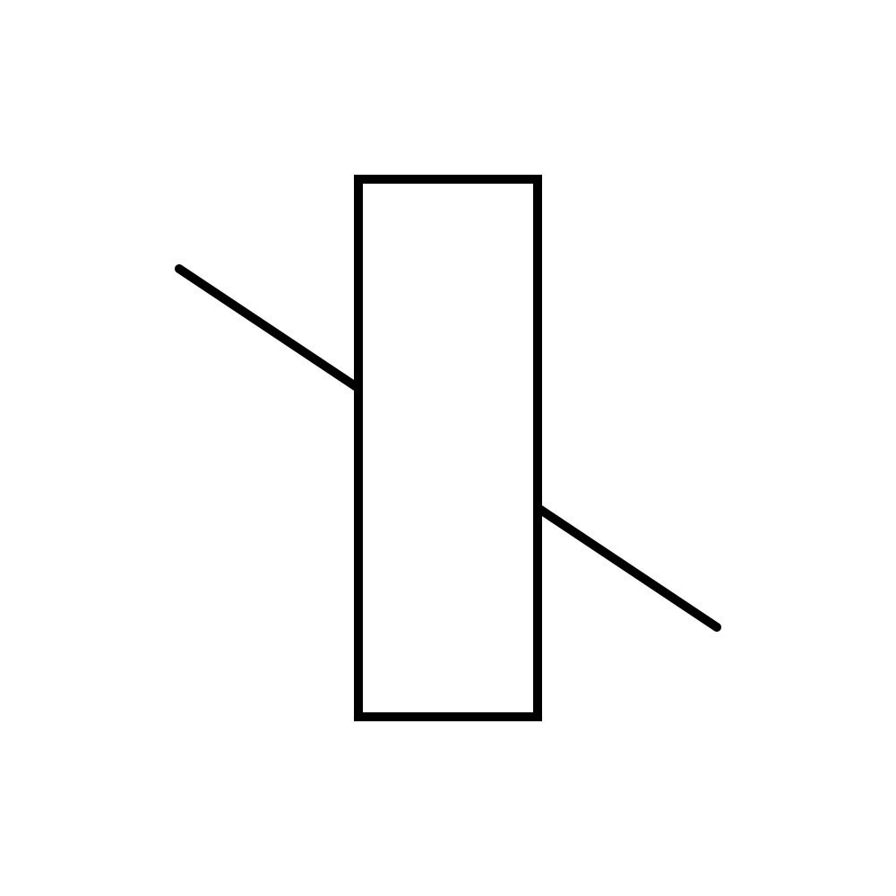

# August 27: Plotting Generative Art


---

**Agenda:**

* Sharing of students' DIY Drawing Machines
* [Rule-Based Art and Drawing Machines, 1950-1970](https://courses.ideate.cmu.edu/60-428/f2021/daily-notes/09-01-lines-and-svgs/)
* [Drawing, Expanded by the Computer](https://github.com/golanlevin/lectures/tree/master/lecture_drawing)
* What's Different about Vector Drawing? 
* One Drawing, Four Ways: PNG, SVG, HPGL, G-Code
* Making a Plot on AxiDraw: A Complete Walkthrough
* Introduction to [Assignment Set 2](https://github.com/golanlevin/DrawingWithMachines/tree/main/assignments/2025/02_getting_started)

---

### What's Different about Vector Drawing? 



* [Demonstration sketch](https://editor.p5js.org/golan/sketches/HaM3r23qW)
* [Resulting svg](img/svg-demo.svg)

---

### One Drawing, Four Ways: PNG, SVG, HPGL, G-Code

```
const nPoints = 40;
const cx = width / 2;
const cy = height / 2;
const radius = width / 4;

beginShape();
for (let i = 0; i <= nPoints; i++) {
  let theta = map(i, 0, nPoints, 0, TWO_PI);
  let px = cx + radius * sin(2.0 * theta);
  let py = cy + radius * cos(3.0 * theta);
  vertex(px,py);
}
endShape(); 
```
 


* [Four-way generator demo](https://editor.p5js.org/golan/sketches/9JeWC8_H3) / ([local](lissajous_demo/sketch.js))
* [lissajous_demo](lissajous_demo/lissajous.svg) - 96dpi 
* [lissajous.hpgl.txt](lissajous_demo/lissajous.hpgl.txt) - 1016dpi - view with [Sharecad](https://sharecad.org/)
* [lissajous.gcode.txt](lissajous_demo/lissajous.gcode.txt) - 25.4dpi (mm) - view with [NCViewer](https://ncviewer.com/)
* [lissajous.png](lissajous_demo/lissajous.png) - 96*2dpi (Retina)

*Practically speaking, in CFA-303:*

* **SVG** files are consumed directly by the AxiDraw plotters and `axicli`.  
* You can derive **HPGL** files from SVG files with *vpype*. HPGL is consumed by the HP7475A, HP DraftMaster II, and MK Cutter.
* You can derive **G-Code** files from SVG files using BantamToolsStudio.app. G-Code is consumed by the Bantam ArtFrame 1824. 

--- 

### Making a Plot on AxiDraw: A Complete Walkthrough

* [**Why "optimize" your SVG?**](https://github.com/golanlevin/DrawingWithMachines/blob/main/generating_svg/vpype_svg_prep/README.md#why-optimize-introducing-vpype)
* [**Creating a Python3.10 Venv, and Installing vpype**](https://github.com/golanlevin/DrawingWithMachines/blob/main/generating_svg/python/README.md#1-creating-a-suitable-python310-virtual-environment) (skim) & the importance of venv
* [**Optimization in practice**](https://github.com/golanlevin/DrawingWithMachines/blob/main/generating_svg/vpype_svg_prep/README.md#2-use-vpype-to-crop-and-optimize)

And

* [Generating SVG Files for Plotters (2025)](https://github.com/golanlevin/DrawingWithMachines/tree/main/generating_svg) - JavaScript, Python, Java
* [Prepping SVGs for Plotting with vpype](https://github.com/golanlevin/DrawingWithMachines/blob/main/generating_svg/vpype_svg_prep/README.md) - a quick lookahead
* [AxiDraw RPi Instructions (2024)](https://github.com/golanlevin/DrawingWithMachines/blob/main/rpi_standalone/README.md)

---

