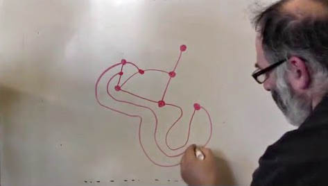
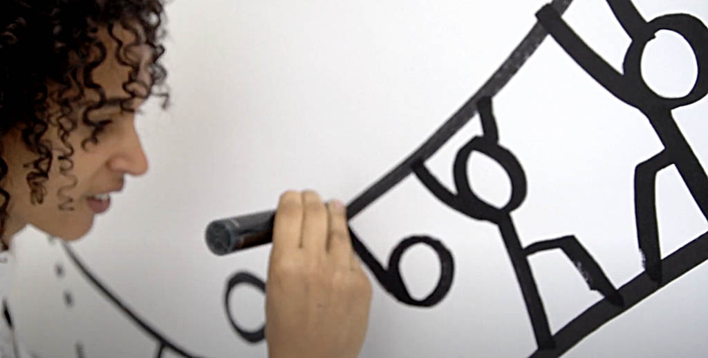
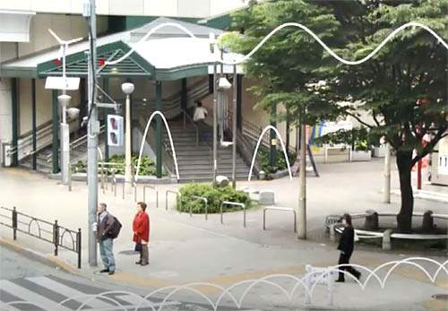
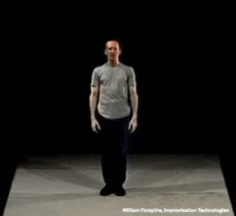
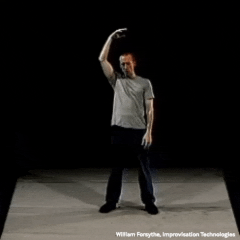
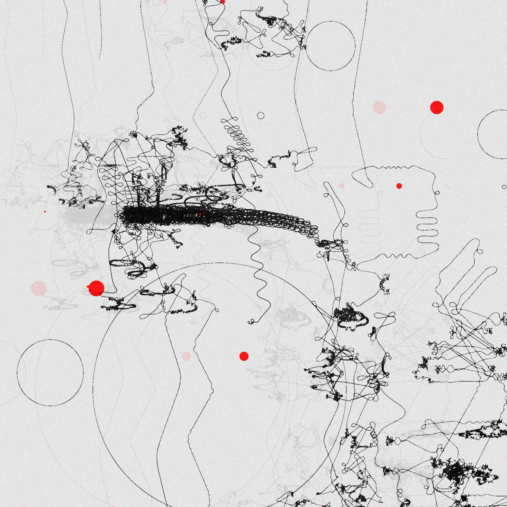

# September 3: Line

---

## Agenda

* Reminder about [support for art supplies](https://github.com/golanlevin/DrawingWithMachines/blob/main/syllabus/60-428_syllabus_fall_2025.md#art-supplies)
* Pinup of [Assignment 2.5](../../../assignments/2025/02_getting_started/README.md#25-re-coding-and-plotting-molnars-lettres): Asemic Writing & Vera Molnar's *Lettres*
* ***Break***
* [Warmup: Sprouts](#warmup-sprouts)
* [Vibing: Curves are Traces in Space](#vibing-curves-are-traces-in-space)
* Introduction to [Assignment 3: Line](../../../assignments/2025/03_line/README.md) (due Wednesday September 10)
* ***Break***
* Main Presentations
	* [Generating G-code Files for Plotters](../../../lectures/topics/gcode/README.md)
	* [Offset Curves](../../../lectures/topics/offset_curves/README.md)
	* [Some Strategies for Walking a Dot](../../../lectures/topics/walking_a_dot/README.md)
* *Dessert*: [Joanie Lemercier's workflow](https://twitter.com/JoanieLemercier/status/1391443586206535682) & [another thread](https://x.com/JoanieLemercier/status/996180699357958144)

---

## Warmup: Sprouts

We will take a moment to enjoy [Sprouts](https://www.youtube.com/watch?v=ZQY4v5GItes), an algorithmic line-game. 

--- 

## Vibing: Curves are Traces in Space

*We will watch some brief videos on lines by/about Shantell Martin, Masahiko Sato, and William Forsythe.*

[Shantell Martin follows the line](https://www.youtube.com/watch?v=7ywYnk0-xUY) (3 minutes)

> *“A line is a miracle that you draw when you throw it.”* — Masahiko Sato

"A trailblazer in Japan’s media landscape since the 1990s, Sato Masahiko has created innovative yet approachable content across a wide range of platforms―including TV commercials, educational programs, books, and games. The breadth and diversity of his work is remarkable, especially considering it was created by a single individual."
 
Here is the short documentary [*CURVES*](https://www.youtube.com/watch?v=Be3R5YEKFN0&t=20s) (2008) by [Masahiko Sato](https://yokohama.art.museum/eng/exhibition/202506_satomasahiko/). We will watch 0:20–6:45 and 13:20–19:20.

American choreographer William Forsythe served as artistic director of the Frankfurt Ballet from 1984 until 2004, and was known for the integration of ballet and visual arts, In 1999, he released “Improvisation Technologies“, a CD-ROM that detailed his understanding of fundamental primitives of human movement and the language of dance. These are illustrated through 2D white lines that have been hand-rotoscoped onto the video. Despite their formal and technical simplicity, the results are extremely compelling.

* [Point-Point-Line](https://www.youtube.com/watch?v=6X29OjcBHG8)
* [Point-Line Extrusion](https://www.youtube.com/watch?v=e_7ixi32lCo)
* [Dropping curves](https://www.youtube.com/watch?v=_zt95yXWLX4)
* [Line avoidance](https://www.youtube.com/watch?v=cqGyFiEXXIQ)

---

## Main Presentations

* [**Generating G-code Files for Plotters**](../../../lectures/topics/gcode/README.md)
* [**Offset Curves**](../../../lectures/topics/offset_curves/README.md)
* [**Some Strategies for Walking a Dot**](../../../lectures/topics/walking_a_dot/README.md)
* **Dessert**: [Joanie Lemercier's workflow](https://twitter.com/JoanieLemercier/status/1391443586206535682) & [another thread](https://x.com/JoanieLemercier/status/996180699357958144)
