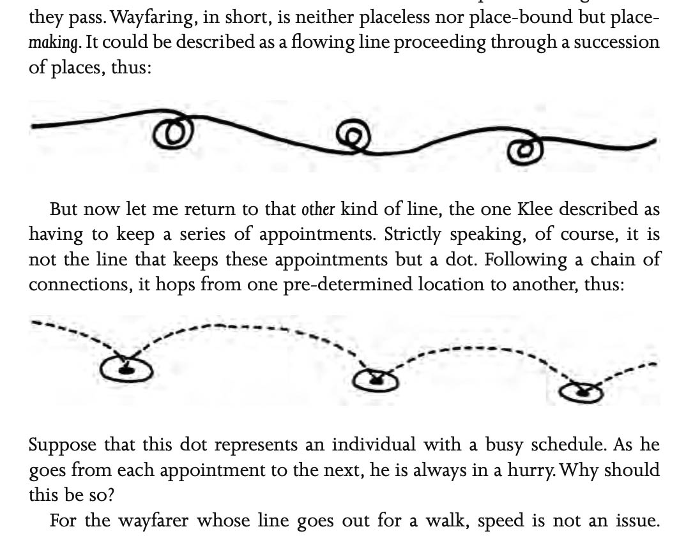
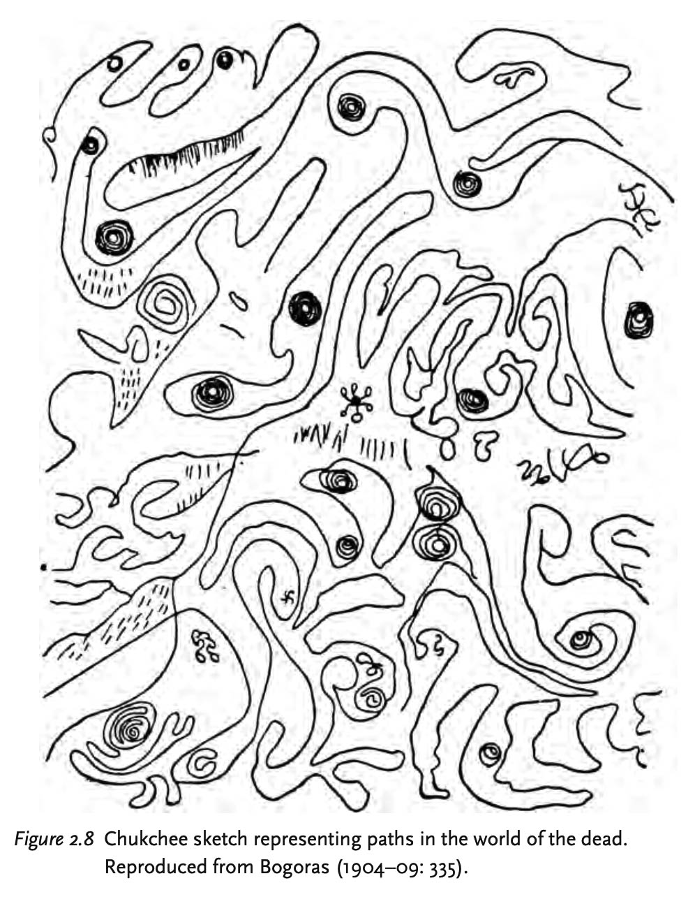

# Monday September 8: Line

**Agenda:**

* Practical Demonstrations (ArtFrame, HP7475A)
* Dot Walking
* Worksession

---

### Practical Demonstrations

* Using the **Bantam ArtFrame 1824** plotter
	* [p5.js Lissajous G-Code with Pressure demo](https://editor.p5js.org/golan/sketches/UpHCoNCz1)
	* Preview G-Code using [NCViewer.com](https://ncviewer.com/)
	* [Plotter instructions](https://github.com/golanlevin/DrawingWithMachines/tree/main/machines/bantam_artframe_1824)
* Using the **HP7475A** plotter
	* Test file: [lissajous.svg](https://github.com/golanlevin/DrawingWithMachines/blob/main/machines/hp7475a/vpype/lissajous.svg)
	* Convert to HPGL using vpype `vpype read input.svg write --device hp7475a --page-size letter --landscape output.hpgl`
	* Preview HPGL using [ShareCad.org](https://sharecad.org/).
	* [Plotter instructions](https://github.com/golanlevin/DrawingWithMachines/blob/main/machines/hp7475a/hp7475a-one-sheet/hp7475a-one-sheet.md)

---

* [Some Strategies for Walking a Dot](../../../lectures/topics/walking_a_dot/README.md)
* [Joanie Lemercier's workflow](https://twitter.com/JoanieLemercier/status/1391443586206535682) & [another thread](https://x.com/JoanieLemercier/status/996180699357958144)

---

