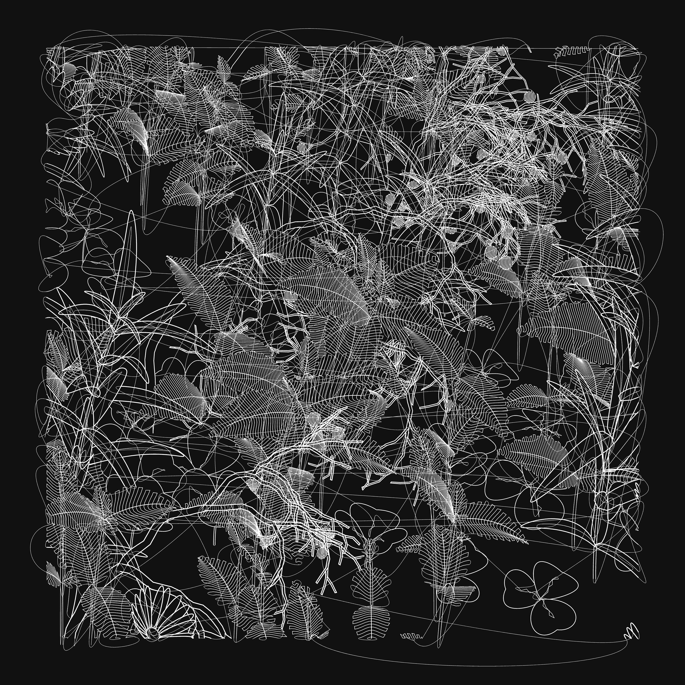

# Monday September 8: Line

 *Single-line plottable SVG by Michaël Zancan, 2022*

--- 

**Agenda:**

* Practical Demonstrations
* Brief Presentations: Dot Walking Techniques
* Worksession

---

### Practical Demonstrations

* Using the **Bantam ArtFrame 1824** plotter with custom G-Code
	* [p5.js Lissajous G-Code with Pressure demo](https://editor.p5js.org/golan/sketches/UpHCoNCz1)
	* Preview G-Code using [NCViewer.com](https://ncviewer.com/)
	* [Plotter instructions](https://github.com/golanlevin/DrawingWithMachines/tree/main/machines/bantam_artframe_1824)
	* [A word about pressure: cosine profile](img/golan_squiffles.jpg)
* Using the **HP7475A** plotter
	* Test file: [lissajous.svg](https://github.com/golanlevin/DrawingWithMachines/blob/main/machines/hp7475a/vpype/lissajous.svg)
	* Convert to HPGL using vpype `vpype read input.svg write --device hp7475a --page-size letter --landscape output.hpgl`
	* Preview HPGL using [ShareCad.org](https://sharecad.org/).
	* [Plotter instructions](https://github.com/golanlevin/DrawingWithMachines/blob/main/machines/hp7475a/hp7475a-one-sheet/hp7475a-one-sheet.md)

---

### Brief Presentations

From [**Some Strategies for Walking a Dot**](../../../lectures/topics/walking_a_dot/README.md): 

* [Differential Curve Plotting](https://github.com/golanlevin/DrawingWithMachines/blob/main/lectures/topics/walking_a_dot/README.md#2-differential-curve-plotting): drunk walks, self-avoiding walks
* [Golan's attempt](https://editor.p5js.org/golan/sketches/im4aJHJO_)
* [Flocking demo by Dan Shiffman](https://openprocessing.org/sketch/2716876)
* [Physarum demo by Deniz Biçer](https://denizbicer.com/202408-UnderstandingPhysarum.html)
* [Curve Smoothing demo](https://editor.p5js.org/golan/sketches/G-uT6taZ_)
* [Dubins Path](https://github.com/golanlevin/DrawingWithMachines/tree/main/lectures/topics/walking_a_dot#322-dubins-path)

---

### Misc Inspo

