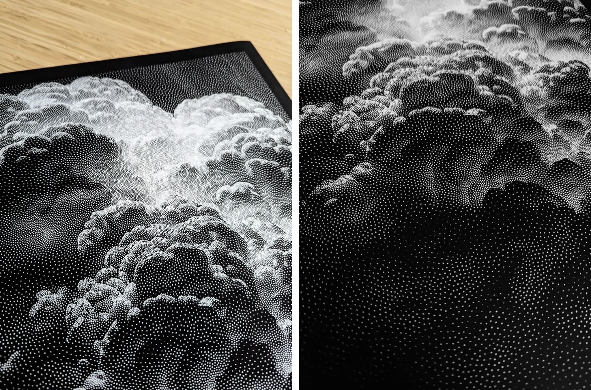

# Wednesday September 10: Tone

*The appearance of continuous tone can be made through processes of hatching, stippling, dithering, and halftoning, among other techniques.*

 [*Turmoil*](https://joanielemercier.com/editions/), 2024. [Joanie Lemercier's workflow](https://twitter.com/JoanieLemercier/status/1391443586206535682) & [another thread](https://x.com/JoanieLemercier/status/996180699357958144).

--- 

## Agenda

* **Review** of Assignment 3: Offset Curve Composition, Dot Walk
* **Introduction** to [**Assignment 4, Tone**](../../../assignments/2025/04_tone/README.md) (due Wednesday September 17)
* [**Tone lecture**](../../topics/tone/README.md)

---

