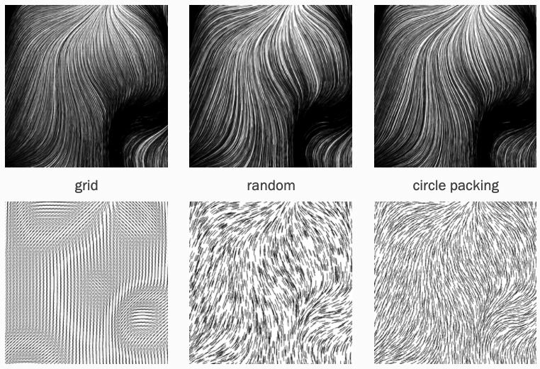

# Monday September 15: Field

Agenda: 

* Viewing: [Joanie Lemercier's workflow](https://twitter.com/JoanieLemercier/status/1391443586206535682) & [another thread](https://x.com/JoanieLemercier/status/996180699357958144).
* Flow Fields
* Scan Your Work!
* Work Session

--- 

## Flow Fields

*A versatile and common approach to synthesizing a tonal surface.*

* [**Flow Fields**](../../topics/flow_fields/README.md) main lecture
* Helpful [**article by Tyler Hobbs**](https://www.tylerxhobbs.com/words/flow-fields)

---

