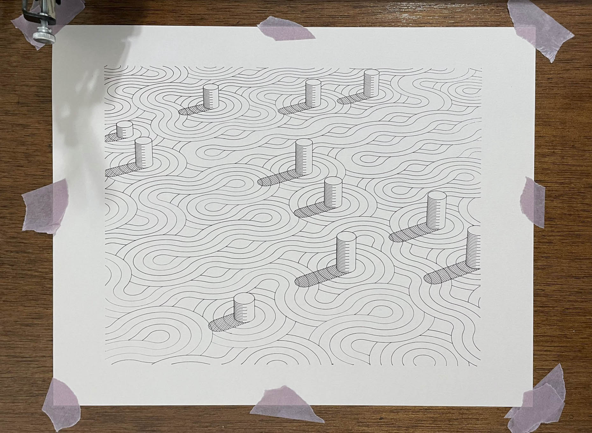
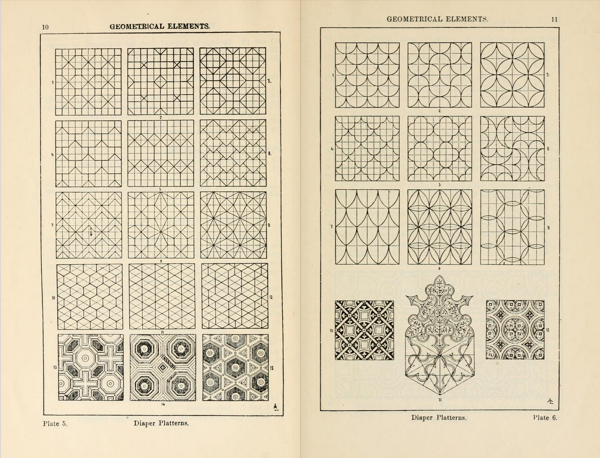

# Wednesday September 17: Pattern

Rolando Jones, [*truchet_towers*](https://x.com/rolandojones/status/1400109808489930752)

---

Agenda: 

* Viewing of [Tone assignments](../../../assignments/2025/04_tone/README.md)
* [**Pattern Lecture**](https://github.com/golanlevin/lectures/tree/master/lecture_pattern)
* Overview of [Assignment Set 5, Pattern/Modularity](../../../assignments/2025/05_pattern/README.md)
* Guest Visit: [Bre Pettis](https://en.wikipedia.org/wiki/Bre_Pettis)!
	* [cult of done manifesto](img/cult-of-done-manifesto.jpg)

--- 

