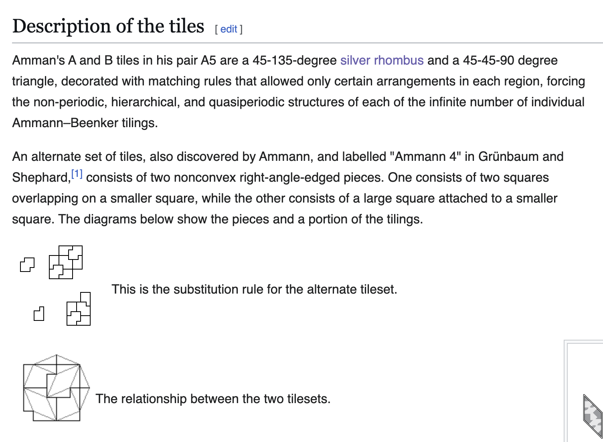

# Monday, September 22: Pattern

* [Pattern lecture](https://github.com/golanlevin/lectures/tree/master/lecture_pattern) link
* [Very Simple Truchet Tutorial](https://openprocessing.org/sketch/2731464)
	* See [https://openprocessing.org/sketch/2546013](https://openprocessing.org/sketch/2546013)
* [Wang tiles in p5](https://editor.p5js.org/golan/sketches/vUSpJuD6f)
* Frontiers: [aperiodic tilings](https://editor.p5js.org/golan/sketches/jhaSjf1q6), aperiodic monotiles, recursive substitution rules...
* *Worksession*

---

