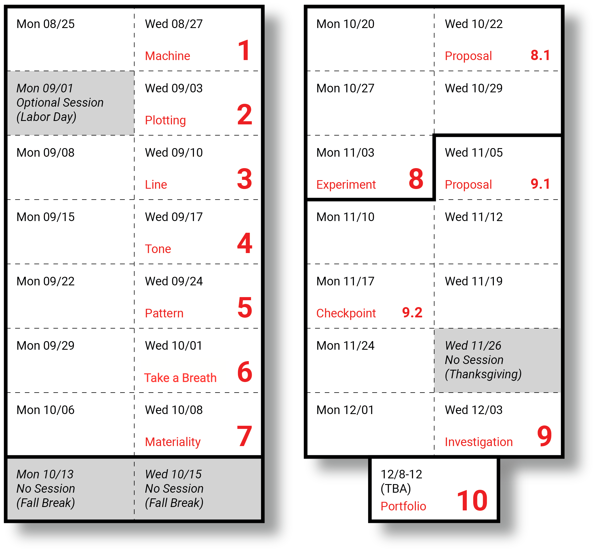

# Lectures & Daily Agenda (2025)

---

* `Mon 08/25` — [0825_hello](0825_hello/README.md)
* `Wed 08/27` — [#1 Due](../../assignments/2025/01_drawing_machine/README.md) (Machine); [0827_hello](0827_hello/README.md)
* `Mon 09/01` — [Optional Workday (Labor Day)](0901_workday/README.md)  
* `Wed 09/03` — [#2 Due](../../assignments/2025/02_getting_started/README.md) (Plotting); [0903_line](0903_line/README.md)
* `Mon 09/08` — [0908_line](0908_line/README.md) & work session
* `Wed 09/10` — [#3 Due](../../assignments/2025/03_line/README.md) (Line); [0910_tone](0910_tone/README.md)
* `Mon 09/15` — TBA / Lecture & work session
* `Wed 09/17` — [#4 Due](../../assignments/2025/04_tone/README.md) (Tone); Guest presentation
* `Mon 09/22` — TBA / Lecture & work session
* `Wed 09/24` — [#5 Due](../../assignments/2025/05_pattern/README.md) (Pattern)
* `Mon 09/29` — TBA / Lecture & work session
* `Wed 10/01` — [#6 Due](../../assignments/2025/06_field_distribution/README.md) (Field)
* `Mon 10/06` — TBA / Lecture & work session
* `Wed 10/08` — [#7 Due](../../assignments/2025/07_material_conditions/README.md) (Materiality)
* `Mon 10/13` — *No session (Fall Break)*
* `Wed 10/15` — *No session (Fall Break)*
* `Mon 10/20` — TBA / Lectures (other topics)
* `Wed 10/22` — [#8.1 Due](../../assignments/2025/08_self_directed_experiment/README.md) (Proposal)
* `Mon 10/27` — Workday
* `Wed 10/29` — Workday
* `Mon 11/03` — [#8.2 Due](../../assignments/2025/08_self_directed_experiment/README.md) (Experiment)
* `Wed 11/05` — [#9.1 Due](../../assignments/2025/09_self_directed_investigation/README.md) (Proposal)
* `Mon 11/10` — Workday
* `Wed 11/12` — Workday
* `Mon 11/17` — [#9.2 Due](../../assignments/2025/09_self_directed_investigation/README.md) (Checkpoint)
* `Wed 11/19` — Workday
* `Mon 11/24` — Special Workday (Card Preparation)
* `Wed 11/26` — *No session (Thanksgiving)*
* `Wed 12/01` — Workday
* `Mon 12/03` — Last regular class session; [#9.3 Due](../../assignments/2025/09_self_directed_investigation/README.md) (Investigation)
* `TBA, 12/8-12` — [#10: Semester Portfolio Review](../../assignments/2025/10_portfolio_review/README.md) and Card Exchange
* `Mon 12/15` — Final Deadline for Exhibitables and Documentation
* `January TBA`  — Class Exhibition at [Bantam Machine Arts Gallery](https://bantamtools.com/pages/gallery), NY

---

