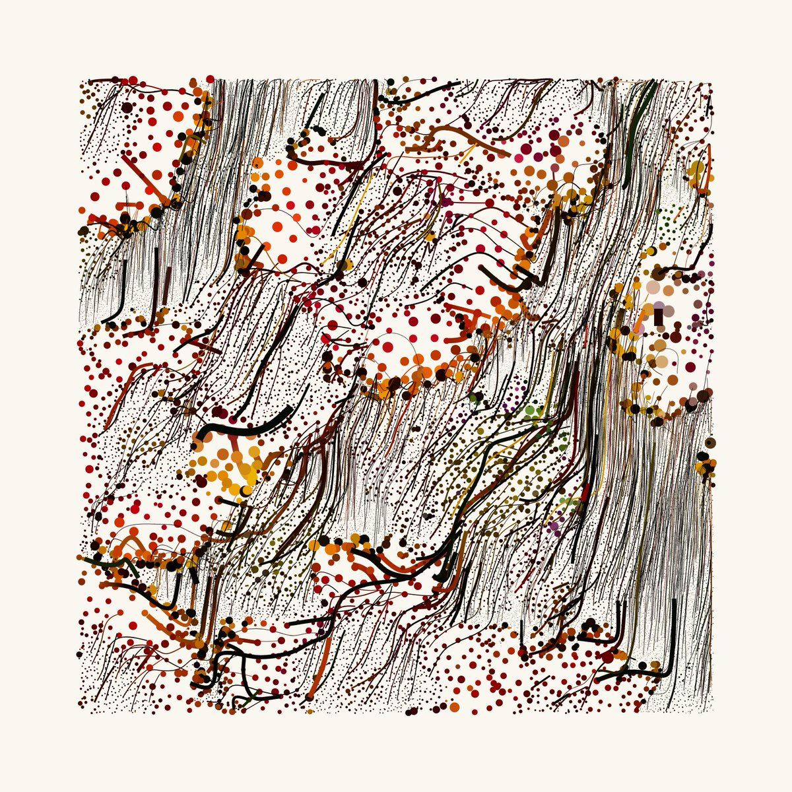

# (Perlin Noise) Flow Fields

-- 

## Code

Here's code for a simple [p5.js demo of a Perlin-noise flow field](https://editor.p5js.org/golan/sketches/Tent2cAg5).

---

## Technical Overview

Here’s an [excellent Observable notebook](https://observablehq.com/@esperanc/flow-fields) with interactive illustrations of Perlin Noise flow fields:

Here’s Dan Shiffman offering an explanation [on the Coding Train](https://www.youtube.com/watch?v=BjoM9oKOAKY).

Algorithmic alternatives to Perlin Noise:

* [Inigo Quilez noise examples](https://www.shadertoy.com/playlist/fXlXzf&from=0&num=12)
* [Paul Bourke noise examples](https://paulbourke.net/fractals/noise/)
* [Simplex Noise](https://www.youtube.com/watch?v=Lv9gyZZJPE0)
* [Worley (Voronoi) Noise](https://www.youtube.com/watch?v=4066MndcyCk)
* Value Noise, Gradient Noise, etc. 

---

## Some Artworks that Use Perlin Noise Flow Fields 

By [Nadieh Bremer](https://twitter.com/NadiehBremer/status/1429820630250184708): 

By [Tyler X. Hobbs](https://tylerxhobbs.com/fidenza):


By [Mark Webster](https://twitter.com/motiondesign_01/status/1443930292121657344):

By [Lionel Radisson](https://twitter.com/MAKIO135/status/1444047935055007745):



By [Fred Briolet](https://twitter.com/p1xelfool/status/1435000906693726212):

By [Itay Niv](https://twitter.com/Itay_niv/status/1441863748516397060):

By [Julien Gachadoat](https://twitter.com/v3ga/status/1432463143167565832):

By [Caleb Ogg](https://twitter.com/caleb_ogg/status/1552770615970476032). Each circles is constructed from two identical spirals overlaid with a small offset. The *direction* of the offset is based on Perlin noise, yielding field-aligned interference patterns.

By [Manolo Gamboa Naon](https://www.behance.net/manoloide):



By [Aleksandra Jovanić](https://twitter.com/alexis_o_O/status/1413060985884221445):

By [Jessica In](https://www.instagram.com/p/COdZNZgnVqW/):

By 90PercentArt:

---

## Blending Algorithmic Approaches

In [this article](https://tylerxhobbs.com/essays/2020/flow-fields), Tyler Hobbs shows how different algorithms (including circle packing) can be used to seed the initial positions of moving particles — which can affect how a Perlin Noise flow field looks.

In [this example (YouTube)](https://www.youtube.com/watch?v=s3VsK8BtIw0) (discussed [here](https://medium.com/@jason.webb/simulating-dla-in-js-f1914eb04b1d), "Simulating 2D diffusion-limited aggregation (DLA) with JavaScript"), Jason Webb shows how a Diffusion-Limited Aggregation simulation can be expressively altered, when the diffusing particles are not simply moving in a random way, but are moving along gradients of another simulation (in this case, a Perlin Noise flow field).

---

[2021 version](https://courses.ideate.cmu.edu/60-428/f2021/index.html%3Fp=1372.html)