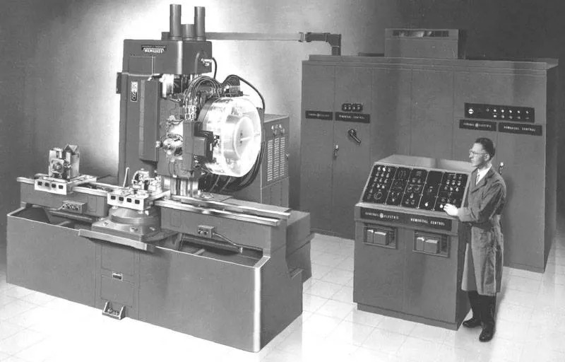
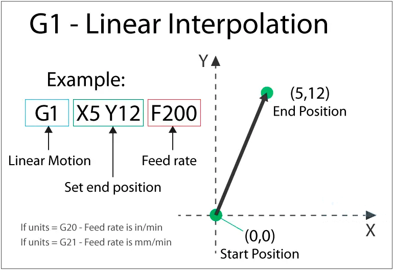
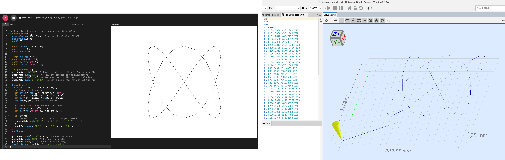
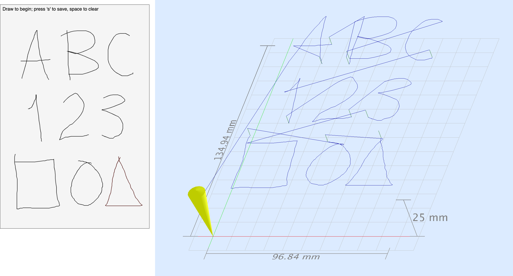
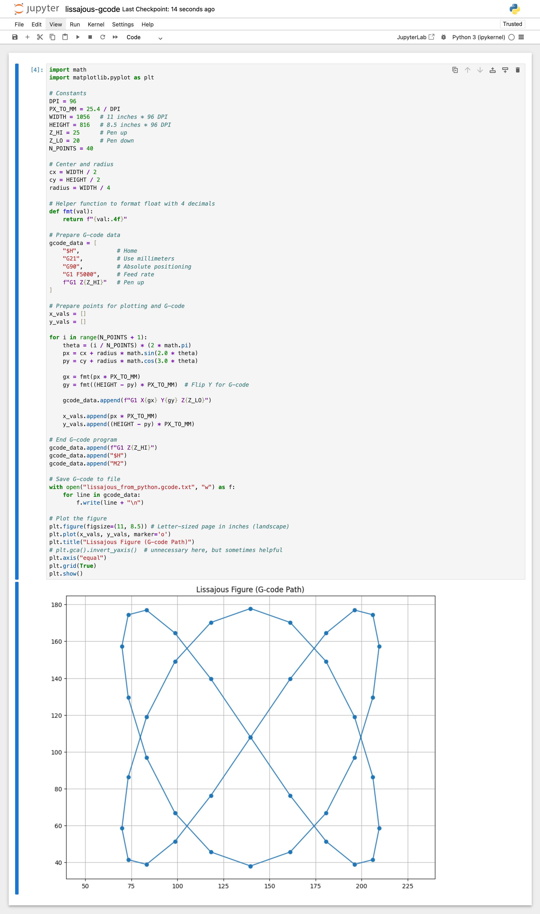

# Generating G-code Files for Plotters

* It is straightforward to *convert* a 2D SVG to G-Code — using, for example, the [BantamToolsStudio app](https://support.bantamtools.com/hc/en-us/articles/36808222820499-Bantam-Tools-Studio-Software-Installation), or the [vpype-gcode](https://github.com/plottertools/vpype-gcode) or [vpype-gscrib](https://vpype-gscrib.readthedocs.io/en/latest/) G-Code plugins for vpype. 
* However, if you wish to execute **3D G-Code file**, you will almost certainly need to generate these files *yourself*. This document provides workflows for computationally generating G-code *files*.
* For information on controlling a plotter in *real-time* with G-code, see [these instructions](https://github.com/golanlevin/DrawingWithMachines/blob/main/realtime/artframe_realtime/README.md) instead. 

---

## Contents

* [What is G-code?](#what-is-g-code)
* [Basic G-code Commands](#basic-g-code-commands)
* [Generating G-code with p5.js](#generating-g-code-with-p5js)
	* [p5.js G-code Drawing Recorder](#p5js-g-code-drawing-recorder)
* [Generating G-code with Python](#generating-g-code-files-with-python)
* [Other Workflows](#other-workflows)

---

## What is G-code?



[G-code](https://en.wikipedia.org/wiki/G-code), short for “Geometric Code,” is a plain-text programming language used to control milling machines, 3D printers, plotters, and other automated tools. It was developed in the late 1950s as part of U.S. military-funded research into computer numerical control (CNC), particularly at MIT’s Servomechanisms Laboratory. One of its earliest motivations was to machine complex submarine propellers—precise, curved forms that were nearly impossible to produce by hand. With funding from the U.S. Navy, these efforts led to the first NC milling systems and, eventually, the standardization of G-code (RS-274) in the early 1960s. If you'd like to know more, our friends at Bantam Tools have published a [nice history of CNC machining](https://medium.com/cnc-life/history-of-cnc-machining-part-1-2a4b290d994d).

G-code’s simplicity and clarity made it ideal for precise, repeatable fabrication. Its commands are terse and human-readable, like `G01 X10 Y10` to move a tool to position (10,10). Despite its age, G-code is the most widely used CNC language today because it’s hardware-agnostic, easy to parse, and flexible enough to support everything from basic movements to elaborate toolpaths. Its longevity is a testament to its simple, functional design.


---

## Basic G-code Commands

This illustration shows an example of one of the most basic and important G-code commands, `G1` (or `G01`), which means "move linearly to the following location at a specified rate":



For executing G-code on our classroom Bantam Artframe 1824:

* The Bantam 1824's default units are **millimeters**.
* The G-code **origin** is in the lower-left, so if you're working in a toolkit like p5.js or Processing, you'll need to subtract your Y-coordinates from your document height.
* `+X` goes right, `+Y` goes upwards, `+Z` goes up and away from the work surface.
* Did you notice that `+Y` goes upwards? That means: **flip** your p5.js sketches vertically!
* The acceptable range for `X` is 0 to 18"x25.4mm/in = 457.2
* The acceptable range for `Y` is 0 to 24"x25.4mm/in = 609.6
* The acceptable range for `Z` is 0 to 60.0, where Z+ is upwards. Z can be used for pressure!
* The acceptable range for `F` (feed speed) is 0-15000 mm/min. For
ballpoint pens, a recommended feedrate is 10000 mm/min.
* It is possible to send the Bantam too far into `+X`, so that your pen crashes into the plotter frame. It is your job to prevent this. 
* Exceeding any of the XYZ coordinate ranges will likely trigger alarms that stop the plotting process and require you to reboot the plotter.
* The plotter will continually interpolate from one point to the next. 

Here is an example G-code program. Note how comments are written `(in parentheses)`; spaces are optional but helpful; and only *new* information is necessary on each line:

```
$H (Home the machine - this code is Bantam-specific)
G21 (tells plotter to interpret numbers in millimeters)
G90 (set to absolute positioning mode)
G0 Z5 (raise the pen 5mm, using rapid motion)
G1 X 300.0 Y 250.0 Z 10.0 F 5000 (go to 300,500,10 at 5000mm/min)
G1 X250Y350Z10 (spaces are optional)
G1 Y150 (only new information is necessary)
G0 Z55 (lift the pen close to the max height when we're done)
G0 X0 Y0 (move to origin when we're done)
M2 (end of program)
```

If you want more information, here's an [overview of GCode commands](https://howtomechatronics.com/tutorials/g-code-explained-list-of-most-important-g-code-commands/) that you might find helpful. But in point of fact, 99% of the commands you need to know are shown above. Although there are dozens of possible G-Code commands, most are concerned with 3D milling machines (e.g. spindle speed) and irrelevant to 2D plotting.

---

## Generating G-code with p5.js

To **generate** G-code in p5.js, we can:

1. **construct** strings that contain G-code commands — using string [concatenation](https://www.freecodecamp.org/news/how-js-string-concatenation-works/?utm_source=chatgpt.com) or [template literals](https://developer.mozilla.org/en-US/docs/Learn_web_development/Core/Scripting/Strings?utm_source=chatgpt.com#embedding_javascript) — as well as the p5.js [`nf()`](https://p5js.org/reference/p5/nf/) number-format function to specify decimal precision;
2. **append** these strings into an array, using the [`Array.prototype.push()`](https://www.freecodecamp.org/news/javascript-append-to-array-a-js-guide-to-the-push-method-2/) function;
3. and then **export** the array of strings as a GCode file, using the p5.js [`saveStrings()`](https://p5js.org/reference/p5/saveStrings/) function.

Put another way, to generate G-Code in JavaScript, all you really need to know is how to do string concatenation, how to handle arrays of strings, and how to use the p5.js [`saveStrings()`](https://p5js.org/reference/p5/saveStrings/) function. 

[Here](https://editor.p5js.org/golan/sketches/Gly-gpjzM) and below is a simple p5.js program that generates a Lissajous figure and exports a GCode file: 

```javascript
// Generate a Lissajous curve, and export it as G-Code

function setup() {
  createCanvas(1056, 816); // Letter: 11"x8.5" at 96 DPI.
  background(255);
  noFill();

  const pxToMm = 25.4 / 96;
  const zHi = 25; // pen height: 
  const zLo = 20; // adjust for your pen
  
  const nPoints = 40;
  const cx = width / 2;
  const cy = height / 2;
  const radius = width / 4;
  
  let gcodeData = [];
  gcodeData.push("$H"); // Home the plotter - this is Bantam-specific
  gcodeData.push("G21"); // Tell the plotter to use millimeters
  gcodeData.push("G90"); // Use absolute coordinates, not relative
  gcodeData.push("G1 F5000"); // Let's use a feed rate of 5000 mm/min
  gcodeData.push("G1 Z" + zHi); // Start with pen raised
 
  beginShape();
  for (let i = 0; i <= nPoints; i++) {
    // Compute each vertex
    let theta = map(i, 0, nPoints, 0, TWO_PI);
    let px = cx + radius * sin(2.0 * theta);
    let py = cy + radius * cos(3.0 * theta);
    vertex(px, py); // draw the vertex
    
    // Format the lineto movement as GCode
    let gx = nf(px * pxToMm,1,4); 
    let gy = nf((height-py) * pxToMm,1,4); 
    if (i==0){
    	// Travel to the first point with the pen raised
    	gcodeData.push("G1 X" + gx + " Y" + gy + " Z" + zHi);
    }
    gcodeData.push("G1 X" + gx + " Y" + gy + " Z" + zLo);
  }
  endShape();
  
  gcodeData.push("G1 Z" + zHi); // raise pen at end
  gcodeData.push("M2"); // End the GCode program
  gcodeData.push("$H"); // Re-home the plotter
  saveStrings (gcodeData, "lissajous.gcode.txt");
}
```

And [here](gcode/lissajous.gcode.txt) is the G-code it produces:

```gcode
$H
G21
G90
G1 F5000
G1 X139.7000 Y38.1000 Z25
G1 X139.7000 Y38.1000 Z20
G1 X161.2848 Y45.7132 Z20
G1 X180.7568 Y66.8932 Z20
G1 X196.2098 Y97.0231 Z20
(etc. etc. etc. ...)
G1 X83.1902 Y97.0231 Z20
G1 X98.6432 Y66.8932 Z20
G1 X118.1152 Y45.7132 Z20
G1 X139.7000 Y38.1000 Z20
G1 Z25
M2
$H
```

We can **verify** that the G-code is valid using special previewing software such as [**NC Viewer**](https://ncviewer.com/) (in the browser), or [Universal G-code Sender](https://winder.github.io/ugs_website/installing/) (on your laptop). (UGS is great software, which can also be used to transmit G-code to devices in real-time; to install it on MacOS, you may need to use the command `sudo xattr -rd com.apple.quarantine /Applications/UniversalGcodeSender.app`.)

Another quick hack for previewing G-code is this Python script by Windell Oskay, [gcode-to-svg.py](gcode-to-svg.py); its usage is `python3 gcode-to-svg.py theInputFile.gcode theOutputFile.svg`. 



Once you have generated your G-code file, you can **plot** it on the Bantam ArtFrame in one of two ways: 

* by placing the file on the plotter's SD card, as described in the [ArtFrame user's guide, here](https://github.com/golanlevin/DrawingWithMachines/blob/main/machines/bantam_artframe_1824/artframe_guide_v1-1-1.pdf),
* or by streaming the file's data to the plotter in-real time, [using the instructions here](https://github.com/golanlevin/DrawingWithMachines/blob/main/realtime/artframe_realtime/README.md).


---

## p5.js G-Code Drawing Recorder

<details>
  <summary><strong>Click here</strong> for information about another sample program, a p5.js G-code Drawing Recorder.</summary>


Here's [another p5.js program]((https://editor.p5js.org/golan/sketches/5NkOru6OA)) which records mouse drawings and exports G-Code files: 

* [at Editor.p5.js.org](https://editor.p5js.org/golan/sketches/5NkOru6OA)
* [in this repository](p5js/p5js_gcode_drawing_recorder/sketch.js)



</details>

---

## Generating G-code Files with Python

[Here's a Python 3.10 program](python/lissajous-gcode.py), `lissajous-gcode.py`, for generating a Lissajous figure and exporting G-code. Note that this program records the design data to a pair of arrays, `x_vals` and `y_vals`, and then uses those arrays for both on-screen display and file export. Code like `gcode_data.append(f"G1 X{gx} Y{gy} Z{Z_HI}")` uses Python *f-strings*, short for formatted string literals, to inject the numbers into a string:


```python
import math
import matplotlib.pyplot as plt

# Constants
DPI = 96
PX_TO_MM = 25.4 / DPI
WIDTH = 1056   # 11 inches * 96 DPI
HEIGHT = 816   # 8.5 inches * 96 DPI
Z_HI = 25      # Pen up
Z_LO = 20      # Pen down
N_POINTS = 40

# Center and radius
cx = WIDTH / 2
cy = HEIGHT / 2
radius = WIDTH / 4

# Helper function to format float with 4 decimals
def fmt(val):
    return f"{val:.4f}"

# Prepare G-code data
gcode_data = [
    "$H",           # Home
    "G21",          # Use millimeters
    "G90",          # Absolute positioning
    "G1 F5000",     # Feed rate
    f"G1 Z{Z_HI}"   # Pen up
]

# Prepare points for plotting and G-code
x_vals = []
y_vals = []

for i in range(N_POINTS + 1):
    theta = (i / N_POINTS) * (2 * math.pi)
    px = cx + radius * math.sin(2.0 * theta)
    py = cy + radius * math.cos(3.0 * theta)
    
    gx = fmt(px * PX_TO_MM)
    gy = fmt((HEIGHT - py) * PX_TO_MM)  # Flip Y for G-code
    
    if i == 0:
        # Move to the first point with the pen raised
        gcode_data.append(f"G1 X{gx} Y{gy} Z{Z_HI}")
    
    # Now draw to the point with the pen down
    gcode_data.append(f"G1 X{gx} Y{gy} Z{Z_LO}")
    
    x_vals.append(px * PX_TO_MM)
    y_vals.append((HEIGHT - py) * PX_TO_MM)

# End G-code program
gcode_data.append(f"G1 Z{Z_HI}")
gcode_data.append("M2")
gcode_data.append("$H")

# Save G-code to file
with open("lissajous-from-python.gcode.txt", "w") as f:
    for line in gcode_data:
        f.write(line + "\n")

# Plot the figure
plt.figure(figsize=(11, 8.5)) # Letter-sized page in inches (landscape)
plt.plot(x_vals, y_vals, marker='o')
plt.title("Lissajous Figure (G-code Path)")
# plt.gca().invert_yaxis()  # unnecessary here, but sometimes helpful
plt.axis("equal")
plt.grid(True)
plt.show()
```

To **run** this program, I'll assume you already have a Python virtual environment, as discussed [here](https://github.com/golanlevin/DrawingWithMachines/blob/main/generating_svg/vpype_svg_prep/README.md#1-install-python-create-a-virtual-environment). Then: 

**Activate** the virtual environment:

* Mac: `source myVenv2025/bin/activate`
* Win: `myVenv2025\Scripts\activate`

Once your virtual environment is activated, you *may* need to install some needed libraries, such as `notebook` (for running Python notebooks in your browswer) and `matplotlib` (for graphing):

```
pip install --upgrade pip
pip install notebook
pip install matplotlib
```

You should now be able to launch the Jupyter notebook environment: 

```
jupyter notebook
```

This will open a browser to `http://localhost:8888/tree`. From there, you can either load [this Python notebook](python/lissajous-gcode.ipynb), or, if you prefer to make a new notebook: 

* Click "New" → "Python 3 (ipykernel)"
* Paste the code from `lissajous-gcode.py` into an empty cell
* Click **Run**. The program should export a `lissajous_from_python.gcode.txt` G-code file into the root directory of the notebook. 



---

## Other Workflows

* A plugin for vpype, [*vpype-gcode*](https://github.com/plottertools/vpype-gcode), allows generation of G-code in a Python environment. 
