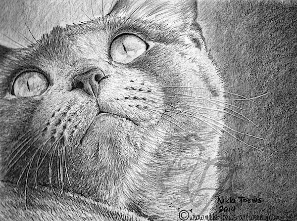

# Material Conditions

* The **order** of strokes matters. 
* The **direction** of strokes matters.
* The **speed** of strokes matters.
* The **pressure** of strokes matters.
* The **substrate** matters.
* The **stylus** matters.
* The **ink** matters.

---

The **order** of strokes matters:

[*Sabbia*](https://vimeo.com/249372973), Andreas Gysin, 2017. Overhead projection through plotted sand, using AxiDraw controlled by Processing. [Code](https://github.com/ertdfgcvb/Genau) 

---

The **direction** of strokes matters.

[Chisel tip pattern by @TarGz](https://twitter.com/TarGz/status/1416856260033531915), using the [Pilot Parallel Pen](https://www.amazon.com/gp/product/B019YLRFFS/). 

[Pen direction test by Greweb](https://twitter.com/greweb/status/1441035454124630019) 

---

The **speed** of strokes matters. Consider the precise control of a physical process. Move slowly or hold the pen in one spot, the ink spreads: a function of medium, substrate, and time. 

---

Drawing is done on a **substrate** — usually paper. Paper can be varied creatively. 

[Daniela Krohnert](https://penplotterartwork.com/blog/2021/10/27/weather-as-art-inspiring-pen-plot-art/) left out a sheet of paper for a few minutes during a Viennese summer rainstorm. The paper dried curled, and created an uneven texture when plotting 42 straight lines. 

[@Andy_Makes created (and calibrated) designs specifically for vintage polar graph paper.](https://twitter.com/Andy_Makes/status/1342933775924264960) 

[@emorydunn has been plotting on photographs](https://twitter.com/emorydunn/status/1390093823678713859) 

---

Drawing can be done through **incision** and **etching**. 

The whiskers in this drawing are *incised*. 

[@revdancatt has done copper-plate etching using the pen plotter](https://twitter.com/revdancatt/status/1377633171433488386) 

Patricio Gonzalez-Vivo [has been using AxiDraw for circuit board etching experiments.](https://www.evilmadscientist.com/2018/pcb-etching-with-axidraw/) He draws on copper clad boards with a Sharpie marker with the AxiDraw. Drawing is followed by a chemical bath, which etches away the non-drawn area. The marker is cleaned off of the remaining copper to reveal the design. 

[Tom Lauerman has been using the AxiDraw to create incisions in clay](https://www.instagram.com/p/ChT0Y7XAf9P/) 

---

Drawing is a **physical process**. You can interpose appurtenances to meddle with these physics.

[Mike Jacobs added a pantograph to his AxiDraw to multiply its size range](https://www.evilmadscientist.com/2018/axidraw-pantograph/), increasing the range from 9×12” to 45×58”. 

Here's a [thread by Daniel Feles involving interposed physics](https://twitter.com/dfeles/status/1223962631012339712). 

Arnaud Pfeffer (@arnaudpfef) has been [exploring mechatronic suminagashi](https://twitter.com/arnaudpfef/status/1589358879728508929). 

---

The **ink** (marking medium) matters.

Marcel Schwittlick has [explored dying pens](https://schwittlick.net/composition52/). 

[Joanie Lemercier with invisible ink](https://www.evilmadscientist.com/2018/invisible-ink-with-axidraw/). 

Tobias Grothman used invisible ink, which reveals the solution to a maze under UV light. 

There are some really [wild inks out there](https://www.reddit.com/r/fountainpens/comments/129i2e9/what_are_the_most_unique_inks_youve_tried/). This is "Wearingeul Taxidermied Genius", a magenta ink with a metallic green sheen. 

---

[Watercolor plots by @@alegiaco2](https://twitter.com/alegiaco2/status/1384202013764775941) 

[Chaotic system with ink+air, by @josephwilk](https://twitter.com/josephwilk/status/1317142944231673857) 

---

[*Avena+ Test Bed:* Agricultural Printing and Altered Landscapes](https://benedikt-gross.de/projects/avena-test-bed-agricultural-printing-and-altered-landscapes/), Benedikt Groß, 2013. Precision farming: drawing by planting seeds with a GPS bulldozer.

---

[2021 Notes](https://courses.ideate.cmu.edu/60-428/f2021/daily-notes/10-25-new-beginning/material-conditions/)

Unincorporated notes: 

* Lightpainting, https://www.instagram.com/p/DI_gGrhpO45/