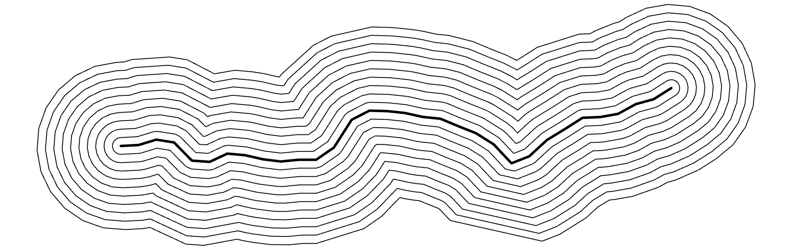

# Offset Curves / Parallel Curves

*Offset curves, also known as parallel curves, are shapes that run a fixed distance away from an original curve. They are essential in applications ranging from CNC machining to typography, and have many analogies in layered phenomena in the natural world. Despite their simple definition, offset curves are mathematically complex: they can develop cusps, self-intersections, and abrupt changes even when the original curve is smooth. Understanding them helps artists and engineers work more precisely with form, structure, and process.*

---

Demonstration code to compute offset curves: 

* [Processing (Java) v.4.4.4 demo](processing/offset_curves/offset_curves.pde) (requires the [PEmbroider](https://github.com/CreativeInquiry/PEmbroider) library)
* [p5.js (JavaScript) demo](p5js/) (uses [Unmess.ts](https://github.com/LingDong-/squiggy) by Lingdong Huang).
* [Python demo](python/README.md) (uses the [Shapely](https://shapely.readthedocs.io/en/stable/) library v.2.1.1)

---

### In Nature

Layers of sedimentary geology, i.e. *varves*

Laguna Agate and Condor Agate

Coral growth bands

Annual tree rings

Layers of an onion

The Belousov-Zhabotinsky Reaction

---

### In Art and Human Activity

Rice terraces in Vietnam

Maya Lin, [*Systematic Landscapes*](https://camstl.org/exhibitions/maya-lin-systematic-landscapes/), 2007

CNC machining toolpaths

Laurel Bancroft, [*core section of the CMU fence*](https://www.flickr.com/photos/golanlevin/2426520046), 2007

Pedro Ramírez Vázquez et al., [*Mexico 1968 olympics logo*](https://www.logohistories.com/p/folk-art-psychedelia)

Robert Hodgin, [*Individuation*](https://roberthodgin.com/project/individuation), 2021

Zach Lieberman, [*Offsety Person*](https://www.instagram.com/p/BHBKPsgAOA0/), 2016

Jürg Lehni, [*Otto*](https://vimeo.com/129666491), 2014
